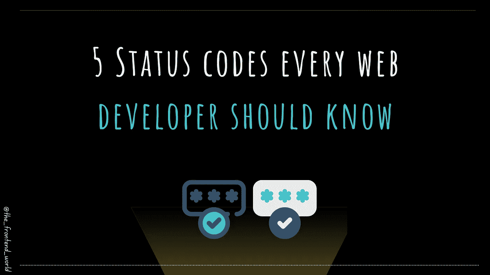

# 直观地了解 HTTP 状态代码

> 原文：<https://levelup.gitconnected.com/learn-visually-about-http-status-codes-4ac8decdccad>

## 构建一幅关于 HTTP 请求状态的心理图像

作者:FAM

我已经在下面的文章中写了 HTTP 最重要请求代码背后的故事:

 [## 每个 Web 开发人员都应该知道的 5 个状态代码

### 学习这些网络开发的基本状态代码

javascript.plainenglish.io](https://javascript.plainenglish.io/5-status-codes-every-web-developer-should-know-c38923c8230) 

# 它的视频出来了！

我希望你喜欢它，并支持我的[网络故事频道](https://www.youtube.com/channel/UCaxr-f9r6P1u7Y7SKFHi12g/) ^^

再见！

> 我今天的故事到此结束，我希望你喜欢它，并从中吸取教训，❤

[如果你喜欢看我的文章……♥️](https://famzil.medium.com/subscribe)

 [## 如果你喜欢看我的文章… ♥️

### 如果你喜欢读我的文章… ♥️，当我的文章发表时，欢迎你第一个得到通知…

famzil.medium.com](https://famzil.medium.com/subscribe) 

> 谢谢你，❤

如果你有兴趣成为付费会员，你可以使用我的推荐[链接](https://famzil.medium.com/membership)。下次见

亲爱的读者，感谢你在我生命中的存在。让我们在 [**上**取得联系****](https://medium.com/@famzil/)**[**Linkedin**](https://www.linkedin.com/in/fatima-amzil-9031ba95/)**[**脸书**](https://www.facebook.com/The-Front-End-World)**[**insta gram**](https://www.instagram.com/the_frontend_world/)**[**YouTube**](https://www.youtube.com/channel/UCaxr-f9r6P1u7Y7SKFHi12g)**或**********

****参见我的关于网络要素和一般文化的电子书。****