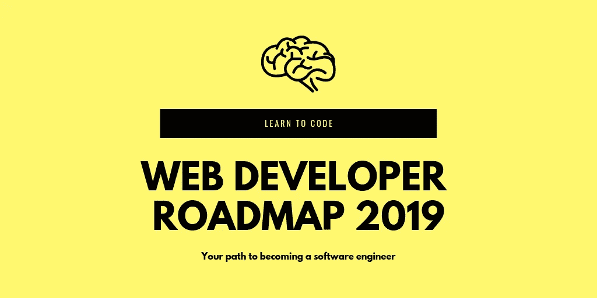
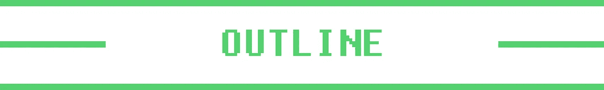
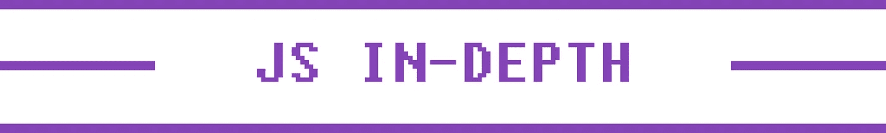

# 2019 年学习网页开发|网页开发教程

> 原文：<https://levelup.gitconnected.com/learn-web-development-in-2019-aecb6dfb3e51>

## 2019 年开启 web 开发职业生涯指南。我列出了学习前端和后端软件工程所需的技能和顶级课程。

**通过学习在线编程开始 web 开发生涯——不需要计算机科学学位**🤓

对软件工程师的需求呈爆炸式增长，有很多资源可以让任何人找到一份开发人员的工作。有了免费和付费的在线教程，无论你的背景如何，你都可以学习编码——我个人没有 CS 学位，也没有和无数其他开发人员一起工作过。

这篇文章是你 2019 年成为 web 开发者的路线图。它概述了最好的教程和顶级课程，为开始前端或后端工程师的职业生涯提供了一条道路。

 [## 组合 API -轻松发展您的编码事业| gitconnected

### 消除在每个单独位置手动更新您的详细信息的痛苦。只需在您的中更改一次数据…

gitconnected.com](https://gitconnected.com/portfolio-api) 

# 概述

本文分为 7 个部分:

1.  **入门**:如果你是编码新手，从哪里开始
2.  **通用编码&工具**:每个开发者都应该知道的编程概念
3.  前端开发:学习如何构建用户界面
4.  **后端开发**:学习如何构建 API 和编写服务器代码
5.  **JavaScript 与编码深度**:自上而下学习 JS
6.  **软件工程书籍**:我发现这些书籍通常有助于提高我对编程的整体理解，并对工作产生积极影响。( [**点击**](https://amzn.to/2SdZtxI) 查看完整列表)
7.  **工作建议&总结**:一些关于如何找工作和继续发展开发人员的最后快速提示

如果您是编程新手或仍在学习基础知识，您应该从“入门”部分开始，巩固核心编码原则。“通用编码和工具”部分包含每个开发人员都应该知道的内容，比如 Git、命令行和基本工具。

Web 开发通常分为两个领域——前端和后端。前端是用户在 web 浏览器中与之交互的 UI，它涉及布局、样式和管理从服务器发送的数据——对于对视觉方面和交互性感兴趣的开发人员来说。后端专注于创建 API 和处理应用程序的复杂逻辑——面向对数据和纯逻辑感兴趣的开发人员。

我强烈建议至少要熟悉前端和后端，因为了解整个堆栈非常有价值，会让你的技能更有吸引力。然而，你仍然可以通过非常了解堆栈的一部分来找到角色。

> 这些都是我个人推荐的产品。对于他们中的一些人，如果你使用文章中的链接，我会得到报酬。如果你确实找到了你喜欢的东西，你的支持会受到感激。

# 1.编码入门

## 你第一次接触编程

知道从哪里开始可能是编程中最令人生畏的部分。我的建议——学习 JavaScript。

1.  JavaScript 是一种相对容易学习的语言
2.  JavaScript 是构建 web 应用程序所必需的，因为它是在浏览器中运行的编程语言
3.  JavaScript 可以在前端和后端使用，允许您用一种语言编写全栈应用程序
4.  JavaScript 开发人员有大量的工作

> 如果你知道你要么只想处理数据，要么只想做后台工作，学习 Python 是另一个适合初学者的选择。

有很多高质量的免费选项可以用来开始编码。 [freeCodeCamp](https://medium.com/u/8b318225c16a?source=post_page-----aecb6dfb3e51--------------------------------) 和 [Codecademy](https://medium.com/u/ec84fe9ce756?source=post_page-----aecb6dfb3e51--------------------------------) 是很好的选择，可以为你打下良好的基础。

 [## 通过免费的在线课程、编程项目和面试准备学习编码…

### 通过免费的在线课程、编程项目和开发人员工作的面试准备来学习编码。

freecodecamp.org](https://freecodecamp.org)  [## 免费学习编码| Codecademy

### 学习你想要的工作所需要的技能。作为在线教育和学习编码的领导者，我们…

codecademy.com](https://codecademy.com) 

一旦你有了基础，下一个伟大的步骤就是 [JavaScript30](https://javascript30.com/friend/GITCONNECTED) 。 [Wes Bos](https://medium.com/u/86a55cd7983b?source=post_page-----aecb6dfb3e51--------------------------------) 通过 30 天免费搭建 30 个项目来教 JS。

> 你应该尽快尝试做真正的项目。这是最好的学习方式，也是找工作时最有利的。

 [## JavaScript 30

### 用香草 JS 在 30 天内用 30 个教程构建 30 个东西

javascript30.com](https://javascript30.com) 

如果你想加快速度，这些是从 JS 初学者开始并快速进步的很好的课程。

[**现代 JavaScript 从头开始**](https://bit.ly/2T1cbNi)

 [## 现代 JavaScript 入门(包括 10 个真实项目)

### 用纯 JavaScript 学习和构建项目(没有框架或库)

udemy.com](https://bit.ly/2T1cbNi) 

[**【现代 JavaScript 训练营(2019)**](https://bit.ly/2AQcEL5)

 [## 现代 JavaScript Bootcamp (2019) | Udemy

### 通过构建真实世界的应用程序来学习 JavaScript。包括 3 个真实项目、80 个编程挑战和 ES6/ES7！

udemy.com](https://bit.ly/2AQcEL5) 

[高级 Javascript](https://bit.ly/2DobpVj)

 [## 高级 Javascript | Udemy

### 只需三个小时，你就能学会足够的 javascript，从初级 JS 开发人员变成高级 JS 专家

udemy.com](https://bit.ly/2DobpVj) 

如果你正在寻找一个可以带你从初学者到专业人士的课程订阅选项，一个很好的选择是 [Pluralsight](https://pluralsight.pxf.io/c/1304575/424552/7490) 。你必须注册订阅(提供免费试用)，但他们几乎在所有方面都有优秀的内容。

 [## Pluralsight -无限在线开发人员、IT 和网络安全培训

### 技术学习平台，提供网络开发，IT 认证和按需培训，帮助您的…

pluralsight.com](https://pluralsight.pxf.io/c/1304575/424552/7490) 

# 2.通用编码和工具

这一部分将关注对任何开发人员的要求。您应该精通命令行，知道如何使用 Git 对代码进行版本控制，并了解 web 的基础知识。

## 命令行

命令行是你运行代码的方式。您必须能够导航和执行所需的命令。你在命令行上做得越好，你作为开发人员的效率就越高。

*   [**学够命令行才危险**](https://www.learnenough.com/command-line-tutorial) —一本学习命令行的优秀免费书籍。
*   [**Linux 命令行基础知识**](https://bit.ly/2srCscc)
*   [**Linx 命令行:完整介绍**](https://amzn.to/2W23LHD)

对于 Windows 用户，你现在能够在你的机器上运行真正的 Linux 终端，所以我强烈推荐这种方法，因为 Unix(也用于 MAC)是你在工作中最常用的环境。

## 选择文本编辑器

VS Code 是 web 开发人员的首选，这使得它成为一个很好的起点——这是我个人使用的。然而，有许多优秀的选项可用，如用于硬核的 [Atom](https://atom.io/) 、 [WebStorm](https://www.jetbrains.com/webstorm/) 或 [Vim](https://www.vim.org/) 。

文本编辑器是编写所有代码的地方，终端是执行代码的地方。作为一个开发商，这就是生活。花些时间挑选合适的编辑器，设置插件，学习热键。拥有正确的工作流程可以显著提高您的工作效率。

## Git 和版本控制

Git 是用于保存代码和创建不同版本的工具，允许您与其他开发人员协作。GitHub 是存储代码和协作开发开源软件的最佳场所。

*   [**向 GitHub 学习 Git**](http://try.github.io/)
*   [**排名 Git 教程**](https://gitconnected.com/learn/git)
*   [**Git Complete:Git**](https://bit.ly/2HknNd8)的权威分步指南

## 网络基础(在某个时候学习这些)

*   [**HTTP**](https://en.wikipedia.org/wiki/Hypertext_Transfer_Protocol)**/[**HTTPS**](https://en.wikipedia.org/wiki/HTTPS)**
*   **[宋承宪 ](https://en.wikipedia.org/wiki/Secure_Shell)**
*   **[**字符编码**](https://www.w3.org/International/questions/qa-what-is-encoding)**
*   **[**【模型-视图-控制器】**](https://en.wikipedia.org/wiki/Model%E2%80%93view%E2%80%93controller)**
*   **[**休息**](https://en.wikipedia.org/wiki/Representational_state_transfer)**

****

# **3.学习前端开发**

**JavaScript 是现代 web 开发的基础。流行的客户端库——React、Angular 和 Vue——都是用 JavaScript 编写的。彻底了解普通的 JavaScript 对于提升和拥有构建复杂应用程序所需的技能是必不可少的。在深入研究 JS 之前，你应该知道 [HTML](https://gitconnected.com/learn/html-5) 和 [CSS](https://gitconnected.com/learn/css) 。即使 UI 是用 JS 编码的，它仍然会生成 HTML，并由 CSS 进行样式化。**

**[**2019 年网络开发训练营**](https://bit.ly/2D8kams)**

**最完整的网页开发课程。从 HTML 和 CSS 开始，学习 JavaScript 以及它如何与 DOM 交互，最终构建一个全栈的 web 应用。**

** [## 完整的 2019 网络开发训练营| Udemy

### 欢迎来到完整的 Web 开发训练营，这是您学习编码并成为全栈 web…

udemy.com](https://bit.ly/2D8kams) 

[**Web 开发者训练营**](https://bit.ly/2QZdHxG)

 [## Web 开发人员训练营| Udemy

### 学习 web 开发唯一需要的课程——HTML、CSS、JS、Node 等等！

udemy.com。](https://bit.ly/2QZdHxG) 

# HTML 和 CSS

HTML 和 CSS 通常是一起学习的。HTML 是赋予页面结构的骨架，CSS 是赋予页面风格的语言。

[**HTML 和 CSS 绝对初学者**](https://bit.ly/2CnsSv8)

 [## 一步一步 HTML 和 CSS 的绝对初学者

### 想学习如何创建网页，但对 HTML 和 CSS 感到害怕？不确定从哪里开始？循序渐进…

udemy.com](https://bit.ly/2CnsSv8) 

[**用 HTML5 和 CSS3**](https://bit.ly/2SYFgJu) 构建响应式现实世界网站

 [## 使用 HTML5 和 CSS3 | Udemy 构建响应性网站

### “在经历了其他平台上的其他相关课程后，我可以说这个课程是最实用和最容易的…

udemy.com](https://bit.ly/2SYFgJu) 

[**CSS:完全指南(高级 CSS)**](https://bit.ly/2FBcQRA)

 [## CSS:完全指南(高级 CSS)

### 第一次学习 CSS，或者温习你的 CSS 技能并深入学习。每个 web 开发人员都需要知道。

udemy.com](https://bit.ly/2CnsSv8) 

# Java Script 语言

由于前端和后端都使用了 JavaScript ,所以我在“入门”部分也包含了这些资源。JS 会是你的主要工具，所以好好了解它，投入时间深入学习它。

[**现代 JavaScript 从头开始**](https://bit.ly/2T1cbNi)

 [## 现代 JavaScript 入门(包括 10 个真实项目)

### 用纯 JavaScript 学习和构建项目(没有框架或库)

udemy.com](https://bit.ly/2T1cbNi) 

[**现代 JavaScript boot camp(2019)**](https://bit.ly/2AQcEL5)

 [## 现代 JavaScript Bootcamp (2019) | Udemy

### 通过构建真实世界的应用程序来学习 JavaScript。包括 3 个真实项目、80 个编程挑战和 ES6/ES7！

udemy.com](https://bit.ly/2AQcEL5) 

[**高级 Javascript**](https://bit.ly/2DobpVj)

 [## 高级 Javascript | Udemy

### 只需三个小时，你就能学会足够的 javascript，从初级 JS 开发人员变成高级 JS 专家

udemy.com](https://bit.ly/2DobpVj) 

# 用户界面库(React、Vue、Angular)

现代的 UI 开发已经趋向于一个组件模型，其中有三个库作为工作中使用的主要库— [React](https://gitconnected.com/learn/react) 、 [Vue](https://gitconnected.com/learn/vue-js) 和 [Angular](https://gitconnected.com/learn/angular) 。你最好对其中一个非常了解，而不是试图学习所有三个。然后在工作中，如果公司使用你没有学过的库，你将能够学到一些不同的东西。React 是最受欢迎的，但 Vue 和 Angular 都被迅速采用。

# 反应

[**现代与 Redux (2019)**](https://bit.ly/2AQeBqT)

 [## modern React with Redux【2019 更新】| Udemy

### (2018 年 12 月更新)掌握 React v16.6.3 和 Redux 搭配 React 路由器、Webpack、Create-React-App。包括钩子！

udemy.com](https://bit.ly/2AQeBqT) 

[**React 16.6 —完整指南(包括 React 路由器& Redux)**](https://bit.ly/2W66AY3)

 [## React 16:完整课程(包括 React 路由器 4 和 Redux)

### 投身其中，从头开始学习 React！学习 Reactjs、Hooks、Redux、React Routing、Animations、Next.js 等等！

udemy.com](https://bit.ly/2W66AY3) 

[**为初学者反应过来**](https://ReactForBeginners.com/friend/GITCONNECTED)

 [## 对初学者做出反应

### 想升级自己的 JavaScript 技能，学习 React.js？了解如何在几个小时内建立网站和网络应用程序…

reactforbeginners.com](https://reactforbeginners.com) 

[**高级 React + GraphQL**](https://AdvancedReact.com/friend/GITCONNECTED)

 [## 高级反应和图表

### 使用 React 和 GraphQL 构建全栈应用

advancedreact.com](https://advancedreact.com/) 

# 某视频剪辑软件

[**Vue JS 2 —完整指南(含 Vue 路由器& Vuex)**](https://bit.ly/2R2bOQX)

 [## 使用 Vue JS 2 开发(完整的 Vue 路由器和 Vuex 课程)

### Vue JS 是一个非常棒的 JavaScript 框架，用于构建前端应用程序！VueJS 混合了最好的角度+反应！

udemy.com](https://bit.ly/2R2bOQX) 

[**终极 Vue JS 2 开发者课程**](https://bit.ly/2DmWkU1)

 [## Vue.js Essentials — 3 门课程包| Udemy

### 通过使用 Vue 构建 3 个专业、真实的 web 应用程序来学习和掌握 VueJS！

udemy.com](https://bit.ly/2DmWkU1) 

[**Vue JS Essentials 带 Vuex 和 Vue 路由器**](https://bit.ly/2Ho3mfj)

 [## 带有 Vuex 和 Vue 路由器的 Vue JS Essentials | Udemy

### 学习 Vue、Vuex 和 Vue 路由器的时间有限？参加这个课程，11 个小时学会 Vue！

udemy.com](https://bit.ly/2Ho3mfj) 

# 有角的

[**棱角分明 7 —完整指南**](https://bit.ly/2Hn9mF6)

 [## 主角度 7(以前的角度 2):完整的课程

### 掌握 Angular (Angular 2+，包括 Angular 7)并使用 Angular.js 的继任者构建令人惊叹的反应式 web 应用程序

udemy.com](https://bit.ly/2Hn9mF6) 

[**完整角度教程:从初级到高级**](https://bit.ly/2RFP0M2)

 [## 完整的角度课程:初学者到高级

### 最全面的 Angular 4 (Angular 2+)课程。用 Angular，Firebase 和 Bootstrap 构建一个真正的电子商务 app

udemy.com](https://bit.ly/2RFP0M2) 

# 4.学习后端开发

后端是您与数据库对话、处理业务逻辑以及向前端发送必要数据的地方。

# 结节

[节点](https://gitconnected.com/learn/node-js)是我们在浏览器外执行 JavaScript 的方式，可以用来在后端/服务器上构建 API。

[**【node . js 开发者教程全集(第二版)**](https://bit.ly/2RSOAkL)

 [## 完整的 Node.js 开发人员课程(第二版)

### 你以前学过 Node 吗？你开了一门新课程，老师让你安装一堆库…

udemy.com](https://bit.ly/2RSOAkL) 

[**NodeJS —完整指南(包括 MVC、REST APIs、GraphQL)**](https://bit.ly/2U46COi)

 [## NodeJS -完整指南(包括 MVC、REST APIs、GraphQL)

### 主节点 JS，用 Node.js 构建 REST APIs，GraphQL APIs，添加认证，使用 MongoDB，SQL &等等！

udemy.com](https://bit.ly/2U46COi) 

[**学习节点**](https://LearnNode.com/friend/GITCONNECTED)

 [## 学习节点

### 学习使用 Node.js、Express、MongoDB 和 friends 构建应用程序的高级培训课程。

learnnode.com](https://learnnode.com/) 

# 计算机编程语言

[Python](https://gitconnected.com/learn/python) 对初学者来说很容易，但也被科技巨头和初创公司广泛用于后端、数据科学和脚本编写。

[**完整 Python Bootcamp:在 Python 3 中从零到英雄**](https://bit.ly/2AWhgPW)

 [## 完整的 Python 训练营:学习 Python 编程和代码

### 像专业人士一样学习 Python！从基础开始，一直到创建自己的应用程序和游戏！

udemy.com](https://bit.ly/2AWhgPW) 

[**Python 和 Django 全栈 Web 开发者训练营**](https://bit.ly/2U0NNeQ)

 [## Python 和 Django 全栈 Web 开发人员训练营

### 欢迎来到 Python 和 Django 全栈 Web 开发人员训练营！在本课程中，我们涵盖了您需要知道的一切…

udemy.com](https://bit.ly/2U0NNeQ) 

## 数据库

数据库是应用程序数据的永久存储。通常，后端会在 API 调用期间对数据库进行查询。有两种常见的数据库类型— SQL 和 NoSQL。

## GraphQL

[GraphQL](https://gitconnected.com/learn/graphql) 本身不是数据库，而是数据库之上的查询语言。许多人认为这将会彻底改变应用程序开发，彻底改变我们构建 API 的方式。它正在迅速被科技巨头和顶级初创公司采用和利用。

*   [**现代 graph QL boot camp(Advanced node . js)**](https://bit.ly/2R2tf3F)
*   [**GraphQL 与 React:开发者指南大全**](https://bit.ly/2W8d4Wf)

## MongoDB

Mongo 是与 Node 一起使用的最流行的 NoSQL 数据库。它将数据存储在文档中，文档是容易映射到 JSON 和 JavaScript 对象的`key` / `value`对。

*   [**MongoDB —完全开发者指南**](https://bit.ly/2U3wOIJ)

## PostgreSQL / MySQL

这是两个顶级的 SQL 实现，很可能是您将在大多数公司中看到的。

*   [**终极 MySQL 训练营:从 SQL 初学者到专家**](https://bit.ly/2R0Wfcj)
*   [**SQL & PostgreSQL 初学者**](https://bit.ly/2FEGeHs)

# 其他后端选项

## Go (Golang)

围棋相对较新，但已被迅速采用。它是一种静态类型的语言，但对开发人员来说非常友好。这使它成为建筑服务的理想选择。

*   [**完成围棋训练营:从零到英雄(Golang)**](https://bit.ly/2U464rH)
*   [**用 Google 的 Go 编程语言进行 Web 开发**](https://bit.ly/2QYgWFG)

## Ruby on Rails

Ruby on Rails 多年来一直是首选的启动语言。它的易用性和约定驱动的语言使得快速构建产品变得容易。

*   [**完整的 Ruby on Rails 开发者课程**](https://bit.ly/2CD3UIm)

## 服务器端编程语言（Professional Hypertext Preprocessor 的缩写）

早期互联网的大部分都是建立在 PHP 基础上的，现在仍有许多网站使用 PHP，包括脸书。

*   [**PHP 初学者—成为 PHP 高手— CMS 项目**](https://bit.ly/2sDxBVg)

## Java 语言(一种计算机语言，尤用于创建网站)

企业客户大量使用 Java，因此有大量的工作机会。对于新手来说，它不是理想的语言，但对于来自其他领域的软件工程师来说，它可能是一个不错的选择。

*   [**面向软件开发者的 Java 编程大师班**](https://bit.ly/2szR0Xd)
*   [**Java Spring 教程 Masterclass —学习 Spring 框架 5**](https://bit.ly/2RTuQ0p)

# 5.JavaScript 和深入编码

我建议尽快着手真正的项目。然而，在某些时候，您会想要深入研究 JavaScript，并了解它是如何工作的。此外，了解数据结构、算法和其他一般计算机科学知识也很重要。

[**【你不知道的 JavaScript(YDKJS)**](https://amzn.to/2FwY6TO)**—这简直是关于 JavaScript 最好的书。如果你完全理解了这一点，你就会了解 JS 的整个核心语言。在 GitHub 上免费阅读[或](https://github.com/getify/You-Dont-Know-JS)[在亚马逊上购买实体或 Kindle 版本](https://amzn.to/2FwY6TO)。**

**[**TypeScript**](https://bit.ly/2UnQ0RZ) —这并不是对初学者的要求(除非你使用的是 Angular)，但是 TypeScript 的采用正在快速增长。许多人认为这是 JavaScript 的未来。**

**[**JavaScript 中的数据结构**](https://bit.ly/2FNMZa9) —用 JavaScript 从头开始构建最常见的数据结构。这个视频系列是建立你已经获得的知识的一个很好的扩展，也是一个很好的采访资源。**

**[**雄辩的 JavaScript**](https://amzn.to/2FsFJj7)**——又一本 JavaScript 工程师最爱的书。它涵盖了比 YDKJS 更广泛的主题，包括浏览器和节点。[在线免费阅读](http://eloquentjavascript.net/)或[在亚马逊上购买实体或 Kindle 版本](https://amzn.to/2FsFJj7)。****

******算法介绍——虽然不是最适合初学者的书，但它很全面。一旦你真的觉得是时候彻底理解算法了，就迈出这一步。******

******[**算法**](https://bit.ly/2R1fbr5) —本课程以 Java 授课，但学习成果仍然有效。你对计算机科学中最重要的算法有了透彻的理解。该课程由普林斯顿大学在 Coursera 上教授。******

********

# ****6.软件工程书籍****

****这 5 本书将会使你成为一个更好的程序员，或者是你在职业生涯中的某个时刻，比如在面试中需要的一本重要的书。或者，查看[编程书籍推荐](https://www.amazon.com/ideas/amzn1.account.AHSFMOVW4P7NMOJ5UWMOKZ7BSOEA/2S0LJ6D2LK797/ref=as_li_ss_tl?ie=UTF8&linkCode=sl2&tag=treyhuffine-20&linkId=d73e8fd0b44c7ba47fdac76dbda9f84c&language=en_US)的完整列表。****

*   ****罗伯特·C·马丁 [**干净的代码**](https://amzn.to/2r4n5pr)****
*   ****[**实用主义程序员**](https://amzn.to/2Q7cp7r) 作者安德鲁·亨特&戴维·托马斯****
*   ****[**卓有成效的工程师**](https://amzn.to/2QgHXbf) 刘德明****
*   ****[**破解编码访谈**](https://amzn.to/2KjRRTY) 格利·拉克曼·麦克道尔****
*   ****[**计算机编程的艺术**](https://amzn.to/2M7apYu) 唐纳德·克努特著****

****如果你正在学习网络开发，你也很有可能对创业感兴趣。这些是一些关于创业和成功人士哲学的顶级书籍。****

*   ****[**精益创业**](https://amzn.to/2AIgwOs) 埃里克·里斯****
*   ****[**零比一**](https://amzn.to/2M8ABSu) 彼得·泰尔****
*   ****[**被 Nir Eyal 钩住**](https://amzn.to/2ST8tFt)****
*   ****[**牵引**](https://amzn.to/2VNxJ1K) 由加布里埃尔·温伯格和贾斯汀·马雷斯****
*   ****[**关于硬东西的硬东西**](https://amzn.to/2Fx26ni) 本·霍洛维茨著****

# ****7.工作建议和总结****

****通过学习这些教程，你将会成为一名专业的 web 开发人员。确保尽快开始建立真正的项目，并开始申请工作。项目和部署的网络应用程序是向公司展示你一旦被录用就能做出贡献的最好方式。****

****找第一份工作总是一场数字游戏，所以你申请得越多，得到工作的机会就越大。这可能需要几个月的时间，所以要为漫长的道路做好准备。然而，你最终会得到一份工作，在得到第一份工作后，每一份工作都会变得容易得多。****

****访问 gitconnected.com/learn 获得更多[教程，学习编程](https://gitconnected.com/learn)。****

****在推特上关注我们，了解最新消息。脸书。****

## ****如果你觉得这有帮助，请点击拍手👏并分享文章🤓******