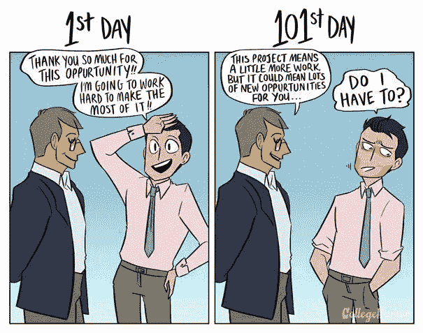

# 作为软件工程师的第一年，我学到了什么

> 原文：<https://levelup.gitconnected.com/learned-first-year-software-engineer-d70064229db5>

相关的

我刚刚完成了作为软件工程师的第一个完整的一年，时间过得很快。

一路走来，我学到了很多，我想花些时间反思一下，并分享我所学到的东西。

# 师徒制

有一段时间，我淡化了导师在职业发展中的重要性。找到一个好的导师需要很长时间，坦率地说，我*还没有花时间去找一个。*

相反，我选择尽可能多地向团队中的高级工程师学习。幸运的是，我和他们相处得很好，甚至可以问一些与职业相关的问题。我经常询问的一些问题或建议包括:

*   有哪些学习{语言/库}的好资源？
*   你在代码评审中寻找什么？
*   有哪些事情是你希望自己在职业生涯之初就知道的？
*   在#年的工作经验中，你的薪水是多少？

# 做你自己的拥护者

根据我的经验，当你作为初级开发人员开始一份新工作时，你的同事总是会低估你。不幸的是，我被分配的工作简单、无趣、太容易了。

这真的很令人沮丧，因为我觉得自己对工作越来越厌烦，因为我做的事情不太具有挑战性。而且，我很抱歉让这种情况持续了太长时间(2-2.5 个月)。

这需要很多内部动员，但我最终在一次 sprint 规划会议上谈到了这一点。

事后看来，我没有说太多——我说我想做更复杂的事情。然后，我继续积极尝试承担我认为更合适的任务，而不是相信我的同事知道什么对我最好。

# 学习如何寻求帮助

我承认，我还在努力。我过去常常很乐意寻求帮助，但随着时间的推移，我对此越来越感到难为情。我担心随着时间的推移，我没有表现出对代码库更好的理解。我担心我的同事会认为我学得不够快，或者我不擅长编码。

克服这种不安全感和普遍的冒名顶替综合症一直很困难。我不能说我真的已经释怀了，但是我已经采取了一些措施来减轻这种感觉，包括:

*   写下我的问题或我遇到的困难。这让我看到，随着时间的推移，我的问题变得越来越“聪明”，我问的是更复杂的事情。
*   向别人传授我的发现。如果另一个工程师有我能回答的问题，我会提供帮助，即使我不确定我是对的。你可以想象，我的回答中充斥着“我认为”、“如果我错了，请有人纠正我”、“也许”、“可能”和“这可能是”。尽管我害怕这样做，但我尽最大努力记住，从长远来看，这对我更好。我可以与他人分享我学到的东西，同时从其他工程师那里获得我理解的反馈。
*   谈论我的感受。另一个初级工程师和我同时开始工作，所以我发现和她谈论我的不安全感真的很有帮助。她也能够分享她是如何挣扎的，这让我觉得我并不孤单或落后。

我不再寻求帮助的另一个原因是，我经常得到太多 T2 的帮助。我会带着一个我认为很简单的问题去找一位高级工程师，然后我会带着任务中所有有趣的部分离开。我一直在努力问更具体的问题，当我认为我已经得到了我想要的东西时就说出来，这样我得到的帮助就到此为止了。

# 你真的不需要成为专家——真的。

“你不必成为专家”。当我考虑在当地集会和会议上发言时，当我开始尝试写技术文章时，我听到了很多次。很长一段时间我都不相信——当然这只是人们在说他们已经非常擅长说的事情。

但是有一周，工作让我陷入了一个*非常特殊的*问题——我们正在将`react-router`从 v3 升级到 v4。这次升级需要大量的研究，因为一些关键的库被否决了，而且有很多突破性的变化。

我最终对这个特定的图书馆了解了很多。在很多天的过程中，我阅读了很多文档、GitHub 问题和指南。我收集了所有我找到的信息，并对其进行了整合，因为我没有找到任何一个有助于深入解释正在发生的事情的指南。

于是，我[自己写了一个](https://www.freecodecamp.org/news/a-guide-to-upgrading-to-react-router-4/)。当然，这并没有引起太多的关注。更重要的是，我很欣慰没有人拿着干草叉追我。

然后，我想到了当我第一次开始学习一门新的语言或框架时，我阅读了多少“x 入门”的文章。这些都是非常基础的文章，需要一些背景知识，但总体来说没有什么太大的技术争议。

那时，我决定将 React Hooks 作为我下一篇文章的主题。无论如何我都不是反作用钩子的专家。它刚刚问世，我只把它用于一些个人项目，但我写了一篇关于它的文章。所以，真的，你不需要成为专家。

# 利用与经理一对一的机会

如果你目前还没有做，那就去问他们。我每两周吃一次。对我来说，我发现这些一对一的交流是一个很好的机会，让我反思我的工作，对我困惑的事情提出问题，并对工作顺利和不顺利的事情给出总体反馈。

一些具体的问题和反馈包括:

*   产品的这一部分是如何工作的？
*   在我的 PRs 中，您是否看到了可以改进的一致主题？
*   我很喜欢在 X 上工作，但我想继续探索其他的东西，所以你认为我可以开始从事与 Y 相关的工作吗？

因为这些对话，我能够得到我更感兴趣的不同类型的任务，学习更多关于代码库的知识，并且通常使我的部分工作更容易。

虽然每个经理都是不同的——所以你可能不习惯问我建议的那种问题，但至少，希望你能得到一些对你工作有用的反馈。

# 文件

尤其是在你职业生涯的早期，记录你每天都在做什么是很重要的。这有助于你看到自己的成长，更好地理解你的工作，并且总体上有助于你反思和理解你一直在做的事情。另外，你可以更容易地在简历上加分。

我承认我在这方面很糟糕。我大约每周在笔记本上记下一些东西，当我这样做的时候，我只真正记下我们产品中更复杂的部分。理想情况下，你会想记下那天你完成了什么，并更经常地记下代码库和一般的“业务逻辑”。

我不认为这是一件谈论/写得足够多的事情，但我在 twitter 上关注的一个人 [Cecelia Martinez](https://twitter.com/ceceliacreates) ，最近问她的 Twitter 粉丝他们用来记录事情的工具，所以绝对[看看](https://twitter.com/ceceliacreates/status/1172187733961379840?s=20)如果这是你感兴趣的事情。

# 广泛参与社区活动

科技行业在很多方面都存在问题，但作为一名从事科技行业的女性，它帮助我追随那些经历过与我类似事情的人。[李美玲](https://twitter.com/ladyleet)([这家网络实验室](https://www.thisdot.co/labs)的首席执行官)有一份优秀的[女性科技从业者名单可以追随](https://twitter.com/ladyleet/status/985018157994831872)。

我还加入了我所在城市的女性程序员分会，并参加了一些当地聚会。作为一个见到陌生人会很紧张的人，我发现这是一个在热情友好的环境中交流的好方法。

# 寻找非编码爱好

当我第一次开始工作时，我感到很大的压力，要跟上最新的技术，并继续学习新的东西。然而，我很快就筋疲力尽了，因为这就是我所做的一切。

我后退了几步，决定探索做我喜欢的、与编码无关的事情。我开始学习如何弹吉他和如何说印地语，我加入了一个读书俱乐部，我开始更多地去健身房。

总而言之，我学到了很多，希望你也从我的经历中学到了一些东西。我很期待明年会发生什么！