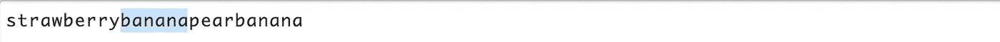

# 了解高级正则表达式

> 原文：<https://levelup.gitconnected.com/learning-about-advanced-regular-expressions-94fd346819a0>


莎伦·麦卡琴在 [Unsplash](https://unsplash.com?utm_source=medium&utm_medium=referral) 上的照片

## 深入了解作为程序员最难学习的东西之一

正则表达式经常被忽视，大多数程序员认为它们很难学。虽然基础知识可以很快学会，但是更高级的正则表达式概念可能很难理解。

尽管正则表达式非常强大，但很多程序员并不真正了解正则表达式。

在本文中，我们将回顾一些更高级的正则表达式概念。我最近[发表了一篇文章](/read-this-if-you-dont-know-enough-about-regex-73141bb0e1a7)，讲述了正则表达式的基础知识。

如果您不太熟悉正则表达式，并且希望了解更多关于正则表达式的知识，那么这篇文章是一个很好的起点。我建议你先读那篇文章，然后再看这篇文章。

本文深入探讨了更高级的正则表达式，是介绍基础知识的文章的后续。所以事不宜迟，让我们更深入地研究正则表达式吧！

# 匹配 A 或 B

正则表达式有可能匹配 A 或 b。例如，当您想要查找*颜色*时，这很方便。或者颜色，这是一些人喜欢的写法。

为了匹配 A 或 B，您可以使用管道。


这是正则表达式:/(colour|color)/g 的结果

如果您愿意，可以添加更多选项。要添加选项 C，只需添加另一个管道和必须与之匹配的值。


这是 regex: /(colour|color|clr)/g 的结果

注意，大多数时候需要将正则表达式放在括号中。如果你这样做，这至少是一个好习惯，因为它使你的正则表达式可读性更好。这些括号称为捕获组。如果您还不知道什么是捕获组，请不要担心，我们接下来将讨论捕获组。

## 摘要

```
*(Jon|John) *            Match either Jon or John
*(Jon|John|Johnny) *     Match either Jon, John or Johnny
```

# 捕获组

捕获组是更高级的正则表达式的基本部分，因为它们允许我们提取正则表达式匹配的一部分。

为了创建一个捕获组，您必须将正则表达式的一部分括在括号中。通过这种方式，您可以将正则表达式的这一部分组合在一起，这允许您对整个组应用量词等。

假设我们想要匹配一些没有扩展名的 pdf 的文件名。我们可以使用一个捕捉组来捕捉比赛的这一部分。


这是正则表达式的结果:/^(.*)\.pdf 美元/克

请注意，所有的 PDF 文件都得到匹配。目前没什么特别的。但是当我们看一看被捕的那群人。


使用捕获组的结果

## 摘要

将正则表达式的一部分用括号括起来，以提取正则表达式匹配的部分。

# 非捕获组

就像捕获组一样，非捕获组也存在。非捕获组是您可以定义不想捕获的组。差不多都在名字里了。

要定义非捕获组，您可以使用`(?:)`。以此为前缀的组不会被捕获，因此不会显示在匹配项中。在处理复杂的正则表达式时，您会经常用到这个特性。

假设我们正在寻找史密斯家族的成员。大多数家庭成员都有中间名，但是我们想把这些从匹配中排除。为此，我们可以使用非捕获组。

我们使用下面的正则表达式:

```
/(Frank|Jimmmy|Jeff)\s(?:.*)\s(Smith|Smithy)/g
```

我们在第一个捕获组中寻找 *Frank* 、 *Jimmy* 和 *Jeff* ，后面跟着一个空白字符。接下来是非捕获组，可以包含任何字符。注意，这个组以`?:`开始，这使它成为一个非捕获组。这个非捕获组后面还有一个空白字符。在最后一个捕获组中，我们寻找姓氏 *Smith* 和*Smith*。


regex 的结果:/(Frank|Jimmmy|Jeff)\s(？:.*)\s(Smith|Smithy)/g

这个正则表达式只产生两个匹配—一个是名，一个是姓。


非捕获组从匹配中排除了中间的名字

## 摘要

使用`(?:)`创建一个非捕获组。这将从匹配中排除该组。

# 前瞻

有时，我们只需要为一个模式寻找那些在另一个模式之前或之后的匹配。您可以在正则表达式中使用 lookaheads 来实现这一点。

如果 *B* 紧跟在 *A* 之后，Lookaheads 可以用来匹配*A*。它的语法看起来像`A(?=B)`。

让我们来看看下面的正则表达式。这个正则表达式使用正向前瞻。

```
/banana(?=pear)/g
```

如果直接跟进*梨*就会搭配*香蕉*。


regex: /banana(？=梨)/g

前面的例子是一个积极前瞻的例子。另一方面，也有消极的展望。如果在它的正前方没有 *B* ，则负前视匹配 *A* 。

像这样的否定前瞻的语法应该是:`A(?!B)`。回到前面的例子，让我们检查下面的正则表达式:

```
/banana(?!pear)/g
```

会搭配*香蕉***如果是**不是**直接跟进*梨*。**


regex: /banana(？！梨)/克

## 摘要

```
**Positive lookahead**
*banana(?=apple) *          Match *banana* that is directly followed up by *apple***Negative lookahead** *banana(?!apple)* Match *banana* that is **not** directly followed up by *apple*
```

# 向后看

后视与前视的工作方式相同，只有一个主要区别——它看的是后面而不是前面。

如果 *B* 在前面，Lookbehinds 可用于匹配 *A* 。其语法类似于`(?<=B)A`。

让我们来看看下面的正则表达式，它使用了一个肯定的 lookbehind。

```
/(?<=strawberry)banana/g
```

如果这个正则表达式前面直接有*草莓*，它将匹配*香蕉*。



正则表达式的结果:/(？<=strawberry)banana/g

There’s also a negative lookbehind which matches *A* 如果它没有 *B* 就直接在它前面。否定后视的语法类似于`(?<!B)A`。

```
/(?<!strawberry)banana/g
```

如果**而不是**前面有*草莓*，这个正则表达式将匹配*香蕉*。


正则表达式的结果:/(？

## 摘要

```
**Positive lookbehind** *(?<=apple)banana*          Matches the *banana* that has *apple* right in front of it**Negative lookbehind** *(?<!apple)banana* Matches the *banana* that **doesn't** have *apple* right in front of it
```

# 包装它

既然我们已经讨论了这些更高级的正则表达式主题，我希望您已经了解了一些东西。到目前为止，您可能比一般开发人员更了解正则表达式——这很好。

但是为了保持领先，您需要练习并获得正则表达式的实践经验。例如，您可以将它们构建到您的下一个应用程序中。

摆弄你刚刚学到的所有新的正则表达式概念。

编码快乐！