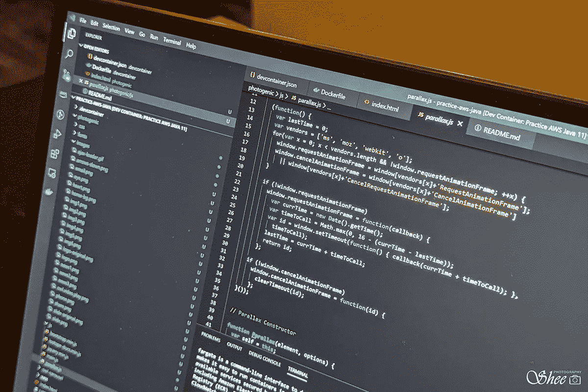
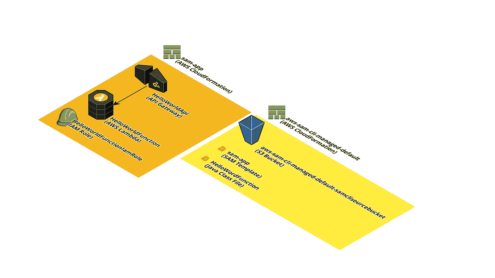

# 学习 AWS CLIs 以使用 VS 代码部署 AWS Lambda 函数

> 原文：<https://levelup.gitconnected.com/learning-aws-clis-to-deploy-aws-lambda-services-using-vs-code-3963481bc743>



# TD；速度三角形定位法(dead reckoning)

1.  这是一个关于建立一个示例 AWS Lambda 函数并快速干净地将其拆除的指导性教程。
2.  本教程使用 VS 代码开发容器来演示它如何在本地机器上提供一个包含所有必要工具的环境来开始构建和部署 AWS 服务。它也可以重复用于其他工具链。

# 又一个教程？

自从我上次写博客已经有一段时间了。哦，孩子，有很多途径可以出版你想要的任何东西。这是我在 Medium 上的第一篇帖子，我想分享一些我编译的步骤，以便轻松地开发和部署 AWS 服务。

在这篇文章中，我分享了一种使用 AWS CLI 工具快速构建和部署 Lambda 示例函数的方法。

为了让之前没有任何 AWS 背景的人更容易开始学习和使用这些工具，我创建了一个[容器](https://code.visualstudio.com/docs/remote/containers)，其中包含了所有必要的工具，可以让本教程开箱即用。

VS 代码通过针对 Visual Studio 代码的的[远程容器扩展支持(是的，它已经发布了一段时间)Docker 容器内的代码开发。作为一个一直从事针对不同平台和工具集的项目的人，我非常欣赏今天的开发工具支持特定于项目的环境(我以前是通过使用虚拟机来实现这一点的)。你可以想象当我听到关于](https://aka.ms/vscode-remote/download/extension) [Github Codespaces](https://github.blog/2020-05-06-new-from-satellite-2020-github-codespaces-github-discussions-securing-code-in-private-repositories-and-more/#codespaces) 的消息时我有多兴奋。Github 代码空间有其他的选择，但是我认为如果在 Github 中集成，采用的成本会更低。我真的希望有一个免费的选择。

# 怎么样

我开发的 DevContainer 项目包含一些由 Micosoft[vs code-dev-containers](https://github.com/microsoft/vscode-dev-containers)项目提供的附加功能，如下所示:

1.  安装 AWS 工具(aws cli、aws sam cli、aws fargate cli、*等*)。)
2.  Docker 中的 Docker；在 docker 容器中运行 docker 引擎。在本例中，aws sam cli 要求使用 Docker。

我制作了这个 DevContainer 的两个版本；一个用于 Java，另一个用于 Node:

1.  [Java AWS 实践项目](https://github.com/senglin/practice-aws-java)
2.  [节点](https://github.com/senglin/practice-aws-node)AWS 实践项目

# 我们开始吧

在继续学习本教程之前，请在您的本地计算机上安装以下工具:

1.  [Visual Studio 代码](https://code.visualstudio.com/)
2.  [远程 Visual Studio 代码的容器扩展](https://aka.ms/vscode-remote/download/extension)
3.  [码头工人](https://docs.docker.com/install/#supported-platforms)
4.  饭桶

从上面的练习项目中挑一个，说我们选 Java 吧。

```
$ git clone [https://github.com/senglin/practice-aws-java.git](https://github.com/senglin/practice-aws-java.git)
```

在 VS 代码中打开克隆的 Git 存储库文件夹。

单击左下角的快速操作状态栏项目。

选择**远程容器:在容器**中重新打开。这一步需要一段时间，因为 Docker 镜像和所需的包将被下载和安装。

从菜单中选择**端子- >新端子**。您现在可以使用安装的工具来克隆、开发和部署到 AWS。

对于本教程的其余部分，*请在 VS 代码*中使用这个终端窗口。

验证您是否安装了必要的 CLI。

```
$ aws --version
aws-cli/2.0.17 Python/3.7.3 Linux/4.19.76-linuxkit 
$ sam --version
SAM CLI, version 0.52.0
```

验证容器中的 docker 引擎正在工作。您应该会看到客户端和服务器的版本。如果没有，一个好的补救方法是点击左下角的快速动作状态栏项，并选择**Remote-Containers:Rebuild Container**。

```
$ docker version
Client: Docker Engine - Community
 Version:           19.03.9
 API version:       1.40
 Go version:        go1.13.10
 Git commit:        9d988398e7
 Built:             Fri May 15 00:25:25 2020
 OS/Arch:           linux/amd64
 Experimental:      falseServer: Docker Engine - Community
 Engine:
  Version:          19.03.9
  API version:      1.40 (minimum version 1.12)
  Go version:       go1.13.10
  Git commit:       9d988398e7
  Built:            Fri May 15 00:23:57 2020
  OS/Arch:          linux/amd64
  Experimental:     false
 containerd:
  Version:          1.2.13
  GitCommit:        7ad184331fa3e55e52b890ea95e65ba581ae3429
 runc:
  Version:          1.0.0-rc10
  GitCommit:        dc9208a3303feef5b3839f4323d9beb36df0a9dd
 docker-init:
  Version:          0.18.0
  GitCommit:        fec3683
```

恭喜你。

# 设置凭据

请确保您已经设置了 AWS 帐户。您可以利用持续 12 个月的 [AWS 免费等级](https://aws.amazon.com/free/free-tier/)。

如果您还没有这样做，请设置您的 AWS 凭证环境。有关访问密钥 id 和秘密访问密钥的信息，请参见 *IAM 用户指南*中的[管理 IAM 用户的访问密钥](https://docs.aws.amazon.com/IAM/latest/UserGuide/id_credentials_access-keys.html)。确保设置了区域名称(这是为了方便)。

```
$ **aws configure**
AWS Access Key ID [None]: **your_access_key_id**
AWS Secret Access Key [None]: **your_secret_access_key**
Default region name [None]: **us-west-2**
Default output format [None]:
```

# 下载并测试一个示例 Java Lambda 应用程序

接下来的步骤严格遵循 [AWS SAM 指南](https://docs.aws.amazon.com/serverless-application-model/latest/developerguide/serverless-getting-started-hello-world.html)中的步骤。

1.  使用以下流程下载示例应用程序:

```
$ **sam init**
Which template source would you like to use?
        1 - AWS Quick Start Templates
        2 - Custom Template Location
Choice: **1**Which runtime would you like to use?
        1 - nodejs12.x
        2 - python3.8
        3 - ruby2.7
        4 - go1.x
        5 - java11
        6 - dotnetcore3.1
        7 - nodejs10.x
        8 - python3.7
        9 - python3.6
        10 - python2.7
        11 - ruby2.5
        12 - java8
        13 - dotnetcore2.1
Runtime: 5Which dependency manager would you like to use?
        1 - maven
        2 - gradle
Dependency manager: **1**Project name [sam-app]:Cloning app templates from [https://github.com/awslabs/aws-sam-cli-app-templates.git](https://github.com/awslabs/aws-sam-cli-app-templates.git)AWS quick start application templates:
        1 - Hello World Example: Maven
        2 - EventBridge Hello World: Maven
        3 - EventBridge App from scratch (100+ Event Schemas): Maven
        4 - Step Functions Sample App (Stock Trader): Maven
Template selection: **1**-----------------------
Generating application:
-----------------------
Name: sam-app
Runtime: java11
Dependency Manager: maven
Application Template: hello-world
Output Directory: .Next steps can be found in the README file at ./sam-app/README.md$
```

2.切换到新创建的目录并构建项目。

```
$ **cd sam-app/**
$ **sam build**
Building function 'HelloWorldFunction'
Running JavaMavenWorkflow:CopySource
Running JavaMavenWorkflow:MavenBuild
Running JavaMavenWorkflow:MavenCopyDependency
Running JavaMavenWorkflow:MavenCopyArtifactsBuild SucceededBuilt Artifacts  : .aws-sam/build
Built Template   : .aws-sam/build/template.yamlCommands you can use next
=========================
[*] Invoke Function: sam local invoke
[*] Deploy: sam deploy --guided$
```

3.在当前环境下，您可以执行下面的函数来本地测试 lambda 函数。

```
$ **sam local invoke**
Invoking helloworld.App::handleRequest (java11)Fetching lambci/lambda:java11 Docker container image....................................................................................................................................................................................................................................................
Mounting /workspaces/practice-aws-java/sam-app/.aws-sam/build/HelloWorldFunction as /var/task:ro,delegated inside runtime container
START RequestId: aba29d4d-6554-1ca6-ebc0-16d26831ec6a Version: $LATEST
END RequestId: aba29d4d-6554-1ca6-ebc0-16d26831ec6a
REPORT RequestId: aba29d4d-6554-1ca6-ebc0-16d26831ec6a  Init Duration: 265.90 ms        Duration: 1159.41 ms    Billed Duration: 1200 ms        Memory Size: 512 MB     Max Memory Used: 90 MB{"body":"{ \"message\": \"hello world\", \"location\": \"<redacted>\" }","headers":{"X-Custom-Header":"application/json","Content-Type":"application/json"},"statusCode":200}$
```

该命令使用默认事件`events\event.json`调用`template.yml`中定义的 HelloWorldFunction。

4.您也可以在本地部署该功能:

```
$ **sam local start-api**
Mounting HelloWorldFunction at http://127.0.0.1:3000/hello [GET]
You can now browse to the above endpoints to invoke your functions. You do not need to restart/reload SAM CLI while working on your functions, changes will be reflected instantly/automatically. You only need to restart SAM CLI if you update your AWS SAM template
2020-06-07 09:16:18  * Running on http://127.0.0.1:3000/ (Press CTRL+C to quit)
```

5.这将启动一个正在运行的进程。从菜单中选择**端子- >新端子**，并发出以下卷曲请求。

```
$ **curl** [**http://127.0.0.1:3000/hello**](http://127.0.0.1:3000/hello)
{ "message": "hello world", "location": "<redacted>" }
```

6.您可以在前一个终端窗口中使用 Ctrl-C 关闭该服务。

# 部署

现在您有机会部署到 AWS。部署架构如下:



AWS SAM CLI 提供自己的数据库供自己使用，并为每个新部署创建新的云形成实例。

运行以下命令，然后回答提示。确保您选择的区域与您在本教程开始时提供的区域相同。

```
$ **sam deploy --guided**Configuring SAM deploy
======================Looking for samconfig.toml :  Not foundSetting default arguments for 'sam deploy'
        =========================================
        Stack Name [sam-app]: 
        AWS Region [us-east-1]: us-west-2
        #Shows you resources changes to be deployed and require a 'Y' to initiate deploy
        Confirm changes before deploy [y/N]: **y**
        #SAM needs permission to be able to create roles to connect to the resources in your template
        Allow SAM CLI IAM role creation [Y/n]:  
        HelloWorldFunction may not have authorization defined, Is this okay? [y/N]: **y**
        Save arguments to samconfig.toml [Y/n]:
```

该流程将以类似如下的输出结束:

```
CloudFormation outputs from deployed stack
--------------------------------------------------------------------
Outputs                                                                                                                                                                                                                                     
--------------------------------------------------------------------
Key                 HelloWorldFunctionIamRole                                                                                                                                                                                               
Description         Implicit IAM Role created for Hello World function                                                                                                                                                                      
Value               arn:aws:iam:redactedKey                 HelloWorldApi                                                                                                                                                                                                           
Description         API Gateway endpoint URL for Prod stage for Hello World function                                                                                                                                                        
Value               **https://<redacted>.execute-api.us-west-2.amazonaws.com/Prod/hello/**Key                 HelloWorldFunction                                                                                                                                                                                                      
Description         Hello World Lambda Function ARN                                                                                                                                                                                         
Value               arn:aws:lambda:redacted                                                                                                                                 
--------------------------------------------------------------------Successfully created/updated stack - sam-app in us-west-2
```

一旦这个流程完成，您就可以运行下面的请求(从上面的输出中找到您的相关 url):

```
$ curl **https://<redacted>.execute-api.us-west-2.amazonaws.com/Prod/hello/**
```

# 打扫

您应该在完成试验后删除部署，这样您就不会产生费用/用完您的自由配额。

```
$ aws cloudformation delete-stack --stack-name sam-app
```

上面只删除了 Lambda 函数。但是，AWS SAM CLI 将有关构建/部署的信息存储在单独的 S3 存储桶中。你可以在你的列表中看到 S3 桶:

```
$ aws s3 ls
2020-06-07 19:00:04 aws-sam-cli-managed-default-samclisourcebucket-<redacted>
```

如果您想完全删除它，请继续下面的操作。

我发现了一个有用的[脚本](https://gist.github.com/wknapik/191619bfa650b8572115cd07197f3baf)，它可以自动清空启用了版本控制的 S3 存储桶(有几个脚本，但我只选择了一个——感谢社区！)

```
$ aws-s3-empty-bucket.sh --bucket $(aws cloudformation describe-stacks --stack-name aws-sam-cli-managed-default | jq -r '.Stacks[0].Outputs[] | select(.OutputKey=="SourceBucket") | .OutputValue')
$ aws s3 rb s3://$(aws cloudformation describe-stacks --stack-name aws-sam-cli-managed-default | jq -r '.Stacks[0].Outputs[] | select(.OutputKey=="SourceBucket") | .OutputValue')
$ aws cloudformation delete-stack --stack-name aws-sam-cli-managed-default
```

这个`aws-sam-cli-managed-default-samclisourcebucket`桶现在应该已经被完全移除了。

# 摘要

到本教程结束时，您将已经部署并测试了使用 Lambda 函数实现的端点，并且熟悉了 AWS CLI 的基本命令。

如果你在学习教程的过程中有任何问题，请告诉我。我的意图是引入一个框架(devcontainer 项目),它使用必要的工具来加速环境创建，以便使用 VSCode 远程容器特性将项目部署到 AWS。

接下来，Lambda 函数之后是什么？法盖特集装箱服务！继续阅读[使用 Visual Studio 代码](https://medium.com/@senglin/learning-aws-clis-to-deploy-aws-fargate-services-using-vs-code-75548acb4115)开发代码&部署到 AWS Fargate