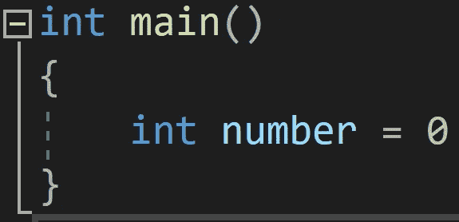
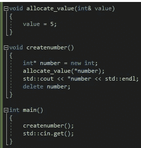
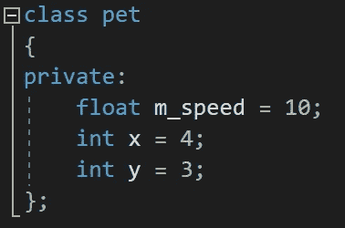
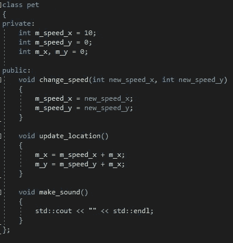
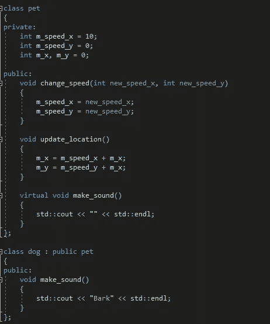

# 学习 C++:一项困难但可管理的任务

> 原文：<https://levelup.gitconnected.com/learning-c-a-difficult-but-manageable-task-5229881aa0be>

无论您是将 C++作为第一语言学习，还是从 python 等其他语言学习，学习 C++都是一项艰巨的任务，但不应该害怕。

图片由 [Unsplash](https://unsplash.com/s/photos/c%2B%2B?utm_source=unsplash&utm_medium=referral&utm_content=creditCopyText) 上的 [Taras Shypka](https://unsplash.com/@bugsster?utm_source=unsplash&utm_medium=referral&utm_content=creditCopyText) 拍摄

当我在 2020 年从 python 出来后第一次学习 C++时，我被大量的内容所淹没，但当我把它分成更小的块并每天学习一点点时，这项任务变得易于管理，并且是我期待的事情。

你如何开始学习 C++真的取决于你是一个完全的初学者还是来自一种不同的语言。如果你是一个完全的初学者，像 codeacademy 这样的地方是很棒的，如果你只是想得到一些基本的东西，比如:打印到控制台，if/else 语句和 for/while 循环。然而，如果你来自不同的语言，如果你有点生疏，codeacademy 课程仍然有用，否则，它只会教你已经知道的东西。我发现对我有用的是互联网上存在的大量视频，我注意到其中很多都集中在 C++的几个核心方面。因此，我将总结这些核心要素，而不是把数百个视频联系起来。

# **指针**

C++允许你在堆栈和堆上存储内存。存储在堆栈上的内存是范围内的内存。

堆栈分配变量，源:作者

堆栈分配的变量在离开作用域时被删除，因此 int 类型的变量编号不能在任何其他函数中使用，除非它被解析到该函数中，但是该函数仍然必须在声明该变量的同一个作用域内调用。

在堆上分配的变量没有这个问题，但是在堆上分配的变量不能被调用，因为它们的内存地址是未知的，这就是指针出现的地方。指针允许你存储变量的内存地址，允许你调用变量，引用也做类似的事情，除了它们只是获得内存地址，允许你通过引用传递变量到函数中。

指针的使用，来源:作者

在这个例子中，变量 number 是一个堆分配的 int 指针，由 int*和 new 表示。new 关键字在堆上分配内存，而*实际上使它成为一个指针。*number 表示我在解引用指针来获取原始变量。delete 关键字的存在是因为 C++没有垃圾收集，所以这些变量会留在堆中导致内存泄漏，删除所有堆分配的变量非常重要。

如果你能掌握 C++中的指针，剩下的学习应该会变得更容易

# **面向对象编程**

C++是面向对象的编程，但是你可以在 C++中编写非面向对象的代码。

OOP 是一种范式，意味着软件是围绕对象而不是功能来设计的。

来源:作者

在这个例子中，我们有一个定义宠物的基类。一只宠物目前有三个变量，它的速度，它的 x 位置和它的 y 位置。这些都是私有变量，这意味着只有这个类和与这个类是朋友的类才能改变它们。

来源:作者

这个更新的类包含函数，在 C++中，当这些函数被放入一个对象中时，就被称为方法。方法是公共的意味着这些函数可以在类外调用。

像其他 OOP 语言一样，C++也允许对象从其他对象派生。在这个例子中，我创建了一个名为 dog 的宠物子类。Dog 有所有相同的变量，方法有基类。但是有一点不同，在基类中现在有一个名为 make_sound()的虚方法，在子类中也有一个名为 make_sound()的虚方法，但是输出不同。通过使它成为虚函数，将总是使用该类的正确函数。

如果你打算从事游戏开发，理解 C++中的 OOP 是至关重要的。它还可以用于各种各样的其他应用，例如渲染器或基于代理的传输模型等等。

# **变量类型**

在 C++中，你必须声明你的变量的类型，这与其他语言不同，比如 python，解释器会自动给变量分配一个类型。

如果你来自一种不需要声明变量类型的语言，这就更成问题了，但是如果 C++是你的第一语言，这就不是问题了

我还没有介绍 C++入门所需的所有内容，否则这篇文章会没完没了。但是最后，学习 C++很难，但是有一些方法可以让你变得更容易。