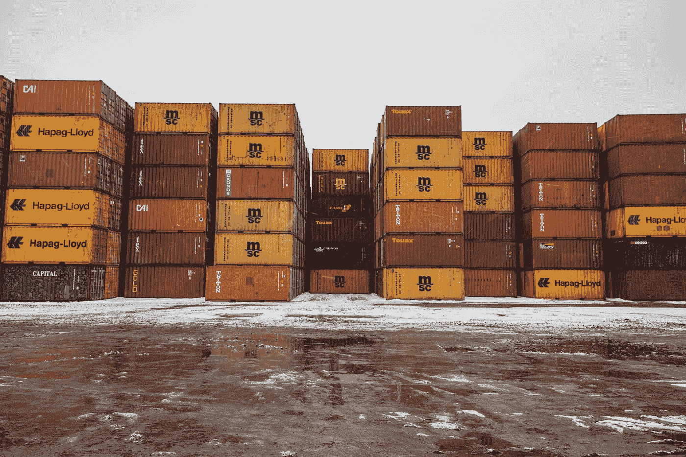

# 学习 c++:STL 容器概述

> 原文：<https://levelup.gitconnected.com/learning-c-an-overview-of-the-containers-of-the-stl-72e736ae5c33>

照片由 [Unsplash](https://unsplash.com?utm_source=medium&utm_medium=referral) 上的 [Jp Valery](https://unsplash.com/@jpvalery?utm_source=medium&utm_medium=referral)

标准模板库(STL)包含一组用于存储数据的容器(数据结构)。这些容器与 STL 的算法一起使用，以解决各种计算机处理问题。在本文中，我将概述 STL 中的三个容器类别，并简要讨论这些类别中的容器的细节。我还有其他文章更详细地讨论了这些容器。你可以在我的网站上找到它们。

# STL 容器类别

STL 中的三类容器是:*序列*、*关联*和*适配器*。序列容器按顺序存储数据，顺序通常非常重要。例如，可能需要从最低到最高显示一组等级，因此将等级存储在序列容器中是必要的。

关联容器存储与其他数据相关联的数据。例如，一个联系人列表(我几乎用过电话簿，但意识到那让我听起来很老)存储了名字和与这些名字相关的电话号码。另一个例子可能是一个简单的库存，库存中的商品数量与一个商品名称相关联。

容器类别的第三种类型是适配器。适配器容器是其他类别之一的变体。两个经典的例子是栈和队列，我将在本文后面讨论。

在我开始讨论序列容器之前，我需要花一点时间讨论一下它们与原始(在内置的意义上)数组的使用。多年来，即使在 STL 变得可用之后，程序员仍然坚持使用数组来满足大多数数据存储需求。这种偏好很大程度上是因为与 STL 容器相比，数组的效率有所提高，尽管使用数组会因其大小不灵活而产生问题。随着 STL 变得更加高效，内置数组相对于 STL 容器的这种优势现在基本上消失了。甚至像比雅尼·斯特劳斯特鲁普这样的权威也建议程序员在几乎所有的应用程序中选择向量(一个 STL 序列容器)而不是原始数组。

# 序列容器

序列容器是数据的有序集合，其中数据通常存储在连续的存储器位置中。一些序列容器中的数据可以被随机访问，但并非所有的序列容器都是如此。

最常用的序列容器是`vector`类。与原始数组相比，使用向量有几个优点。最重要的优点是，一个向量可以按照程序员的意愿增长和收缩。原始数组有一个固定的大小，如果不复制或使用动态内存就不能改变。vector 的另一个优点是它有一个 size 函数，返回存储在 vector 中的元素数量。这意味着您可以使用向量作为函数参数，而不必像原始数组那样将向量的大小作为第二个参数。仅这两个优点就使 vector 成为大多数顺序数据存储需求的首选容器。

另一个顺序容器是`deque`类。这个容器就像一个动态数组，您可以在末尾或开头添加数据。这意味着，如果您的应用程序需要将数据添加到前端和后端，那么 deque 可能是一个很好的容器。但是，如果需要频繁地将数据添加到中间，就不要使用它，因为这需要上下移动元素来为新数据腾出空间。

STL 也有一个`array`类。这个类模仿了原始数组，但也有一些优于它的地方。例如，该类有一个您可以使用的`size`函数，这样您就不需要将它与数组一起传递给函数，而您必须用原始数组来传递。

`list`类是一个顺序容器，具有链表的行为。这意味着当您需要频繁插入或删除时，列表是一个很好的容器，因为列表插入或删除只涉及重新分配链接或删除不再需要的链接，而不是移动元素来为插入腾出空间或从删除中回收空间。`list`类是一个双向链表，这样你可以在列表中向前或向后移动。

`forward_list`类是一个单向链表，只允许向前移动。这个类没有多大用处，因为它不提供 list 类的功能，而且由于单链表的性质，有些函数效率很低。但是，当您希望快速遍历列表的开头和结尾时，可以使用该类。

这就结束了 STL 序列容器的概述。关于这些容器的更深入的报道，请参阅我的其他文章。

# 关联容器

关联容器是一种根据某种排序标准自动对其元素进行排序的容器。存储在关联容器中的数据可以是任何类型的值，也可以是任何类型的键/值对。对于键控容器，一个键直接映射到一个值。

我将回顾的第一个关联容器是`set`类。集合是根据值排序的唯一值的容器。集合通常由小于运算符(`<`)排序，这意味着集合的正常排序顺序是升序。将重复项放入集合的尝试将会失败。

还有另一个类`multiset`，它允许重复，但具有与 set 类相同的排序行为。

`map`类是一个关联容器，它以键/值对的形式存储数据。映射条目的键可以是任何数据类型，与该键相关联的值也可以是任何数据类型。`map`类的实例通常被称为关联数组，因为一个映射的行为就像一个带有非整数索引的数组。当映射名用键“索引”时，它返回用键存储的值。映射的一个重要特征是不允许重复键。

如果需要一个包含重复键的容器，可以使用`multimap`类。多映射可以用作字典，因为字典可以让同一个单词有多种含义，所以多映射可以让同一个键与多个值相关联。

这些是 STL 中的关联容器。set 和 map 类是最常用的，除非必须存储非唯一数据。

# 适配器容器

如果一个容器为特定目的采用了更通用的容器类型，那么它就是容器适配器。适配器容器类是`stack`、`queue`和`priority_queue`。

`stack`类实现了一个特殊的容器，只允许后进先出(LIFO)访问。这是通过具有有限数量成员函数的类接口来实现的。使用`push`函数将新数据值添加到堆栈中。使用`pop`功能从堆栈中移除数据值。使用`top`功能查看栈顶值。这是堆栈中唯一可以查看的元素。除了一些其他的实用函数，这些是唯一可以在堆栈上执行的操作。

栈在计算机科学中有很多应用，比如在解释器和编译器中的作用域操作，以及在其他领域，比如实现逆波兰符号算法。

`queue`类实现了一个容器，该容器模拟数据缓冲区的操作或存储中的行。队列允许先进先出(FIFO)访问。使用`push`函数将新数据放入队列中。使用`front`功能检查队列的前面，使用`back`功能检查队列的后面。函数的作用是:从队列中移除一个值。

队列在计算机科学(数据缓冲区)和模拟中有应用，其中客户活动(商店排队)需要建模。

`priority_queue`类类似于 queue 类，但是元素被放入基于排序标准的优先级队列中，该排序标准可以在声明优先级队列时提供。如果没有提供分类标准，则使用`less`。

使用`push`函数将数据放入优先级队列，使用 `pop` 函数移除数据，但仅提供`top`函数用于检查优先级队列的内容(前端元素)。

优先排队的一个典型例子是医院急诊室的排队。病人根据病情的严重程度排队等候，以便病情最重的病人先得到治疗。

# STL 容器并不全面

并不是每一个经典的计算机科学数据结构都是由 STL 实现的，但是所提供的容器将涵盖您将会遇到的大多数应用程序。虽然您可能已经在学校中实现了这些容器中的一部分或大部分，但是我们建议您只在 C++程序中使用这些实现，因为它们肯定比您自己构建的任何东西都更有效。

我还没有详细介绍本文中提到的任何容器，但是请查看我已经发表的文章或以后的文章，了解所有这些 STL 容器的详细介绍。

感谢您阅读这篇文章，请给我发电子邮件，提出您的意见和建议。