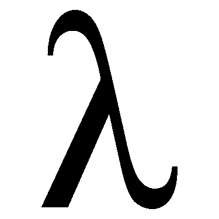

# 学习 C++: Lambdas 和 STL

> 原文：<https://levelup.gitconnected.com/learning-c-lambdas-and-the-stl-1a48e18033a>



lambda(也称为匿名函数)是一个没有名字的函数。lambda 可以在任何需要语句或表达式的地方调用。你可以在任何需要命名函数的地方使用 lambda。

# 第一个简单的例子

让我们通过写经典的“你好，世界！”来开始我们对 lambda 的探索使用 lambda 的示例。我们使用 lambda 的第一种方法是将它赋给一个变量:

```
auto hw = []() { cout << "Hello, world!"; };
hw(); // Hello, world! is displayed
```

看第一行代码，lambda 在赋值操作符的右边。我们将马上解释所有的语法。但是现在，注意我们使用了`auto`关键字，所以编译器将推断出 lambda 的类型。如果我们试图为变量提供我们自己的类型，比如 void，编译器会产生一个错误。

通过将变量名与函数调用操作符`()`结合起来调用函数。这里，对`hw`的调用类似于对 void 函数的调用，执行 lambda 块中定义的语句。

使用这个函数的第二种方法是定义它并在同一个语句中调用它。我们是这样做的:

```
[]() { std::cout << "Hello, world!"; }();
// displays Hello, world!
```

lambda 与函数调用操作符相结合，以立即执行 lambda 的主体。如上所述，该语句的行为就像调用 void 函数一样。

# Lambda 语法解释

编写 lambda 时遇到的第一个语法元素是一对方括号(`[]`)，称为 *lambda 引入符*。该元素用于捕获外部值，以便在 lambda 中使用。让我们看一个简单的例子，扩展我们的“你好，世界！”λ:

```
string name = "Dennis";
auto hw = [name] () { std::cout << "Hello, " << name << "!"; };
hw(); // displays Hello, Dennis!
```

我们将字符串变量名放在 lambda 导入器中，这样我们就可以在 lambda 中使用它的值。变量通过值传递给 lambda，就像值参数传递给常规函数一样。

在 lambda 引入程序之后，您可以为 lambda 指定参数。现在，我们将只演示如何向 lambda 传递一个简单的值:

```
auto hw = [] (const std::string &name ) { std::cout << "Hello, "
                                          << name << "!"; };
hw("Dennis"); // displays Hello, Dennis!
```

在这个例子中，我们为函数指定一个常量字符串引用参数，然后用一个字符串文字调用函数。稍后，我们将演示在这个地方可以使用的其他参数。

# Lambdas 可以返回值

当然，lambdas 不一定要表现为 void 函数。lambda 也可以返回值。例如:

```
auto r = [] (int num) { return num * num; };
std::cout << r(2) << std::endl; // displays 4
```

由于在 lambda 中没有指定返回类型，编译器将从返回值中推导出类型:

```
auto d = [] (double val) { return val * 1.1; };
auto dr = d(3.14159);
std::cout << typeid(dr).name(); // displays d for double
```

在这个例子中，我们使用`typeinfo` 头来显示变量`dr`的数据类型。

还可以使用以下语法指定 lambda 的返回类型:

*[ ] () - >数据类型{ lambda 语句体；};*

以下是使用此语法的示例:

```
auto d = [](int i) -> double { return i * i; };
std::cout << typeid(d(2.2)).name(); // displays d for double
```

# 通过引用或值传递外部范围

在 lambda 引入程序内部，您可以指定如何将程序的外部范围传递给 lambda。通过值来指定，你写`[=]` ，通过引用来指定，你写`[&]`。例如，下面的程序使用 lambda 来执行变量交换:

```
int x = 1, y = 2;
std::cout << "Before the lambda call: " << std::endl;
std::cout << "x: " << x << ", y: " << y << std::endl;
[&] () { int temp = x; x = y; y = temp; }();
std:: cout << std::endl << "After the lambda call: " << std::endl;
std::cout << "x: " << x << ", y: " << y << std::endl;
```

这个程序的输出是:

```
Before the lambda call:
x: 1, y: 2After the lambda call:
x: 2, y: 1
```

这段代码之所以有效，是因为我们告诉编译器通过引用传递外部作用域中引用的变量，这给了我们对`x`和`y`的写访问权限，这样我们就可以更改它们的值。然而，如果我们试图使用`[=]` 作为 lambda 引入者来运行这段代码，或者只是让它为空，编译器会返回一个错误，因为它检测到我们试图修改我们只有读取权限的变量的值。

您可以通过在参数列表后添加关键字 mutable 来修改 lambda 中的这种行为。这使您可以对 lambda 内部的对象进行写访问，但不能对 lambda 外部的对象进行写访问。我们可以重写上面的`swap` lambda 程序，允许变量值在 lambda 内部交换，如下所示:

```
int x = 1, y = 2;
std::cout << "Before the lambda call: " << std::endl;
std::cout << "x: " << x << ", y: " << y << std::endl << std::endl;
[x,y] () mutable { int temp = x; x = y; y = temp; std::cout
  << "Inside the lambda: " << "x: " << x << " ,y: " << y
  << std::endl;}();
std:: cout << std::endl << "After the lambda call: " << std::endl;
std::cout << "x: " << x << ", y: " << y << std::endl;
```

这段代码的输出是:

```
Before the lambda call:
x: 1, y: 2Inside the lambda: 
x: 2 , y: 1After the lambda call:
x: 1, y: 2
```

注意，我们必须将`x`和`y`放在 lambda 导入器中来捕获变量的值，当我们告诉编译器通过引用来捕获外部范围时，我们不必这样做。

# 使用 Lambdas —一个实际例子

如上例所示，Lambdas 通常不单独使用。相反，当与 STL 中的算法结合使用时，lambdas 被证明是最有用的。我将用两个使用 STL 算法的例子来演示这一点。

第一个例子演示了如何使用带有`sor` t 函数的 lambda。这个函数将把一个容器中的内容(在这个例子中是一个向量)排序。默认顺序是升序。以下程序演示了`sort` 功能的工作原理:

```
#include <iostream>
#include <vector>
#include <algorithm>template <typename T>
void print_vector(std::vector<T> vec) {
  for (T element : vec) {
    std::cout << element << " ";
  }
}int main()
{
  std::vector<int> numbers {3,1,2,5,4};
  print_vector(numbers);
  std::cout << std::endl;
  sort(numbers.begin(), numbers.end());
  std::cout << std::endl;
  print_vector(numbers);
  return 0;
}
```

这个程序的输出是:

```
3 1 2 5 41 2 3 4 5
```

但是如果我们想对向量进行降序排序呢？原来,`sort`函数带有一个可选的第三个参数，它可以是一个函数对象，或者对于我们的目的来说，是一个 lambda。我们可以用它来改变排序的顺序，这样排序就是降序而不是升序。

下面是对带有 lambda 的`sort`函数的调用，用于按降序排序:

```
sort(numbers.begin(), numbers.end(),
  [](int a, int b){ return a > b; });
```

要将排序顺序从升序改为降序，我们只需要测试大于条件而不是小于条件，这也是`sort`函数的默认行为。

如果我们用上面的新函数调用替换原来的`sort`函数调用，我们会得到以下输出:

```
3 1 2 5 45 4 3 2 1
```

另一个经常使用的 STL 函数是`for_each`。这个函数获取容器中的一系列数据，并对该范围内的每个元素执行一些任务。让我们使用这个函数来显示上面例子中的矢量数据。

首先，我们将开发函数调用。我们需要一个 lambda 来获取范围内的每个元素，并将其写出到标准输出中。这是 lambda 的样子:

```
[] (auto &element) { std::cout << element << " "; };
```

我通过使用`auto`声明来自外部的元素的类型，并通过传递元素作为引用，使这个 lambda 更加通用，这样我们就不会意外地复制大量数据。

下面是 lambda 在函数调用中的样子:

```
for_each(numbers.begin(), numbers.end(),
  [](auto &element) { std::cout << element << " ";});
```

下面是使用函数调用的代码片段:

```
std::vector<int> numbers {3,1,2,5,4};
sort(numbers.begin(), numbers.end(),]
  [](int a, int b){ return a > b; });
for_each(numbers.begin(), numbers.end(),
  [](auto &element) { std::cout << element << " ";});
```

输出是:

```
5 4 3 2 1
```

# 兰姆达斯很有用

当您需要在函数调用中使用局部函数时，Lambdas 是很好的工具。这些通常是“一次性的”,因此如果您只打算进行一次函数调用，那么创建一个单独的函数是没有意义的。

感谢您阅读这篇文章，请给我发电子邮件，提出您的意见和建议。