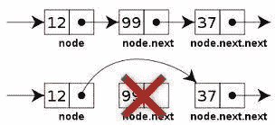

# 学习 c++:STL 和 List 类

> 原文：<https://levelup.gitconnected.com/learning-c-the-stl-and-the-list-class-8544e3c13387>


照片由[格伦·卡斯滕斯-彼得斯](https://unsplash.com/@glenncarstenspeters?utm_source=medium&utm_medium=referral)在 [Unsplash](https://unsplash.com?utm_source=medium&utm_medium=referral) 拍摄

众所周知，分配了连续内存地址的顺序容器(如数组)在插入和删除数据时效率很低。如果需要在数组前面插入或删除一个数据元素，一个 *n* 大小的数组可能需要 *n* 个步骤。本文讨论了在可能发生多次插入和删除时使用的替代容器——`list`类。这个类实现了经典的*链表*数据结构。

# 链表结构

一个*链表*是被链接在一起的被称为*节点*的数据元素的独立集合。一个列表可以是单链接的，其中链接从列表的前面移动到列表的后面，或者一个列表可以是双 T21 链接的，其中既有前向链接也有后向链接。

下面是单向和双向链表的图示:


图片由克里斯托弗·韦伯提供

链表不允许随机访问，因为您只能通过节点的链接从一个数据元素移动到另一个数据元素。

# 链表的优点

标准模板库(STL)的 list 类是一个提供高效插入和删除的链表。链表不是上下移动元素来执行插入或删除，而是简单地分配几个指针，使链接的元素指向正确的下一个或前一个元素。以下是链表插入的外观:


图片由 engineering.purdue.edu 提供

从链表中删除看起来像这样:



图片由 tech-faq.com 提供

当处理非常大的数据集时，通过对链表执行插入和删除而节省的步骤数量可能非常大。

# 创建列表

`list`类用于在 C++中创建链表。像所有的 STL 容器一样，这个类是一个模板类，所以数据类型必须在 `list`关键字之后指定。下面是两条创建新的`list`对象的语句:

```
list<string> names;
list<int> numbers;
```

还可以通过在声明中添加 size 参数来指定列表中元素的初始数量:

```
list<string> names(10);
list<int> numbers(100);
```

您可以提供一个初始化列表，在声明时将一些数据放入列表中:

```
list<string> names{"Cynthia", "Jonathan", "Raymond",
                   "Danny", "Mayo"};
list<int> numbers{1,2,3,4,5};
```

# 将数据放入列表

在列表中存储数据有两种标准方法。要使用的功能有`push_back`和`push_front`。`push_back`函数将数据添加到列表的后面，而`push_front`函数将数据添加到列表的前面。下面是两个演示如何使用这些函数的例子(在这个例子之后，我将只展示代码片段，而不是完整的程序):

```
#include <iostream>
#include <list>|
using namespace std;int main()
{
  list<string> names;
  string name;
  for (int i = 1; i <= 5; i++) {
    cout << "Enter a name: ";
    getline(cin, name);
    names.push_back(name);
  }
  list<int> grades;
  int grade;
  for (int i = 1; i <= 5; i++) {
    cout << "Enter a grade: ";
    cin >> grade;
    grades.push_front(grade);
  }
  return 0;
}
```

# 访问汇总列表数据

列表中的数据只能通过范围`for`循环或迭代器来访问。以下是这两种技术的示例:

```
int main()
{
  list<string> names {"John", "Paul", "George", "Ringo"};
  list<int> grades{81, 77, 92, 100, 88};
  cout << "The names list:" << endl << endl;
  for (string name : names) {
    cout << name << " ";
  }
  cout << endl << endl << "The grades list: " << endl << endl;
  for (auto iter = grades.begin(); iter != grades.end();
       iter++) {
    cout << *iter << " ";
  }
  return 0;
}
```

没有办法随机访问列表元素或使用索引技术。这些技术违背了链表的整体思想，在链表中，对一个元素的访问导致通过链接对下一个元素的访问。

# 访问列表的前面和后面

`list`类具有访问列表前端和后端的特殊函数。令人惊讶的是，这些函数被称为`front`和`back`。下面是它们的使用方法:

```
int main()
{
  list<string> names {"John", "Paul", "George", "Ringo"};
  list<int> grades{81, 77, 92, 100, 88};
  cout << "The front of names is: " << names.front() << endl;
  cout << "The back of names is: " << names.back()
       << endl << endl;
  cout << "The front of grades is: " << grades.front()
       << endl;
  cout << "The back of grades is: " << grades.back() << endl;
return 0;}
```

# 对列表进行排序

分类类对象的方式不同于其他容器，比如 vectors。该类将 sort 函数作为成员函数，这意味着它是从一个`list`类实例中调用的，而不是使用容器迭代器作为一般 sort 函数的参数。

下面是`sort`成员函数如何处理`list`对象:

```
int main()
{
  list<string> names {"John", "Paul", "George", "Ringo"};
  list<int> grades{81, 77, 92, 100, 88};
  names.sort();
  for (string name : names) {
    cout << name << " "; // displays George John Paul Ringo
  }
  cout << endl << endl;
  grades.sort();
  for (int grade : grades) {
    cout << grade << " "; // displays 77 81 88 92 100
  }
  return 0;
}
```

# 从列表中删除数据

有几种技术可以从列表实例中删除数据。两个常用的成员函数分别从列表的前面和后面移除元素，`pop_front`和`pop_back`。它们是这样工作的:

```
int main()
{
  list<string> names {"John", "Paul", "George", "Ringo"};
  list<int> grades{81, 77, 92, 100, 88};
  names.pop_front();
  for (string name : names) {
    cout << name << " "; // displays Paul George Ringo
  }
  cout << endl << endl;
  grades.pop_back();
  for (int grade : grades) {
    cout << grade << " "; // displays 77 92 100 88
  }
  return 0;
}
```

您也可以使用`remove`功能删除特定值。它是这样工作的:

```
int main()
{
  list<int> grades{81, 77, 92, 100, 88};
  grades.remove(100);
  for (int grade : grades) {
    cout << grade << " "; // displays 81 77, 92 88
  }
  return 0;
}
```

请记住，当删除一个值时，内部数据结构只需要重新排列两三个链接，而不需要执行任何数据移位。

另一种从列表中删除数据的方法是`erase`函数。这个函数将删除迭代器位置的元素。这个函数是这样工作的:

```
int main()
{
  list<string> beatles {"John", "Paul", "George", "Pete", "Ringo"};
  auto iter = beatles.begin();
  while (*iter != "Pete") {
    iter++;
  }
  beatles.erase(iter);
  for (string name : beatles) {
    cout << name << " ";
  }
  return 0;
}
```

程序移动一个迭代器，直到找到想要移除的元素，然后调用`erase`函数移除它。

另一个从列表中移除元素的函数是`remove_if`。该函数将根据条件删除元素。下面是一个使用 lambda 函数剔除一些随机生成的数字的示例:

```
#include <iostream>
#include <list>
#include <cstdlib>
#include <ctime>
using namespace std;int main()
{
  srand(time(0));
  list<int> numbers;
  for (int i = 1; i <= 20; i++) {
    numbers.push_back(rand() % 100 + 1);
  }
  for (int n : numbers) {
    cout << n << " ";
  }
  numbers.remove_if([](int number) { return number < 50;});
  cout << endl << endl;
  for (int n : numbers) {
    cout << n << " ";
  }
  return 0;
}
```

这个程序的输出是:

```
7 38 76 67 26 74 52 53 65 26 56 82 66 90 83 55 88 34 8 7376 67 74 52 53 65 56 82 66 90 83 55 88 73
```

您可以通过调用`clear` 函数来删除列表中的所有元素。

# 插入到列表中

`insert`功能允许您将数据插入列表。但是，您必须使用迭代器来指定插入点。这个函数有好几个版本，但我只演示最简单的版本，它在迭代器位置之前插入一个元素。下面是一个例子:

```
int main()
{
  list<string> beatles {"John", "Paul", "George", "Ringo"};
  auto iter = beatles.begin();
  while (*iter != "Ringo") {
    iter++;
  }
  string fifthBeatle = "Pete";
  beatles.insert(iter, fifthBeatle);
  for (string name : beatles) {
    cout << name << " ";
    // displays John Paul George Pete Ringo
  }
  return 0;
}
```

# 使用列表作为集合

在这篇文章的最后，我将演示如何将一个列表作为一个集合来使用。函数`unique`从列表中移除所有重复的元素。有了这个功能，当你需要这个功能的时候，你可以把一个列表变成一个特殊情况下的集合。通常，当你需要一个集合时，你应该使用 set 类。

下面是一个使用`unique`功能的例子:

```
void printList(list<int> lst) {
  for (int n : lst) {
    cout << n << " ";
  }
}int main()
{
  list<int> numbers;
  srand(time(0));
  for (int i = 1; i <= 50; i++) {
    numbers.push_back(rand() % 100 + 1);
  }
  numbers.sort();
  printList(numbers);
  numbers.unique();
  cout << endl << endl;
  printList(numbers);
  return 0;
}
```

# 清单上的最后一个词

您不应该使用`list`类来满足正常的数据存储需求。向量和数组更适合一般用途。但是，如果您的应用程序需要大量的插入和删除，可以考虑使用`list`类，因为它比使用一个在连续内存中存储数据的容器更有效。

感谢您阅读这篇文章，请给我发电子邮件，提出您的意见和建议。