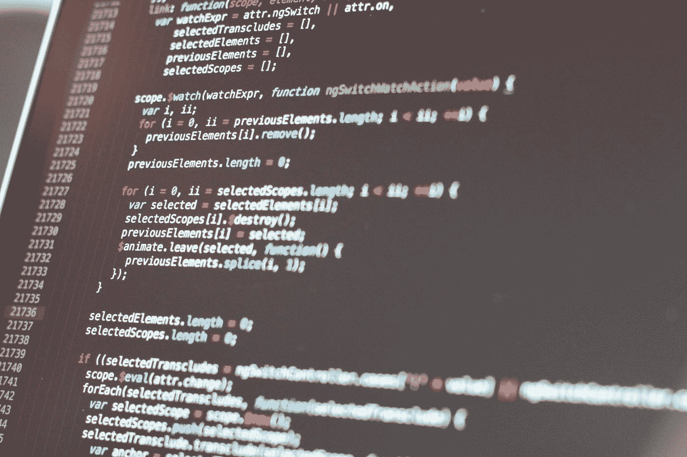

# 学习 C++:值和参考参数

> 原文：<https://levelup.gitconnected.com/learning-c-value-and-reference-parameters-d3cbfd176b42>



图片由 [Taras Shypka](https://unsplash.com/@bugsster?utm_source=medium&utm_medium=referral) 在 [Unsplash](https://unsplash.com?utm_source=medium&utm_medium=referral) 上拍摄

初学 C++的程序员最难理解的概念之一是通过值传递函数参数和通过引用传递函数参数之间的区别。在本文中，我将解释两者的区别，并演示何时以及为什么应该使用每种参数类型。

# 按定义的值传递

当函数接收参数的副本时，函数参数通过值传递。这意味着参数值存储在为函数调用保留的内存中。这是 C++的默认行为。

为了演示按值传递意味着什么，这里有一个简单的例子:

```
#include <iostream>
using namespace std;void changeParam(int param) {
  param += 5;
  cout << "Parameter: " << param << endl;
}int main ()
{
  int number = 0;
  changeParam(number);
  cout << "Number: " << number << endl;
  return 0;
}
```

这个程序的输出是:

```
Parameter: 5
Number: 0
```

变量`number`作为变量(参数)传递给函数。在函数内部，参数值增加 5，该值显示在屏幕上。该功能结束，控制返回到`main`。然后访问`number`的值，显示仍为 0。

变量的值没有改变，因为当`number`被传递给函数时，它的值的副本被放入参数中。该值是由函数体增加的值，当函数结束时，与该函数相关的所有存储器，包括参数及其值，都被擦除。

在很大程度上，这正是我们想要的 C++函数的行为。事实上，编写函数是为了执行计算，但是当传递给函数的数据可以被函数改变时，理解程序如何工作就变得更加困难了。

# 通过定义的引用传递

通过在参数名前面加上地址运算符(`&`)来引用传递参数。当参数通过引用传递时，编译器访问参数的内存位置并直接使用该值，而不是像通过值传递参数那样使用该值的副本。

下面是上面的程序，它被修改为使用引用参数而不是值参数:

```
void changeParam(int &param) {
  param += 5;
  cout << "Parameter: " << param << endl;
}int main ()
{
  int number = 0;
  changeParam(number);
  cout << "Number: " << number << endl;
  return 0;
}
```

下面是这个程序的输出:

```
Parameter: 5
Number: 5
```

因为参数是通过引用传递的，所以在函数中所做的更改是永久的，当在`main`中访问变量时，将显示`number`的新值。

# 引用传递的一个实例

需要对其参数进行永久更改的函数的一个很好的例子是交换函数。在排序应用程序中，交换变量值可能会发生数百次或更多次，因此为此创建一个交换函数是有意义的。

让我们首先看看如果我们使用值参数编写交换函数会发生什么:

```
void swap(int val1, int val2) {
  int temp = val1;
  val1 = val2;
  val2 = temp;
}int main ()
{
  int number1 = 1;
  int number2 = 2;
  cout << "number1: " << number1 <<", number2: "
       << number2 << endl;
  swap(number1, number2);
  cout << "number1: " << number1 <<", number2: "
       << number2 << endl;
  return 0;
}
```

这个程序的输出是:

```
number1: 1, number2: 2
number1: 1, number2: 2
```

这些值没有交换，因为它们是通过值传递给函数的，一旦函数结束，变量中的值就与传递给函数之前的值相同。

您所要做的就是让参数引用参数，然后函数就可以正常工作了:

```
void swap(int &val1, int &val2) {
  int temp = val1;
  val1 = val2;
  val2 = temp;
}int main ()
{
  int number1 = 1;
  int number2 = 2;
  cout << "number1: " << number1 <<", number2: "
       << number2 << endl;
  swap(number1, number2);
  cout << "number1: " << number1 <<", number2: "
       << number2 << endl;
  return 0;
}
```

这个程序的输出是:

```
number1: 1, number2: 2
number1: 2, number2: 1
```

显然，通过引用传递可以解决问题，并使变量交换成为可能。

# 默认情况下，数组是引用参数

默认情况下，C++中的一些对象是引用参数。这种对象的一个例子是数组。您可以将一个数组传递给一个函数，而不需要提供 address-of 运算符，并且函数中对数组的任何更改都是永久的。

下面是一个函数示例，该函数将传递给它的数组中的分数曲线化:

```
void curver(int arr[], int numEles, int amount) {
  for (int i = 0; i < numEles; i++) {
    arr[i] += amount;
  }
}int main ()
{
  const int numElements = 5;
  int grades[] = {71, 67, 88, 72, 66};
  for (const int grade : grades) {
    cout << grade << " ";
  }
  cout << endl;
  curver(grades, numElements, 5);
  for (const int grade : grades) {
    cout << grade << " ";
  }
  return 0;
}
```

以下是该程序的输出:

```
71 67 88 72 66
76 72 93 77 71
```

# 默认情况下，向量是值参数

与数组不同，向量在默认情况下是值参数，如果您想对函数中的向量进行更改，您必须使用 address-of 运算符将向量作为引用参数传递。

下面是上面的分数示例，使用向量代替了数组:

```
#include <iostream>
#include <vector>
using namespace std;void curver(vector<int> &vec, int amount) {
  for (int i = 0; i < vec.size(); i++) {
    vec[i] += 5;
  }
}int main ()
{
  vector<int> grades = {71, 67, 88, 72, 66};
  for (const int grade : grades) {
    cout << grade << " ";
  }
  cout << endl;
  curver(grades, 5);
  for (const int grade : grades) {
    cout << grade << " ";
  }
  return 0;
}
```

这个程序的输出是:

```
71 67 88 72 66
76 72 93 77 71
```

如果向量按值传递，程序将运行，但函数调用后成绩不会改变。

# 何时使用每个参数传递类型

一般来说，您编写的函数应该使用通过值传递的参数来编写。大多数函数都是根据传递给它们的数据生成新值的。但是，有些情况下需要通过引用传递参数，例如交换变量值和修改向量值。

然而，许多初学编程的人了解引用参数，并将它们视为解决所有函数问题的方法。你自己不要犯这种错误。必要时使用引用参数，其余时间使用赋值参数。

感谢您的阅读，请发送电子邮件至[mmmcmillan1@att.net](mailto:mmmcmillan1@att.net)向我提出意见和建议。如果你对我的在线编程课程感兴趣，请访问 https://learningcpp.teachable.com。