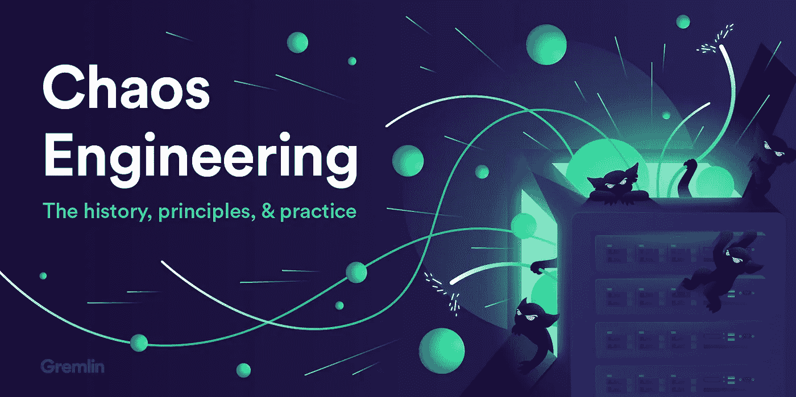
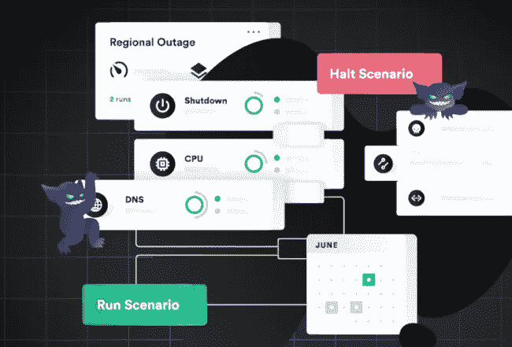
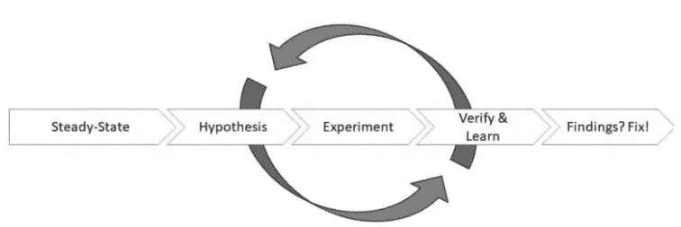
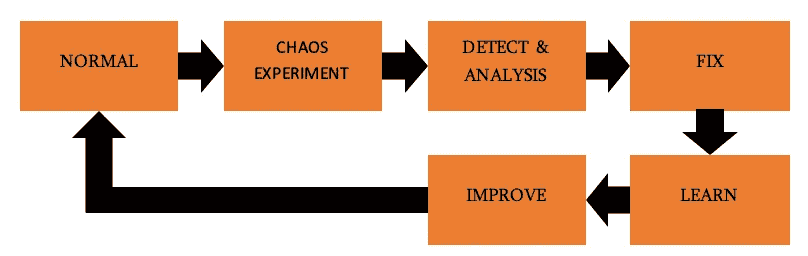

# 学习混沌工程——探索脆弱的软件系统

> 原文：<https://levelup.gitconnected.com/learning-chaos-engineering-exploring-fragile-software-systems-1e9f319098f>

## 云和 Kubernetes **增加了评估应用弹性的复杂性**

来源:[https://RES . cloud inary . com/gremlin/image/upload/c _ limit，q_80，w _ 2000/chaosengineeringintro-tutorial-title-2x . png](https://res.cloudinary.com/gremlin/image/upload/c_limit,q_80,w_2000/chaosengineeringintro-tutorial-title-2x.png)

现代分布式系统越来越多地采用微服务架构风格来设计基于云的系统。然而，**微服务架构和容器编排技术(如 Kubernetes)的流行增加了评估此类系统弹性的复杂性。**在这篇文章中，我将阐述如何通过对一个示例应用进行弹性测试或者*混沌工程*来揭示和探索系统的弱点。

来源:[https://cdn . Lynda . com/course/5028636/5028636-637199559059573570-16x 9 . jpg](https://cdn.lynda.com/course/5028636/5028636-637199559059573570-16x9.jpg)

公司希望他们的系统是可靠的。用户期望这些系统在高峰工作时间也可用。想象一下，像亚马逊这样的在线零售平台在黑色星期五的几分钟内无法使用。这听起来是个大问题吗？2013 年，亚马逊大约有 15 分钟无法访问，这让零售商损失了 66，240 美元——每分钟**[【1】](https://www.upguard.com/blog/the-cost-of-downtime-at-the-worlds-biggest-online-retailer)！那基本上就是一百万美元了！**

**如果宕机几分钟，许多企业都会遭受巨大的收入损失，不仅仅是亚马逊。8 月份，英国航空公司不得不取消 100 多个航班，另有 200 多个航班因几个系统故障而延误。历史给我们提供了更多这样的事件[【3】](https://spectrum.ieee.org/riskfactor/computing/it/it-failures-2018-all-the-old-familiar-faces)。因此，企业和开发者加大努力来增强他们系统的弹性。然而，正如爱德华·墨菲所说:**

> ***“任何可能出错的事情*都会*出错”***

**当前的弹性工程方法旨在首先避免故障，例如在多台机器上分布组件(分布式系统架构)或通过部署单个组件的多个实例(冗余)。现在，开发人员知道软件系统*将*失败。不知何故。有时。在最糟糕的时刻。因此，有必要了解*我们的系统如何*发生故障，以及我们的系统*在这种情况下如何*运转。**

# **什么是混沌工程？**

****

**来源:[https://cdn . thenewstack . io/media/2019/09/a 0767727-gremlin-chaos-engineering-templates . png](https://cdn.thenewstack.io/media/2019/09/a0767727-gremlin-chaos-engineering-templates.png)**

**如*混沌原理*[【4】](https://principlesofchaos.org/?lang=ENcontent)所述，混沌工程可以定义如下。**

> ***混沌工程是对系统
> 进行实验的学科，目的是建立对系统能力
> 的信心，以承受生产中的动荡条件***

**混沌工程的最初想法来自于网飞将他们私有的基础设施迁移到云环境的需要。于是，网飞创造了混沌猴。混沌猴负责关闭单个 AWS EC2 实例，以便观察单个 EC2 实例的丢失是否会导致系统中断[【7】](https://www.gremlin.com/community/tutorials/chaos-engineering-the-history-principles-and-practice/)。以前，网飞称这种做法为弹性测试，但后来被改为混沌工程。早期的方法建议在生产环境中进行实验，以便从实验中获得最佳效果。**

**然而，看看最近的研究，许多从业者建议在生产环境中开始之前在阶段之间进行转换。因此，建议在一个隔离的环境中开始实验，直到你对这个过程和你的实验有足够的信心，可以进入下一个阶段。不幸的是，在孤立的环境中进行试验并不能提供与生产中试验同等的洞察力。**

**混沌工程归结为以下过程:**

****

*   ****定义稳定状态** —为了知道您的系统是否按预期工作，您应该定义一组业务度量和一组容差，这些容差给出了关于您的系统当前状态的详细信息 [[8]](https://books.google.de/books?hl=de&lr=&id=DwqiDwAAQBAJ&oi=fnd&pg=PR4&dq=russ+miles+learning+chaos+engineering&ots=cQHWe0JPlo&sig=EGxeD7cT26yVftc94IZzCniR24o#v=onepage&q=russ%20miles%20learning%20chaos%20engineering&f=false) 。参见[【9】](https://medium.com/netflix-techblog/sps-the-pulse-of-netflix-streaming-ae4db0e05f8a)作为一组业务度量的例子。**
*   **假设 —为了进行实验，你需要陈述一个假设。假设被认为是一种信念的陈述。在假设中，您假设您的系统在特定情况下按照您的意愿运行。例如，我们相信，在数据库服务器的两个实例中有一个丢失后，我们的系统仍然能够提供数据内容。**
*   ****运行实验** —在这一步中，您执行您的实验，并根据需要观察您的系统。任何发现都应以合理和可理解的方式记录下来，以便进行精确的分析。**
*   ****验证** —在这一步中，你根据你的假设分析你的发现。您可以使用任何有意义的测试和验证方法，例如统计假设测试，如 t-测试、Kolmogorov-Smirnov 等。**
*   ****调整** —如果您发现任何偏差，您应该立即修复它们！如果你认为已经解决了这个问题，你可以回到假设步骤，或者提出一个新的假设，或者重新进行之前的实验。**

**在您的实验测试计划中，应该始终考虑连续运行相同的实验，因为这提供了连续的验证，确保以前修复的问题不会再次出现在您的系统中。**

# **打破神话混沌工程**

****

**虽然，我假设谣言陈述了混沌工程应该是什么，但是实际上，他们大多数描述的是什么**而不是**！让我们揭开其中一些的神秘面纱:**

1.  ****破坏给定系统中的随机组件**–诚然，关于混沌工程的第一个解决方案和理论是基于随机终止 EC2 实例的行动，但在过去的几个月和几年中，人们已经意识到不受控制的混沌产生的价值低于使用系统方法**
2.  **我们运行混沌猴，所以我们在做混沌工程——正如 Grady Booch 曾经说过的:“一个拥有工具的傻瓜仍然是一个傻瓜”。虽然混沌猴子最初被宣布为网飞混沌工程时代的开端，但仅仅由*运行*它是不够的。混沌工程可以应用于许多层面，而不仅仅是基础设施层面，因此，如果它符合你的目的，仅仅通过运行混沌工程工具而不进行彻底的调查，可能会也可能不会帮助你获得你所寻求的知识**。****
3.  **仅仅为了打破东西而打破它们——阻止你在对你的系统进行彻底实验的基础上获得新知识**
4.  ****注入一个我们知道我们的系统无法处理的失败**——正如 Russ Miles、Benjamin Wilms 和其他几个人指出的，如果我们已经知道我们的系统无法坚持我们的假设，我们将不会通过执行实验获得任何新的信息。**
5.  ****我们需要在生产中进行测试，以便进行真正的混沌工程** —尽管上面的定义建议这样做，但混沌工程领域的许多人(如 Russ Miles、Benjamin Wilms)建议从小处着手，如在隔离的测试环境或类似环境中。生产应该是混沌工程周期中的最后一步，只有当你对之前应用混沌工程的努力有足够的信心时才会考虑**
6.  ****我们正在做混沌工程，所以我们可以放弃其他测试—** 绝对不行！混沌工程不是单元测试、集成测试或其他测试的替代品，而是它们的补充**

# **混沌工程基本术语**

****

**到目前为止，我们已经讨论了我们没有解释的不同术语，即稳态、稳态假设和爆炸半径。在下文中，我们将对它们进行更好的描述，因为我们需要它们来将混沌工程应用到应用程序中。**

## **稳态描述**

**让我们从稳态开始:应用程序的稳态是一组业务度量和一组容差的组合，这些容差给出了关于系统当前状态的详细信息[【10】](https://books.google.de/books?hl=de&lr=&id=DwqiDwAAQBAJ&oi=fnd&pg=PR4&dq=russ+miles+learning+chaos+engineering&ots=cQHWe0JPlo&sig=EGxeD7cT26yVftc94IZzCniR24o#v=onepage&q=russ%20miles%20learning%20chaos%20engineering&f=false)。稳定状态可以是单个指标，如测量的响应时间，也可以是复合指标。一个很好的例子是网飞的[流每秒启动(SPS)](https://medium.com/netflix-techblog/sps-the-pulse-of-netflix-streaming-ae4db0e05f8a) 。网飞的业务指标是随着时间的推移收集的多个指标的复合。但是，确定了您的系统特有的一组测量值并不足以描述一个稳定状态。在混沌工程实验中，我们希望观察湍流情况是否对我们的系统行为有重大影响，即我们的测量值是否有重大变化。例如，假设您使用响应时间来识别和描述系统的稳态。如果我们进行一个混乱的实验，我们想要观察我们的反应时间是正变还是负变。任何偏离参考分布的情况都会为我们提供有价值的信息，让我们了解我们的系统在注射阶段的表现。**

## **稳态假设**

**稳态假设应该是关于系统稳态的假设或假设。所以可以用各种方式陈述。使用假设的一种常见方式是将它们表述为信念的*陈述*。举个例子，**

> ***我们相信我们的系统仍然能够维持它的核心服务，尽管数据库被删除了***

**一个好的开始是问这样的问题:如果……会发生什么？如果……这还会起作用吗？然而，你可能已经确定了许多潜在的候选者，值得作为混沌实验来实施。此时，您将需要决定哪些实验值得执行，哪些实验将被放弃。当然，你可以为每个“如果…会怎样”的场景设计完整的实验，但这将花费大量的时间、金钱和精力。因此，您应该考虑使用不同的方法来区分已确定的假设的优先级。一个有价值的方法是应用事件分析。已知的方法有故障树分析、故障模式和影响分析。但是，根据系统的不同，如果操作正确，应用这些方法需要花费大量的时间和精力。尽管如此，它们将为你提供一个很好的指示，哪些实验或假设值得考虑，哪些可以暂时忽略。**

## **爆炸半径**

**爆炸半径被认为是你的实验可能对你的系统产生的影响。在众多因素中，最小化爆炸半径应该是你的首要任务，尤其是当你在生产中运行混沌工程的时候。爆炸半径通常指的是减少实验规模，例如，通过减少单个实验中目标组件的数量。**

## **结论**

**在这篇博文中，我们讨论并解释了理解混沌工程所必需的基础知识。如果你想了解更多，请在[脸书](https://www.facebook.com/devopsdudes/)和[推特](https://twitter.com/DevopsDudes)上发表评论或分享，我们会跟进第二个帖子！**

# **顺便说一下，👏🏻*鼓掌*👏🏻如果你喜欢这篇文章，请举手(高达 50 倍)。它鼓励我继续写作，并帮助其他人找到它:)**

**请跟随👉 [Tj 博客](https://medium.com/u/97d099c3810d?source=post_page-----1e9f319098f--------------------------------)获取更多精彩的 DevOps 故事！**