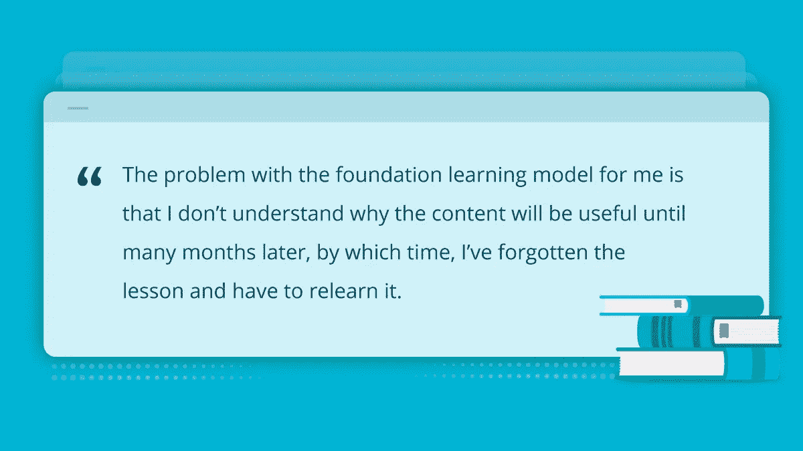

# 通过解决问题学习 Django:一个律师如何建立他的副业

> 原文：<https://levelup.gitconnected.com/learning-django-through-problem-solving-how-a-lawyer-built-his-side-project-209b7aced659>

*本帖最初发表于* [*导师的博客*](https://www.codementor.io/blog/django-lawyer-a5j3og2tox?utm_source=medium&utm_campaign=outreach)

> “我不想成为一名程序员。我只是想建立 K 的状态，但在这一点上，我可能已经学会了 Django 中的每个主题。”

Ingram 是一名全职律师，也是 KState 的创始人，这是一个问答网站，用户可以根据学术研究回答自己的问题，他带着非常明确的目标和非常模糊的想法开始了他的编程之旅。

“多年来，我有一个网站的想法，我想存在，”Ingram 解释说，“有某些类型的问题——经验问题——最佳可用答案来自已发表的研究，而不是某人的意见。但是要理解那些研究所说的有太多的障碍。我想解决这个问题。”

在正常情况下，几乎没有任何编程知识的人会选择雇佣专业开发人员来构建他们的产品。“我会把它比作一件艺术品，”英格拉姆解释说，“如果你还不知道你想要的画是什么样子，你就不能委托艺术家。”他继续分享说，由于他对问答网站如何运作没有清晰的印象，他希望能够自由地摆弄代码。由于他不知道他会要求开发商做什么，Ingram 认为自己建造会更容易控制预算。

因此，只配备了在世纪之交学到的基本 HTML 和 CSS，他试图通过用 HTML 制作一个表格来创建一个网站模型，“因为这是人们在 2001 年做的。”它完成了工作，但他也很快意识到他的知识已经过时，当然不足以将他脑海中的想法变成现实。

经过大量的研究，Ingram 提出了一种“非常复杂的方法”来建立网站，并开始寻找可以给他反馈的导师或高级开发人员。“我在 Codementor 上遇到的第一个人告诉我，我的实施计划完全错误，”他笑着说。幸运的是，导师给他指出了正确的方向:学习 Django，这一切并没有白费。

他确实这么做了。但是作为一名空闲时间有限的全职律师，Ingram 需要一种能够适应他繁忙日程的学习代码的方法。但是传统的教学方法并不适合:“对于训练营，你需要亲临现场或者遵守他们的教学时间表。”相反，他开始通过买书、看 Youtube 视频和购买几门 Udemy 课程来自学。

过了一会儿，他意识到他做的决定会对未来的决定产生蝴蝶效应。他认为自己要么继续从 YouTube 视频中寻找建议，要么与一位知道他们在做什么并能帮助他做出更好决定的导师合作。

他选择了后者。

英格拉姆与几位导师聊了聊，最终找到了他多年来一直合作的导师杰瑟敏。随着他的项目(和预算)增加，他们开始每周一起工作几次，然后增加到每周多次。

> *一个令人惊讶的收获是，和导师一起工作对于学习最基本的东西是多么有帮助。*

“这就像我的第 10 次会议，当 Jessamyn 问我在哪里保存我的代码，”他分享道。和大多数非技术人员一样，Ingram 在他的笔记本电脑上保存了这个项目。在那次会议中，他学习了 Git，如何使用它，以及程序员如何实际运行一个项目。“当然，YouTube 上有关于如何使用 Git 的视频，但如果你不知道它的存在，你就不会知道在第一时间搜索它。”

“我对成为一名开发者不感兴趣。我只是对建立一个具体的项目感兴趣，”当我们谈论他的学习之旅时，他强调说。在传统的学习模式中，基础建设虽然重要，但并不符合 Ingram 的时间表。“对我来说，基础学习模式的问题是，我不明白为什么这些内容会有用，直到几个月后，我忘记了教训，不得不重新学习。”

他在学习时使用目标导向的方法。“我通常知道我想要创造什么，”英格拉姆谈到他的学习过程时说。他花时间浏览在线资源和文档——“Python 和 Django 的免费官方文档是最有用的”——然后拿出一个实施计划与导师分享。“我试着尽我所能自己做，并在早期得到 Jessamyn 的认可，”他分享道，“这是一个反复的过程。通常，如果我事先进行了足够的思考，这个概念第一次就能实现，但有时一旦我开始实施，我甚至从未想到的考虑就会出现。”

然而，对于一份要求很高的全职工作，有时他会试图缩短学习过程:“通常是在我通宵工作了几个晚上之后，或者我有理由相信我不会再遇到某个特定的问题了。”在这些会议期间，他将通过观看导师代码来学习，并在她进行过程中提出问题，这要求要低得多。“但我不得不说，几乎在每种情况下，我最终都会再次遇到这个问题，不得不花更多的钱和时间来掌握她所做的事情，”他说，“第一次注意并正确学习通常是有好处的。”

自从 Ingram 开始他的编程之旅以来，已经有四年了，而 State of K 的用户群也在稳步增长。虽然他的学习过程可以被描述为“解决问题”，但在这一点上，他“可能已经学习了 Django 库中的每个主题，并可以将这些知识应用到其他项目中。”这得到了他的导师 Jessamyn 的回应:“在我积极指导他的几年里，Ingram 作为一名开发人员表现出了令人难以置信的成长。他从一个新手发展到能够开发相当复杂的功能。”

> “我学 Django 比别人慢吗？绝对的。但我也在全职工作的时候做过，我认为这也很棒。

*原载于* [*共同导师*](https://medium.com/r?url=https%3A%2F%2Fwww.codementor.io%2Fblog%2Fdjango-lawyer-a5j3og2tox%3Futm_source%3Dmedium%26utm_campaign%3Doutreach) *。*