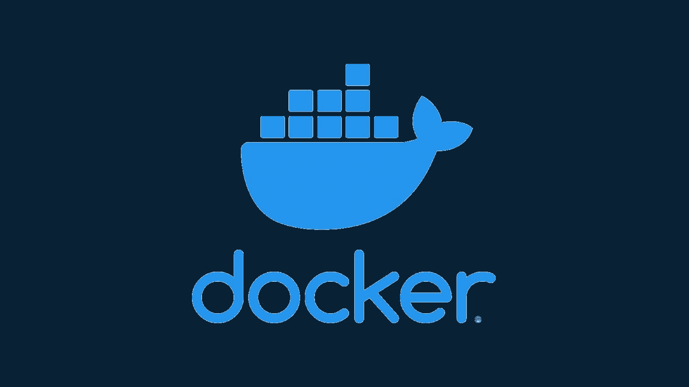

# 从一个讨厌码头工人的人那里学习码头工人将是你职业生涯中最好的决定

> 原文：<https://levelup.gitconnected.com/learning-docker-will-be-the-best-decision-of-your-swe-career-from-an-ex-docker-hater-cbf826e9c269>

多克是最棒的，伙计。

我曾经讨厌 docker。这很可怕——我没有完全理解，也不想理解。我*喜欢*我的过程:我*喜欢*写代码并在我的机器上运行，直接在金属上运行。我*喜欢*不得不写关于如何安装所有依赖项的长篇“自述文件”,处理 Postgres 的本地安装，并努力在本地编排许多不同的服务。等待*…*

*我以前觉得 Docker 没用。老实说，我相信它就像 Kubernetes 一样:对我的大多数用例来说都是过度工程化的，无法相信人们真的在使用它。对于我的一个项目，我想使用 [Hasura](https://hasura.io) 。不幸的是，最好的使用方法是使用 Docker。“好吧”，我怒喝道。我硬着头皮安装了 Docker 桌面。*

*讨厌它的每一秒钟，我复制了“docker-compose”文件。带着流过指尖的恨意，我打出了“docker-compose up”这个命令。当 docker 开始从云中提取图像时，我(焦急地)等待着。当 Postgres 数据库和 Hasura 都在我的机器上无缝启动，并开始无需我的干预而相互交谈时，我恶意地笑了。*

**等等*！什么？就这样？我只需要复制 docker-compose.yml 文件，运行 Docker-Compose up，就可以了？我的数据库和服务器就这样在我的机器上运行？这一定是个恶作剧。我在 chrome 浏览器中输入“localhost:8080 ”,迎接我的是 Hasura 管理界面。我打开了我的 DBAdmin(这不是赞助的，但我在 Mac 上使用[TablePlus](http://tableplus.com/)——比 PHPMyAdmin 好得多。)并顺利地连接到本地运行的 postgres 实例。*

*我被迷住了。*

*我承认，我已经有点脱离码头工人的疯狂状态了。但就是*这么容易。*前几天我开始了一个新项目，我希望能够说明:*

*   *2 个 Postgres 数据库*
*   *运行 Postgraphile 的 Node.js 项目*
*   *谷歌云功能本地跑步者*

*想象一下，在没有 docker 的情况下，让一名新工程师加入这个项目。我需要告诉他们应该在本地创建两个 postgres 数据库，安装 node.js，以及如何在守护进程中运行云功能。不容易啊！我可以这样做，或者我可以解释如何安装 docker 并运行 docker-compose up。我不在乎他们用的是 M1 还是英特尔的 Mac，Windows 系统，任何 Linux 发行版，甚至是 Chromebook(实际上我不确定最后一个，但我只能推测)。如果他们可以让 docker 工作，他们可以在本地运行应用程序的完整堆栈。*

*我害怕学习 docker，因为我认为这将是一项巨大的时间投资。整个工作岗位都是开发人员的，Docker 不就是一个开发型交易吗？我认为这将是一个长达数周的学习过程，我必须知道一堆东西才能写一个 docker 文件。*

*没有。就用 alpine linux 吧，兄弟。安装您的依赖项，您就可以开始了。你想让两个码头集装箱互相交流吗？写一个 docker-compose。*

*相信我，这并没有看起来那么难。我也想讨厌它，真的——我想成为开发社区的潮人。“不，老兄，我不用码头工人😎我只是手动编排一切，浪费许多开发时间在他们的机器上排除项目设置故障。”*

*我真的认为它对任何人都有用，不仅仅是后端开发人员或 Devops 人员。至少，要知道它有什么用处，这样，如果你遇到了 docker 可能解决的问题，你也许可以向可爱的鲸鱼求助。*

*docker 是否适用于每一种情况？绝对不是。有些情况下 package.json 就可以了，甚至部署一个可执行的二进制文件也可以。如果你在独自工作，或者做一个周末项目，或者只是尝试一些新技术，为什么不呢？在原始计算机上设置它会产生一些开销，但谁在乎呢。这是你的电脑，在这种情况下，你可能只是想开始快速学习。*

*但是，在任何情况下，如果您需要共享一个项目，或者将一个项目部署到多台机器上，您都需要对它进行 dockerize。这并不难，也不需要两个小时的教程。我敢打赌，我可以在 10 分钟内教会码头工人写作。*

*如果你认为一篇关于《docker 前憎恨者指南》的文章对你有帮助，请发表评论。*