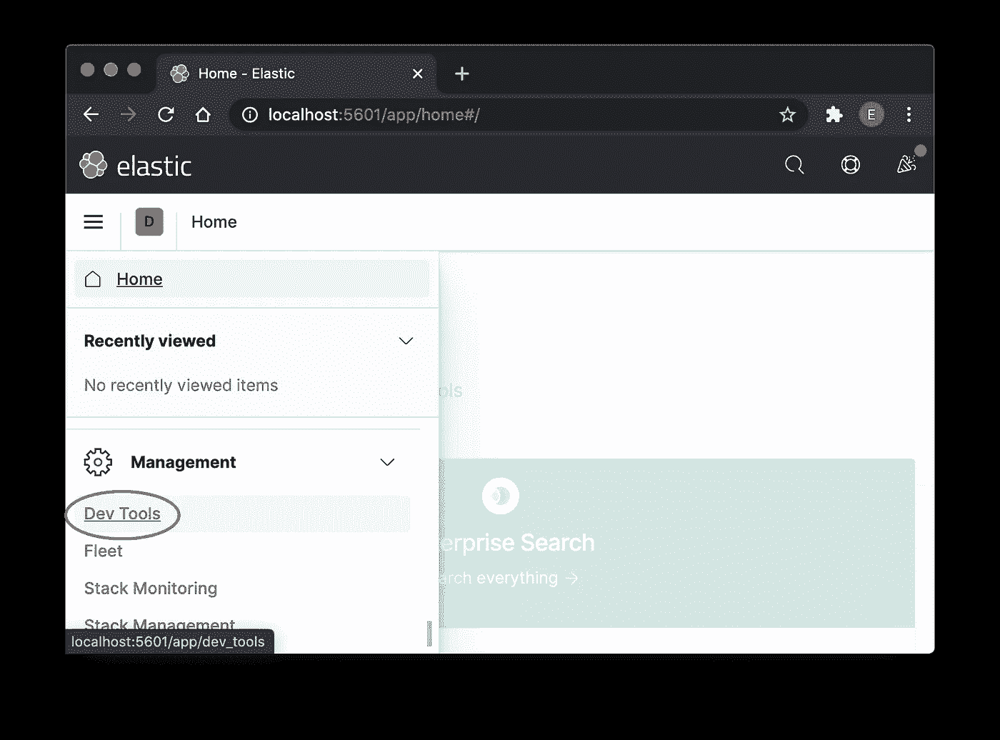
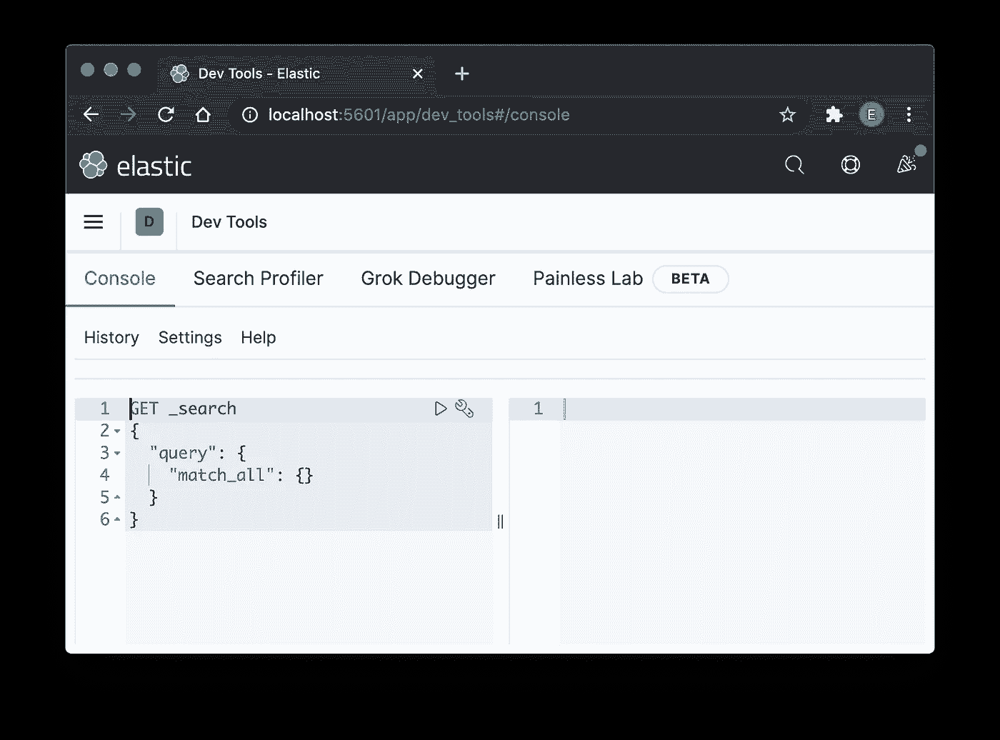

# 轻松学习弹性搜索基础

> 原文：<https://levelup.gitconnected.com/learning-elasticsearch-basic-easily-441f37b8bd8d>

## 学习软件开发

## 轻松快速体验 Elasticsearch


照片由 [Rawan Yasser](https://unsplash.com/@rawanyasser?utm_source=medium&utm_medium=referral) 在 [Unsplash](https://unsplash.com?utm_source=medium&utm_medium=referral) 上拍摄

W 当我第一次听说 Elasticsearch 时，我知道它是一个新的数据库系统，可以根据内容的关键字灵活地进行搜索。它不使用传统的 SQL 来查询数据。

很高兴有机会一睹它的风采，而不会搞坏我的机器。因此，在这里分享我的学习，这样我就不会忘记。

## 在本地机器上设置 Elasticsearch 和 Kibana

历史上，当我们想学习任何工具时，我们需要安装它。但是现在 docker 来帮忙了。我们可以通过将它们下载到容器中来设置它们，让它们工作，并在不破坏任何本地机器环境的情况下完全删除它们。

您可以使用 docker-compose 来运行它，如下文所示

[](/docker-compose-made-easy-with-elasticsearch-and-kibana-4cb4110a80dd) [## 用 Elasticsearch 和 Kibana 使 Docker-Compose 变得简单

### 使用 docker-compose 轻松启动和关闭软件系统

levelup.gitconnected.com](/docker-compose-made-easy-with-elasticsearch-and-kibana-4cb4110a80dd) 

一旦你安装了 Kibana(一个使使用 Elasticsearch 变得容易的数据库控制台),你可以从如下所示的菜单中访问 Dev Tools 页面。



现在，您已经准备好进行弹性搜索了🎉

# 创建和删除索引

首先，我们需要学习创建一个索引(存储区)并删除它。

## 创建索引

要创建索引，只需使用下面的命令

```
PUT books
```

其中`books`是索引名。

## 删除索引

要删除索引，可以使用下面的命令

```
DELETE books
```

> 注意:在重新创建之前，您需要删除一个索引。

从数据库的角度来看，创建和删除数据库只需要一个命令，而不需要担心底层数据是如何组织和构造的。太好了！

> 提示:
> 1。您可以使用`HEAD books`来检查索引
> 2 是否存在。你可以使用`GET books`来检查索引的属性。
> 3。您可以使用 curl 在终端中执行添加或删除操作，如下所示

```
curl -XPUT localhost:9200/books
curl -XDELETE localhost:9200/books
```

# 添加文档

拥有索引本身是没有用的，除非我们可以向它添加文档(数据)。有几种方法可以向其中添加文档。

## 添加特定的文档索引

```
PUT books/_doc/1
{
  "id": "1",
  "title": "Learning Perl Made Easy",
  "genres": [ "programming", "education" ]
}
```

我们可以使用`PUT`添加文档索引`1`。如果要编辑数据，再按`PUT`对同一文档进行索引。

> 提示:我们也可以在终端中使用`curl`来`PUT`文档

```
curl -XPUT -H "Content-Type: application/json" localhost:9200/books/_doc/1 -d '
{
  "id": "1",
  "title": "Learning Perl Made Easy",
  "genres": [ "programming", "education" ]
}'
```

## 只是批量添加到文档中

```
POST books/_bulk
{"index":{}}
{"title": "What A Manager Does", "genres" : ["management"]}
{"index":{}}
{"title": "Happy Learning", "overview" : "learning is fun" }
```

另一种方式是批量插入。

请注意上面的例子，您会注意到我可以插入一个遵循先前可用属性的文档，或者可以忽略它，或者可以创建一个新的。

非常灵活。

> 温馨提示:
> 1。您可以将文档添加到不存在的索引中。将创建索引。
> 2。您也可以通过 curl 添加数据，并从下面的文件中添加数据，文件列表在`folder/booklist_file`中

```
curl -s -H "Content-Type: application/x-ndjson" -XPOST localhost:9200/_bulk --data-binary "@folder/booklist_file"
```

> 3.您可以使用通过使用`GET books/_search`添加的所有文件列表，它将显示所有文件以及所有字段
> 4。要查看特定的字段，您可以使用如下所示的`_source`

```
GET books/_search 
{
  "_source" : ["title", "genres"]
}
```

# 搜索

现在是 Elasticsearch 有趣的部分。没有更多的 SQL。简单查询有多种方式，如`term`、`range`、`match`、`match_phrase`、`multi_match`等。每一个都在下面进一步阐述。

# 术语查询

[术语查询](https://www.elastic.co/guide/en/elasticsearch/reference/current/query-dsl-term-query.html)用于在指定字段中搜索精确的单词

为了更容易理解这一点，让我们在其中包含两个文档(记住首先要有一个干净的文档集的索引)

```
POST books/_bulk
{"index":{}}
{ "title": "Dogs", "description": "A fox jump  over the lazy dog" }
{"index":{}}
{ "title": "Cats", "description": "Garfield the sleepy cat" }
```

要使用单词`lazy`对`description`字段执行`term`搜索，只需编写如下

```
GET books/_search
{
  "query": {
    "term": {
      "description": "lazy"
    }
  }
}
```

您将获得带有结果的`Dogs`文档

```
"A fox jump  over the lazy dog"
```

## 区分大小写

但是如果你想搜索`Garfield`，你会注意到下面没有返回任何结果。

```
GET books/_search
{
  "query": {
    "term": {
      "description": "Garfield"
    }
  }
}
```

为什么？如果我们检查一下这个词是如何被分析的，我们就能理解了

```
GET _analyze
{
  "text": "Garfield the sleepy cat"
}
```

你会注意到`Garfield`已经被标记为`garfield`。稍后我们会谈到*分析*。现在，为了使它不区分大小写，我们可以使用下面的(仅在 Elasticsearch 7.10.0 和更高版本中可用)。

```
GET books/_search
{
  "query": {
    "term": {
      "description": {
        "value" : "Garfield",
        "**case_insensitive**": true
      }
    }
  }
}
```

然后你会得到结果

```
"Garfield the sleepy cat"
```

## 术语查询

如果你喜欢搜索`lazy` **或者** `sleepy`，那么你就必须使用[项查询](https://www.elastic.co/guide/en/elasticsearch/reference/current/query-dsl-terms-query.html)来代替。注意`term**s**` 用复数`**s**`。

```
GET books/_search
{
  "query": {
    "term**s**": {
      "description": ["lazy", "sleepy"]
    }
  }
}
```

您将同时获得`Cats`和`Dogs`文档。

```
"A fox jump  over the lazy dog"
"Garfield the sleepy cat"
```

# 范围查询

[范围查询](https://www.elastic.co/guide/en/elasticsearch/reference/current/query-dsl-range-query.html)提供了搜索大于(gt)或小于(lt)的值的能力。

我们使用以下数据

```
POST books/_bulk
{"index":{}}
{ "title": "Dogs", "publish": "2007-02-08" }
{"index":{}}
{ "title": "Cats", "publish": "2014-12-30" }
{"index":{}}
{ "title": "Rich", "publish": "2018-04-02" }
```

如果我们想搜索 2009 年后**到 2015 年前**之间出版的书，我们可以使用

```
GET books/_search
{
  "query": {
    "range": {
      "publish": {
        "gt" : "2009-12-31",
        "lt": "2015-01-01"
      }
    }
  }
}
```

我们会得到这本书`cats`

```
"title": "Cats", "publish": "2014-12-30"
```

# 匹配查询

我们已经学习了术语查询，这似乎很正常。这是相当严格的，没有重量给结果。[匹配查询](https://www.elastic.co/guide/en/elasticsearch/reference/current/query-dsl-match-query.html)提供了更加灵活的模糊搜索评分，对搜索结果的重要性进行排序。

## 一词搜索

让我们在实验中使用下面的文档列表

```
POST books/_bulk
{"index":{}}
{ "title": "Dogs", "description": "A fox jump  over the lazy dog" }
{"index":{}}
{ "title": "Cats", "description": "Garfield the sleepy cat" }
{"index":{}}
{ "title": "Sleepy", "description": "Rest is important" }
```

如果我们表演

```
GET books/_search
{
  "query": {
    "match": {
      "description": {
        "query": "Garfield" 
      }
    }
  }
}
```

它会返回`Cats`书。

```
"Garfield the sleepy cat"
```

请注意，术语查询的不同之处在于

*   即使我们使用大写`G`，令牌是`garfield`，它仍然会返回结果
*   注意结果有"`"max_score" : 1.1149852`。这用于对搜索结果进行排名。稍后将对此进行更多解释。

## 多词搜索

有时我们想找到少数几个世界中的任何一个

```
GET books/_search
{
  "query": {
    "match": {
      "description": {
        "query": "Dog Garfield",
        "operator": "and"
      }
    }
  }
}
```

那么结果会是`Cats`和`Dogs`本书。

如果我们希望两者都存在，那么我们需要使用下面的`"operator": "and"`。

```
GET books/_search
{
  "query": {
    "match": {
      "description": {
        "query": "Dog Garfield",
        "operator": "and"
      }
    }
  }
}
```

当然，我们找不到任何一本书，`Garfield`不是`dog`。

## 模糊搜索

有时候我们搜索的时候可能会有错别字。匹配查询可以容忍使用`fuzziness`

当我们偶然键入`car`而不是`cat`时，用`fuzziness`，仍然会导致`Cats`书。

```
GET books/_search
{
  "query": {
    "match": {
      "description": {
        "query": "Garfield car",
        "operator": "and",
        "fuzziness": 1
      }
    }
  }
}
```

那么结果将会

```
"Garfield the sleepy cat"
```

没有`fuzziness`，什么都不会返回，除非我们把`car`改成`cat`。

## 匹配短语查询

如果我们想要短语而不是单词，我们可以使用[匹配短语查询](https://www.elastic.co/guide/en/elasticsearch/reference/current/query-dsl-match-query-phrase.html)。

如果我们像下面一样搜索`lazy dog`，我们将得到`Dogs`的书。

```
GET books/_search
{
  "query": {
    "match_phrase": {
      "description": "lazy dog"
    }
  }
}
```

结果是

```
"A fox jump  over the lazy dog"
```

但是如果我们搜索`Garfield cat`，我们将不会得到任何东西，尽管在一个句子中我们有`Garfield`和`cat`，但是它们并不都紧挨着。

## 多匹配查询

有时我们希望在多个字段中搜索相同的文本。我们可以使用[多匹配查询](https://www.elastic.co/guide/en/elasticsearch/reference/current/query-dsl-multi-match-query.html)。

我们可以搜索同时存在于`title`和`description`中的`Sleepy`单词

```
GET books/_search
{
  "query": {
    "multi_match": {
      "query": "Sleep",
      "fields": ["title", "description"]
    }
  }
}
```

它将返回`Sleepy`和`Cats`本书。

```
{ "title": "Cats", "description": "Garfield the sleepy cat" }
{ "title": "Sleepy", "description": "Rest is important" }
```

# 得分

匹配查询比术语查询更高级，因为它为结果提供一些评分，这使得能够在顶部返回更相关的结果。

以下是几种评分方法

## 检索词频率

该术语在文本中出现的次数越多，得分越高。例如

```
POST books/_bulk
{"index":{}}
{ "title": "Happy Happy Happy"}
{"index":{}}
{ "title": "Happy Happy"}
```

当我们搜索的时候

```
GET books/_search
{
  "query": {
    "match": {
      "title": "Happy"
    }
  }
}
```

书`Happy Happy Happy`会得分更高，因为它出现的次数更多。

```
{ "title": "Happy Happy Happy"}
{ "title": "Happy Happy"}
```

## **逆文档频率**

包含该术语的文档越多，得分越低

```
POST books/_bulk
{"index":{}}
{ "title": "Happy"}
{"index":{}}
{ "title": "Happy"}
{"index":{}}
{ "title": "Sad"}
```

当我们搜索的时候

```
GET books/_search
{
  "query": {
    "match": {
      "title": "Happy Sad"
    }
  }
}
```

书`Sad`会得到更高的分数，因为它出现得更少。

```
{ "title": "Sad"}
{ "title": "Happy"}
{ "title": "Happy"}
```

## 字段长度标准化

文档中的术语百分比越高，分数越高

```
POST books/_bulk
{"index":{}}
{ "title": "A happy book"}
{"index":{}}
{ "title": "Happy book"}
```

当我们搜索的时候

```
GET books/_search
{
  "query": {
    "match": {
      "title": "Happy"
    }
  }
}
```

书`Happy book`会得分更高，因为它`Happy`在文档中占据更高的百分比。

```
{ "title": "Happy book"}
{ "title": "A happy book"}
```

## 协调

在文档中找到的查询术语越多，得分越高。

```
POST books/_bulk
{"index":{}}
{ "title": "Happy happy"}
{"index":{}}
{ "title": "Sad sad"}
{"index":{}}
{ "title": "Happy sad"}
```

当我们搜索的时候

```
GET books/_search
{
  "query": {
    "match": {
      "title": "Sad Happy"
    }
  }
}
```

图书`Happy Sad`将获得最高分，因为它拥有最多的搜索词

```
{ "title": "Happy sad"}
{ "title": "Happy happy"}
{ "title": "Sad sad"}
```

你可以在下面的文章中获得更多的得分细节。

[](https://www.compose.com/articles/how-scoring-works-in-elasticsearch/) [## 评分在弹性搜索中的工作原理

### 在这篇文章中，我们将看看相关性评分是如何在弹性搜索，触及信息检索…

www.compose.com](https://www.compose.com/articles/how-scoring-works-in-elasticsearch/) 

# 复合查询

有时我们希望搜索多个标准，有时我们希望某些结果优先于其他结果。我们可以使用`bool`查询来帮助我们的工作。

为了实验，我们使用下面的文档

```
POST books/_bulk
{"index":{}}
{ "title": "Dogs", "description": "A fox jump over the lazy dog" }
{"index":{}}
{ "title": "Cats", "description": "Garfield the sleepy cat" }
{"index":{}}
{ "title": "Sleepy", "description": "Rest is important" }
{"index":{}}
{ "title": "Rich", "description": "Money is never enough" }
{"index":{}}
{ "title": "Pets", "description": "Dog and cat are friends" }
{"index":{}}
{ "title": "Person", "description": "Are you really a dog person?" }
```

## 只是普通的搜索

使用 bool，和正常搜索一样，我们可以使用`filter`

```
GET books/_search
{
  "query": {
    "**bool**": {
      "**filter**": {
        "match": {
          "description": {
            "query": "dog"
          }
        }
      }      
    }
  }
}
```

结果是发现`dog`的正常结果

```
"A fox jump over the lazy dog"
"Dog and cat are friends"
"Are you really a dog person?"
```

另一个需要注意的是，当我们使用`filter`时，`match`不会产生任何分数。

## 只是一个普通的反向搜索

为了反转`filter`结果，我们可以使用`must_not`

```
GET books/_search
{
  "query": {
    "**bool**": {
      "**must_not**": {
        "match": {
          "description": {
            "query": "dog"
          }
        }
      }      
    }
  }
}
```

我们将得到没有`dog`的描述

```
"Garfield the sleepy cat"
"Rest is important"
"Money is never enough"
```

请注意，这里也没有分数。

## 带有评分排序的普通搜索

为了保持`match`的分数，我们可以使用`must`。

```
GET books/_search
{
  "query": {
    "**bool**": {
      "**must**": {
        "match": {
          "description": {
            "query": "dog"
          }
        }
      }      
    }
  }
}
```

请注意，根据获得的分数，结果的顺序不同。

```
"Dog and cat are friends"
"Are you really a dog person?"
"A fox jump over the lazy dog"
```

请注意，较短的句子得分较高，因此排序较高。

> 提示:我们也可以在这里使用`should`。然而`should`与`must`、`filter`或`must_not`结合使用时会有所不同。

## 具有不同顺序项的过滤搜索

假设您喜欢搜索所有优先于`person`的`dog`。

如果不在乎`dog`顺序，就用`filter`和`should`就好。

```
GET books/_search
{
  "query": {
    "**bool**": {
      "**filter**": {
        "match": {
          "description": {
            "query": "dog"
          }
        }
      },
      "**should**": {
        "match": {
          "description": {
            "query": "person"
          }
        }
      }
    }
  }
}
```

然后结果是，其中带有`person`的`dog`是最上面的结果，然后是任何带有`dog`的结果。

```
"Are you really a dog person?"
"A fox jump over the lazy dog"
"Dog and cat are friends"
```

如果你在乎`dog`顺序，就用`filter`和`must`就好了。

```
GET books/_search
{
  "query": {
    "**bool**": {
      "**must**": {
        "match": {
          "description": {
            "query": "dog"
          }
        }
      },
      "**should**": {
        "match": {
          "description": {
            "query": "person"
          }
        }
      }
    }
  }
}
```

那么结果是，其中带有`person`的`dog`是最上面的结果，然后是描述中更短的`dog`句子。

```
"Are you really a dog person?"
"Dog and cat are friends"
"A fox jump over the lazy dog"
```

# 分析仪

到目前为止，我们一直在谈论的搜索是基于默认的标准文本令牌分析器。

## 设置分析器

要更改分析器，可以在创建索引时手动定义字段的映射。下面是设置一个`sentence`字段`english`为`analyzer`

```
PUT test_analyzer
{
  "mappings": {
    "properties": {
      "sentence": {
        "type": "text",
        "analyzer": "english"
      }
    }
  }
}
```

## 分析仪类型

还有更多如中所列

[](https://www.elastic.co/guide/en/elasticsearch/reference/current/analysis-analyzers.html) [## 内置分析器参考|弹性搜索参考[7.11] |弹性

### Elasticsearch 附带了广泛的内置分析器，可以用于任何索引，而无需进一步…

www.elastic.co](https://www.elastic.co/guide/en/elasticsearch/reference/current/analysis-analyzers.html) 

下面是几个例子

**标准**

```
GET /_analyze 
{
  "analyzer": "standard",
  "text": "The mafia is money-laundering?"
}
```

代币是`the`、`mafia`、`is`、`money`和`laundering`

查询搜索时使用

*   匹配短语`"Mafia was money-laundering"`不返回任何内容
*   匹配`is`返回`"The mafia is money-laundering?"`
*   匹配`"launder"`不返回任何内容
*   匹配`"money-laundering"`返回`"The mafia is money-laundering?"`
*   匹配`"money-laundering?"`返回`"The mafia is money-laundering?"`

**空白**

```
GET /_analyze 
{
  "analyzer": "whitespace",
  "text": "The mafia is money-laundering?"
}
```

代币是`The`、`mafia`、`is`和`money-laundering?`

查询搜索时使用

*   匹配短语`"Mafia was money-laundering"`不返回任何内容
*   匹配`is`返回`"The mafia is money-laundering?"`
*   匹配`"launder"`不返回任何内容
*   匹配`"money-laundering"`不返回任何内容
*   匹配`"money-laundering?"`返回`"The mafia is money-laundering?"`

**英文**

```
GET /_analyze 
{
  "analyzer": "english",
  "text": "The mafia is money-laundering?"
}
```

令牌是`mafia`、`monei`和`launder`

查询搜索时使用

*   匹配短语`"Mafia was money-laundering"`返回`"The mafia is money-laundering?"`
*   比赛`is`回报`nothing`
*   匹配`"launder"`返回`"The mafia is money-laundering?"`
*   匹配`"money-laundering"`返回`"The mafia is money-laundering?"`
*   匹配`"money-laundering?"`返回`"The mafia is money-laundering?"`

## 如何重置分析

假设 analyzer 是在创建索引映射的开始时设置的，我们可以在文档活动时重置它吗？

我发现这种有趣的方式就在这里

[](https://dba.stackexchange.com/questions/194659/change-analyzer-for-an-elasticsearch-index) [## 弹性搜索指数的变化分析器？

### 我想为 ElasticSearch 中的现有索引更改分析器，但我搞不清语法(我也不是…

dba.stackexchange.com](https://dba.stackexchange.com/questions/194659/change-analyzer-for-an-elasticsearch-index) 

这是一种变通方法，而不是实际的方法。

假设我们有一个如下所示的空白分析器

```
PUT test_analyzer
{
  "mappings": {
    "properties": {
      "sentence": {
        "type": "text",
        "analyzer": "whitespace"
      }
    }
  }
}PUT test_analyzer/_bulk
{"index":{}}
{ "sentence": "The mafia is money-laundering?"}
```

当我们使用`match_phrase`分析仪时，我们找不到任何结果。

```
GET test_analyzer/_search
{
  "query": {
    "match_phrase": {
      "sentence": "Mafia was money-laundering"
    }
  }
}
```

要进行更改，首先，让我们创建一个新的映射

```
PUT test_analyzer_new
{
  "mappings": {
    "properties": {
      "sentence": {
        "type": "text",
        "analyzer": "endlish"
      }
    }
  }  
}
```

然后我们可以重新索引(复制)从`test_analyzer`到`test_analyzer_new`的文档

```
POST /_reindex
{
  "source" : {
    "index" : "test_analyzer"
  },
  "dest" : {
    "index" : "test_analyzer_new",
    "version_type" : "external"
  }
}
```

之后，我们可以将`test_analyzer_new`别名为`test_analyzer`，然后去掉实际的`test_analyzer`。

```
POST /_aliases
{
  "actions" : [
    {
      "add" : {
       "index" : "test_analyzer_new",
       "alias" : "test_analyzer"
      }
    },
    {
      "remove_index" : {
        "index": "test_analyzer"
      }
    }
  ]
}
```

如您所见，它是一个`alias`，而不再是实际的`test_analyzer`。所以如果你想再次改变`analyzer`，我们不能重复这个步骤。也许要做一个不同的别名。尝试愉快。

这是对 Elasticsearch 功能的简单介绍。希望这能为进一步学习提供一个良好的初步概述。