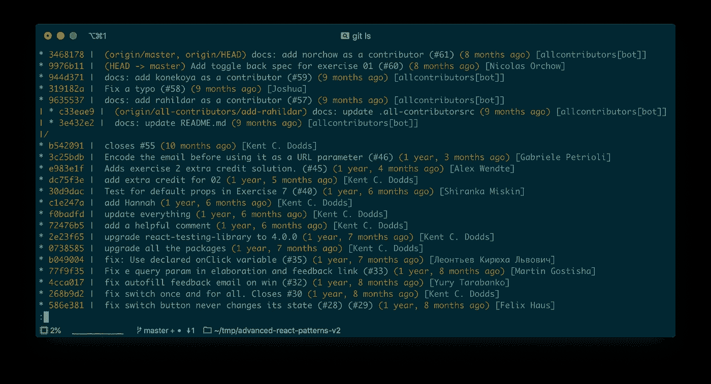
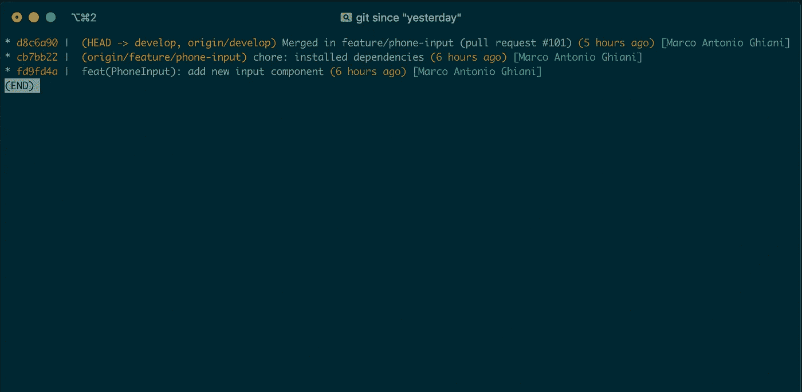

# 学习 Git:提高编码速度的 5 个捷径

> 原文：<https://levelup.gitconnected.com/learning-git-shortcuts-1267fb689f4a>

## 高级编码技巧。

## 使用 Git 并学习有用的命令来提高您的日常工作效率！


用 Git 树跟踪你的代码。

在我过去两年的编程生涯中，我见过的给开发人员的工作机会比任何其他职位都多。公司寻找任何一种能够创建软件的程序员，这种对极客的搜寻确实是多种多样的，从网络开发人员到开发运营人员，从 iOS 和 Android 工程师到混合应用程序开发人员。几乎每个角色都有一个共同之处，那就是必须具备的技能:能够与 [**Git**](https://git-scm.com/) 一起工作。

这听起来很正常，Git 是跟踪任何软件项目的进展和发展的必要工具。在线文档非常好，每个初学者都知道至少掌握这个工具的基本知识对于有机会获得一个开发人员的职位是非常重要的。

今天我不会向您展示众所周知的基本命令，但是我会给您一些额外的技巧，我发现这些技巧对于提高我使用 Git 的工作效率非常有用，并且可以充分利用它。

## 命令 1:格式化日志记录

```
gitlog --pretty='%Cred%h%Creset | %C(yellow)%d%Creset %s %Cgreen(%cr)%Creset %C(cyan)[%an]%Creset' --graph --all
```



控制台上的“git ls”输出。

它是`git log`命令可用选项的组合，这将使您的提交历史更加用户友好并易于交互。例如，它使用 *grep* 或其他 bash 命令进行管道搜索。

命令的帮助页面中的选项:

*   **pretty:** 它允许用户使用许多占位符来格式化日志。你可以在 [Git pretty formats](https://git-scm.com/docs/pretty-formats) 找到它们的完整列表。
*   **graph:** 在输出的左侧绘制提交历史的基于文本的图形表示。
*   **all:** 假设 refs/中的所有 refs 连同 HEAD 都列在
    命令行上，作为< commit >。

这是一个很长的命令，所以在您的终端上创建一个别名来简化您的工作😅

```
ls = log --pretty='%Cred%h%Creset | %C(yellow)%d%Creset %s %Cgreen(%cr)%Creset %C(cyan)[%an]%Creset' --graph --all
```

## 命令 2:删除合并的分支

```
git branch --merged | grep -v ‘*’ | xargs -n 1 git branch -d
```

这可能是我用得最多的化名之一。它负责删除所有合并的分支，从遗留分支中清除本地存储库，并节省手动删除每个分支的时间。

我将它另存为`clear` 别名，因为它实际上从回购中删除了一些东西。

```
clear = "!git branch — merged | grep -v ‘*’ | xargs -n 1 git branch -d"
```

## 命令 3:将文件添加到以前的提交中

```
git commit --amend --no-edit
```

你多久会忘记在做之前添加一个文件到舞台上？哎哟！即使对于拥有强大工作流的人来说，这实际上也很常见，重置提交以创建一个包含丢失文件的新提交并不是最快的解决方案。使用此命令，您可以快速、安全地编辑上次提交的添加文件:

```
// We have 3 files ==> file1, file2, file3
git add file1 file2
git commit -m "first 3 files"
// Doh!
git add file3
git commend
// Quickly solved!
```

简单对吗？相当快速和干净！`commend` 是为此命令创建的别名:

```
commend = commit --amend --no-edit
```

## 命令 4:跟踪你的个人提交

```
git log --all --author=$USER --since='$1'
```

您是否曾经想要检查自特定时间以来您在回购中所做的所有提交？随着技能的提高，记录自己的表现，看看自己的表现会有所帮助！该命令将显示您在 repo 中的提交，您可以将它作为参数传递给我们现在要创建的别名。我还将它与我之前展示的`git ls` 结合起来:

```
since = !sh -c \"git ls --all --author=$USER --since='$1'\" -
```

为什么这个看起来和正常的别名不一样？因为我们需要使用 shell 来插入时间值的参数。结果非常好🚀



## 命令 5:创建一个 repo . zip 文件

```
git archive --format zip HEAD | $1.zip
```

如果您需要导出当前 HEAD 版本的存档，并且您想避免包含`node_modules`和所有其他`.gitignore` 文件，这是适合您的命令！它用您在别名末尾传递的名称创建文件的 zip 存档:

```
export = !sh -c \"git archive --format zip HEAD > $1.zip\" -
```

这样做，用一个简单的`git export myRepo`*你就可以在一秒钟内创建你的副本！*

# *摘要*

*正确使用 git 将极大地提高您的生产力，并帮助您在团队中更好地工作！这是一个不断发展的神奇工具。我建议关注未来版本的变更日志，以了解最新的特性！*

*关于这个话题的评论、分享和讨论总是很受欢迎，我很乐意回答你的任何问题！*

> ***随时联系我**[**Linkedin**](https://www.linkedin.com/in/marcoantonioghiani/)*

*在这里你可以找到我的一些文章*

*[](https://marcoghiani.com/blog/10-programming-code-smells-that-affect-your-codebase) [## 影响代码库的 10 种编程代码味道

### 为了成为干净的代码忍者，我们在编程时应该认识到一些最常见的代码味道。你有没有…

marcoghiani.com](https://marcoghiani.com/blog/10-programming-code-smells-that-affect-your-codebase) [](https://marcoghiani.com/blog/moving-beyond-console-log-8-console-methods-you-should-use-when-debugging-javascript-and-node) [## 超越 console.log() -调试 JavaScript 和节点时应该使用的 8 个控制台方法

### 你从来没有调试过的控制台函数！Marco 的图片每个 JavaScript 开发人员都用过…

marcoghiani.com](https://marcoghiani.com/blog/moving-beyond-console-log-8-console-methods-you-should-use-when-debugging-javascript-and-node) [](https://marcoghiani.com/blog/5-tips-to-speed-up-your-macbook-productivity) [## 提高 MacBook 工作效率的 5 个技巧

### 提高 MacBook 性能的提示集。差不多七年前，我买了我的第一台 MacBook，就是我现在…

marcoghiani.com](https://marcoghiani.com/blog/5-tips-to-speed-up-your-macbook-productivity)*