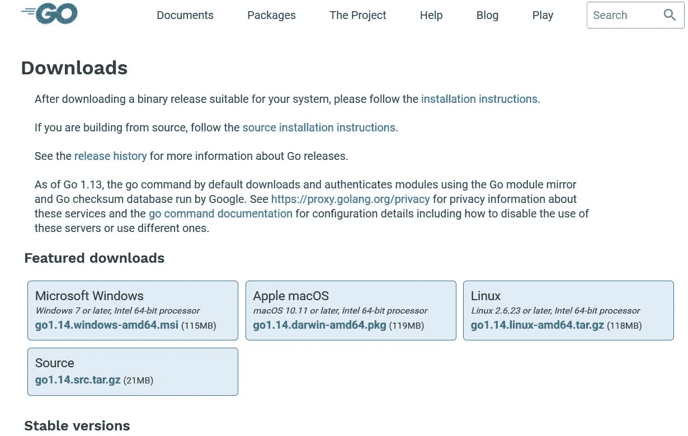
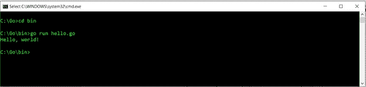

# 学习围棋:围棋入门

> 原文：<https://levelup.gitconnected.com/learning-go-getting-started-with-go-7ed12039622b>


Arif Riyanto 在 [Unsplash](https://unsplash.com?utm_source=medium&utm_medium=referral) 上拍摄的照片

在接下来的一系列文章中，我将提供一个学习 Go 语言的教程。Go 语言是由谷歌的计算机科学研究人员开发的一种编程语言。两位最初的开发人员 Rob Pike 和 Ken Thompson 是贝尔实验室 C 和 Unix 开发的一部分。Go 有几个技术特性使它从其他编程语言中脱颖而出，你应该考虑在下一个编程语言学习项目中学习它。

# Go 类似于 C

由于 Go 的两位开发人员也是贝尔实验室 C/Unix 小组的成员，这种语言与 C 有许多相似之处是有道理的。Go 继承了 C 的许多编程特性，如表达式的形成方式、基本的控制流结构(尽管 Go 没有 while 循环结构)、按值调用参数和指针。尽管如此，Go 从 C 语言继承的最重要的特性是对高效编译的强调和它与现代操作系统工作方式的接近。(参见艾伦·多诺万(Alan Donovan)和布莱恩·克尼根(Brian Kernighan)所著的《围棋编程语言》一书，了解更多与 c 语言的相似之处。)

# 来自其他语言的概念

围棋开发者也从其他语言中寻找灵感。Go 对包的使用来源于 Oberon 和 Oberon-2 中发现的特性。这些语言是由著名的计算机科学家尼古拉斯·沃斯开发的，而在 Go 中实现的关于包、导入和方法声明的概念受到了 Wirth 对 Oberon 和 Oberon-2 的工作的极大影响。

Go 语言的开发部分是为了推进由 Rob Pike 和他在贝尔实验室的同事们开发的关于并发性的某些概念。这些语言，包括 Alef、Squeak 和 Newsqueak，以及由贝尔实验室开发但并未在该组织之外真正实现的操作系统 Plan 9，在编程行业并不知名，但对并发领域的计算机科学研究产生了重大影响。

在他们的书中，Donovan 和 Kernighan 还提到 Go 受到了 APL、Scheme 等语言的影响，以及 Python 等动态编程语言的现代版本。

# 设计强调力量但简单

Go 最有趣的一个方面是注意它所具有的特性，以及许多“现代”编程语言所具有的、Go 决定不包括的特性。它包含的编程特性包括词法范围、一级函数、不可变字符串、垃圾收集和一个包系统。它遗漏的特性列表要长得多(这个列表直接取自 Donovan 和 Kernighan):隐式数字转换、构造函数或析构函数、运算符重载、默认参数值、继承、泛型、异常、宏、函数注释或线程本地存储。

Go 有一个功能完善的标准库，用于执行输入/输出、文本处理、图形、加密、网络和分布式系统。

Go 的一个有趣的特性是它如何实现面向对象的编程。Go 没有类或类层次结构，所以没有继承。构建复杂的数据类型是通过组合来完成的，从当前对象构建新对象，并避免与继承相关的复杂性和问题。

# 下载和安装 Go

你可以从该项目的网站下载该语言:[golang.org](/golang.org)。所有常用的操作系统都有二进制文件。我将带您完成 Windows 的下载和安装。

首先，进入 go 语言下载页面(【https://golang.org/dl/】T2)。以下是该页面的屏幕截图:



转到下载页面

选择 Microsoft Windows。然后只需按照提示，并选择所有的默认设置，它将安装在您的计算机上。完成后，按下“完成”按钮，您就可以开始了。

# 你好，世界！进去吧

为了遵循可以追溯到 Go 的祖先 C 的传统，我将通过编写一个显示“Hello，world！”的程序来介绍 Go 在屏幕上。

打开命令行窗口，移动到 Go 安装的子目录。如果您在安装过程中遵循了默认设置，那么应该是 c:\go。现在移动到编译器所在的 c:\Go\bin 目录。在文本编辑器中输入以下程序，将其另存为 hello.go:

```
package mainimport "fmt"func main() {
  fmt.Println("Hello, world!")
}
```

在以后的文章中，我将讨论这个程序的不同部分，所以现在我们只是编译和运行这个程序。在命令行中，输入以下命令:

```
c:\Go\bin\go run hello.go
```

编译完成后，您将在屏幕上看到输出，如下图所示:



# 继续前进

这只是一系列教程文章中的第一篇，这些文章将教你更多关于 Go 编程的知识。我将围绕编程模板来组织文章，以便将这种语言作为一种解决问题的工具，并将我的文章导向使用这种语言来解决问题，而不仅仅是解释 Go 语言的特性。

如果这些文章对你有用，请告诉我，随着我们对围棋的了解越来越多，我该如何改进它们。