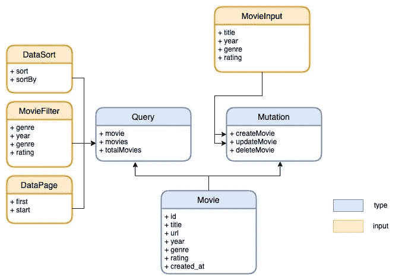
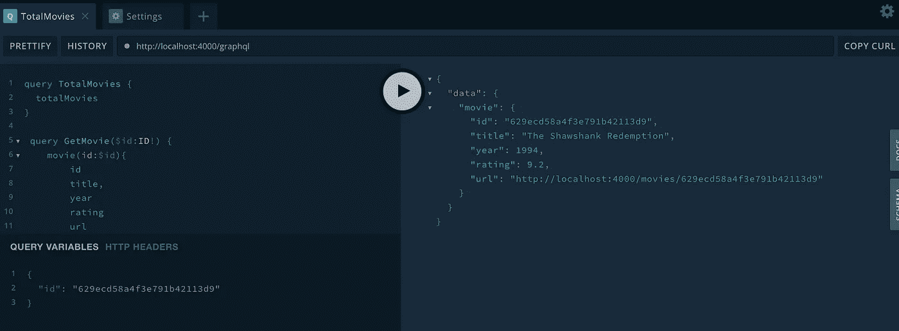

# 从一个电影 CRUD 例子中学习 GraphQL

> 原文：<https://levelup.gitconnected.com/learning-graphql-from-a-movie-crud-example-158d06e5780f>


GraphQL 是一个超级强大的概念，可以帮助我们构建 API。

本帖将分享一个学习 GraphQL CRUD 操作的直白的电影应用。

# 先决条件

*   MongoDB 数据库
*   节点运行环境

完整的代码是[这里](https://github.com/jerryan999/movies-graphql-demo)

# 设计模式

在 REST 中，我们将 API 视为端点的集合；然而，在 GraphQL 中，我们将它们视为**类型的集合。**

那么，我们在哪里定义类型呢？

在 GraphQL 中，模式文件定义了 API 中可用的类型。这是一个契约，客户端和服务器都使用它来确保它们发送和接收的数据是兼容的。

现在让我们定义我们的模式。



GraphQL 方案

## **电影**对象类型

在我们的例子中，我们使用`Movie`类型来定义一个电影对象的模式，它有一个惟一的 id 和一些其他字段，如标题、类型、发行日期等。

```
**type** Movie {
    id: ID!
    title: String!
    url: String!
    year: Int!
    genre: MovieGenreEnum!       # predefined enum type
    rating: Float!
    created_at: Datetime!        # predefined scalar type}
```

这种类型是我们电影模式的基本元素；它大量用于其他类型。

## 查询类型

**查询**类型是 GraphQL 模式中的**根**类型，表示客户端将发送给服务器的查询。

在我们的示例中，我们可以执行以下查询

*   获取特定的电影
*   通过实现过滤器、排序和分页来获取所有电影
*   获取电影总数。

```
type Query {
    movie(id:ID!): Movie!
    movies(filter:MovieFilter paging:DataPage sorting:DataSort):   no[Movie!]!
    totalMovies: Int!
}
```

## 突变类型

**突变**类型是 GraphQL 模式中的另一个根类型。我们用它来创建将改变系统状态的特定动作或事件。

在我们的示例中，我们可以执行以下操作

*   创作电影
*   更新电影
*   删除电影

```
type Mutation {
    createMovie(input:MovieInput): Movie!
    updateMovie(id:ID!, input:MovieInput): Movie!
    deleteMovie(id:ID!): Boolean!
}
```

## 其他类型

GraphQL 中还有其他种类的数据类型也很有用。

一个**输入**类型类似于电影对象类型，除了它只用于输入参数。

```
input MovieInput {
    title: String!
    year: Int!
    genre: MovieGenreEnum!
    rating: Float!
}
```

例如，`MovieInput`被用作`createMovie`操作和`updateMovie`操作的参数。

一个**枚举**类型是一个标量类型，它定义了一组有限的值。

```
enum MovieGenreEnum {
    ACTION
    ADVENTURE
    ANIMATION
    COMEDY
    CRIME
    DOCUMENTARY
    DRAMA
    FAMILY
}
```

GraphQL 的内置标量类型(Int、Float、String、Boolean、ID)非常有用，但有时您可能需要定义自己的自定义标量类型。

```
scalar Datetime
```

# 分解器

模式描述数据需求，但不执行获取数据的工作。解析器处理这项工作。

一个*解析器*是一个为特定字段返回数据的函数。解析器函数以模式指定的类型和形状返回数据。

## 查询解析器

在我们的例子中，我们使用 MongoDB 数据库来存储电影数据。Mongo 是一个面向性能且易于使用的 NoSQL 数据库。

*   在`movie`操作中，我们通过 id 查询数据库，如果找到就返回电影文档。
*   在`movies`操作中，通过给定的过滤、分页和排序，返回匹配的电影。
*   在`totalMovies`操作中，我们返回数据库中电影的总数。

## 突变解析器

变异解析器实现 CUD 对数据库的三个基本操作(创建、更新、删除),并返回它们的结果。

## 类型解析器

有时，我们需要向我们的电影对象添加自定义标量类型；例如，我们不需要存储 URL，因为它们可以从电影 id 中计算出来。

在这种情况下，我们可以将该字段映射到电影类型解析器中的函数。

# 运行服务器

是时候给 web 服务器配备 GraphQL API Playground 了。

用户界面非常友好！现在我们可以尝试使用它来执行我们定义的所有查询。



如果你喜欢这篇文章，请鼓掌，让其他人也能看到。💚