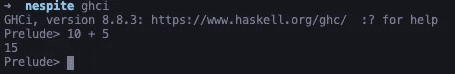
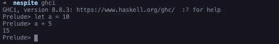

# 学习 Haskell:设置

> 原文：<https://levelup.gitconnected.com/learning-haskell-getting-setup-c1f2cc69d915>

## 让您的机器设置开始学习 Haskell


[胡安·戈麦斯](https://unsplash.com/@nosoylasonia?utm_source=medium&utm_medium=referral)在 [Unsplash](https://unsplash.com?utm_source=medium&utm_medium=referral) 上拍照

这是我关于学习 Haskell 的系列文章的第一部分，我将带您经历我学习函数式编程语言的旅程。

如果你已经准备好了学习 Haskell 的机器，你可以继续阅读我在这个系列的下一篇文章，[学习 Haskell:入门](https://medium.com/@Grantlyk/learning-haskell-getting-started-9f34155456e)。

在我们开始编写任何 Haskell 之前，我们应该首先在我们的机器上安装它。

要开始编写 Haskell，你只需要几样东西，首先你需要一个文本编辑器或 IDE，你可以随意使用任何你觉得舒服的东西，我个人使用 Visual Studio 代码，但有很多选项可供选择。从记事本到 Eclipse 都有，在这个阶段你选择哪一个真的不重要。

我们将开始使用的下一个东西是 Haskell 平台，它是一个有用的 Haskell 开发工具的集合，在网站[上被描述为包含电池的 Haskell。](https://www.haskell.org/platform/)

以下是 Haskell 平台中包含的所有内容的列表；

*   Glasgow Haskell 编译器(用来编译你的 Haskell)
*   Cabal 构建系统(用于构建和打包 Haskell 库和程序)
*   Stack 工具(用于开发 Haskell 项目的跨平台工具)
*   核心包(使 Haskell 开发更容易的包的集合，比如用来处理数组、时间、文件路径等的库)

我使用 Mac OS X 作为我的操作系统，如果你使用另一个操作系统，请随意访问[这个](https://www.haskell.org/platform/)网站，看看你的操作系统的安装说明。

在 MacOS 上，安装 Haskell 平台的推荐方法是使用为 Haskell 安装的通用程序`ghcup`，它将包括 GHC (Glasgow Haskell 编译器)和 Cabal 的命令行接口`cabal-install`。我们可以用下面的 curl 命令安装这两个程序。

```
curl --proto '=https' --tlsv1.2 -sSf [https://get-ghcup.haskell.org](https://get-ghcup.haskell.org) | sh
```

一旦完成，下一步就是安装 Haskell 工具栈，你可以用下面的 curl 命令来完成。

```
curl -sSL https://get.haskellstack.org/ | sh
```

恭喜你，通过安装必要的工具🥳，你已经向学习 Haskell 迈出了第一步

我们现在可以打开 GHCI，这是一个 REPL，允许你在终端中与 Haskell 交互，如果你已经使用过像 Ruby 这样的语言，你会对 REPLs 很熟悉。

要打开 GHCI，只需在您的终端中输入`ghci`，您也可以使用命令`stack ghci`通过堆栈来执行此操作，这将启动 REPL。

从 REPL 内部，我们现在可以开始用 Haskell 编程，让我们尝试一些简单的加法。



10 + 5

10 + 5 等于 15，行得通！

REPL 是开始与 Haskell 交互的一种简单方式，它允许我们立即获得关于正在发生的事情的反馈，这是开始探索语言的一种很好的方式，如果你想初始化一个变量，我们只需使用 let 关键字。



a = 10，a + 5

我已经超出了这篇文章的范围，所以在使用 REPL 的时候，我只需要再提一件事，如果你想退出，只需输入`:q`

我们现在已经在我们的机器上安装了 Haskell，可以开始编写程序了，现在你已经准备好阅读本系列的下一篇文章了，[学习 Haskell:入门](https://medium.com/@Grantlyk/learning-haskell-getting-started-9f34155456e)