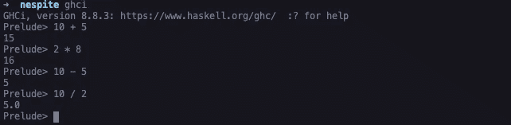
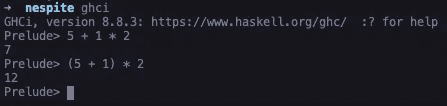
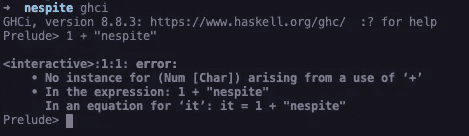
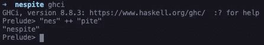
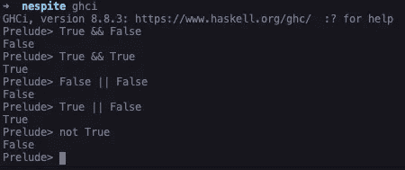
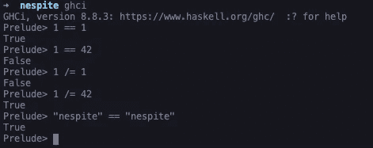
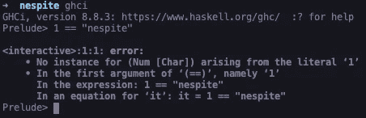
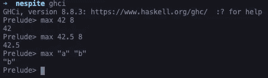
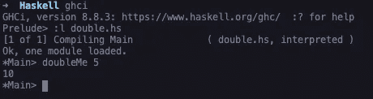
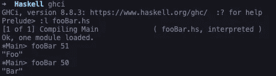

# 学习 Haskell:入门

> 原文：<https://levelup.gitconnected.com/learning-haskell-getting-started-9f34155456e>

## 加入我学习 Haskell 的下一部分，我们将学习算术、函数、惰性求值等等

Paul Esch-Laurent 在 Unsplash 的照片

在我的上一篇文章中，我们介绍了如何在您的机器上安装 Haskell。如果你没有读过那篇文章，你可以在这里阅读。

“学习 Haskell”是我围绕我学习 Haskell 的旅程写的一系列文章，希望我也能教你一些关于 Haskell 的东西。

# 算术

在我上一篇关于如何设置 Haskell 的文章的最后，我们开始通过执行一些算术来试验 REPL。对于来自其他编程语言的人来说，这是非常简单明了的，所以我会尽量简短。如果你用`ghci`或`stack ghci`命令加载你的 REPL，你可以开始加、减、乘、除整数和浮点数。

ghci REPL 中的算术

我们也可以使用括号来确保优先级。

带括号的算术

如果我们尝试将一个整数和一个字符串相加会发生什么？

Haskell 中的 1+“nes pite”

我们得到一个错误！这是因为“nespite”不是整数或浮点数，所以 Haskell 不知道如何将 1 和“nespite”相加，你只能将整数和浮点数相加。

# 串并置

如果你有两个字符串，你想创建一个连接的字符串，那么你可以使用一个`++`来连接这些字符串。

haskell 中的字符串串联

# 布尔代数

这在 Haskell 上是非常简单的。`&&`是逻辑*和*运算符，`||`是逻辑*或*和`not`反转布尔运算。

haskell 中的布尔代数

# 平等

同样，其他一些东西也很容易理解和实现

哈斯克尔的平等

然而，如果我们试图比较像整数和字符串这样的东西，我们会得到一个错误消息。

将 1 与“nespite”进行比较会导致错误

这是因为在 Haskell 中你只能比较两个相同类型的东西。

# 功能

如果您习惯于命令式语言，那么当您第一次看到 Haskell 中的函数时，可能会觉得有点奇怪。这是因为在 Haskell 中调用函数不使用括号，传递给函数的参数也不用逗号分隔。

以`max`函数为例。这个函数有两个参数，告诉你哪个最大。

## 定义你自己的

你可以这样定义你自己的函数；

它是一个函数名，然后是一个空格，然后是用空格分隔的参数，后面是一个等号，然后是你的实现。Haskell 使用隐式返回，所以上面的函数将返回`X * 2`

如果您想在 REPL 中使用该功能，请将该功能保存到文件中。在这种情况下，我把它保存到一个名为`double.hs`的文件中，然后我可以用`:l`把它加载到 REPL 中

将模块加载到 REPL

# 纯函数

在我看来，这是 Haskell 的优点之一。事实上，它是一种纯粹的函数式编程语言，这意味着几乎所有的表达式都没有副作用，也不会改变全局状态。

这意味着，如果我们有一个函数，给定相同的参数，它将总是产生相同的输出。

# 不变的

Haskell 中的表达式是不可变的，这意味着它们在被求值后不能改变。所以任何时候你写一些代码，你认为可能会操作一个变量，它实际上创建了这个变量的一个新版本。

当人们第一次听说 Haskell 是不可变的时，他们认为不断创建新版本的东西不会很有效率，但它实际上非常有效率，因为 Haskell 并没有制作某个东西的全新副本——它引用了它正在复制的东西。这意味着如果你改变了第一个东西，它也会更新并改变第二个东西，但是因为它是不可变的，所以你不能改变第一个东西。

# 条件式

在 Haskell 中，条件是另一个相对容易掌握的东西。在 Haskell 中，条件是通过一个`if`语句提供的，这是每个使用命令式语言的人都应该熟悉的。与其他一些编程语言相比，Haskell 的一个不同之处是你必须提供一个 else。

haskell 中 if 语句的示例

# 懒惰评估

哈斯克尔很懒。Haskell 不会在表达式被赋给变量时对其求值，而是将求值推迟到需要结果的最后一刻。这可能会导致一些有趣的场景，因为它给了 Haskell 处理无限数据的能力。当我们浏览列表的时候，我们会更深入地研究这个懒惰的评估。

# 结论

你已经完成了入门。请随意休息一下，因为一次要吸收很多信息。花些时间玩玩 REPL，在头脑中巩固这些概念。

在这篇文章中，你学到了:

*   Haskell 中的算术
*   使用括号表示优先顺序
*   如何在 Haskell 中连接字符串
*   如何在 Haskell 中执行布尔代数
*   如何使用等式运算符
*   如何定义函数
*   如何将模块加载到 REPL
*   Haskell 是一种纯函数式编程语言
*   Haskell 是不可变的
*   如何用 Haskell 编写 if 语句
*   哈斯克尔很懒

在我以后关于 Haskell 的文章中，我们将开始深入研究递归、列表、元组、模式匹配、保护、Case 表达式、本地绑定等等。

如果这篇文章有助于你学习 Haskell，请写下评论或鼓掌让我知道。