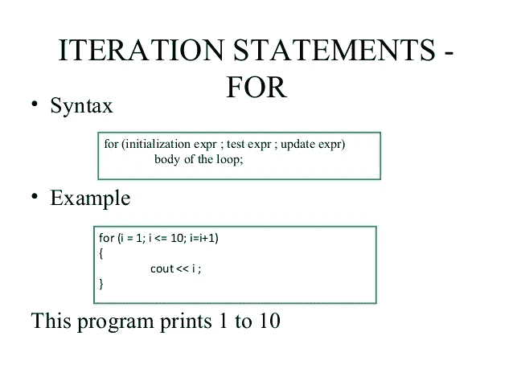

# 如何学习编程:创建语法模板块

> 原文：<https://levelup.gitconnected.com/learning-how-to-program-creating-syntax-template-chunks-b9d50893cf2d>



将某一领域的专家与业余爱好者区分开来的特征之一是，专家能够以极快的速度从记忆中调出结构。在编程中，所有初学者都应该记住的一套结构是编程语言的主要编程结构的语法模板。编程结构也可以被认为是组块。在这篇文章中，我将讨论什么是语法模板，如何以及为什么它们被认为是组块，以及为什么组块对于开发编程技能是重要的。

# 语法模板

语法模板是编程结构的正式定义。在这一节中，我们将看几个示例模板，它们涵盖了几种流行编程语言中主要的基本编程结构。

语法模板描述了编程语言的语法。这些模板被用作如何编写一种语言的各种编程结构的模型。例如，在 C++中，下面是声明变量的语法模板:

*数据类型变量名；*

这个模板指出，要在 C++中声明一个变量，首先要声明变量的数据类型，然后是变量名，最后用分号结束语句。将此应用到实际程序中，变量声明可能如下所示:

`string name;`

大多数编程语言允许你在同一个语句中声明一个变量并给它赋值。以下是 JavaScript 代码语法模板:

```
*const|var|let variable_name assignment-operator expression;*
```

在这个例子中，有三种可能的方法来开始变量声明:const、var 或 let。竖线表示变量声明可以使用这些关键字中的任何一个。赋值操作符是=字符，这个符号可以用在模板中，但是我更喜欢这个名字，因为这有助于学生记忆模板。

我很难向初学者解释模板中的*表达*是什么意思。他们可能已经看到，在这些类型的语句中经常使用文字，这与他们所认为的表达式并不相符。我必须让他们相信文字只是对自身求值的表达式。如果这种语言有 REPL shell，您可以通过简单地在命令提示符下键入一个文本并展示返回值如何仅仅是文本来演示文本如何计算自身。

赋值语句有自己的语法模板。以下是 Python 的赋值语句语法模板:

```
*variable-name assignment-operator expression*
```

if 语句对每种类型的 if 都有一个语法模板:简单 if、if-else 和 if-else if。下面是 Java(和 C，C++等)中 if 语句的模板。):

请注意，在程序块内部，*语句*中的“s”在括号中。这意味着在每个块中可以有一个或多个语句(我们将忽略根本没有语句的事实)。

向学生教授这些`if`模板最难的部分是 if-else `if`语句。模板中的省略号表示可以有多个 else if 块，else 块周围的方括号表示它是可选的。

还要注意，我使用的语法模板将不同的块用花括号括起来，即使块中只有一条语句。当在关系表达式之后编写块以减少错误时，这已经成为更标准的用法。

循环的语法模板编写类似。以下是 C++ while 循环的语法模板:

然而，Python 中的`while`循环的语法模板是这样的:

```
*while relational-expression:*
 *statement(s)*
```

类似地，遵循类 C 语法的语言中的`for`循环的语法模板如下所示:

Python for 循环看起来有点不同。下面是语法模板:

```
*for iterator-var in sequence:
 statement(s)*
```

函数定义也有一个语法模板。对于类似 C 的语言，模板如下所示:

```
*return-type function-name(parameter-list)
{
 [statements;]
 return expression;
}*// Or like this for void functions:*void function-name(parameter-list)
{
 statement(s);
}*
```

我让我的学生在模板中指出函数体中的语句是可选的，因为可以定义一个只有返回语句的函数。这个模板还省略了 C++中成员函数的附加修饰符，比如 const。当我让我的学生学习成员函数的模板时，我确实包括了这一点。

# 为什么记忆语法模板很重要——组块

学习研究人员认为专家表演所必需的关键技术之一是使用*语块*。那么什么是大块呢？奥克兰大学的工程学教授芭芭拉·奥克利在她的书《数字思维:如何在数学和科学上出类拔萃》中，将组块定义为“通过意义结合在一起的信息片段。”在国际象棋中，块是棋盘上代表国际象棋高手下棋的不同阶段的棋子图案。国际象棋大师在他们的大脑中储存了大约 50000 个国际象棋程序块，并且在下棋时可以在几秒钟内回忆起来。

为什么组块如此重要？将单个概念分块的能力让专家更快地解决问题。对于国际象棋选手来说，能够快速识别棋子的模式使他们能够更快地决定他们的下一步棋，并允许他们分析该棋步将如何影响未来的棋步，而仅仅看棋盘上的单个棋子是不允许的。

对于初学编程的人来说，学习如何识别何时需要一个特定的编程结构，以及如何使用该结构，而不必回头去看关于该结构是如何形成的笔记，这是非常重要的。组块的第二部分是学习如何通过在正确的时间、正确的地点应用不同的组块(结构)来解决问题。计算机程序总是由这里的 if 语句、那里的函数调用和几个地方的循环组成。编写好的计算机程序所需的知识是从头开始构建的，这些知识的基础是我们在本文中讨论的基本编程结构。

# 如何创建编程构造块

从编程构造创建块的第一步是集中学习语法模板。仔细研究它，但不只是在一个很长的时间内，而是在更长的时间内，例如一天两次或三次，每隔一天，直到你真正了解它。间隔学习比集中学习更有效。在这段学习时间里，试着根据记忆写出语法模板，然后对照笔记或课本检查你的答案。检索练习比一次又一次地阅读模板要好得多。

第二步是确保您理解编程结构的用途，以及如何将其应用于特定的问题。我告诉我的学生从几个例题的变量追踪开始，直到他们完全理解这个结构是如何工作的。

接下来，运行课堂或教科书中的几个例子，看看程序返回什么输出。修改程序中变量的值，并尝试预测输出结果。

一旦您熟悉了这一步，最后一步是开始尝试解决一些使用该构造的问题，以便理解使用该构造的上下文。如果你能从问题的伪代码开始工作，无论是你自己的还是在你试图完全从零开始解决问题之前提供给你的伪代码，这是非常好的。

执行此步骤的另一种方法是从问题模板开始工作。计算机编程中有几个问题模板，如变量交换、计算累计等。这些模板为您提供了解决问题的环境，并允许您将构造应用于模板。然后，一旦你掌握了使用模板，你将开始看到如何应用它来解决独特的问题。

这些是所有学习者成为各自领域的专家时都要采取的步骤，没有什么不同。

# 练习制造大块

你成为一名伟大的计算机程序员的能力取决于你将各种编程结构分块的能力，这样你就可以立即识别何时需要分块，以及如何将分块应用于手头的问题。随着时间的推移，通过一致的实践，结构变成了组块。第一步是记住结构的语法模板。第二步是理解该结构如何工作，第三步是知道如何使用该结构以及何时使用该结构是合适的。创建编程构造块的最好方法是每天练习一点。当你学习一个新的构造时，把它放入你的程序员的工具箱，和你已经知道的其他构造一起使用，来解决新的和更困难的问题。定期这样做可以让你走上编程专业的道路。

*原载于 2020 年 2 月 10 日*[*【https://thelearningprogrammer.com】*](https://thelearningprogrammer.com/learning-how-to-program-creating-syntax-template-chunks/)*。*