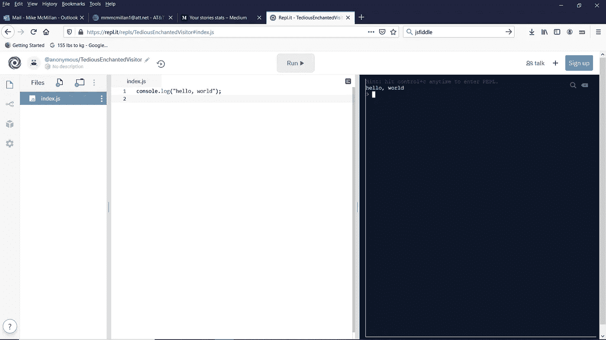
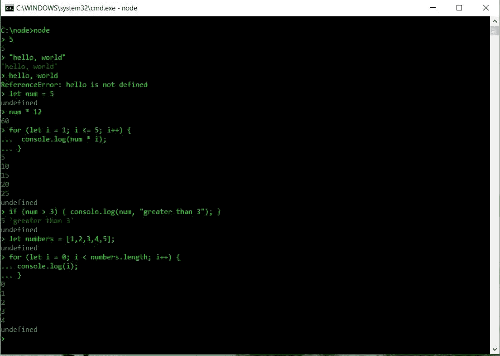
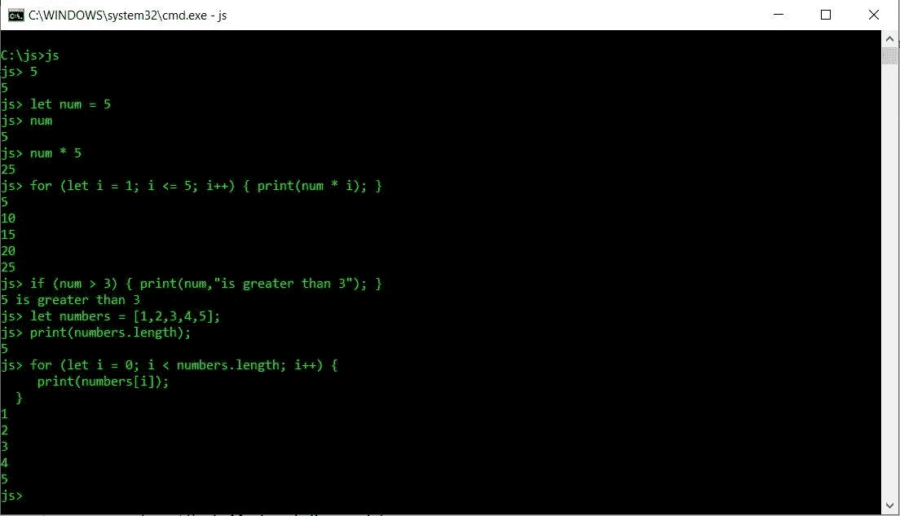

# 学习 JavaScript:JavaScript 编程的开发环境

> 原文：<https://levelup.gitconnected.com/learning-javascript-development-environments-for-javascript-programming-a1fe3751d915>


照片由[詹姆斯·温斯科特](https://unsplash.com/@tumbao1949?utm_source=medium&utm_medium=referral)在 [Unsplash](https://unsplash.com?utm_source=medium&utm_medium=referral) 上拍摄

如今学习 JavaScript 的一个好处是有太多的选择来编写和运行 JavaScript 代码。在本文中，我将描述其中的一些环境，并向您展示我将在这一系列文章中使用的环境。

# 环境 1 —网络浏览器

运行 JavaScript 最简单的方法就是使用你的网络浏览器。您可以创建一个 HTML 页面并将 JavaScript 代码放在一个

如果你使用 HTML，这里有一个 Hello，world！展示文件外观的示例(我跳过一些 HTML 最佳实践来创建一个最小系统):

```
<!doctype html>
<html>
  <head>
  <script>
    alert("Hello, world!");
  </script>
  </head>
  <body>
  </body>
</html>
```

用. html 扩展名保存该文件，然后使用浏览器中的“打开文件”命令加载该页面。“你好，世界！”将出现在浏览器的一个框中。

在浏览器中运行 JavaScript 程序的另一种方法是使用浏览器的开发工具。对于 Chrome 和 Firefox，如果你按 F12，web 开发者控制台打开，你可以在这里输入你的程序。

寻找命令提示符`>>`。在那里键入您的 JavaScript 命令，然后按 Enter 键让浏览器评估您的代码。

这里有一个例子:

```
>> console.log("Hello, world!");
Hello, world!
-> undefined
```

`undefined`只是意味着你运行的语句没有给任何东西赋值。

Chrome 浏览器的开发者工具工作方式类似。

# 环境 2 —在线口译员

有几个在线解释器可以用来编写 JavaScript 程序。一个简单的使用方法是 [https://repl.it](https://repl.it) 。如果您转到该网页，只需从下拉菜单中选择 JavaScript，就会出现一个编辑器屏幕来编写您的 JavaScript 代码，如下面的屏幕截图所示:



回复它

另一个基本的在线 JavaScript 代码编辑器和解释器是 [https://js.do](https://js.do) 。

还有其他更高级的在线编辑器/解释器，如 CodePen.io 和 JsFiddle。然而，对于初学 JavaScript 的程序员来说，这些可能有太多的特性，应该只在你获得了一些 JavaScript 编程经验之后才使用。

# 环境 3 —桌面解释器

有两种主要的桌面 JavaScript 解释器可以用来学习 JavaScript。这些解释器是 Node 和 Mozilla Spidermonkey shell。

如果你对 JavaScript 生态系统了解很多，你至少听说过 Node。我不会深入这个基于 JavaScript 的 web 开发系统的所有方面，但是我会提到，当您下载 Node 时，您会得到一个适用于您的桌面的 JavaScript 命令行解释器。

前往 https://nodejs.org[为您的电脑类型下载 Node。下载和安装完成后，您只需输入以下命令即可打开命令行 shell:](https://nodejs.org)

`node`

这将打开一个命令提示符，您可以开始输入 JavaScript 代码。下面是在我的桌面上运行的节点 shell 的屏幕截图:



节点外壳

如果您是 JavaScript 新手，不要担心您看到的所有代码。你很快就会知道的。

另一个流行的 JavaScript shell 是 Mozilla Spidermonkey shell，我将在本文中使用它。这个 shell 类似于 Node 的 shell，但是有一些我更喜欢的区别，我将在单独的文章中详细讨论。

你可以在这里下载蜘蛛猴外壳:

[https://archive . Mozilla . org/pub/Firefox/nightly/latest-Mozilla-central/](https://archive.mozilla.org/pub/firefox/nightly/latest-mozilla-central/)

向下滚动，直到找到适用于您的操作系统类型的二进制文件。

下载该文件，并将其复制到计算机上一个方便的位置。要运行 shell，请在命令提示符下键入`js`。下面是我的 shell 的屏幕截图:



蜘蛛猴壳

# 您已经准备好开始编程了

现在，您已经看到了可以用于 JavaScript 编程的不同环境，您已经准备好开始了。我的第一篇文章将讨论 JavaScript 程序中使用的不同类型的数据，以及如何创建变量并在其中存储数据。

感谢您的阅读，请给我发电子邮件提出意见和建议。