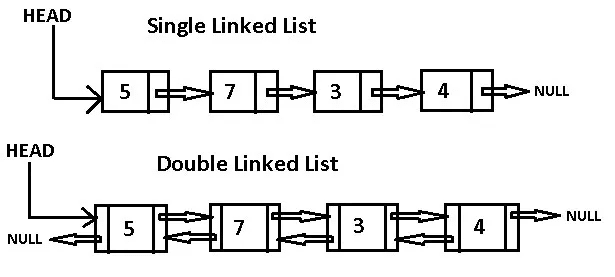

# 学习 JavaScript:单链表

> 原文：<https://levelup.gitconnected.com/learning-javascript-singly-linked-lists-ce0dd47aacb7>


照片由 [JJ 英](https://unsplash.com/@jjying?utm_source=medium&utm_medium=referral)在 [Unsplash](https://unsplash.com?utm_source=medium&utm_medium=referral)

链表是一种顺序数据结构，旨在提高其他顺序数据结构的效率。让我来解释一下。考虑一个数组。数组是一组可以存储数据的连续内存位置。假设您有一个如下所示的数组:

[1,2,3,4,6,7,8,9,10]

如果你需要在 4 和 6 之间插入数字 5 呢？为此，您必须将 7、8、9 和 10 向右移动一个位置，以便为 5 腾出空间。现在想象一下，如果您必须移动数千个数据元素来为一个数字腾出空间。那是非常低效的。

或者想象你有这样一个数组:

[1,2,3,4,5,5,6,7,8,9,10]

如果你决定去掉多余的 5 美元呢？现在，您必须将元素 6，7，8，9，10 向左移动一个位置，以消除移除额外的 5 时留下的空间。同样，想象一下，如果您必须对数千个数据元素而不仅仅是 5 个数据元素执行这种转换。

这个问题的解决方案是使用一个链表。链表是一组存储数据的对象，它们通过一个从一个对象指向序列中下一个对象的链接而相关联。有些链表只提供向前的链接，称为单向链表，而另一些链表提供向前和向后两个方向的链接，称为双向链表。

下图显示了这两种类型的链表:



单向和双向链表图

在本文中，我将演示如何创建单向链表，并在以后的文章中讨论双向链表。

# 实现一个链表

为了简化我的输入，我把单链表叫做链表。链表中的每个对象被称为一个节点。节点是一个有两个字段的对象——一个存储数据的字段和一个链接到链表中下一个节点的字段。下面是一个链表节点的类定义:

```
class Node {
  constructor(data, link) {
    this.data = data;
    this.next = link;
  } show() {
    return this.data;
  }
}
```

下面是一个测试这个类定义的简短程序:

```
let n3 = new Node("Danny", null);
let n2 = new Node("Jonathan", n3);
let n1 = new Node("Cynthia", n2);
let header = new Node("head", n1);
let currentNode = header;
while (currentNode.next != null) {
  currentNode = currentNode.next;
  print(currentNode.show());
}
```

以下是该程序的输出:

```
Cynthia
Jonathan
Danny
```

我们不能对一个链表单独使用这个代码，因为我们需要有在现有节点之间插入新节点的方法和从列表中删除节点的方法。我们需要一个链表类定义，所以让我们继续这个定义。

# 链表类

为了实现一个链表类(`LList`)，我将在定义中使用`Node`类。一个`LList` 对象将由节点以及在这些节点上执行的操作组成，比如插入一个新节点、删除一个现有节点以及显示节点列表。

第一步是为类定义一个构造函数。构造函数将初始化一个用来“锚定”链表的头节点。下面是构造函数方法的定义以及类本身的标题:

```
class LList {
  constructor() {
    Node header = null;
  }
}
```

我们需要添加的下一个方法是向链表添加数据。对于这个应用程序，我们将在列表的前面添加数据。`addFront`方法创建一个新节点，将数据分配给该节点，将头的下一个链接分配给新节点的下一个链接，然后将新节点分配为头的下一个链接，这样当通过头进入列表时，添加到前面的节点是遇到数据的第一个节点。代码如下:

```
addFront(data) {
  let n = new Node(undefined, undefined);
  n.data = data;
  n.next = this.header.next;
  this.header.next = n;
}
```

现在我需要定义一个显示方法，这样我们就可以确保我们的链表被正确构建:

```
display() {
  let currentNode = this.header.next;
  while (currentNode != null) {
    print(currentNode.data);
    currentNode = currentNode.next;
  }
}
```

这是对我们目前所知的一个测试:

```
let list = new LList();
list.addFront("Cynthia");
list.addFront("Jonathan");
list.display();
```

输出是:

```
Jonathan
Cynthia
```

我们可以包含的另一个方法是`front`，它将显示链表的第一个元素:

```
front() {
  return this.header.next.data;
}
```

接下来，我们需要一个方法来从链表中移除前面的元素。为此，我们需要创建一个`Node`对象，并给它分配一个头节点。然后，我们将头节点的下一个链接分配给新创建的节点，然后删除该节点。我们有效地将标题的下一个链接重新分配给前一个节点之后的节点。下面是方法定义:

```
removeFront() {
  let old = this.header;
  this.header = old.next;
  old = null;
}
```

下面是一个测试程序:

```
let list = new LList();
print("Current list:");
list.addFront("Cynthia");
list.addFront("Jonathan");
list.addFront("Danny");
list.display();
list.removeFront();
print("Current list after removing front:");
list.display();
```

以下是输出:

```
Current list:
Danny
Jonathan
Cynthia
Current list after removing front:
Jonathan
Cynthia
```

我们需要的另一个方法是`empty`，它让我们知道一个链表除了头节点之外是否还有其他节点。下面是这个方法的代码:

```
empty() {
  return this.header.next == null;
}
```

让我们把这些代码放在一起看看完整的`LList`类定义:

```
class LList {
  constructor() {
    this.header = new Node("null", null);
  } addFront(data) {
    let n = new Node(undefined, undefined);
    n.data = data;
    n.next = this.header.next;
    this.header.next = n;
  } display() {
    let currentNode = this.header.next;
    while (currentNode != null) {
      print(currentNode.data);
      currentNode = currentNode.next;
    }
  } front() {
    return this.header.next.data;
  } removeFront() {
    let old = this.header;
    this.header = old.next;
    old = null;
  } empty() {
    return this.header.next == null;
  }
}
```

不要忘记你需要`Node`类定义和`LList`类定义来拥有一个工作的`LList`类。

这里有一些你可以使用`LList`类解决的问题:

1.使用`LList` 类编写一个程序，存储一个游戏的前十名分数。

2.写一个程序，接受两个名字链表，并将它们合并成第三个链表。

3.创建两个包含 5 个等级的链表，等级按降序存储。创建第三个链接列表，该列表合并了另外两个链接列表，但合并后的分数仍按降序排列。

如果你对这些问题的解决方案感兴趣，给我发邮件，我会回复你程序。

感谢您的阅读，请回复本文或给我发电子邮件，提出您的意见和建议。