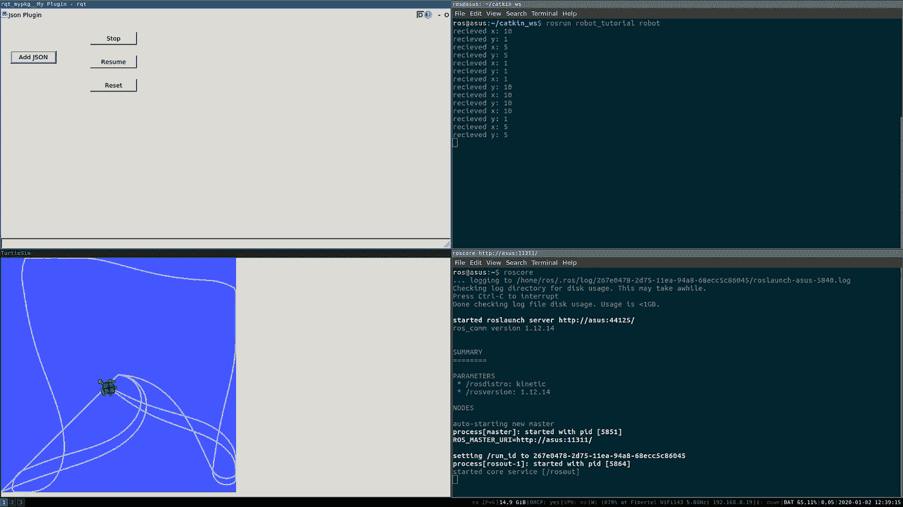
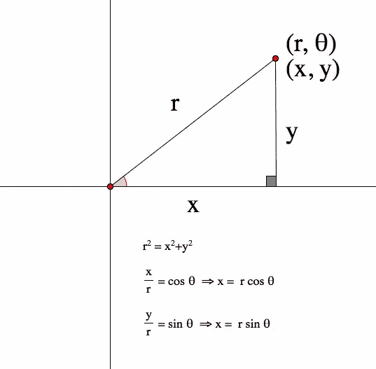

# 动态学习机器人操作系统。

> 原文：<https://levelup.gitconnected.com/learning-robotics-operative-system-ffee4366a813>


照片由来自 [Pexels](https://www.pexels.com/photo/grey-quadcopter-drone-724921/?utm_content=attributionCopyText&utm_medium=referral&utm_source=pexels) 的 [Pok Rie](https://www.pexels.com/@pok-rie-33563?utm_content=attributionCopyText&utm_medium=referral&utm_source=pexels) 拍摄

几个月前，给了我一个具体的任务:学习 ROS，5 天内完成一个挑战。这是一个简短的解释，说明了我让代码工作的过程，以及我在这个过程中对 ROS 的了解。
如果你正在寻找一种能够亲自动手编写 ROS 代码的方法，你来对地方了。让我们开始吃吧。

> 文末 gitlab repo 链接。要了解我是如何做到这一点的，请阅读下面的内容。

# 目录

*   挑战
*   一点理论
*   关键概念
*   第一步
*   挑战:开始行动
*   臭名昭著的“目标”方法
*   服务
*   用户界面
*   结论和链接

# 挑战

*   C++中使 *turtlesim* 移动到目标[x，y]的 ROS 节点。
*   目标将以 geometry_msgs/Pose2D 格式发布到主题中。
*   必须使用相同的 Pose2D 格式提供海龟姿势的定期反馈。
*   可以使用服务暂停、恢复或重置运动。
*   创建一个 RQT Python UI 插件来读取一个 JSON 文件，该文件包含机器人必须遵循的点的列表。

> 必须使用装有 Ubuntu 16.04 的 ROS Kinetic。

那么首先我们从[文档](http://wiki.ros.org/ROS/Tutorials)说起。这里的是一个关于如何在 Ubuntu 16.04 中安装 ROS 的链接，但是**要注意:它对 Anaconda 并不友好。因此，如果你像我一样安装了 Anaconda，我建议你创建一个新用户来安装 ROS。**

如果安装成功，您应该能够在一个新的终端中运行 *roscore* ，并打印出以*started core service[/rosout]*结尾的内容。从现在开始，我假设 ROS 已经安装好并准备好了。

安装后，你需要创建一个 [ROS 工作空间](http://wiki.ros.org/ROS/Tutorials/InstallingandConfiguringROSEnvironment)，以及一个 [ROS 包](http://wiki.ros.org/ROS/Tutorials/CreatingPackage)。这些教程非常容易理解，并且包含了你需要的所有信息，所以我不会过多地讨论它是如何完成的。我将推荐您使用柳絮工作空间，因为本教程中的所有内容都是用它完成的。

# 一点理论

好了，现在怎么办？你装的没错，但是什么***是*** ROS？你可能已经知道，ROS 是机器人操作系统的缩写；基本上是什么在操纵机器人。如果你熟悉实时操作系统[RTOS](一个为嵌入式设备设计的轻量级实时操作系统)的概念，那么你可能会认为 ROS(目前)是类似的东西，但运行在 PC 上。实际上，这要复杂一点，但这是一个相似的概念。对于那些不熟悉 RTOS 的人来说，您的 ROS 应用程序将有一个或多个节点，它们可以与其他节点通信。这可以通过发布或订阅主题或者通过使用或提供服务来实现。这些节点将运行我们应用程序的不同任务。

# 关键概念

*   [节点](http://wiki.ros.org/ROS/Tutorials/UnderstandingNodes):节点是使用 ROS 与其他节点通信的可执行文件。
*   [主题](http://wiki.ros.org/Topics):节点可以*向主题发布*消息，也可以*向主题订阅*接收消息。
*   Messages:订阅或发布主题时使用的 ROS 数据类型。
*   [服务](http://wiki.ros.org/ROS/Tutorials/UnderstandingServicesParams):节点可以相互通信的另一种方式。服务允许节点发送*请求*并接收*响应*。

# 第一步

为了让 turtlesim 移动到某个目标，我需要运行它。在上面*关键概念*下链接的节点教程中，它向您展示了如何运行一个节点，它使用的例子正是默认情况下应该安装的 turtlesim 节点。所以如果你跑:

```
rosrun turtlesim turtlesim_node
```

turtlesim 模拟应该出现在屏幕上。非常好。对我来说，下一步是复制 C++发布者和订阅者代码。我建议你也这样做，让它工作，并了解节点如何通信。

之后，我创建了自己的代码来完成这两项任务，它会说话，也会听。我把它命名为 Controller，并使用 OOP 来开发它。

```
#include "ros/ros.h"
#include "std_msgs/String.h"
#include <sstream>class Controller {
 private:
  ros::NodeHandle n;
  ros::Publisher pub;
  ros::Subscriber sub;

 public:
  Controller() {
   sub = n.subscribe("chatter", 1000, &Controller::callback, this);
   pub = n.advertise<std_msgs::String>("feedback", 1000);
  }void callback(const std_msgs::String::ConstPtr &msg) {
   std_msgs::String pub_str;
   std::stringstream ss;
   ROS_INFO("Controller heard: [%s]", msg->data.c_str());   
   ss << "position set to: " << msg->data.c_str();
   pub_str.data = ss.str(); std::cout << pub_str.data.c_str() << std::endl; pub.publish(pub_str);
   ros::spinOnce();
  }};
int main(int argc, char **argv)
{
 ros::init(argc, argv, "Controller");
 Controller ctrl;
 ros::spin();return 0;
}
```

它基本上监听一个 *chatter* 主题，并将它收到的所有内容复制到一个*反馈*主题。如果您修改原始教程，使其与 *chatter* 对话，并听取*的反馈*，那么您可以轻松测试此代码。

# 挑战:开始行动

既然你已经了解了 ROS 的基础知识，并且知道了如何编写一些代码，那么让我们从挑战开始吧。或者至少是它的第一部分。您需要能够与 turtlesim 通信，所以让我们来看看如何实现。

> 提示:您需要使用多个终端。

运行:

```
rosrun turtlesim turtlesim_node
```

一旦它启动并运行，您就可以知道它在听哪些主题:

```
rostopic list
```

这将列出当前可用的所有主题。

```
/rosout
/rosout_agg
/turtle1/cmd_vel
/turtle1/color_sensor
/turtle1/pose
```

类似这样的东西应该打印出来。你要找的是以/turtle1 开头的。要获得关于每台机器的更多信息，请运行:

```
rostopic info /topic
```

因此，如果您对 turtlesim 的每个主题运行上面的命令，您将会看到/cmd_vel 实际上监听了 *geometry_msgs:Twist* 消息。从您的节点您需要做的就是*使用特定类型的*消息*发布*到那个*主题*。

```
#include "ros/ros.h"
#include "geometry_msgs/Twist.h"
#include "geometry_msgs/Pose2D.h"class Robot {
 private:
  ros::NodeHandle n;
  ros::Publisher vel_pub;
  ros::Subscriber pose_sub;
  ros::Publisher feedback_pub;
  ros::Subscriber messages_sub; public:
  turtlesim::Pose goal_pose;
  turtlesim::Pose aux_pose;
  geometry_msgs::Pose2D feedback_msg;
  geometry_msgs::Twist vel_msg;Robot() {
   // Advertise to turtlesim
   vel_pub = n.advertise<geometry_msgs::Twist>("/turtle1/cmd_vel", 10);
   // Subscribe to new directions
   messages_sub = n.subscribe("directions", 10, &Robot::dirCallback, this); // Get turtlesim position
   pose_sub = n.subscribe("/turtle1/pose", 10, &Robot::poseCallback, this);
   // Send feedback position
   feedback_pub = n.advertise<geometry_msgs::Pose2D>("feedback", 10);
}
```

> 注意，以上只是部分代码，强调的是我提到的改动。

这是我最初采取的方法。所以现在，每次通过“*方向”*到达一个新的目标，你都需要告诉机器人移动。
这是您需要实现“*to goal”*方法的部分。为此，你需要了解一些基本的数学知识，以及一些控制系统的背景知识。



当所有节点都在运行时，它应该是什么样子

# 臭名昭著的“目标”方法

事不宜迟:

```
void toGoal(turtlesim::Pose goal_pose, double tolerance) {
   const double Kv = 1.5;
   const double Kh = 3.5;ros::Rate loop_rate(10);while(getDistance(turtlesim_pose.x, turtlesim_pose.y, goal_pose.x, goal_pose.y) > tolerance) {

     vel_msg.linear.x = Kv * getDistance(turtlesim_pose.x, turtlesim_pose.y, goal_pose.x, goal_pose.y);
     vel_msg.linear.y = 0;
     vel_msg.linear.z = 0;
     vel_msg.angular.x = 0;
     vel_msg.angular.y = 0;
     vel_msg.angular.z = Kh * (atan2(goal_pose.y - turtlesim_pose.y, goal_pose.x - turtlesim_pose.x) - turtlesim_pose.theta); vel_pub.publish(vel_msg);
    ros::spinOnce();
    loop_rate.sleep();
   }

   vel_msg.linear.x = 0;
   vel_msg.angular.z = 0;
   vel_pub.publish(vel_msg);
   ros::spinOnce();
  }
```

为了做到这一点，你需要将[x，y]笛卡尔坐标转换为极坐标形式。



```
double getDistance(double x1, double y1, double x2, double y2) {
 return sqrt(pow((x1-x2),2)+pow((y1-y2),2));
}
```

如您所见，您可以通过一些基本的高中三角学和“math.h”标准库的帮助来完成。
但是你的问题是，你不能把距离发给 turtlesim 的题目 *cmd_vel* ，你要发一个速度。线速度和角速度。

为了更好地理解这应该是如何工作的，我开始在网上搜索，直到我发现有人有一个关于如何做这件事的教程，移动乌龟！不幸的是，这是一个付费课程，只有几个免费视频。但有几个正是我需要的，让我走上正确的方向。

为了到达某一点，我所做的是将速度设置为与我们当前位置和目标之间的距离成比例的值。

先说一点控制器。如果你翻阅一本控制系统的书，你可能会发现[提到了](https://en.wikipedia.org/wiki/PID_controller)三种基本类型的控制器。p、PI 和 PID。比例控制器、比例积分控制器和比例积分微分控制器。我提到这一点的原因是，我实际上实现了一个比例控制器，设置速度与常数 *Kv* 和要走的距离成比例。选择 *Kv* 和 *Kh* 的值有些随意。虽然我熟悉连续控制系统的理论，但我从未设计过数字控制器。所以我用每个常数的几个值进行迭代，直到我找到一个合理的行为。

> 有趣的是，在连续控制器中，这些常数与系统的稳定性有关，增加太多会使系统不稳定。

好了，你已经奠定了代码基础。应该发生的是，新的目标点通过“方向”主题到达您的节点。这些被存储起来，然后由“toGoal”方法处理，发布到 turtlesim 的主题“cmd_vel”。

# 服务

您几乎已经完成了这个挑战，但是就 C++而言，您还需要实现一些东西。
我已经谈了一些主题，以及如何使用它们与其他节点进行通信，所以您可能想知道，为什么要学习什么是“服务”呢？事实上，当你需要不断地发送数据时，主题是非常有用的。例如，反馈位置必须一直更新，以便订阅该主题的任何人都能实时了解该位置。同样的情况也适用于你的“方向”主题。新的目标点无论如何都会到来，你需要做好处理它们的准备。然而，在某些情况下，这可能是不必要的。这就是服务发挥作用的地方。这样，一个节点将提供一个或多个服务，其他节点(客户端)将使用它们。

为了使用服务“停止、恢复和重置”turtlesim 的动作，我建议您阅读并遵循[本](http://wiki.ros.org/ROS/Tutorials/CreatingMsgAndSrv)和[本](http://wiki.ros.org/ROS/Tutorials/WritingServiceClient%28c%2B%2B%29)教程，其中涵盖了服务消息以及如何创建它们。每个服务消息由两部分组成:请求和响应。您需要为您的请求和响应创建一个描述消息类型的文件。

如果您浏览存储库，您会发现一个“srv”文件夹，其中有一个类似如下的 *ManualCommands.srv* 文件:

```
string name
string order
---
string response
```

完成这些后，您可以实现如下内容:

```
// Server method
  bool process(robot_tutorial::ManualCommands::Request  &req, robot_tutorial::ManualCommands::Response &res) {
   if(req.name == "turtle1") {
    if(req.order == "stop") {
     order = req.order;
    }
    if(req.order == "resume") {
     order = req.order;
    }
   }
   return true;
  }
```

对于“重置”，您将在代码实现中看到我调用了另一个服务，一个来自 turtlesim 的服务，以便将绝对位置设置为起始点。后来我注意到 turtlesim 已经有了一个 *reset* 服务，所以你可能想实现它。我怀疑代码会干净得多。

# 用户界面

这是我最纠结的。我发现很少有关于 RQT Python 插件的文档。我找到了[这个](http://wiki.ros.org/rqt/Tutorials/Create%20your%20new%20rqt%20plugin)教程，但是从先决条件开始，第二个我已经失败了。首先，我没有基于 QWidget 的 GUI。这正是我实际上想要完成的…所以在完成了那个教程之后，我开始尝试一些东西。我意识到 *my_module.py* 是应用的入口点，所以在 googling 了 Qt 代码后，我找到了一种方法，通过 resources 文件夹中的 *MyPlugin.ui* 文件来定义 UI。我需要做的就是使用 Qt 钩子来触发 ROS 服务和主题。如果你通读代码，你会发现它非常简单，通过导入 Qt 和 ROS 库，你可以将 UI 按钮连接到链接到 ROS 主题/服务的回调。除此之外，我还导入了 tkFileDialog 来给用户一个显示本地文件的弹出窗口，让用户选择一个 *points.js* 文件让海龟跟随。

# 结论和链接

整个库可以在[这里](https://gitlab.com/tomi.ambro/catkin_ws)找到。在那里你会发现几个 ROS 节点。本文讨论的是“robot_tutorial”和“rqt_mypkg ”,它们分别是 C++节点和 python UI 插件。在自述文件中，您将找到如何运行这些程序的说明。我希望这篇文章能帮助你比我更好地浏览 ROS 代码的第一行。

我可能会考虑将这篇文章变成一个系列，解释我在完成这篇文章后为自己设定的几个挑战，这篇文章让我开始在存储库中的其他节点上工作，这包括摆弄导航包。