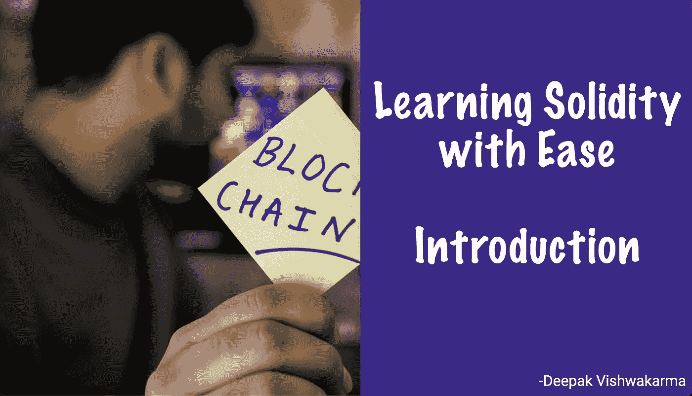
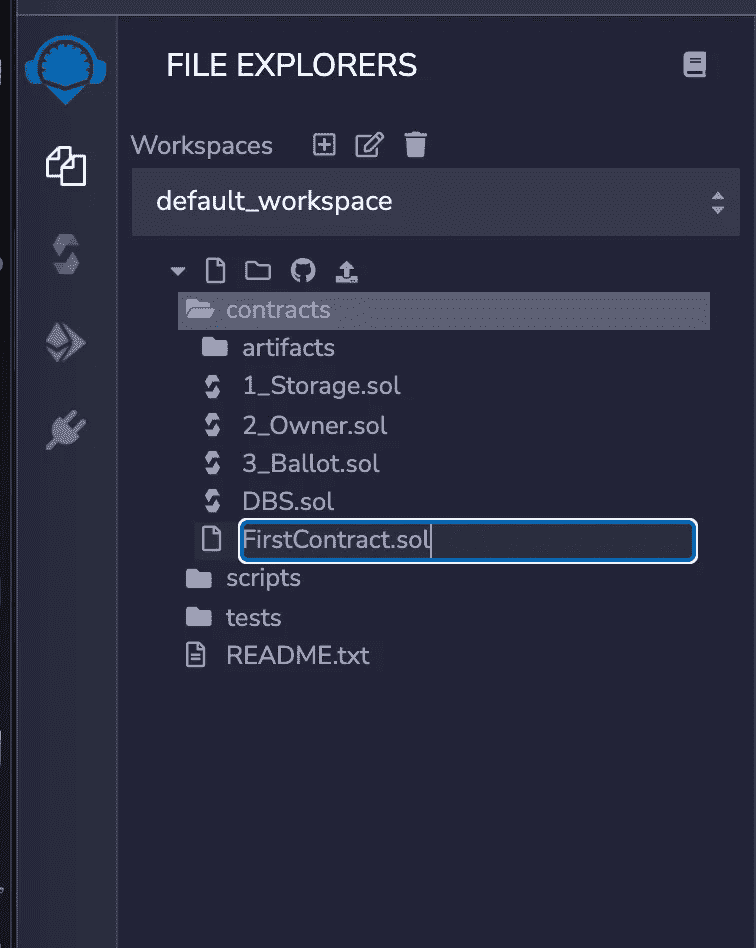
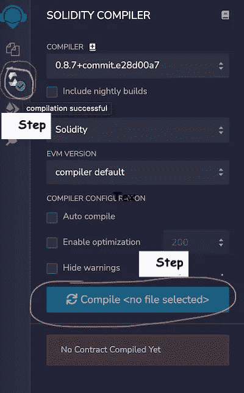

# 轻松学习扎实——简介

> 原文：<https://levelup.gitconnected.com/learning-solidity-with-ease-introduction-121281d36ad7>



在 [Unsplash](https://unsplash.com/?utm_source=medium&utm_medium=referral) 上由 [Hitesh Choudhary](https://unsplash.com/@hiteshchoudhary?utm_source=medium&utm_medium=referral) 拍摄的照片

Solidity 是一种面向对象的通用编程语言。Solidity 用于在以太坊网络上编写智能合约。互联网上有很多可用的资源。然而，从不同的资源中收集信息需要很大的努力。所以我决定把这些资源做笔记，作为文章发表。在这篇文章中，我们将关注 Solidity 语言的基础。

## **先决条件:**

1.  以太坊区块链的基本认识
2.  对任何编程语言的基本理解

## 目录

1.  区块链网络
2.  混音 IDE—[https://remix.ethereum.org/](https://remix.ethereum.org/)
3.  智能合同
4.  合同——写下你的第一份合同
5.  基本数据类型
6.  经营者
7.  功能
8.  高级数据结构
9.  范围和可见性

## 1.区块链网络

以太坊生态系统是一个复杂的架构。它由许多组件组成。简单地说，区块链网络是一个分布式系统，您可以在其中部署智能合同，并使用智能合同编写业务逻辑。业务逻辑可以简单到在区块链网络上转储数据，也可以复杂到在区块链网络上构建整个运输管理。在现实世界中，你可能想也可能不想创建自己的网络。以太坊是一种公共的分布式大型技术，所有人都可以使用。在接下来的文章中，我们将学习如何创建自己的网络。在这篇文章中，我们将着重于对可靠性语言的基本理解。

## 2.混合 IDE

正如我上面提到的，创建区块链网络是一个复杂的过程。所以对于本文，我们将使用 [Remix IDE。Remix IDE 是一个开发环境，我们可以在其中部署不同类型的区块链网络并与之交互。目前使用 Remix，我们可以在 **Javascript VM** 、**注入 web3** 或 **Web3 提供者**上工作。](https://remix.ethereum.org/)

*   Javascript VM 是一个虚拟环境，就像模拟测试网一样，你可以在虚拟环境中工作。数据将在会话结束时被清除。
*   使用**注入的 web3，**你可以使用 [Web3](https://web3js.readthedocs.io/en/v1.5.2/) 库/协议与不同的公共网络交互。为此，你可能需要一个客户端应用程序，如 [MetaMask](https://metamask.io/) 。
*   如果你已经建立了自己的关系网。您可以使用 **Web3 提供商进行连接。**

**注意:**在本文中，我们将使用 **Javascript VM**

## 3.智能合同

智能合约只是存储在区块链上的程序，在满足预定条件时运行。该定义摘自[主题/智能合同](https://www.ibm.com/sa-en/topics/smart-contracts)。智能契约通常包含共享资源及其所有权的业务逻辑。

让我们创建我们的第一个智能合同。打开 RemixIDE，在 **contracts** 文件夹下创建一个文件( **FirstContract.sol** )。



所有智能合约都以**结尾。sol** 扩展。

```
// **FirstContract.sol** // SPDX-License-Identifier: GPL-3.0pragma solidity >=0.7.0 <0.9.0;
```



编写智能合同所需的最少代码是提及 solidity 版本。现在你可以导航到编译器标签来编译 **FirstContract.sol** 。一旦你编译，你不会看到任何事情发生。因为我们还没有写任何合同。

## **4。合同——写下你的第一份合同**

契约非常类似于面向对象编程中的类。它包含变量和函数。

```
pragma solidity >=0.7.0 <0.9.0;contract Person {
   string public name = "Deepak";
}
```

您可以保存文件，编译并部署到 **Javascript VM。**一旦部署了契约，就可以交互获得一个相当于**“Deepak”的名字。在上面的例子中，名字的作用域是 public。这将创建一个 getter 函数来访问名称。我们将在本文后面学习作用域。**

**要了解更多关于编译和部署的信息，请阅读**[**create _ deploy**](https://remix-ide.readthedocs.io/en/latest/create_deploy.html)**。**

## **5。**基本数据类型

就像任何编程语言一样，Solidity 有多种预定义的数据类型来处理区块链网络上的数据。数据既可以作为局部变量存储，也可以作为全局状态存储在网络中。

```
pragma solidity ^0.8.1;

contract Person {
    string public name;
    uint256 public age;
    address public paddress;

    function setDetail(string memory _name, uint256 _age)
        public
        returns (
            string memory,
            uint256,
            address
        )
    {
        name = _name;
        age = _age;
        paddress = msg.sender;
        return (name, age, paddress);
    }
}
```

局部变量是用-in 函数创建的，一旦程序退出函数，它就会被销毁。状态变量与契约一起被创建，并且一旦契约在网络中被破坏，状态变量就被破坏。
我们来看例子。

```
function f(uint[] memory c) public {
    // stores a reference to ``s`` in ``g``
    StructType storage g = s;
    // also changes ``s.moreInfo``.
    g.moreInfo = 2;
    // assigns a copy because ``g.contents``
    // is not a local variable, but a member of
    // a local variable.
    g.contents = c;
}
```

**详细了解数据类型:**docs.soliditylang.org/types

## **6。操作员**

编程语言中的运算符是一个符号，它告诉编译器或解释器执行特定的数学、关系或逻辑运算，并产生最终结果[ref:[computer _ programming _ operators](https://www.tutorialspoint.com/computer_programming/computer_programming_operators.htm)]。

```
pragma solidity 0.4.8;contract Operators {// Arithmatic Operators
    uint a = 10;
    // +, -, unary -, unary +, *, /, % (remainder), ** (exponentiation)
    uint b = 2**3; // b = 8// a++ and a-- are equivalent to a += 1 / a -= 1 
    // but the expression itself still has the previous value of a. 
    // In contrast, --a and ++a have the same effect on a but return the value after the change.
    a = a++; // a = 10
    a = ++a; // a = 11// a += e is equivalent to a = a + e. 
    // The operators -=, *=, /=, %=, a |=, &= and ^= are defined accordingly. 
    a += 5; // a = 11+5 = 16// Logical Operators
    // ! (logical negation)
    // && (logical conjunction, “and”)
    // || (logical disjunction, “or”)
    // == (equality)
    // != (inequality)
    bool isOwner;
    isOwner = isMortal && hasWriteAccess;
    isOwner = true && false; // false
    isOwner = true || false; // true
    isOwner = !false; // true
    var check = (1 ether == 1000 finney); // true
    var check = (1 ether != 2000 finney); // true// Bitwise Operators
    // & Bitwise AND 
    // | Bitwise OR 
    // ^ Bitwise exclusive OR 
    // ~ Bbitwise negation
    // >> Bitwise right shift
    // << Bitwise left shift
    var orValue = 0x02 | 0x01; // orValue = 0x03
    uint shiftValue = 0x01 << 2; // shiftValue = 4// Define consutruct here
    function Operators(uint initialCoins) {
       // Initialize state variables here
    }}
```

**Ref，了解更多:**[toshblocks.com/operators-arithmetic-logical-bitwise](https://www.toshblocks.com/solidity/operators-arithmetic-logical-bitwise/)

## 7.功能

函数是可重复使用的代码块，可以反复执行。一个合同可以有一个或多个功能。可以在引用契约的同时直接调用函数。一旦动态创建了一个契约，就可以动态调用一个函数。

```
contract Person {
    string public name;
    uint256 public age;
    address public paddress;

    function setDetail(string memory _name, uint256 _age)
        public
        returns (
            string memory,
            uint256,
            address
        )
    {
        name = _name;
        age = _age;
        paddress = msg.sender;
        return (name, age, paddress);
    }
}
```

在上面的例子中，`setDetail`是一个函数。这个函数接受三个输入参数，并返回一个元组作为结果。

## 8.高级数据结构

除了 int，float，bool，Solidity 还支持复杂的数据结构，如[映射](https://www.tutorialspoint.com/solidity/solidity_mappings.htm)，[数组](https://www.tutorialspoint.com/solidity/solidity_arrays.htm)，[结构](https://www.tutorialspoint.com/solidity/solidity_structs.htm)，[枚举](https://www.tutorialspoint.com/solidity/solidity_enums.htm)，地址。
Struct 是一种复杂的数据类型，可以包含其他数据类型。

```
contract test {
   struct Book { 
      string title;
      string author;
      uint book_id;
   }
   Book book;

   function setBook() public {
      book = Book('Learn Java', 'TP', 1);
   }
   function getBookId() public view returns (uint) {
      return book.book_id;
   }
}
```

映射是一种可以基于键存储值的数据结构。与映射类似，数组是一种可以存储相似数据类型集合的数据结构。我们可以使用值的索引来访问值。

```
contract LedgerBalance {
    mapping(address => uint) public balances; function updateBalance(uint newBalance) public {
        balances[msg.sender] = newBalance;
    }
    function testMethod() public pure{
      uint len = 7; 

      //dynamic array
      uint[] memory a = new uint[](7);

      //bytes is same as byte[]
      bytes memory b = new bytes(len);

      assert(a.length == 7);
      assert(b.length == len);

      //access array variable
      a[6] = 8;

      //test array variable
      assert(a[6] == 8);

      //static array
      uint[3] memory c = [uint(1) , 2, 3];
      assert(c.length == 3);
    }
}
```

**注:**

1.  基于数组的创建，数组可以是动态的或静态的。
2.  映射没有长度
3.  映射没有长度。理解这一点很重要。数组有长度，但是由于映射在内部的存储方式，它们没有长度。
4.  结构用它们的默认值初始化

> 假设您有一个映射 mapping(uint 256 = > uint)my mapping，那么所有的元素 myMapping[0]，myMapping[1]，myMapping[123123]，…都已经用默认值初始化了。如果将 uint256 映射到 uint，则将键类型“uint”映射到值类型“uint”。

**了解更多:**【ethereum-blockchain-developer.com/mappings-and-structs】T2

**地址:**地址是一种特殊的数据类型。地址包含一个 20 字节的值(以太坊地址的大小)，即客户或合同的唯一位置。地址是可以播放的。可支付地址有一些特殊的功能，如转账或发送。
**了解更多:**[docs.soliditylang.org/types#address](https://docs.soliditylang.org/en/v0.8.10/types.html#address)

## 9.范围和可见性

要定义函数的可见性，可以问一个简单的问题“谁能调用函数”。可靠性函数有四种可见性私有、内部、外部或公共。默认情况下，函数具有公共范围。

**私有:**私有函数只能被主契约调用。
**内部:**内部函数只能被主契约或派生契约调用。
**外部:**外部函数只能由第三方调用。它不能被主契约或派生契约调用。
**公共:**公共函数可以被任何人在任何地方调用。

**了解更多:**bitsofco.de/solidity-function-visibility-explained/

## 结论

这篇文章只是对区块链的介绍。这篇文章的目的只是对要学习的题目做个简介。我在下面附上了所有的参考链接。如果你想找一个详细的版本，你可以阅读[ethereum book/ethereum book](https://github.com/ethereumbook/ethereumbook)。

## 参考

*   [https://ethereum-blockchain-developer.com/](https://ethereum-blockchain-developer.com/)
*   [https://decipher.dev/blockchain-introduction/](https://decipher.dev/blockchain-introduction/)
*   [https://www.tutorialspoint.com/](https://www.tutorialspoint.com/)
*   [https://docs.soliditylang.org/en/v0.8.11/](https://docs.soliditylang.org/en/v0.8.11/)
*   [https://bitsofco.de/solidity-function-visibility-explained/](https://bitsofco.de/solidity-function-visibility-explained/)