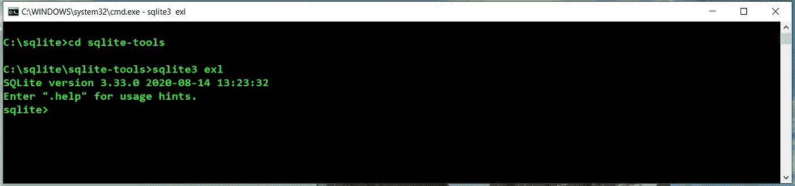

# 学习 SQL:入门

> 原文：<https://levelup.gitconnected.com/learning-sql-getting-started-5ed56b92cef4>


马库斯·斯皮斯克在 [Unsplash](https://unsplash.com?utm_source=medium&utm_medium=referral) 上的照片

欢迎来到学习 SQL(结构化查询语言)的这个系列。在第一篇文章中，我将讨论如何下载和安装我将在这些文章中使用的数据库系统——SQLite。在我谈了一下我为什么选择 SQLite 之后，我将向您指出如何安装系统的一些方向，然后我们将建立一个新的数据库和第一个表。我将通过演示如何向表中插入一些数据来结束本文，这样我们就可以在下一篇文章中开始学习如何查询数据。

# 为什么选择 SQLite

SQLite 可能是安装和使用最简单的完整数据库系统。它被设计成具有很小的尺寸，因此它可以用于几乎任何平台上的任何应用程序，从成熟的 PC 到 Raspberry Pi，甚至是手机。

尽管 SQLite 占用空间很小，但它拥有 MySQL 等大型数据库系统的所有特性。我们可以构建一个包含多个表的数据库，执行所有不同类型的查询，甚至可以从其他编程语言访问它。我将在本系列文章中演示如何做这些事情。

# 安装 SQLite 和使用 SQLite Shell

我不会在这里用下载说明来占据空间，我会把你指向一个 [Youtube 视频](https://www.youtube.com/watch?v=wXEZZ2JT3-k)和[一个关于这些说明的网页](https://www.tutorialspoint.com/sqlite/sqlite_installation.htm)。当您完成其中一个或两个时，请回来，我们将建立我们的第一个数据库。但是首先，我们需要了解如何使用 SQLite shell。

我将通过在 SQLite shell 中键入命令来演示如何使用 SQL。shell 只是一个接受 SQL 命令的命令行界面。要访问 SQLite shell，请导航到安装 SQLite 的目录，转到 SQLite-tools 子目录，并在提示符下键入“SQLite3 exl”。这将打开外壳。下面是我的 shell 在我的 Windows 笔记本电脑上的图片:



# 关于我的例子的数据

关于学习 SQL 的这一系列文章，我准备建立一个大学生数据库。该数据库将存储学生的人口统计信息，如他们的姓名和家乡。该数据库还将存储学生已经上过的课的主列表以及他们在当前学期正在上的课的列表。该数据库将存储每个班级的信息，例如班级名称、教师姓名、教授班级的系、班级提供的学分以及班级的先决条件。

这个数据库比我在这里提到的数据更多，但这足以让你相信这个数据库将是全面的。

# 创建数据库

在 SQLite 中存储数据的第一步是创建一个数据库。数据库是存储数据表的地方。表是组成数据库的数据所在的地方。大多数数据库都有多个表，以便更好地组织数据，更有效地访问数据。[这里的](https://365datascience.com/sql-databases-data-table/)是一个关于数据库和表格概念的很好的教程。

要创建新的数据库，只需在 sqlite3 命令后键入数据库的名称，如下所示:

```
c:\sqlite\sqlite3-tools\sqlite3 students.db
```

这个命令创建新的数据库，并打开 shell，让您开始向数据库添加表。这就是全部了。

下一步是创建一些表来存储数据，但是首先我们需要讨论数据库表的结构以及可以用于数据的数据类型。

# 数据库表的结构和数据类型

数据库表由*字段*组成。你想存储的每一项数据都有一个字段，比如姓名、身份证号、专业等。

每个字段都有一种数据类型。我将在学生数据库中使用的主要数据类型是`text`——文本数据；`int` —整数；`real` —用于浮点数，如学生的平均绩点；和`char` —用于可以存储数字和文本的字段，例如街道地址或身份证号码。

代表一个学生的字段组被称为一个*行*。每个学生记录都是数据库表中的一行。当然，一个表将由多行组成。

现在，我将避免主键和辅键的主题(如果你不知道这些是什么，现在不要担心)，但当然我会在以后的文章中回到键的主题。

# 创建表格

使用 *CREATE TABLE* 语句创建一个数据库表。创建表时，需要命名字段和字段的数据类型。

我们要为学生数据库创建的第一个表是存储学生人口统计数据的表，比如他们的姓名、出生日期、家乡、专业和 id 号。下面是实现这一点的语句:

```
sqlite> create table demographics (
...> id int not null,
...> first_name text not null,
...> last_name text not null,
...> hometown text not null,
...> dob text not null,
...> major text not null)..> ;
sqlite>
```

数据类型后面的短语`not null`表示该字段必须包含数据，并且不能为空。我将在以后的文章中讨论如何处理空字段。

您可以通过发出命令`.tables`来验证该表是否已创建:

```
sqlite> .tables
demographics
sqlite>
```

您可以通过发出`.schema`命令来查看表格的结构:

```
sqlite> .schema demographics
CREATE TABLE demographics (
id int not null,
first_name text not null,
last_name text not null,
hometown text not null,
dob text not null,
major text not null);
sqlite>
```

# 将数据输入表格

使用 `insert into`语句将数据输入表格。这种说法有两种形式。一个表单让你先列出字段，然后输入值，第二个表单让你输入值。我将演示两者。

下面是一个使用第一种形式的`insert into`将数据插入表格的例子。我还演示了如何使用正确的数据库再次启动 shell。

```
C:\sqlite\sqlite-tools>sqlite3 students.db
SQLite version 3.33.0 2020-08-14 13:23:32
Enter ".help" for usage hints.
sqlite> insert into demographics (id, first_name, last_name, hometown, dob, major)
...> values (1234,'Cynthia','Fehrenbach','Little Rock','1987-02-09','Graphic Arts');
sqlite>
```

下面是第二种形式的一个例子，我们省略了字段名:

```
sqlite> insert into demographics values(1231,'Raymond','Williams','Sheridan','1988-12-07','Classics');
sqlite>
```

我们可以通过执行选择查询来测试我们的插入(我将在另一篇文章中详细介绍):

```
sqlite> select * from demographics;
1234|Cynthia|Fehrenbach|Little Rock|1987-02-09|Graphic Arts
1231|Raymond|Williams|Sheridan|1988-12-07|Classics
```

至此，我已经介绍了如何创建数据库、如何创建表以及如何在表中存储数据。您的家庭作业是向 demographics 表中再添加几条记录，以便我们在下一篇文章中使用一些数据，在下一篇文章中，我将讨论如何查询一个表来检索存储的数据。一定要在有一些重复数据的地方插入足够的数据，比如家乡，姓氏，专业等。这很重要，这样你就可以从我以后的文章中获得最大的收益。

感谢您的阅读，请在下方回复或发邮件至 mmmcmillan@att.net[告诉我您的意见和建议。](mailto:mmmcmillan@att.net)