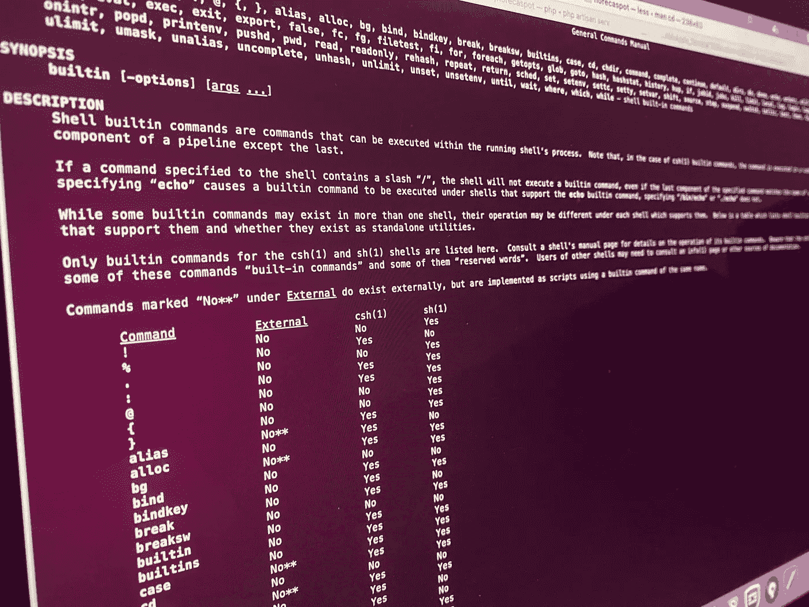

# 学习绝对 CLI 基础知识

> 原文：<https://levelup.gitconnected.com/learning-the-absolute-cli-basics-8441baf10beb>



## 非常适合那些不熟悉命令行的人

如今，开发人员需要了解命令行。虽然一开始看起来很难，但是一旦你知道如何充分利用命令行，你的生活会变得容易得多。这是一个额外的工具，你可以添加到你的武器库，使你更有效率。

本文是为那些对 Linux 命令行没有太多经验的人写的。目标是通过教您一些基础知识，让您在 CLI 上感觉更舒服。即使您以前没有任何使用命令行的经验，这也可能是尝试一下的绝佳机会。

如果你以前已经使用过命令行，并且每天都在使用，那么这篇文章**而不是**适合你。我强烈建议您阅读一些关于命令行的更高级的文章。

正如我之前提到的，这篇文章是为那些没有(或者很少)命令行经验的人准备的。我已经列出了您应该知道的大多数基本命令。这些命令将让您从命令行开始。一旦您开始更频繁地使用命令行，您将会经常用到它们。希望这篇文章能够在使用命令行方面给你一个启发。

在我们开始讨论这篇文章之前，我还有最后一点要注意。我建议你打开一个终端(如果你没有打电话的话)，开始打字。这可能会给您更好的学习体验和对命令的理解。

# 1.当前工作目录的路径

使用命令行时，了解当前工作目录的路径是非常重要的。您希望确保在正确的目录中执行命令。

您可以使用`pwd`命令打印当前工作目录，该命令代表*打印工作目录*。该命令将打印标准输出的绝对完整路径，这是您的屏幕。这是一个非常简单的命令，在命令行上工作时会用到很多次。

```
pwd
/home/user
```

# 2.更改目录

可能使用最多的命令是更改目录的命令。此命令需要您要移动到的目录的绝对或相对路径。

正如我们在`pwd`命令的输出中看到的，我目前在`/home/user`目录中。这个目录包含另外两个目录:*文档*和*照片*。*照片*目录又包含三个目录，分别是 *2020* 、 *2021、*和 *2022。*

为了移动到*照片*目录，我们可以键入以下命令:

```
cd photos
```

为了确认这是可行的，我们可以在更改目录后执行`pwd`命令。输出应该包含我们刚刚在`cd`命令中提到的目录名，即*照片*

```
pwd
/home/user/photos
```

很高兴知道，一旦你开始输入你想`cd`到的目录名，你可以按 tab 键自动完成并给出建议。

因此，你也可以键入`cd ph`，然后按 tab 键，而不是必须键入`cd photos`。点击 tab 键后，你会看到它会自动显示出*照片*目录。

让我们试一试。但是在我们这样做之前，我们必须回到之前的目录，在我的例子中是`/home/user`，因为我们现在在*照片*目录中。

为了在目录中向上导航，我们可以使用两个点:

```
pwd
/home/user/photoscd ..pwd
/home/user
```

到目前为止，我们只看到了使用相对路径的`cd`命令，但是也可以使用绝对路径。我们可以使用下面的命令，使用绝对路径，到达 */photos/2022* 目录，而不管我们当前在哪个目录。

```
cd /home/user/photos/2022
```

这就把我们带到了最后一点。您可以一次跳转多个目录——双向。假设我们又在`/home/user`目录中。我们也可以使用相对路径通过一个命令将 *cd* 放入 *2022* 目录。

```
cd photos/2022 
```

为了导航回到 */home/user* ，我们可以执行以下命令之一:

```
We can either do it the absolute way:
cd /home/userORThe relative way:
cd ../..
```

# 3.列出目录中的文件

既然您已经知道了如何移动到不同的目录，那么是时候学习如何查看这些目录中的文件和目录了。执行此操作的命令是`ls`命令。此命令用于查看目录的内容。

默认情况下,`ls`命令会列出当前目录下的文件和目录。在这个例子中， *2022* 目录包含三个图像。

```
cd /home/user/photos/2022ls
12756.jpg 12865.jpg 12866.jpg
```

您还可以指定要查看其内容的目录:

```
pwd
/home/user/photos/2022ls /home/user/photos
2020 2021 2022ls ..
2020 2021 2022ls /home/user/photos/2022
12756.jpg 12865.jpg 12866.jpg
```

如您所见，相对路径和绝对路径都可以使用。

`ls`命令有一些强大的选项，您也可以使用。代表递归的`-R`选项允许您列出子目录中的所有文件。

```
pwd
/home/user/photosls -R
2020 2021 2022./2020:./2021:./2022:12756.jpg 12865.jpg 12866.jpg
```

`-l`选项将列出文件和目录以及更详细的信息，如权限、文件大小和所有者。

```
pwd
/home/user/photosls -l
drwxr-xr-x  2 daan  staff   64 20 feb 17:30 2020
drwxr-xr-x  2 daan  staff   64 20 feb 17:30 2021
drwxr-xr-x  5 daan  staff  160 20 feb 17:30 2022
```

最后但同样重要的是`-a`选项。这将显示隐藏的文件。请注意，隐藏文件以点开始。

```
pwd
/home/user/photos/2021ls
21231.jpgls -a
.somehiddenfile 21231.jpg
```

也可以组合不同的选项:

```
pwd
/home/user/photos/2021ls -al
-rw-r--r--  1 daan  staff    0 20 feb 17:33 .somehiddenfile
-rw-r--r--  1 daan  staff    0 20 feb 17:33 21231.jpg
```

# 4.创建文件和目录

创建文件和目录有两个独立的命令。要创建文件，您可以使用*触摸*命令。`mkdir` 命令表示创建目录，可以用来创建目录。与所有其他命令一样，您可以选择使用相对路径或绝对路径。

```
pwd
/home/user/photosmkdir 2019mkdir ../videos
```

这同样适用于`touch`命令。

```
cd /home/user/videostouch read-this-first.txttouch home/user/photos/2019/todo.txttouch home/user/website/index.html
```

很高兴知道您可以通过提供多个参数来创建多个目录和文件。

```
touch file1 file2 file3mkdir dir1 dir2 dir3
```

# 5.复制和移动文件

复制和移动文件是您需要了解的一些命令行要点。复制和移动命令的结构非常相似。两者都需要一个目标和目的地。

假设我们想要制作一个图像的副本，并将该副本存储在 *2022* 文件夹中:

```
cp /home/user/photos/2021/21231.jpg /home/user/photos/2022
```

第一个参数是我们想要复制的文件，第二个参数是文件应该复制到的路径。

很高兴知道`cp`命令也有`-R`(递归)选项，就像`ls`命令一样。如果您也想复制子目录，可以使用此选项。

用于将文件和目录从一个位置移动到另一个位置的`mv`命令的工作方式完全相同。

```
mv /home/user/photos/2022 /home/user/photos/best-photos
```

请注意，mv 命令也可以用于重命名文件。举例来说，当你需要修改一个类型时，这就很方便了。

```
mv indxe.html index.html
```

# 6.删除文件和目录

既然您已经学习了如何创建文件和目录以及如何移动它们，那么是时候学习如何删除它们了。就像创建文件和目录一样，删除它们有两个独立的命令:`rmdir`和`rm`。

```
rm /home/user/photos/2019/todo.txtrm ../index.htmlrmdir /home/user/photos/2020rmdir ../2019
```

与`touch`和`mkdir`命令一样，您也可以一次删除多个文件和目录。

```
rm file1 file2 file3rmdir dir1 dir2 dir3
```

# 7.获取文件内容

我们已经到了本文的最后一部分，这是关于获取文件的内容。有几种方法可以做到这一点。

一种方法是使用`cat`命令。该命令最常见的用法是打印文件的内容。

```
cat readme.txtThis is a readme file!
Line 2
Line 3
Line 4
Line 5
Line 6
Line 7
Line 8
Line 9
Line 10
Line 11
Line 12
```

cat 命令输出整个文件，这并不总是你想要的。或者，您可以选择使用`head`或`tail`命令，分别打印文件的第一部分和最后一部分。默认情况下，将打印 10 行。

```
head readme.txtThis is a readme file!
Line 2
Line 3
Line 4
Line 5
Line 6
Line 7
Line 8
Line 9
Line 10tail readme.txtLine 3
Line 4
Line 5
Line 6
Line 7
Line 8
Line 9
Line 10
Line 11
Line 12
```

如果我们想改变打印的行数，我们可以使用`-n`选项。例如，如果我们只想打印 5 行而不是 10 行，这就是它的样子。

```
head -n 5 readme.txtThis is a readme file!
Line 2
Line 3
Line 4
Line 5tail -n 5 readme.txtLine 8
Line 9
Line 10
Line 11
Line 12
```