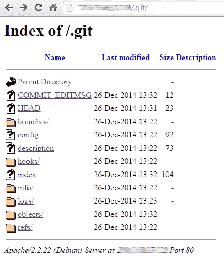
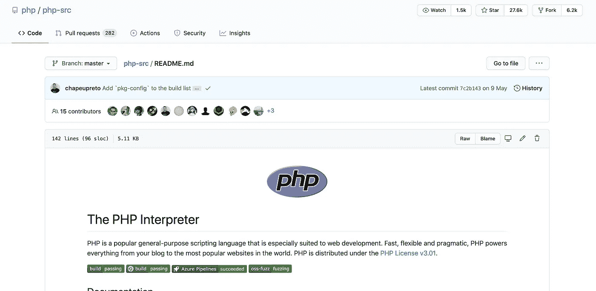
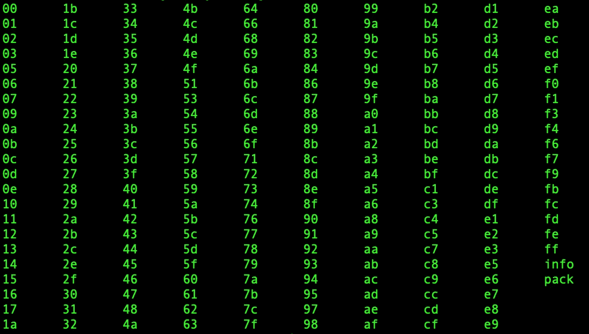
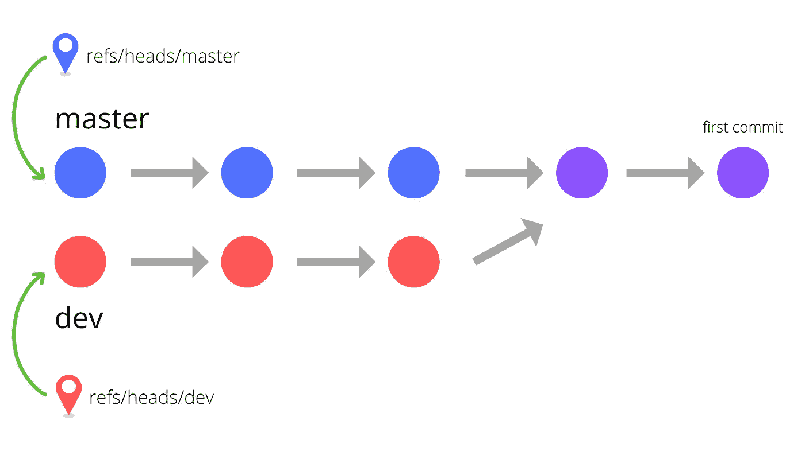

# 教程:通过入侵一个网站来了解 Git 的内部

> 原文：<https://levelup.gitconnected.com/learning-the-internals-of-git-by-hacking-websites-c70c59303b12>

## 编程教程

## 理解我们最喜欢的工具之一实际上是做什么的


> **免责声明:本文仅用于教育目的。作者不纵容也不鼓励黑客攻击，除了** [**允许的白帽黑客**](https://medium.com/@yakko.majuri/the-internet-is-too-unsafe-we-need-more-hackers-c9742fc1a03b) **。**

在这个世界上漫游的大多数开发人员都曾在某个时候遇到过 Git。

你可能每天都在使用它。

现在，虽然很容易将 Git 简化为几个记住的命令，如`git add`、`git commit`和`git push`，但实际上在后台发生了很多我们不经常想去理解的事情。

然而，了解一点幕后发生的事情可能是非常有用的，我将尝试以一种有趣的方式让您深入了解这一点:通过教您如何利用与 Git 相关的安全漏洞，以便您可以更好地保护自己的网站。

记住，**没有明确的许可，你永远不要在任何人的网站上尝试这样做**。这样做可以构成严重犯罪。我不为你从这篇文章中获得的知识所做的任何事情负责。

## 一个非常小的网络服务器

*如果你想跳过文件创建和东西，可以随意地从* [*克隆代码到这里*](https://github.com/yakkomajuri/exposed-git) *(使用 Git :D)，并跳过* [*这一节*](#5e99) *。*

我将在这里讨论的漏洞包括将您的 Git 存储库或其内容暴露给 web。直到今天，它仍然影响着许多网站，而且大多与 PHP 服务器有关(惊讶吧！)，所以我们给自己弄一个吧。

不，先别走！我们实际上不会写很多 PHP，但是你需要确保你的机器上安装了 PHP。您可以通过运行`php -v`来检查它是否已经安装。

在写这篇教程之前，我自己从来没有真正使用过 PHP，所以我向你保证这非常简单。

现在，打开一个终端窗口，让我们创建一个 Git 目录并向其中添加一个文件:

`$ mkdir exposed-git`

`$ cd exposed-git`

`$ git init`

`$ echo "<h1>I will be hacked soon!</h1>" > index.php`

要运行简单的 web 服务器，只需键入:

`$ php -S localhost:8000`

现在试着在你的浏览器中点击`localhost:8000`,确保它能正常工作。

厉害！我们有自己的网络服务器。

## 没有提交的 Git 是什么

我们的 web 服务器准备好了，让我们给它添加一些有趣的东西。

在目录的根目录中，执行以下操作:

`$ touch config.php`

然后，使用您选择的编辑器，将以下内容添加到`config.php:`

```
<?php if(!isset($_SERVER['HTTP_REFERER'])){
        header('location: ../error.php');
        exit;
    } define('DB_USER', 'admin');
    define('DB_PASSWORD', 'password123');?>
```

我们上面所做的是创建一个保存数据库凭证的配置文件模型，并添加一个“安全机制”来防止用户访问它。尝试访问`localhost:8000/config.php`会将我们带到一个错误页面，我们将在下面创建这个页面:

`$ echo "<h1>You really thought you could hack me?</h1>" > error.php`

此时，你可能会想:

“啊，但是没有人会以明文形式存储他们的数据库凭证！”

对此我的回答是:[这里有一个关于`wp-config.php`文件的官方 WordPress 教程](https://wordpress.org/support/article/editing-wp-config-php/)。哦，是的，很糟糕。

顺便说一下，如果**你**以明文形式存储任何凭证，至少请**查看**环境变量。

## 没有提交的 Git 是什么

现在我们的服务器文件已经准备好了，让我们提交它们。运行:

`$ git add .`

`$ git commit -m "first commit"`

我们已经完成了设置。现在让我们来看看黑客。

## 你会黑吗？

让我们运行我们的服务器并尝试一些事情。同样，命令是:

`$ php -S localhost:8000`

确保您的服务器在本教程的剩余部分保持运行，并在其他终端窗口上执行所有其他操作。

首先，尝试在`localhost:8000/config.php`访问我们的`config.php`文件。您应该会看到我们之前设置的错误页面。

现在，让我们看看是否可以访问隐藏的`.git/`目录，因为这正是我们在本文中讨论的内容:

`localhost:8000/.git/`

我运行的是 PHP 7.3.9，这给了我以下页面:


真好。默认情况下，PHP 会阻止对目录的访问。实际上，并不总是这样。一些网站公开了他们的整个`.git`目录，看起来像这样:



演职员表:[https://pentester . land/tutorials/2018/10/25/source-code-disclosure-via-exposed-git-folder . html](https://pentester.land/tutorials/2018/10/25/source-code-disclosure-via-exposed-git-folder.html)

但是，嘿，如果我们不能访问完整的目录，我们也不能访问它的内容，对不对？

好吧，我们试试。参考上图，我们看到了每个 Git 目录包含的一些东西。`HEAD`看起来特别有趣(`config`看起来也很有趣，但是我们今天把那个放在一边)。我们能进入吗？

访问`localhost:8000/.git/HEAD`和宾果！我们有发现了。

虽然看起来不太有趣。但这是一条路——我们也可以试试？

`localhost:8000/.git/refs/heads/master`

哦，我们得到一份杂烩！那会是什么呢？

好吧，让我们想想 GitHub。



上面是 PHP 解释器的 GitHub 库的截图。有一个横幅宣布最近的提交，后面还有一段 hash。我们能找到提交的散列吗？

既然 Git 为我们存储了提交，我们能通过散列找到那个提交吗？

再次查看目录结构，可以猜测提交可能存储在`.git/objects/`中。听起来是个不错的猜测。我们能拿到吗？

`localhost:8000/.git/objects/f452d4085347400afa8751aae3a5184d73113628`

> **作者注**
> 
> 记得用上面的散列替换从`localhost:8000/.git/refs/heads/master`得到的中的**。**

没有找到。所以我们可以放弃，或者尝试学习更多关于 Git 的知识，然后再试一次。

打开任何使用 Git 的目录，查看里面的内容。

如果您选择了一个有很多活动的目录，`objects/`可能看起来像这样:



许多子目录以双字符十六进制命名。

啊！所以我们要寻找的提交不仅仅是自由浮动在`objects/`中，它很可能在一个子目录中，这个子目录以它的 hash 的前两个字符命名。这值得一试。让我们继续请求它(用你的散列代替我的):

`localhost:8000/.git/objects/f4/52d4085347400afa8751aae3a5184d73113628`

对我来说，这实际上提示了一个下载窗口。所以我们一定在做正确的事情。但是如果我在下载后打开或`cat`文件，我得到的只是一些胡言乱语:

```
xùéÀmB1�9ªäm »ˆ˙+!Dê„⁄fiM`2ÊêÓCBg£©kÔÀã~33ÿúıQíq¡’…≈*&4ùè≠ËZmQ7|ù Y,¢Ò>&#⁄’,Ï–ŸB1JnË5'r,M — c~Ø>È|^·Hß«X`˜ÛG€˛OáØNÀe[◊æ„3b
⁄x¯–®µz⁄Áʉ∑JñqüÍ®_∏⁄K,
```

但是，Git 必须知道如何处理这个。让我们创建一个**新的**空目录来运行一些测试。

`$ mkdir git-tests`

`$ cd git-tests`

`$ git init`

然后让我们把文件放在它应该在的地方，在`.git/objects/`。从我们的`git-tests`目录的根目录开始，执行(使用您自己的散列):

```
$ mkdir .git/objects/f4$ curl localhost:8000/.git/objects/f4/52d4085347400afa8751aae3a5184d73113628 --output ./.git/objects/f4/52d4085347400afa8751aae3a5184d73113628
```

然后我们可以使用一个内置的 Git 命令来实际读取文件的内容。看起来是这样的:

```
$ git cat-file -p f452d4085347400afa8751aae3a5184d73113628
```

这给了我们第一点敏感信息:

```
tree 2764257f81462ae8f9b26ab16d08de153db0cc2bauthor Yakko Majuri <email_removed> 1593386015 -0300committer Yakko Majuri <email_removed> 1593386015 -0300first commit
```

(注意:如果您有先前的提交，您还会看到对“父”的引用。)

我们得到了一个“树”的标识符和一些关于提交作者和提交者的信息(例如，这些在拉请求的情况下是不同的)，包括他们的电子邮件！最后，我们还收到了提交消息。

事情开始变得严重了…

作为参考，你实际上不需要整个散列来运行`git cat-file`，只需要其中的一部分就可以了。例如，这给了我相同的结果:

```
$ git cat-file -p f452d40
```

您还应该知道的是，您也可以使用标志`-t`运行该命令。这将给出对象类型，可以是树、blob、提交和带注释的标记。我们主要关心前 3 个，尤其是 blobs(文件)。因此，如果我们得到一个散列并想知道它代表什么类型的对象，我们可以简单地运行:

```
$ git cat-file -t f452d40
commit
```

我们已经涉及了相当多的领域，所以让我们停下来记下一些事情:

*   所有与 Git 相关的东西都存储在`.git/`目录中
*   `HEAD`存储对分支负责人的引用。在我们的例子中，我们只有`master`
*   Git 以对象的形式存储所有东西，对象是基于它们的散列来存储的。这是一个伟大的设计决策，因为这意味着**相同的对象只存储一次**，没有不必要的冗余。
*   对象存储在以其散列的前两个字符命名的子目录内的`.git/objects/`中(例如`.git/objects/f4`
*   我们可以使用`git cat-file`通过带有标志`-t`的散列来获取对象的类型，以及带有标志`-p`的可读格式的实际内容

厉害！但是我们还没完。让我们再深入一点。

## **树和二进制大对象(斑点)**

我们上面检查的提交对象包含对树的引用。让我们通过执行与上面相同的操作来检查这是什么——在`git-tests`中将对象下载到我们的本地`.git/`。

实际上，**我们正在构建服务器 Git 目录的镜像，这样我们就可以看到他们的源代码**，并有可能攻击它。

> **作者注**
> 
> 在真正的攻击中，这当然会通过自动化脚本来完成。编写一个非常简单，但这里不讨论。我们感兴趣的是 Git 如何工作，而不是 Python 脚本，所以我们将手动操作。

继续，我的树对象在提交中被引用，如下所示:

```
tree 2764257f81462ae8f9b26ab16d08de153db0cc2b
```

所以我想做的是用这个新散列运行相同的`curl`命令:

```
$ mkdir .git/objects/27$ curl localhost:8000/.git/objects/27/64257f81462ae8f9b26ab16d08de153db0cc2b --output ./.git/objects/27/64257f81462ae8f9b26ab16d08de153db0cc2b
```

然后，`git cat-file`(有些重复是好的，但是在这之后我就不再重复这些命令了):

```
$ git cat-file -p 2764257
```

你看看那个！

```
100644 blob b7ea4906d2ac64060e01b35530a922c65f063831 config.php100644 blob 5d4522cc30964b73ccd6855b42de805bf4ef59cc error.php100644 blob 9f192b766a623127d8adbc6af01c120a58d8e1f0 index.php
```

我们得到了服务器根目录的目录结构！

由此，我们可以得出一个重要的结论:树，在 Git 中，只是引用其他 Git 对象的数据结构。因此，Git 中的目录被表示为引用 blobs(文件)和其他树(目录)的树。

例如，如果我们的服务器中有一个`vendor/`子目录，它将显示为我们刚才检查的树中引用的树。

```
100644 blob b7ea4906d2ac64060e01b35530a922c65f063831 config.php100644 blob 5d4522cc30964b73ccd6855b42de805bf4ef59cc error.php100644 blob 9f192b766a623127d8adbc6af01c120a58d8e1f0 index.php040000 tree              SOME_HASH                   vendor
```

还有，左边的数字只是 Git 模式。目录是 040000，因为权限被忽略。100644 是不可执行的，100755 是可执行的。还有其他的，但这是主要的。

同样，在我们进入最后一步之前，让我们回顾一些重要的学习点。这里有一个开始的图表:



等等，但是那张图的箭头指向了错误的方向！

实际上，虽然大多数在线 Git 图表会向您显示从第一次提交到`HEAD`的箭头，但我们在这里了解到提交实际上引用了它们的父级，而不是它们的子级。

同样，这也是一个好的设计决策。如果提交引用了它们的子对象，那么上图中的第二个提交将不得不保留两个引用，而不是一个。实际上，它必须能够处理越来越多的孩子。

另一方面，这样做可以确保每个提交只有一个对另一个提交的引用，除非它们是第一个提交(没有父提交)或合并提交(有两个父提交)。并且任意数量的提交可以依次引用同一个父节点，从而创建分支。

最后，正如我们所做的，为了找到一个分支的`HEAD`，我们在`.git/refs/heads/<branch_name>`下检查它。在 Git 中，我们总是有一个对每个叶节点(代表每个分支)的引用，并从它们向根节点遍历，而不是反过来。

现在，我们来谈谈另外几点:

*   当您`git add`文件时，它们的对象在`objects/`中被创建，但是提交对象没有被创建
*   当您`git commit`时，所有的引用都被更新，以反映分支中的变化。最重要的是，先前的`HEAD`(提交)获得了对新的`HEAD`的引用，因此`.git/HEAD`将通过`.git/refs/heads/<branch_name>`指向新的`HEAD`
*   分支也是引用之上的引用。它们与另一个分支共享一个 commit(比如`master`)，这就是为什么在合并时很容易检查分支之间的变化。Git 需要做的就是从`HEAD`开始跟踪对每个提交的父提交的引用，直到到达发生拆分的提交。然后，它在另一个分支上跟踪该提交的子提交，直到到达`HEAD`并比较树。这可以从**任何分支到任何其他分支进行，**因为它们最终都是`master`的一部分。
*   上面的这一点也意味着，如果您从任何下游分支的`HEAD`开始跟踪引用，您将最终到达您的存储库中的第一个提交([除了孤儿分支的特殊情况](https://stackoverflow.com/questions/5689960/how-do-i-create-a-commit-without-a-parent-in-git))
*   提交包含对其父级的引用，但最重要的是，对树的引用是提交后项目的快照。这就是为什么我们实际上可以用 Git 回顾过去，在任何给定的提交上看到我们项目的整个状态。
*   上面这一点也暴露了 Git 的危险，尤其是在与 GitHub 或 GitLab 这样的平台配对时。如果您没有明确删除过去的对象和提交，项目的整个过去将对那些有权访问该存储库的人可见。如果回购以前是私有的，后来变成了公共的，那么它的整个过去都将是可用的。因此，如果你在一个项目中添加了一些你不应该添加的东西(比如一个 API 密匙，或者更糟，一个密码)，一个新的提交删除它是不够的。您必须实际删除相应的对象并提交。幸运的是，Git 确实有一些命令可以帮助你做到这一点，所以你不需要继续在一堆奇怪的散列命名的文件上运行`rm`。

## 要去杀人了

如果你已经仔细阅读了整个教程，你现在应该知道接下来会发生什么，以及如何去做。

执行与上面相同的步骤，我们可以下载`config.php`文件，我们现在知道它的散列，并检查它的内容。

```
$ git cat-file -p b7ea4906d2<?php if(!isset($_SERVER['HTTP_REFERER'])){
        header('location: ../error.php');
        exit;
    } define('DB_USER', 'admin');
    define('DB_PASSWORD', 'password123');
?>
```

在我们的例子中，我们“发现”了一个数据库的用户名和密码。这可能对你来说很荒谬，但是很多网站都像这样被黑过。

即使您没有明文获得敏感信息，您仍然可以访问整个源代码，这意味着人们可以进行各种其他攻击。

## 结论

我希望这篇教程给你上了一些有用的课，既有关于 Git 如何工作的，也有一些与其误用相关的危险。虽然 Git 比我们在这里经历的要多得多，但我相信这应该是一个好的开始。

我自己远不是一个 Git 专家，但是这个简单的知识让我的版本控制游戏有了显著的升级。

再一次，你可以在这里找到我浏览过的所有源代码。如果有任何错误或者我没有解释清楚的地方，请告诉我——我会很乐意尝试改正。

最后，要了解更多，我强烈建议你在你的`.git/`目录中四处看看，如果你真的感兴趣，你可以看看 Git 的[源代码](https://github.com/git/git)。我也推荐下面的视频:

这就是我要说的。谢谢大家！