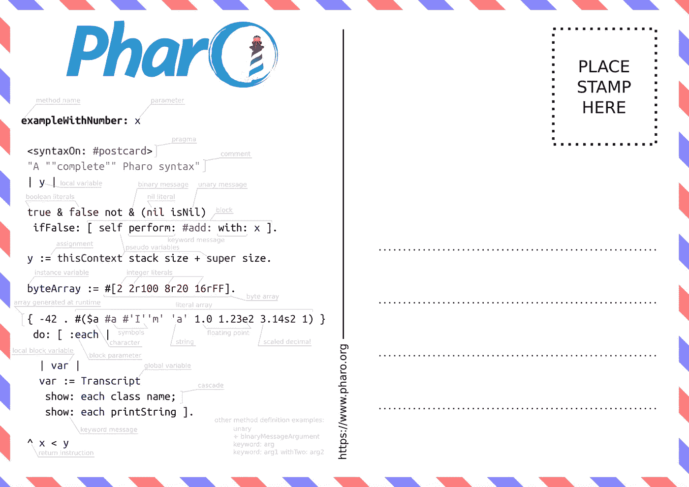

# 学习这 5 种编程语言会让你成为更好的程序员

> 原文：<https://levelup.gitconnected.com/learning-these-5-programming-languages-will-make-you-a-better-programmer-f9ffc6283ef9>

## 通过学习这 5 种编程语言中包含的概念，加快您的编程速度。

对软件开发人员的需求超过了供给。灵活和熟练的程序员非常少见，因此比他们的同龄人有很多优势。掌握与以下编程语言相关的概念将使您编写更干净、更健壮的代码，使您更有效率，最重要的是，将使学习您选择的下一种语言更快、更轻松。

# 📖如何阅读这个故事

首先也是最重要的一点——这与语法或特定于语言的 API 无关。*我建议你不要深入学习以下语言的核心语言 APIs 】,因为并不是下面列出的所有语言都适合使用花哨的框架编写方便的应用程序。*相反，这都是关于概念和哲学的。**

这里列出的语言是按照难度排序的*。所以，如果你来这里是为了学习更高级的东西，请随意跳过第一部分！*

# *🌈闲聊*

*学习这种*面向对象语言*非常简单，因为它的语法非常漂亮和简单——参见下面包含 Smalltalk 全部语法的明信片。安装并运行 [Pharo](https://pharo.org) ，Smalltalk-80 的一种现代方言，将在几分钟内设置好您的开发环境。*

*值得注意的是，当使用 Pharo 时，您还将*看到一个高效的、结构良好的、视觉上整洁的开发环境是什么样子的*。它的可视化调试器具有反向“时间旅行”调试功能，会让你爱不释手。我从中吸取了很大的教训，当使用 IDE 作为我选择的语言时，我总是查找复制 Pharo 的生产力提升功能的插件。*

**

*明信片上的 Pharo 语法。来自 [pavel-krivanek @ GitHub](https://github.com/pavel-krivanek/pharoMaterials/blob/master/postcard/pharo%20syntax%20postcard%20-%20a4.pdf) 。*

*现在，这种语言会教你什么？*

**在具有动态类型检查的语言中正确命名*——它的命名约定使得代码非常可读、可理解和自描述——这应该是每一个写得好的代码的目标。*

**利用调试器的力量。如前所述，一定要尝试在调试器中编程。**

**面向对象编程范式的基础和哲学。*这有几个方面:*

*   *正确地将类的方法责任分配给对象，比起神类和重复代码，更倾向于组合和委托。 Pharo IDE 在其集成的棉绒中强制执行这一点。*
*   **了解* [*得墨忒耳定律*](https://medium.com/better-programming/demeters-law-don-t-talk-to-strangers-87bb4af11694) *的值以及 getters 和 setters 的威力。在* Smalltalk 中，所有方法都是公共的，所有属性都是受保护的。这将使您对访问和变更对象属性有不同的想法。最终，您的代码将变得耦合性更低，模块化程度更高。*

# *⌨️打字稿*

*TypeScript 是现代 JavaScript 方言的超集，增加了编译时的类型检查。注意，这种语言也是学习 GoF 面向对象编程模式的一个很好的环境(简单而强大)。*

*学习这门语言将教会你:*

**像这样的弱类型语言中的强制是如何工作的*，尤其是在使用`==`操作符的时候。出乎意料的复杂。与 Python 或 Smalltalk 等具有强类型安全性的语言相比。有一些语言具有定义自定义强制规则的能力，例如 Ruby 和 Scala，这些语言在这个问题上的知识是有回报的。*

**模块化编程。理解`export`、`export default`、`as`和`*`将帮助你理解使用更复杂的模块化编程系统的编程语言，比如 Scala。**

**闭包及其类型。* TypeScript 提供了两种类型的函数，每一种对于`this`关键字都有不同的语义。掌握`this`以及`Function.call`、`Function.bind`和`Function.apply`，加上`this`上下文中词法闭包和动态闭包之间的区别，将会给你在推理其他语言中的闭包时带来巨大的优势，尤其是函数式编程语言，比如 Haskell、Scala 和 Clojure。*

**可变范围，遮蔽和提升。有几种类型的变量声明修饰符在变量使用范围方面有不同的含义。**

**使用箭头函数的集合变换* —映射、过滤、排序、搜索和归约。掌握这一点将使您避免键入包含重复模式的不必要的循环。同样出现在使用类似概念的语言中，比如 Scala、Python、Haskell，甚至现在的 Java 和 C#。*

# *🎩咬舌*

*这种主要是学术性的*函数式语言*对于学习函数式编程的基础非常有用，函数式编程几乎渗透到了每一种现代编程语言中——包括 Java、PHP、JavaScript 和 C#。*

*这种语言的设计使得编写传统命令式编程风格的代码变得困难，所以*它将迫使你进行范式转换*，这就是这种语言出现在这个故事中的主要原因。*

*学习这种编程语言将教会你:*

**递归算法和列表。*是的，在普通的 Lisp 中没有循环——递归代替了它们。因为在某些情况下使用简单的递归技术可能会很笨拙，所以高级的递归技术，如*前向递归*和*带累加器的递归*将是你必须掌握的。*

**高阶函数。*这些函数可以接受函数作为参数，并且可以返回另一个函数。例如，这在现代 JavaScript 中几乎无处不在。*

**纯函数。随着时间的推移，你会明白为什么使用没有副作用的函数会大大增加代码重用的可能性。**

# *⚙️ C++*

*几乎每个人都听说过这种以低级编程能力、性能和难度著称的编程语言。虽然语言 API 和面向对象概念本身大多没什么意思，但语言的某些部分特别有趣。*

*这些概念值得一试:*

**学习手动内存管理*，包括面向对象和过程代码。你会明白什么是*内存泄漏*。这也将使您深入了解高级运行时系统中的垃圾收集器必须做些什么来防止内存不足问题。*

**理解指针、引用和值类型的区别。*就内部实现和运行时性能而言，这尤其有趣。*

**位运算和低级硬件操作。例如，在为 Arduino 开发时，这些在 C++中非常容易。**

**理解方法多态性中早期和晚期绑定*的区别，这要感谢代码中使用`virtual`关键字的方法绑定类型区分。*

# *🚀斯卡拉*

*这种语言*将函数式和面向对象编程*合二为一。即使对于非常熟练的程序员来说，学习这一点也是既有趣又具有挑战性的，因为它为当代面向对象编程范例带来了许多新概念。*

*这种编程语言充满了许多其他编程语言中出现的有趣概念，可以为您提供:*

**特征*——意味着类中的代码重用，部分绕过了几种面向对象语言的单一继承限制。如果使用正确，它确实是一个非常强大的特性，在 JavaScript/TypeScript、Ruby、PHP 等等中也可以找到。*

**模式匹配。*你会发现一些方便的代码分支和赋值的紧凑语法操作符。模式匹配和类型双关也可以用来学习*鸭子类型*。Python 和 JavaScript/TypeScript 析构语句中也出现了这个令人惊叹的功能的一个稍微不同的子集。*

**高级功能重用模式。*如果你开始喜欢函数式编程，一定要看看 *Function currying 和 Eta conversion* 技术，它们可以从一般函数派生出特定的函数。*

**高级仿制药。*这种语言可以使用*类型界限*和*类型差异注释*非常精确地定义各种泛型类型的赋值兼容性。例如，科特林中就有几个这样的概念。*

**单子。*起源于函数式编程的模式，在面向对象语言中用于流处理和 if-else 结构消除。单子也是 Java 8+的一个内置特性。Scala 单子的端口也可以作为类型脚本库使用。*

**懒评。* Scala 拥有`lazy`关键字以及几个惰性集合转换操作。对于那些喜欢快速优化代码的人来说，这是一个非常有趣的话题。*

**不变性*——这个概念在几个方面与语言交织在一起，比如 case 类和内置的不可变集合框架。*

**特定领域语言开发*无疑是 Scala 大放异彩的一个用例。*

# *📜结论*

*您已经看到了分散在总共 5 种编程语言中的众多编程概念。使用上述编程语言学习概念将有助于您更快、更放心地学习您选择的语言。*

*如果您正处于编程之旅的开端，这些概念一开始可能会令人困惑。但是我说:*

> *不断的教育是达到完美的唯一途径。*

*因此，请继续稳步提高您的编程技能，并保持耐心。*

*如果你在这个列表中遗漏了一些有趣的概念或者语言，请在下面留下评论！*

# *👓值得一看的文章*

* [## 作为一个自学成才的新手，我犯的 10 个错误

### 完成理学硕士学位后，对过去的自己进行了批判性的反思。在软件工程和飞速发展的职业生涯中…

levelup.gitconnected.com](/10-mistakes-i-made-as-a-newbie-self-taught-developer-2b3f14d01052)  [## 像这样写你的 CSS 将会使你的代码非常干净

### 让你的样式表保持整洁的 6 个技巧——让它们易于阅读、维护和重用。

levelup.gitconnected.com](/writing-your-css-like-this-will-make-your-code-super-clean-f82d4bfeb468)*