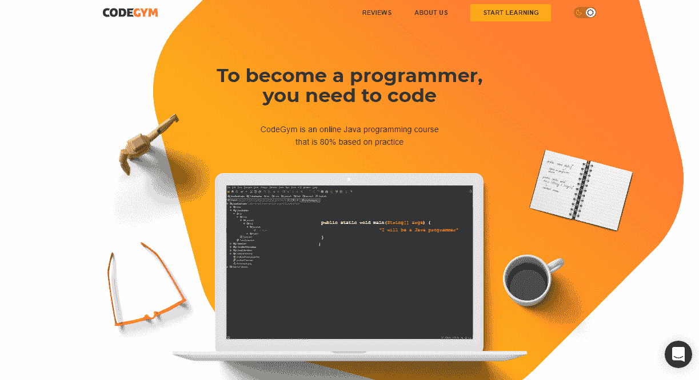
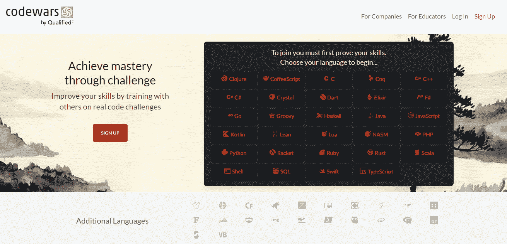
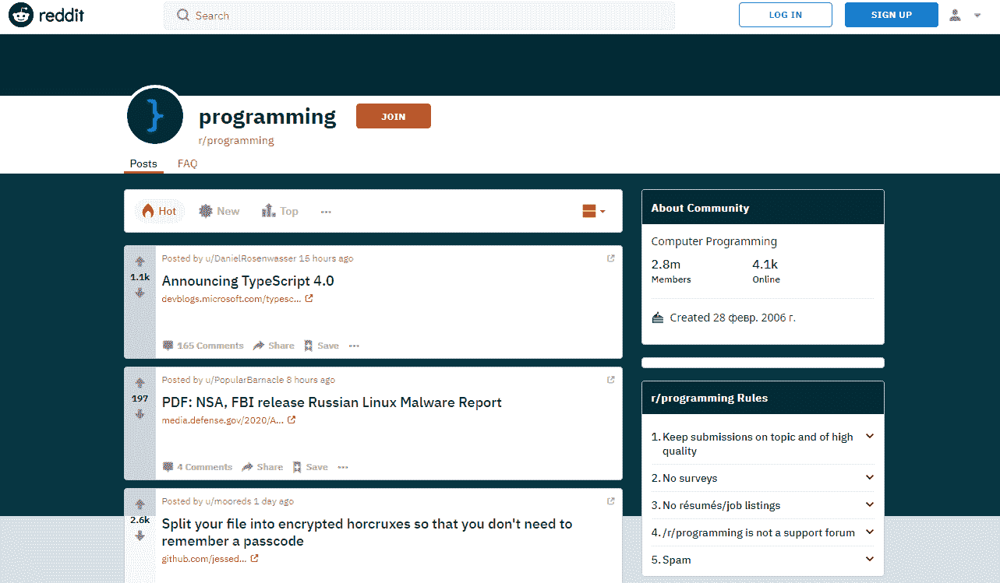
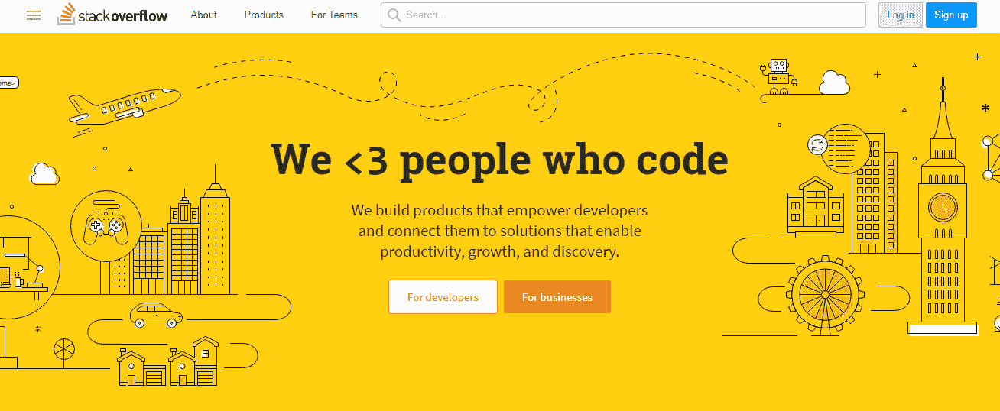
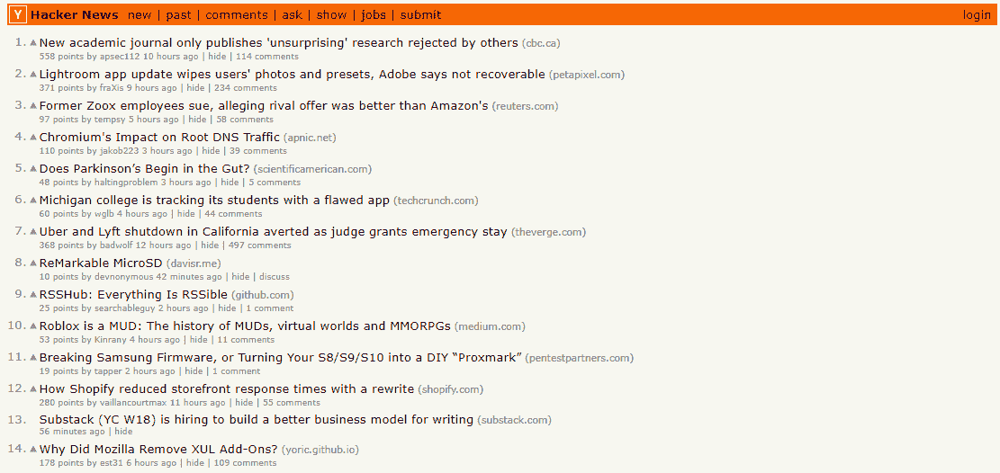
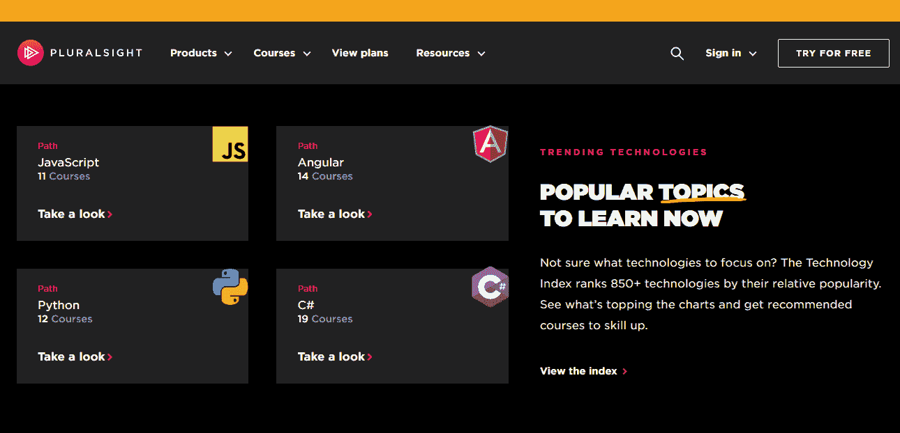

# 学习编码:如何加速过程？

> 原文：<https://levelup.gitconnected.com/learning-to-code-how-to-boost-up-the-process-c441676c0a2e>

让我们面对现实吧:人们天生缺乏耐心，很可能希望生活中的事情发生得更快。我将同样适用于代码学习者。同学们，在开始学习编程的时候，首先想的是如何加快培养速度，尽快做出程序员的事业。

我不是那个让每个人都相信学习编程是一个闪电般的旅程的人——另一件事是，它没有人们想象的那么难。当然，一切都归结于兴趣、热情、经常练习和耐心。我还经常向我的学生推荐不同的在线和离线资源，让他们的学习过程更容易、更有效、更快。在这篇文章中，我将与你分享一些小技巧。

# 那么，如何更快的学习编程语言呢？

这些技巧不是神奇的药丸，可能不会让你在一周内成为一名专业的开发人员，但它们肯定会让你的生活变得更容易，同时学习过程也不会那么令人生畏、模糊和枯燥。此外，跟随他们一起可能会加快训练。

所以，不要再拖延了，让我们开始吧。

# 通过多练习巩固你的知识

一门新学科再简单，也还是需要你巩固知识。在您完成下一部分后，立即开始玩代码有助于您更快地学习给定的概念，并在编写第一行代码时感到自信。幸运的是，网络充满了平台，在那里你可以很快开始练习。

让我们详细考虑一下。

## CodeGym

注册 [CodeGym](https://codegym.cc) 可以让你获得 1200 个不同复杂程度的动手任务。他们会强迫你写大量的代码，这对获得找工作所需的经验至关重要。实践证明是学习编程的最好方法。

这个核心 Java 课程是使用最新的技术开发的，包括可视化、讲故事和游戏化，这样你就有动力继续学习编码。

## 代码集

[Codecademy](https://www.codecademy.com/?utm_source=rakuten&utm_medium=affiliate&utm_campaign=adgoal.net&utm_content=10-1&ranMID=44188&ranEAID=a1LgFw09t88&ranSiteID=a1LgFw09t88-R6cG1CM07Q8ecy4UplDK4A) 平台旨在改革教育体系，建立一个世界值得拥有的教育体系。该公司提供了大量的免费资料，你可以根据你想学习编程的原因进行选择。做完小测验后，专家会给你指出正确的方向。无论您是初学者还是有经验的开发人员，该平台都将满足您的任何期望，并提供许多实际任务，如计算器创建或量身定制的测验来测试您的知识。

## 代码战争

如果你有更多的编程经验，Codewars 是磨练你技能的好机会。该平台允许通过真正的代码挑战达到精通，更好地被称为形。学生们通过完成形、编程练习、创造自己的挑战和找到高质量的解决方案来获得排名和荣誉。这就是为什么，由于游戏化的学习过程，他们学习编码而不会感到无聊或没有动机。

# 先了解基本原理

编程基础是学生应该开始软件工程之旅的基础。他们对基本原理的理解越好，就越容易进入下一个更高级的主题，比如 I/O 流或并发性。然而，从我的经验来看，开始学习编码的学生碰巧低估了基础知识的重要性。他们经常从一个话题跳到另一个话题，不是真正理解，而是越来越糊涂。

所以，在你跳过编程的基本原则之前，想一想你是否准备好重新开始，在紧迫的时间限制下回到基本原则。

# 考虑代码手写

你们中的许多人可能会说这种做法早就过时了。我很难同意，因为手写代码仍然是初学者最好的练习之一。

手工编码不仅能提高熟练程度，还能让你找到一份工作。当通过大学考试或技术面试时，你经常需要手写代码来证明你的技能。手工编码也能让你更好地了解学习结构和语法的速度。在现代，IDE“添加”了很多东西，这样专家们就不会经常注意到他们在学习过程中错过了一些东西。

所谓的“铅笔代码”有点像压力测试，有助于揭示知识差距并弥合它们。

所以，我建议的是，前期要习惯这种老套的做法。

# 求助

我们程序员都是一条船上的人，每个人都是从一些事情开始的。除此之外，开发人员社区以其友好、支持和分享知识的愿望而闻名。所以，如果你在学习编码时遇到了问题，不要害怕寻求帮助。没有不容易消除的 bug，尤其是被其他专家以新的视角或对主题的新解释消除的 bug。

为了省去你上网寻求帮助的麻烦，我整理了几个你可以依赖的平台。以下是它们的简要列表。

[Reddit](http://www.reddit.com/) 频道以及子频道，例如:

*   r/编程
*   学习编程
*   r/代码在一起
*   r/编程工具
*   r/游戏开发
*   r/Prog articles
*   r/webdev
*   r/每日程序

[松弛渠道](https://slack.com/intl/en-ua/features/channels)，包括:

*   标签开发者，Slack 上的世界开发者社区。
*   欧洲开发者资源，开发者分享他们在欧洲国家生活和工作的经验。
*   AngularJS Chat，一个频道，在这里你可以得到 Angular devs 对你的编码问题的回答。
*   DevOps 聊天，一个书呆子开发者聚集在一起讨论高级 DevOps 概念的地方。

*   领先的论坛平台 StackOverflow ，在这里你可以得到你的理论问题的答案，寻求建议，或者接收对你的代码的反馈。

*   [SitePoint](https://www.sitepoint.com/community/) ，另一个帮助开发者清楚理解他们所选择的语言的社区。它还涵盖了商业、营销和其他相关领域的主题。

*   [黑客新闻](https://news.ycombinator.com)，这个论坛让黑客们了解行业最新消息，回答他们之间的常见问题，分享工作经验。

# 运行或编写代码

阅读示例代码是一项有用的练习，但是除非您尝试自己编写或者至少运行它，否则它可能不会有效地工作。修改代码可以让您清楚地了解它是如何工作的，并使学习过程变得更加容易。如果我是你，我会从阅读 Java 库开始，并尝试重写一些东西，例如，去 ArrayList 类并努力重新创建它。

# 暂停调试

不管你是一个绝对的初学者还是熟练的专家，在编写代码的时候，你有时可能会遇到问题。但是，花几个小时苦思该问题的解决方案并不总是能保证您会发现它并理解代码为什么不起作用。所以，我觉得如果你之前的所有尝试，浏览谷歌，或者寻求帮助都没有带来想要的结果，那么离开它，以后再回来是合理的。

简而言之，在调试和尝试其他任务时休息一下，会让你以恢复的理智和新鲜的视角回到有问题的任务，并最终找到解决方案。

# 尝试不同的在线资源

网络上充满了内容。真的。如果你目前试图消化的材料对你来说没有意义，离开，去寻找另一种资源，这种资源将使概念足够清晰，以保持训练。不要害怕尝试不同的材料，但要避免收集它们。

我推荐的平台包括:

*   Treehouse 非常了解如何学习编程，并提供了大量关于 HTML、Ruby on Rails、PHP 和其他技术的视频指南。对交互式测验、代码挑战、学习跟踪和其他附加内容的访问使其成为列表中的理想资源。

*   [一个月](https://onemonth.com)是一门强化课程，最适合想在一个月内完成所选科目的人。SQL、面向非程序员的编程、Ruby on Rails、Python、JavaScript——这只是该平台涵盖的一小部分主题。

*   [代码学院](https://codecollege.ca)允许你订阅并获得所有可能的代码相关课程，或者在订阅前尝试免费挑战。该网站是新手和专家开发者的理想选择。没关系，如果你打算手工编写你的第一个网页或者建立一个定制的 WP 网站，代码学院会帮你搞定。

*   [复数视觉](https://www.pluralsight.com)让学生掌握在家的技能。该平台提供了许多互动挑战和一些免费课程，这对于那些预算紧张的人来说是一个不错的选择。

*   Lynda.com 涵盖多个主题，包括商业、摄影、设计以及网络和软件开发。除此之外，该网站还提供对整个团队的培训，为企业、学校或政府机构提供订阅服务。

# 结束语

毫无疑问，我在这篇文章中提到的技巧是为了加速学习过程而编造的。但是，更重要的是你准备好失败并继续下去。在确定自己在做什么以及为什么需要学习编程语言的同时，你可以对自己的进步保持耐心，并留出一些时间成为一名有经验的专家。因为任何新技能都需要努力和奉献。