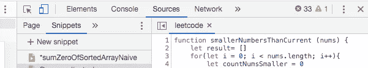
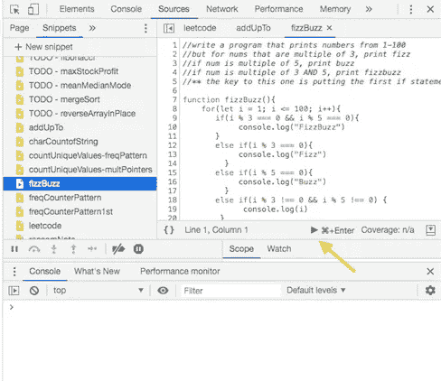

# 使用 Chrome 开发者工具代码片段

> 原文：<https://levelup.gitconnected.com/learning-to-code-without-internet-chrome-developer-tools-snippets-2f98d73d0c9d>

在 [Unsplash](https://unsplash.com/s/photos/saved-notes?utm_source=unsplash&utm_medium=referral&utm_content=creditCopyText) 上由 [Meelika Marzzarella](https://unsplash.com/@moonlitlens?utm_source=unsplash&utm_medium=referral&utm_content=creditCopyText) 拍摄的照片

我最近去了一个没有互联网的偏远地方，但我想继续练习算法，作为我参加的在线课程的一部分。你可以在没有互联网的情况下学习编程——毕竟，这一切都是从互联网开始的！也可以不用电脑学习编程(你好再课本)。如果你愿意，我肯定还有 50 多种方式。但是如果你不想带着沉重的课本去旅行呢？或者，如果您的学习是由视频或交互式网站指导的，并且 IDE 依赖于互联网连接，该怎么办？如果您正在寻找比命令行提供的更多一点的支持(或者您只是想深入实践，而不是成为命令行英雄)，有大量的工具供您使用。

您可以下载带有测试套件的库，以及提供类似于文本编辑器的工具来为您运行代码的浏览器。我选择了 Chrome Dev Tools Snippets，它允许我快速记下代码，自动保存并按需在控制台上运行。厉害！以下是如何做到这一点:

# **片段**

片段可以通过 Chrome 开发者工具轻松访问(在 Mac 上你可以通过**命令** + **选项** + **J** 打开开发者工具)。

在开发工具中，导航到源代码→代码片段→新代码片段。

Chrome 开发者工具片段

一旦进入新的代码片段，您就可以像在命令行中一样编写代码、运行代码和测试代码，但是您可以保存更长的代码块。最重要的是，你可以在没有互联网连接的情况下运行它。只需点击**命令** + **回车** (Mac) 或点击播放按钮(如下图)即可执行您的代码:

单击播放按钮运行您的代码片段。

现在你知道了！编码快乐！

 [## 编写面试问题

### 一个完整的平台，在这里我会教你找到下一份工作所需的一切，以及…

技术开发](https://skilled.dev)