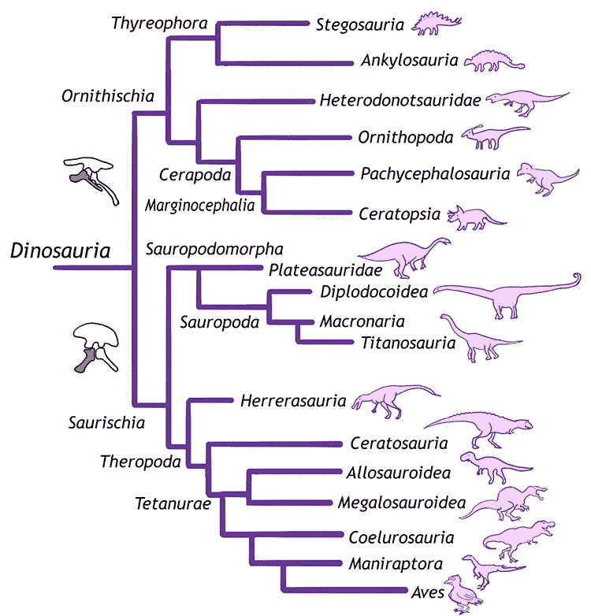

# 学习尝试用恐龙

> 原文：<https://levelup.gitconnected.com/learning-tries-with-dinosaurs-e7ee3e9bb3bc>


卢卡斯·乔治·温迪特在 [Unsplash](https://unsplash.com?utm_source=medium&utm_medium=referral) 上的照片

作为一名软件工程师，一个有趣的事实是总有新的东西要学。虽然我熟悉一些常见的数据结构，如列表、堆栈和树，但我对不了解*尝试*感到内疚。

顾名思义，*树*本质上是*树*的一种。它们针对搜索和检索以层次结构组织的键进行了优化:每个节点都存储一个键值，并且具有数量可变(尽管有限)的子节点，这些子节点表示层次结构中有效的后继节点。键值的类型及其各自的结构可以不同，但一个常见的用例是存储单词字典:


简单的尝试

每个节点代表一个字母，沿着任何一个分支都有可能找到给定语言中所有相关的单词。一个可能的应用是在字典中搜索以公共前缀开头的所有单词。为什么*尝试*对这项任务至关重要？很快，不言而喻的是，当使用替代数据结构时，搜索带有共享前缀的单词是一项令人望而生畏的任务。例如，尽管*hashmap*允许在常量时间内进行值检索，但是没有办法找到所有相关键的散列。另一方面，在*列表*中搜索会慢得可怕。那么我们能做些什么呢？*trys*的超能力是搜索相关值可以在对数时间内完成——有时几乎是常数时间。

## 用恐龙编程

存储语言词典并不是*尝试*的唯一可能用例。事实上，我可以想到另一类分层组织的符号:分类法等级。简单来说，对于像我这样的非专家来说，分类学等级是植物学家、动物学家和古生物学家用来对任何生物进行分类的等级体系。通过使用这个系统，有可能建立一个灌木状的结构来显示不同物种之间的关系。当然，这给了我一个完美的借口，在研究尝试的时候把恐龙引入组合中！对我来说这听起来像是双赢。



[https://open geology . org/historical geology/case-studies/恐龙分类/](https://opengeology.org/historicalgeology/case-studies/dinosaur-classification/)

## 数据结构和操作

让我们实现我们的*分类法 Trie* 。任何给定的*等级*(又名 *Trie* 节点)都将有一组子*等级*，代表恐龙分类中的较小等级，并且将具有一个`isSpecies`标记，它将告诉我们是否到达了生命之树的一片叶子:

秩实现

当然，我们需要一个*分类法*结构的入口点，提供一个根*等级*元素和一些基本操作来创建层次结构和搜索值:

分类类别

检查`isSpecies`标志将允许搜索精确的物种匹配；或者，我们可以验证给定的等级是否存在于结构中。

## 恐龙在行动

想想这群可爱的`Sauropodomorpha`(与`Brontosaurus`有关的长颈恐龙)`aardonyx celestae`**`ammosaurus major`**`ankylosaurus polyzelous`*`melanosaurus readi`**`riojasaurus incertus`*******

***虽然在古生物学参考书中快速搜索会表明这些恐龙是相互关联的，但仍然很难掌握它们在分类学中的确切位置。然而，Trie 数据结构很快揭示了潜在的关系:***

```
***Dinosauria
└── Saurischia
    └── Sauropodomorpha
        └── Prosauropoda
            └── Anchisauria
                ├── Anchisauridae
                │   ├── **ankylosaurus polyzelous**
                │   └── **ammosaurus major**
                ├── **aardonyx celestae**
                └── Melanorosauridae
                    ├── **melanorosaurus readi**
                    └── **riojasaurus incertus*****
```

## ***算法研究***

***想象一下，作为一名古生物学家，即将有突破性的发现。你刚刚检查了一个新化石，它改变了你过去对`Anchisauria`的所有看法。你只需要快速检查一下`Anchisauridae`家族代表:毕竟，你不想因为一个重大错误而遭到你的古生物学家同事的鄙视。您很快将查询插入到您的现场终端，希望底层算法不会花费很长时间才能给出满意的答案。***

***对于像我们这样的分类树，搜索所有的`Anchisauridae`或任何其他分支将像这样实现:***

***你作为古生物学家的名声是有保障的，因为你很快就能找到关于`Anchisauridae`家庭成员的信息:***

```
***Anchisauridae
├── **ankylosaurus polyzelous**
└── **ammosaurus major*****
```

***[加入我的时事通讯，了解更多类似的故事](https://blog.lorisocchipinti.com)***

## ***参考***

*   ***[恐龙化石库](https://github.com/Ipanov7/dinotrie)***
*   ***开放地质学:地球科学免费开放教育资源***
*   ***[kjanjua 26/侏罗纪公园:恐龙数据集](https://github.com/kjanjua26/jurassic-park)***