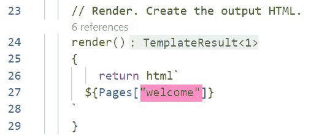

# 使用 Web 组件学习 Typescript with

> 原文：<https://levelup.gitconnected.com/learning-typescript-with-web-components-lit-4f38fae47e27>


# 第 1 部分:属性、值和数据绑定

> 在我的关于 web 组件入门的 3 部分系列文章中，我们创建了一个示例应用程序来展示定制 Web 组件是如何工作的。在这个衍生产品中，我们将使用这些组件作为容器来演示使用 Typescript 开发 web 应用程序的一些基础知识。

**快速索引** 第一部分:[属性，值，&数据绑定](/learning-typescript-with-web-components-lit-4f38fae47e27)
第二部分:[处理数组](/learning-typescript-with-web-components-part-2-9798ec0b67e2)
第三部分:[处理 JSON 对象](/learning-typescript-with-web-components-part-3-a599c8d26213)


Typescript 是 JavaScript 的未来版本，最初由微软发起。

# 为什么要学 Typescript？

[Typescript](https://www.typescriptlang.org/) 无非是 JavaScript 的下一个版本，这是世界上最流行和最重要的编程语言。今天，您可以通过使用支持 Typescript 的服务器和构建器来享受它的未来派特性。添加一个支持 Typescript 的 IDE，您就可以开始了！


今天，我推荐用最小的开销构建定制 web 组件的 Lit。我的 [Hexxed 游戏](https://hexxedgame.com)使用 TS 和 Lit 来渲染巨型动物，带有反应图标的按钮，以及响应用户的调色板。

# 为什么要学习 Web 组件和 Lit 的 TS？

由于 [DOM](https://en.wikipedia.org/wiki/Document_Object_Model) (浏览器实际呈现的)使用起来丑陋而可怕，许多 JavaScript 编程示例试图完全避免使用它！相反，他们会要求你使用“[编码操场](https://jsfiddle.net/)”，在那里他们设置了一个 web 界面来显示你的代码输出。另一种选择是`console.log()`语句，它们甚至不显示在 HTML 页面内部，而是显示在页面外部的调试面板中。呸。


没有一些 HTML 来显示我们的 Typescript 结果，我们只剩下右边难看的 **console.log()** 。

然而，如果我们在 **web 组件已经安装好**的情况下开始 Typescript 学习之旅，我们可以直接从编写 Typescript 开始，在浏览器中查看它的实际输出。如果我们正在开发任何一种带有 web UI 的应用程序，我们可以用 Typescript 来搭建我们的组件行为和外观。

# 先决条件:VSCode、Lit 和 Vite

> 如果您从这里开始本系列，您将需要安装了 Lit 和 Vite 的 VSCode。您可以在我的 web 组件系列的第 2 部分中找到这些的逐步说明，或者您可以从 GitHub 下载我的 [Lit starter kit](https://github.com/garranplum/lit-starter) ，它是现成可用的。

# 在组件中使用值

在前一系列的第 3 部分的最后，我们构建了一个执行*路由*的 web 组件。结果是根据用户的 URL 显示两个不同的内容页面。让我们看看这是如何实现的:


这个组件使用一个 **JSON 对象**和一个**属性**，以便在 HTML 输出中呈现()一个动态值。

# 分配一个常数值

为了存储 HTML 页面的内容，我们使用了一个 Typescript 常量，编写为`const`。根据定义，常量是一个**变量**，它不应该**改变**！换句话说，如果我们不期望或不希望它的值在我们的应用中改变，我们就定义一个常数。


常量定义以 **const** 开始，然后是它的名字。灰色阴影区域是该常数表示的 Typescript 类型的 VSCode 建议。在后面的章节中会有更多的介绍！

我们对`Pages`的`const`定义也为 [**赋值**](https://en.wikipedia.org/wiki/Assignment_(computer_science)) **一个值**(在`=`符号之后)。值周围的花括号告诉我们这是一个 JSON 对象。


“万物不都是对象吗？”“是的，但那现在不重要。”

# 一切都是物体

你可能听说过在 JavaScript 中，一切都是对象。这是真的，但现在不重要。出于我们的目的，我将使用术语 **JSON 对象**，这样我们就知道我们在模型中讨论的是 [JSON 格式](https://en.wikipedia.org/wiki/JSON)的数据。JSON(发音为“JAY-sun”)是 JavaScript 中所有数据(以及其他所有东西)的标准表示方式，因此在 Typescript 中也是如此。

一旦你知道规则，JSON 读起来并不可怕。


这里黄色的文字是两个**键**。它们必须以冒号结尾。这里的**值**是蓝色的，必须用逗号隔开。

JSON 对象可以被认为是一种字典。字典中的每个条目都有一个键和值。虽然我们可以通过关键字在字典中查找任何东西，但是条目*没有任何特定的顺序。*每个键必须是唯一的，我们需要确切的键来获取值。


Typescript 中的数据绑定就像精灵一样。自从 1965 年这个节目播出以来，我们已经走过了漫长的道路。

# 使用${expression}输出数据

如果页面内容存储在我们的 JSON 模型中，我们需要一种方法在组件呈现时显示它(在`render()`函数的`return`中)。


我们可以在 **$花括号**中编写任何有效的 Typescript 表达式，包括来自我们模型的函数调用或值，就像这里的 **Pages** 。

为了从我们的模型中输出数据，我们使用了`${expression}`语法，其中`expression`是来自我们模型的某个东西(包括函数调用)。

# 从 JSON 中获取值

为了在 JSON 对象中查找某些东西，我们使用了一个**访问器**。有两种。我们先来看看这段代码中的那个。


**页**是对我们定义的常数的引用。**【方括号】**中的值是我们想要从 Pages 中访问的键。

# 方括号访问器

这里，我们在方括号内传递我们想要的键。如果我们在编写代码时不知道关键字，这种访问 JSON 对象的方法特别有用，就像这里的情况一样。另一种说法是，关键是**变量**。在这种情况下，它来自一个*属性*，我们马上就会看到这个属性。

# 带文字的方括号



以文字形式提供键将总是产生相同的页面。

如果我们事先知道密钥，我们就可以用引号传递一个**文字**值。例如，如果总是想要欢迎页面而不是其他页面，我们可以只写`“welcome”`加引号。

请注意，在 Typescript 中，使用三种类型的引号并不重要，只要每种类型都是属性嵌套的。然而，特殊的**反引号**(在这里用在`html`之后包围 HTML 内容)具有理解`${expression}`语法的神奇特性。

# 文字的快捷访问器

当我们*确实*知道密钥时，有一个更短的方法来写它。带一个点。


后面有一个**点**的对象是点后面的**键**的访问器。


在《我爱露西》的一个著名情节中，弗雷德自豪地烤了一个“七层深”的蛋糕。

事实上，我们一直在使用这种技术，甚至不知道它。每次我们在 Typescript 中编写 *object.key* (这是很多)时，我们只是在某个 JSON 对象上使用这个快捷方式。我们甚至已经看到在我们的 `<dta-home>`组件中有`document.location.pathname`的“三层深度”。


这里，位置是文档**对象**的关键点。该键的值是另一个具有路径名键的**对象**。

JSON 对象可以并且经常在它们的值中包含其他 JSON 对象。当这种情况发生时，我们可以使用这种快捷方式来“向下钻取”这些键，以获得我们想要的值。在这个例子中，名为`document`的 JSON 对象有一个`location`键。那个键的值是**另一个 JSON 对象**，它有一个名为`pathname`的键。


你听说过地产兄弟吗？在 JS 中，**属性**和**属性**是兄弟。他们还需要是同卵双胞胎*才能完成任何工作！*

# *介绍属性*

*这对于不变的、静态的值(比如我们预定义的页面内容)来说很好。但是为了给我们的组件提供动态行为(比如改变页面)，我们需要**属性**。属性是一种特殊的变量，具有两个独特的特征。*

1.  *属性可以通过自定义元素上的**属性**从外部设置。*
2.  *如果显示的属性发生变化，Lit 将重新绘制组件。*

*为了从外部引入数据，我们需要一个属性。在这种情况下，我们希望从外部获得的数据是我们应该显示的页面的关键。这类属性通常被称为 public，表示它们会受到外部代码的影响。在`render()` 输出之前，将所有这些定义放在一起是很好的编程实践。因此，我将在代码中添加一个部分和一个注释:*

**

*你的 public **属性**应该在你的 CSS 之后，render()输出之前。*

*这个属性定义表明，当我们在其他 HTML 中使用这个组件时，我们模型中的`this.page`的值将总是等于从外部传入的值。所以让我们开始吧！*

**

*在<dta-home>中，我们传递我们想要的 **page=** 属性的值。</dta-home>*

# *将值传递给组件*

*事实上，这种用属性设置属性的方法是 web 组件相互通信的主要方式。这样，每个组件只获得它需要的信息，并且以方便的形式供您传递。*

*这时你可能会奇怪，“如果我们正在设置属性，为什么我们要把它们叫做*属性*？”答案是 attribute 在这里特指 HTML 元素上的`propertyName=”value”`。该元素本身具有其他属性，因此有单独的名称。在本文中，当我指属性上的“发送”值时，我将使用术语`page=`属性，当我指子组件中的“接收”值时，我将使用术语`page`属性。听起来不错吧？*

# *处理默认值*

*在 web 应用程序中，经常需要处理缺省值或缺失值。即使在这个非常简单的应用程序中，我们只定义了两个 web“页面”我们从来没有说过如果用户没有导航到任何一个会发生什么！让我们看看处理缺省值和缺失值的两种技术。*

**

*在 **page=** 属性中，我们使用“or 技术”来处理一个 **null** 或空值。*

**

*不仅仅是编程，所有的逻辑谜题，像著名的[女士或老虎](https://en.wikipedia.org/wiki/The_Lady,_or_the_Tiger%3F)，都可以用[布尔](https://en.wikipedia.org/wiki/Boolean_algebra)运算符如 AND、or、and NOT 来解决。在硅层面，芯片在硬件中以相同的逻辑运行，称为[门](https://en.wikipedia.org/wiki/Logic_gate)。*

# *使用 or 对 Null 进行陷印*

*计算机应用程序的大量业务逻辑可以归结为对`AND`和`OR`的简单测试。在 JS 和 TS 中，or 操作符(写为`||`，读为“OR”)有一个处理空值的有用特性。如果第一个值为空，则返回第二个值！我们可以这样说，“如果`pageKey`是空的，使用`‘welcome’`”*

**

*来自 W3Schools 的这个片段展示了如何在 Typescript 中编写**和**以及**或**。*

*如果用户没有在 URL 上键入路径，在`page=`属性中使用 OR 会导致传递默认值“welcome”。但是如果我们根本没有提供一个`page=`属性**呢？***

# ***设置属性默认值***

******

***在<dta-page>中，如果属性丢失，我们可以设置默认值。</dta-page>***

***在您的组件定义中，很多时候您会希望为根本不传递的值设置默认值。这使得编写元素更加简单，因为您只需要传递非默认值的属性。***

***为了实现这一点，您可以简单地**在组件中定义属性时给它赋值**。就像我们之前对`const`的赋值一样，新值写在`=`符号之后。在这种情况下，它是字符串`“welcome”`，如果没有给我们一个键，我们希望提供它。***

# ***把所有的放在一起***

***那好吧！如果*已经正确定义了*属性(在其组件定义中)并且*正确使用了*(在其**调用方**或**父**组件中)，属性的值应该在组件的模型中可用。让我们看看是不是…***

******

***我用新的 HTML 值添加了第三个键。***

******

***访问新的 URL 会生成新的页面，不需要任何其他更改。***

# ***我们已经走了这么远！***

***那么，旅伴们，我们到哪里了？我们已经了解了如何定义一个 **JSON 对象**，它的作用就像一个字典，并根据我们请求的**键**返回**值**。我们已经看到了**属性**和**属性**如何结合起来将数据从一个 web 组件传递到另一个 web 组件。我们已经展示了如何在输出 HTML 中使用可变数据和表达式，一起被称为**数据绑定**，可以使 web 组件毫不费力地更新自己。***

******

***比利时布鲁塞尔的[原子博物馆](https://en.wikipedia.org/wiki/Atomium)是一座雕塑建筑，你可以在里面漫步(我就这样做过！).它是以铁原子为模型，放大了 1650 亿倍。使用 web 组件的小型模块化设计，您可以构建哪些令人兴奋的大东西？***

# ***接下来，精彩的数组世界***

***在第二部分的[中，我们将看看数组的概念，JS 处理*事物列表*的奇妙方式。我们将创建一个定制的`<dta-palette>`组件，可以显示我们提供的颜色列表的色卡。在这个过程中，我们将会看到在 Typescript 中使用数组的一些很好的技术。](https://medium.com/gitconnected/learning-typescript-with-web-components-part-2-9798ec0b67e2)***

***一如既往的感谢您的阅读。下次见！***

****— D****

# ***分级编码***

```
***Thanks for being a part of our community! More content in the [Level Up Coding publication](https://levelup.gitconnected.com/).Follow: [Twitter](https://twitter.com/gitconnected), [LinkedIn](https://www.linkedin.com/company/gitconnected), [Newsletter](https://newsletter.levelup.dev/)**Level Up is transforming tech recruiting** 👉 [**Join our talent collective**](https://jobs.levelup.dev/talent/welcome?referral=true)***
```