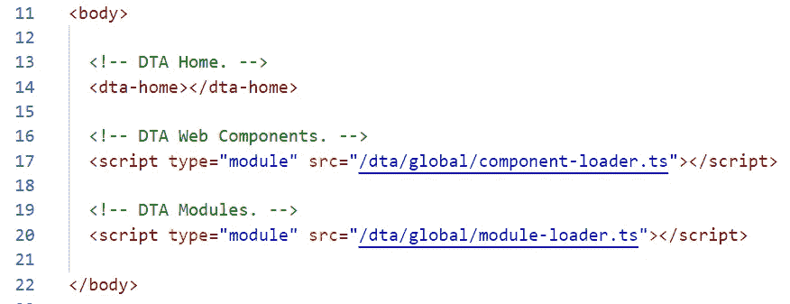
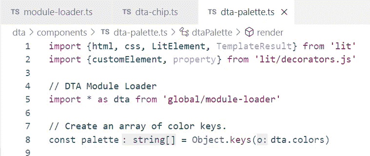

# 使用 Web 组件学习 Typescript:第 2 部分

> 原文：<https://levelup.gitconnected.com/learning-typescript-with-web-components-part-2-9798ec0b67e2>

# 第 2 部分:使用数组

> *在本系列的* [*第 1 部分*](/learning-typescript-with-web-components-lit-4f38fae47e27) *中，我们研究了 Typescript web 组件中数据绑定的概念，并查看了两个使用属性和特性传递数据的示例组件。在这一节中，我们将看到一些处理数组的 Typescript 方法，这就是我们处理数据列表的方式。在这个过程中，我们将开始把代码分成模块，并进一步研究它们之间的数据传递。我们还将首先看看如何使用箭头函数来处理 TS 数组中的项目。*

**快速索引** 第 1 部分:[属性，值，&数据绑定](/learning-typescript-with-web-components-lit-4f38fae47e27)
第 2 部分:[使用数组](/learning-typescript-with-web-components-part-2-9798ec0b67e2)
第 3 部分:[使用 JSON 对象](/learning-typescript-with-web-components-part-3-a599c8d26213)

# 数组与对象

每种编程语言都需要某种方式来处理数据项列表，而不仅仅是单个数据项本身。我们可以将示例`<dta-pages>`组件中的`Pages` JSON 对象视为页面列表。

JSON 对象被**花括号**包围。

还有一种，**阵**。数组在两个方面不同于对象。首先，数组中的元素没有键。相反，它们按照特定的顺序进行。他们在队列中的位置被称为**指数**。在 JS 和 TS 中，数组被方括号包围，而不是对象的花括号。

一个数组被**方括号**包围。

在**铁厨:JavaScript 版**中，两个激烈的竞争对手面对的是同样的数据配料。线性思想的数组会创造出最好的 UI 吗，或者有创造性的对象会创造出更好的东西吗？

# 铁厨:数据存储对决！

每种类型的数据存储都有明显的优势和劣势:

*   *对象*的值只能由它们的**键**访问。没有索引。
*   *数组*的值没有键。它们只能由它们的**索引**访问。

当您知道某个对象的名称或标签时，这使得该对象非常适合于获取该对象——比如使用帐号作为关键字来查找单个帐户的余额。但是当我们需要遍历一个项目列表时，比如为某个地区的所有帐户生成一个邮件列表，数组会更好。这样的列表可以表示为一组帐号。

由于对象值没有任何顺序，我们不能说，“给我第*个第 n*个。”因为数组没有键，我们不能说，“给我一个叫做*某某*的。

让我们的数组只包含**一种**项，通常是另一个对象的键——或者另一个数组的索引，这是很好的编程实践。看起来，只保留所有客户及其余额的列表可能更容易，但实际上，使用尽可能少的数据量更容易，这通常是很好的编程建议。换句话说，我们可以创建只包含我们需要的部分的数组(甚至其他对象),而不是传递整个客户列表。

# 这是甜点配料和地板蜡

通常，我们需要对相同的数据进行两种访问。如果我们要为我们的页面创建任何类型的**菜单**，我们需要显示一个列表——页面名称列表？页键列表？(那就难看了。)

我们可以扩展我们对每个页面的定义，在屏幕上显示一个名称，我们可能应该这样做。但是无论如何我们需要一份页码列表。然后，我们可以在创建菜单输出时“遍历”该列表——无论是按钮列表、下拉菜单上的项目列表，还是我们想要编写的方式。

将 PageArray 定义为数组可以让我们“遍历”我们感兴趣的真实对象中的键。我们不需要数组中的所有页面数据，只需要键。像所有 JS 数组一样，这些项以索引**零**开始。

Chichén Itzá 的勇士神殿很大，但从地面上看很容易被忽略。我偷偷离开了著名的库尔库尔坎金字塔，在那里的圆柱间漫步。你知道玛雅人独立[发明了零](https://en.wikipedia.org/wiki/Maya_numerals)吗？

# 玛雅人也是从零开始

如果你以前没有遇到过，JS 中的数组有一个奇怪的属性。他们的索引从零开始。这意味着数组中的第一项的**索引为零**。不是所有的语言都是这样工作的。可爱的 [Lua](https://en.wikipedia.org/wiki/Lua_(programming_language)) ，我很喜欢，有*基于 1 的数组索引*。(换句话说，正常的人类那种)。

就像开车靠左或靠右，无论你习惯哪种方式，都会让对方看起来很困惑。只是永远不要忘记，JS 有**从零开始的数组索引**。

让我们通过在`dta-page.ts`中显示来自`pageArray`的第二个项目来测试一下:

我在输出中添加了一个临时的 **< div >** ，作为检查**page array[1】**的值的一种方式。这种诊断方法称为**打印调试**。

如果我添加一个临时的`
`并将它的内容绑定到`PageArray[1]`的值，我应该得到数组中的第二个项目。

JS 数组中的 **Index 1** 返回数组中的**第二个**项。

# DIY:用代码创建调色板

对于任何设计来说，调色板都是一个很好的起点，无论是像这样的绣花线选择还是您自己的网络应用程序。通过编写代码，我们可以在任何地方重复使用我们的颜色。

设计真正的 app 时，我喜欢从一个**调色板**开始。让我们创建一个`<dta-palette>`组件，它可以显示一系列单独的`<dta-chip>`色块，调色板中的每种颜色都有一个色块。数据本身需要是单个颜色对象的列表。我们走吧！

我将从一个新文件`dta-palette.ts`开始。应该从 [Lit web 组件](https://medium.com/gitconnected/getting-started-with-web-components-lit-part-3-81ba933f0f56)中常见的疑点开始:`imports`、`component definition`、`CSS`和`render`。我喜欢把“我之前烤过的一个”删除掉我不需要的部分，你可以用我们到目前为止玩过的任何组件来做这件事。

如果当我们创建`<dta-page>`组件时你和我在一起，你会看到我是如何喜欢先设计**用例**，然后再编码。让我们在这里使用这种技术。在我的`<dta-palette>`中，我知道我需要输出一些芯片，每种颜色一个。让我们对单个芯片进行硬编码，并确保它能够工作，然后将其演化为使用列表。

到目前为止，我只将新的 **< dta 芯片>** 添加到 **< dta 调色板>** 输出中。

这里，我添加了一个带有一个属性的`<dta-chip>`元素，一个`color=`值。如果我们传递一个颜色的键(像这里的`violet`，我们可以在`dta-chip.ts`中“检索”这个值作为属性。

# 创建一个色卡

现在，我需要编写`dta-chip.ts`组件来在屏幕上显示一些东西。我将从同一个基本为空文件的另一个副本开始:

**< dta-chip >** 组件输出单个码片。现在，它是蓝色的。

我在 shadow DOM 中添加了 CSS 来为我的芯片定义一个新的类，给它一个固定的颜色。需要注意的是，Lit 中的 CSS 属性是真正静态的，不能由外部值设置。这很重要，我们稍后会看到它是如何发挥作用的。

# 将组件添加到页面

web 组件最好的一点是它们确实是模块化的。为了让我们的新调色板出现在页面上，我们可以把它放在任何地方——在`index.html`上，在页面查看器上，甚至在输出的特定页面上。

现在，让我们将`<dta-palette>`添加到`<dta-home>`中，以便它显示在我们正在访问的任何页面的下方。

我将在我的 **< dta-home >** 组件中的页面输出下面添加我的新 **< dta 调色板>** 。

如果你一直在使用我的**模块加载器**技术，将新组件添加到组件加载器的`exports`列表中。

你可以使用我的**组件加载器**在任何地方访问你的所有组件。否则，为你的每个组件添加一个 **<脚本>** 标签到 index.html。

# 检查初始输出

我们的调色板只有一个硬编码芯片。注意是蓝色而不是紫色！

对于 web 组件，我非常喜欢迭代设计。一些程序员会主张自上而下地构建很多这样的调色板，在屏幕上显示任何东西之前先计算出数组之类的东西。如果你对地形很熟悉，那会做得很好——但是如果你是在这里迈出第一步或者不确定你的部分将如何组合，最好的方法是首先编写**哑-哑**版本。做一些简单的没有功能的东西，然后一点一点地添加。就像我们现在要做的。

注意，这里的芯片是蓝色的，而不是紫色的。此时，我们还没有对传入的属性`color=` 做任何事情。为此，我们将定义“紫色”和其他颜色。你可以随意使用你喜欢的名字和颜色，想用多少就用多少。

HTML 调色板是真正的大盒蜡笔。有超过 1600 万种红色、绿色和蓝色的组合可供选择。即便如此，网络颜色也永远无法真正模拟印刷材料或其他表面颜色，因为您的显示器会发光，而表面会反射光。

# 用模块定义颜色

让我们把我的建议加倍，把我们的颜色代码放在别的地方，使事情模块化。毕竟，我们可能**在其他组件中再次**需要这些颜色。好消息是这个模块不需要 Lit。这是纯打字稿。

我将在我的`modules`文件夹中添加一个`colors.ts`文件:

我们的 **colors.ts** 模块将导出一个 JSON 对象，我们可以通过它的键来访问它。

注意使用`const`来定义值。我们不希望这些颜色改变。还要注意常量定义前重要的`export`关键字。这个`export`，结合我们的模块加载器，使得这个对象在我们的模型中随处可用。

您可以从另一个应用程序中获取十六进制颜色，如 Photoshop，在这种情况下，它们必须以`#`磅符号开头。你也可以使用 [HTML 颜色名称](https://www.w3schools.com/colors/colors_names.asp)，比如`blue`、`orange`和`red`。如果你不擅长挑选有吸引力的颜色组合，你可以让调色板生成器为你制作一些。

在线调色板生成器可以快速为你的应用找到一小组有凝聚力的颜色。注意每个顶部的十六进制代码。你还需要白色(`#FFFFFF`)和黑色(#000000)。

# 加载您的新模块

为了让这个模块进入应用程序，我们可以使用我们的模块加载器技术。我喜欢把我的`module-loader.ts`和我的组件加载器分开，但是想法是一样的。

使用模块加载器来绑定我所有的自定义 Typescript 数据和函数。

如果你使用一个单独的模块加载器，确保将它加载到**index.html**中。

# 访问新模块中的好东西

我们在`colors.ts`中编写的代码本身不是一个 web 组件，所以我们需要将它单独`import`到使用它的组件中。多亏了我们的模块加载器，只需添加一行代码到`dta-chip.ts`。

我们可以使用 **dta** 名称空间导入模块加载器中的所有内容。

你可能还记得我提到过**名称空间**是一种将你的模块与其他人的模块分开的方法。在这种情况下，这将会得到回报，因为我们可以使用语法`import * as *myNamespace*`，其中 *myNamespace* 是您的名称空间。在这种情况下，那就是`dta`。

这样做的结果是**我们从那些其他模块中导出的所有对象**将在这个组件中的`dta`对象下可用！换句话说，我们已经将这些模块中的所有东西都添加到了我们的**模型**中。

我们导出的每个对象(在我们导出的模块中)现在都可以在这个模块中使用——从`dta`对象。关键是我们放在`export`上的名字。由于`colors.ts`导出了一个名为`colors`的对象，我们现在可以用`dta.colors`来访问它。如果我们想从*得到那个*对象的`orange`键，我们就写`dta.colors.orange`。

# 使用调色板中的颜色

如果`colors`对象在我们的模型中(作为`import`的结果)，我们应该能够使用它作为我们芯片的背景颜色。

在`<dta-chip>`中，我添加了一个`style=`属性，它的`background-color`属性被设置为硬编码值`${dta.colors.red}`。

VSCode 知道对象上已经存在的键，并可以提示您。

您可能会问，“为什么我们不把它添加到 chip 类的 CSS 样式定义中呢？”原因是我们不能。我们不能使用`${expression}`从影子 DOM CSS 的静态**定义中的模型获取数据。所以我们会把它加到个人`
`上。在 VSCode 中，IDE 会提示你是否键入了一个键(或者键的一部分，就像这里的`orangeRed`)。**

# 赢了，去吧！

如果我们在浏览器中访问该站点，芯片中会填充来自`dta.colors.red`的颜色值。

用来自 **dta.colors** 对象的颜色设置的单个 **< dta-chip >** 。

虽然有一个名为红色的 HTML 颜色，但这不是我们看到的颜色。这是我们 T4 的习俗。访问该密钥会返回它的值，即我们需要的十六进制代码。这个相同的对象及其键现在可以在我们需要的任何地方获得——在我们的整个应用程序中。

如果我以后需要一个特定的按钮是同样的红色(比如取消按钮)，我可以直接用`${dta.colors.red}`指定颜色。同样的颜色也适用于其他任何东西，比如文本颜色或边框。虽然`${expression}`语法使该值在每个 web 组件中都可用，但我们也可以通过编写不带`${}`的`dta.colors.red`来直接获取它(在 Typescript 模块中)。

恭喜你！你的颜色是完全模块化的，真正通用的。你在自己的网络应用程序中使用(和更新)了大量的颜色。

# 没有钥匙，不准走！

如果我们不完全匹配`dta.colors`对象中的一个键，我们将得到**null**——计算机科学中“什么都没有”的说法。我们可以通过尝试一个未定义的键来验证这一点。我还将默认的 CSS 颜色设置为灰色，这样我们就可以知道我们看到的是默认值。

将默认背景设置为灰色，这样当我们提供一个无效的背景时，我们就能看到它。注意，即使是 VSCode 也抱怨(用红色曲线)说**天蓝色**在 **dta.colors** 上不是一个真正的键。

当密钥不匹配时，结果为 **null** 。内联 CSS 上有一个空的背景色属性，我们从类中得到默认值。

# 李斯特先生，我们准备好了…

如果这看起来像是仅仅为了学习数组而对对象和模块的巨大偏离，那么您是对的！我让你经历它，是因为我不想深入了解**函数**(我最喜欢的主题，也是所有编程中最重要的一个)，直到我们建立了一些好的园艺实践。此外，正如我们所说的，[JS 中的所有东西都是对象](https://developer.mozilla.org/en-US/docs/Web/JavaScript/Reference/Global_Objects/Object)，所以不可避免地会有一些讨论。咻！谢谢你。

[弗朗茨·李斯特](https://en.wikipedia.org/wiki/Franz_Liszt)，一位 19 世纪的匈牙利作曲家和杰出的钢琴家，由于他的姓氏的发音，“名单*列表*”而经常成为节目笑话的主题

现在我们有了一个处理单一颜色的芯片，我们可以把这个想法扩展到一组颜色，每种颜色一个芯片。我们之前提到过使用键数组作为对象的中间站的想法。它让我们能够**迭代**或者遍历列表——键列表！

幸运的是，JS 有一个内置的方法来创建它。叫`Object.keys()`。当我们用括号中的对象调用`Object.keys()`时，我们得到该对象中所有键的数组。有了这些，我们可以为每种颜色/键输出一个芯片。

# 找到你的位置

但这份名单应该何去何从？在我们建立的 MVC 模型中，是`<dta-palette>`需要知道列表。`<dta-chip>`只需要知道它应该得到哪个*单色*。让我们使用`dta-palette.ts`中的`Object.keys()`来获取`dta.colors`对象中的键列表。

导入我们的 colors 对象让我们可以从中创建一个新的调色板常量:它的键的数组。

在`dta-palette.ts`的顶部，我添加了一个新的常量定义，并将其设置为`Object.keys(dta.colors)`。这给了我一个对象中的键的列表，作为一个数组。现在，我需要走一遍。

三种语言的平行文本帮助学者破译了罗塞塔石碑。在经典计算机科学中，“Hello World”函数用于演示任何语言的编程。你可以在 RosettaCode 找到超过 500 种语言的 [Hello World](http://rosettacode.org/wiki/Hello_world/Text) (以及许多其他函数)的例子。

# 对函数说“你好，世界”

为了完成我们对数组的遍历，我们需要定义一个**函数**。本质上，函数只是一个配方(comp sci 术语是 [*算法*](https://en.wikipedia.org/wiki/Algorithm) )，用于获取一些**输入**，应用一些**进程**，并返回一些**输出**。我们现在还不会深究函数的细节，只是将它们视为*配方*。

编写函数的最佳方式是大声说出，**就像对来自*弗兰肯斯坦*的伊戈尔**说话一样，这是描述您想要的东西的最简单的方式。对我们来说，这看起来像这样:

1.  对于列表中的每种颜色…
2.  用那种颜色画一个筹码。

事实上，这是一个程序。这种语言就是我们所说的 [*伪代码*](https://en.wikipedia.org/wiki/Pseudocode) 。基本上，你用一种对你有意义的语言来编造。把它作为一个注释直接写在你的程序中通常是很好的。让我们开始吧。

在任何函数的开头用**伪代码**写注释是一个好习惯。有了 [GitHub Copilot](/flying-with-github-copilot-cab566ee5d9) ，你可以使用这些注释来生成人工智能建议的代码供你审阅。

我们正在编写的函数需要在 `**render**()`内部的**，但是在****返回**或输出阶段之前的**。`Return`是一个关键字，表示函数已经完成了计算，现在可以“返回”(因此，`return`)一个结果。**

# 介绍。地图()

你会很高兴见到 TS `.map()`功能。因为它提供了一个非常有用的服务……**映射到一个数组**，这是 comp sci 的一种奇特的说法“嘿，Igor，把列表上的所有东西都拿来，然后对每件东西做*这个*”

伊戈尔(在 1974 年的《年轻的弗兰肯斯坦》中看到的)想要显得聪明，但实际上需要密切的监督和高度**简化的**指令。这是一个思考计算机一切的好方法。

如果您是编程或 TS 的新手，那么一下子会有很多东西需要理解——我们肯定会在下一期中更仔细地研究函数，但是让我们来分解一下关键部分:

常量 **chips** 将从 **palette.map()** 中获取一个黄色的数组。数组中的每个项目将被称为**颜色，**为蓝色。应用于该项目的**箭头功能**为粉红色。

# 在箭头函数内部

Map 获取数组中的每一项，对其进行处理，然后**返回一个数组**，其中包含应用于每一项的食谱结果。*做某事*部分被称为**箭头功能**，因为它写在 TS `=>`箭头符号之后(打成`=` *等号*后跟大于的`>` *)。*

1.  首先，我们定义常数`chips`并设置它的值。那个值是从`palette.map()`返回的数组，在**黄色的**中。
2.  为了使函数工作，我们需要一个 [*参数*](https://en.wikipedia.org/wiki/Parameter_(computer_programming)) 作为输入。我叫它`color`，在**蓝**里。当我们遍历数组中的每一项时，它将保存我们的键。
3.  最后，我们需要食谱本身，粉红色的。这个食谱利用了 Lit 的神奇特性！

# 数组在 Lit 中有一个神奇的属性

在变革性的 70 年代教育音乐视频系列[校舍摇滚](https://en.wikipedia.org/wiki/Schoolhouse_Rock!)中，“3 是一个神奇的数字。”在 Lit 中，**数组中的任意数量的东西都是神奇的**，因为它们可以被转换成 HTML 数组并一起输出。

上面返回所有 chip HTML `
`元素的代码比以前的方法要小得多，也更容易理解。`Map()`是一个原因。另一个是 Lit 的特殊规则，大概是这样的:

*   **HTML 的数组和 HTML 本身一样好。**
*   **每个项目将按顺序输出。**

这个看似简单的原则导致了更简单的代码。让我们检查一下。我们说过上面粉红色的[箭头功能](https://developer.mozilla.org/en-US/docs/Web/JavaScript/Reference/Functions/Arrow_functions)是产生结果的原因。在`map()`中，这是对每个项目应用一次**功能的结果。**

Lit 将允许我们在这里返回 HTML，所以我们可以建立一个实际 HTML 的数组，然后把它全部吐出来。

每次我们处理一个项目时， **color=** 属性将被设置为 **color** 的当前值。在这种情况下，这是我们的数组中的色键。

通过这种排列，调色板列表上的每个键都会在`chips`数组中产生一个`<dta-chip>`项。每个`<dta-chip>`都有一个`color=`属性，这就是我们想要的颜色的关键。

# Map()返回一个新的转换后的数组

在`color`列表上的按键和`chips`列表上的`<dta-chips>`之间有一一对应的。这是因为`map()`返回一个数组，它的项数与给定数组的项数相同。这样，数组中的每个颜色键都有一个`<dta-chip>`——该数组包含来自`colors`对象的所有键。完美！

常量 **chips** 现在是一个由 **< dta-chip >** 元素组成的数组。在第 36 行，我们只需**返回**它，Lit 将按顺序呈现每个元素。

因为 Lit 按顺序输出数组中的所有 HTML，所以在第 36 行我们可以直接转储从`map()`得到的`chips`数组。

罗尔德·达尔因“儿童读物”而出名，在这些书中，可怕的事情发生在孩子们身上。《查理巧克力工厂》和基于此的《威利·旺卡》电影无疑就是如此。然而，如果你在这个神奇的软件之旅中幸存下来，你将会继承你自己的糖果工厂！

# 品尝彩虹

所以我们的调色板组件现在应该已经完全设置好了，可以为每种颜色生成一个`<dta-chip>`。我们仍然需要在`dta-chip.ts`中添加一些代码来查看我们传递的属性的效果。

前面提到过，**属性**和**属性**是孪生兄弟。我将向芯片组件添加一个`color`属性来匹配我的`color=`属性。

最后，在返回的`
`中，我将更改硬编码的`background-color`来访问`dta.colors`对象，并从该对象中获取`this.color`键的值。换句话说，如果我们传入`color=red`，我们应该得到红色的颜色号(在`red`键下的值)。如果我们通过了`color=violet`，我们应该得到那个十六进制数，这正是`background-color`所期待的。

我将添加一点 CSS spice 来将调色板渲染为网格，然后我们应该能够在浏览器中看到它。

添加一些 CSS 将调色板变成网格。**:主机**标识符表示“该组件”

瞧啊！由一系列颜色对象组成的调色板。

# 这是一个总结！

那么，我们在这里做了什么？我们讨论了数组和对象，以及什么时候可能两者都需要。我们用 Lit 创建了两个新的 web 组件来显示由色卡组成的定制调色板。我们使用良好的设计实践为我们的颜色代码创建一个单独的模块，将其导出为 JSON 对象，并在需要时导入。最后，我们利用 TS 中数组的映射特性和 Lit 中数组的 HTML 特性，为 universal colors 对象中的每种颜色输出一个 chip web 组件。

# 接下来:使用对象

在第 3 部分中，我们将深入研究使用 JSON 对象的类型脚本技术。我们将通过向模型添加更多信息来扩展这个调色板，并使用这些对象的特殊功能来以有趣的方式对这些信息进行分割。此外，我们将研究函数，它们只是“做事情”的对象

直到那时…感谢阅读！回头见。

*— D*

# 分级编码

感谢您成为我们社区的一员！更多内容见[升级编码出版物](https://levelup.gitconnected.com/)。
跟随:[推特](https://twitter.com/gitconnected)，[领英](https://www.linkedin.com/company/gitconnected)，[通迅](https://newsletter.levelup.dev/)
升一级就是转型理工招聘👉 [**加入我们的人才集体**](https://jobs.levelup.dev/talent/welcome?referral=true)