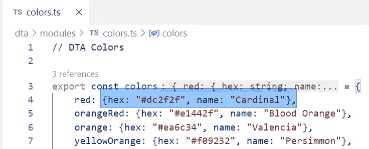
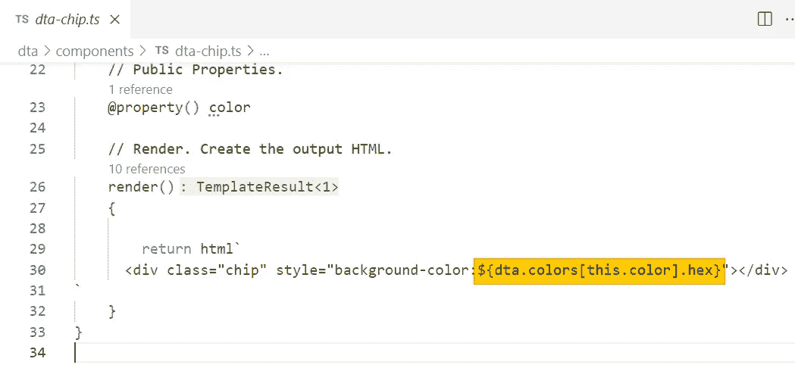

# 使用 Web 组件学习 Typescript:第 3 部分

> 原文：<https://levelup.gitconnected.com/learning-typescript-with-web-components-part-3-a599c8d26213>

# 第 3 部分:使用 JSON 对象

> 到目前为止，在这个系列中，我们已经看到了数据绑定，将数据存储在对象中，并用数组对其进行映射。在这一集里，我们将看看如何切分*Typescript 对象中的数据，以及如何编写和调用在内部处理对象的函数。*

**快速索引** 第 1 部分:[属性，值，&数据绑定](/learning-typescript-with-web-components-lit-4f38fae47e27)
第 2 部分:[使用数组](/learning-typescript-with-web-components-part-2-9798ec0b67e2)
第 3 部分:[使用 JSON 对象](/learning-typescript-with-web-components-part-3-a599c8d26213)

# 函数内部太暗，无法阅读

如果你一直和我们在一起，你会听到我以前说过，一切都是物体。我们稍后将再次讨论这个想法，但是对于这个讨论的大部分，我们将讨论 JSON 对象——在一个键下保存数据值的对象。

美国著名诗人、《草叶集》的作者沃尔特·惠特曼曾说过:“除了狗，书是一个人最好的朋友。在狗的肚子里，太暗了，没法看书。”

在第 2 部分中，我们使用了一个对象来存储通用调色板的颜色。然后我们用一个键从那个对象中调用值，这个键就是，本身，**变量**。这部分很重要。

这里定义的常量**颜色**…

…可以使用我们模型中的任何变量通过键进行访问。这里，是这个颜色。

我们会经常用到这种技术，因为在函数内部，我们通常会对一个变量值进行操作。从外部传入的东西，一个 [**参数**](https://en.wikipedia.org/wiki/Parameter_(computer_programming)) ，就变成了变量的值。在我们之前的例子中，那是`color=`属性。保持这种想法…

# 将对象添加到对象

前面，我们看了如何遍历或 [**迭代**](https://en.wikipedia.org/wiki/Iteration) 数组中的键，以从相应的对象键中获取值。让我们扩展我们的模型，为颜色添加名称。这将需要重新思考架构。

JSON 对象中的每个键只能有一个值。但是，该值可以是一个在自己的键下有多个值的对象！这使我们能够将每种颜色重新定义为一个对象，而不仅仅是一个十六进制值。

将红色重新定义为一个对象让我们在其中存储两个值，每个值都有自己的键。

这里我把每种颜色都改成了两个值，一个在`hex`下面，一个在`name`下面。每当我们改变模型时，我们也需要改变视图，所以让我们更新`dta-chip.ts`:

我们可以得到十六进制颜色，但那真的很丑！有更好的方法…

在迈克尔·克莱顿的**球体**中，科学家们在深海中发现了一个来自未来的结构中的结构——它似乎是在过去被放置在那里的！这很像处理对象。

因此，要获得“三层深度”并找到实际的十六进制值，我们现在必须编写一个又长又讨厌的访问器。在伪代码中，我们可以说我们:

1.  从`dta.colors`中取出对象，即`this.color`键的值。
2.  从中返回`hex`键的值。

这不是史上最烂的存取器，但却是 [**码闻**](https://en.wikipedia.org/wiki/Code_smell) 的例子。这是一个早期警告，表明这段代码以后可能会有问题。在这里，问题在于步骤的复杂性。实际上，它们构成了一个“配方”，我们可以用这个想法将它们重构为一个函数。

# 有不止一种方法…

在编程中，总是有不止一种方法可以实现同样的事情。最好的开始是对你来说最容易推理的。然后，你可以将****重构成更好的东西。让我们来看看将“获取颜色的十六进制值”的方法转移到函数中的几种方法。****

# ****使用函数对象****

****在 Typescript 中，另一种主要类型的对象(除了我们已经存储的 JSON 数据)是一个 **function** 对象。函数和所有其他对象的区别在于函数**做一些事情**。****

****JSON 数据不“做”任何事情。它像一个粮仓一样坐在那里，等着你把小麦放进去，又把它拿出来。功能是*执行者*，它们遵循我们的食谱。在第 2 部分中，我们看了当我们在一个数组上`map()`时“做某事”的*箭头函数*。****

****在这种情况下，我们需要一个独立的**函数，这样我们就可以从任何组件应用它的配方。你可能已经注意到我们已经写了几个像`map()`这样以括号结尾的函数调用。这就是你(和 Typescript)区分 JSON 数据对象和函数对象的方式。数据不以父母结尾。函数有。******

********

****在第 44 行，我们只访问数据。对象后没有父对象。第 45 行是一个**函数调用**，圆括号中有一个参数。(相同的)结果显示在每个结果的右侧。****

****这里我们可以看到从模型中访问数据(第 44 行)和**运行**或**调用**一个带参数的函数(第 45 行)之间的语法差异。在我们的特定模型中，有两种获取相同(固定)数据的方式。****

****我们如何调用一个函数从一个**变量**键中获得一个十六进制值？在`dta-chip.ts`中，让我们用对一个新函数`dta.getColor(thisColor)`的调用来替换背景色`dta.colors[this.color].hex`，这个函数我们还没有定义。****

********

******重构**背景色使用一个我们还没写的函数。****

# ****定义和导出函数****

****让我们写函数定义。最理想的地方是我们已经做好并进口的`colors.ts`模块。如果我们`export`了函数定义，它将可用我们导入它。食谱如下:****

1.  ****给定一种颜色(键)…****
2.  ****从我们现有的颜色对象中返回它的十六进制值。****

********

****我们黄色的新函数引入了一个颜色键(蓝色)。在第 31 行，它从同一个键返回**DTA . colors****hex**值。****

****为了从我们的模型中访问`dta.colors`对象，我们需要在第 4 行`import`它(或者模块加载器)。****

> ****这个截屏还展示了一个 VSCode 技巧…你可以用第 6 行的`>`右角符号折叠一大段代码(比如`export const colors`)。****

# ****定义和使用参数值****

****我们配方的第一行说我们“被给了一个颜色键”我们得到的任何东西都变成了参数。在第 29 行，我们定义了在函数中使用的参数名称**。这个名字在任何其他上下文中都没有意义。它只适用于这个食谱。这段代码表示参数名为`color`。******

****当我们稍后在配方的第 31 行访问同一个`color`变量时，我们会得到一个特定函数调用传入的任何值。所以如果我们用`getColor(“green”)`调用这个函数，我们会得到`dta.colors[green].hex`。****

# ****今日回报****

****Typescript 函数可以**返回**一个值，尽管这不是必需的。如果一个函数有一个类似于第 31 行的`return`语句，那么无论返回什么，都将成为替代使用它的函数调用的值。另一种说法是，返回值*替换代码中相同位置的函数调用*。****

********

****第 45 行的**函数调用**的返回值被绑定到 **< div >** 的内容。****

****最终结果是，我们新的`getColor`函数将接收一个键并返回我们需要的十六进制颜色，从而正确地插入我们放在芯片上的`background-color`值。这里再次供参考:****

********

****用这个组件的颜色属性作为参数调用我们的新函数。****

****浏览器“看到”背景色属性，就好像只有函数的**返回值**存在一样。函数本身不会出现在任何地方。如果我们看看我们的产量，它应该是不变的！****

********

****一次成功的重构的结果应该是…什么都没有！****

****现有代码的成功重构或改进(相对于新特性)应该不会对现有输出产生**变化**。换句话说，这种获取十六进制代码的新方法应该和旧方法完全一样。在引擎盖下，我们为每种颜色添加了一个新的`name`(一个新特性)，所以让我们把它添加到视图中。****

# ****从模型中添加新数据****

****为了得到我们模型中现在的颜色名称，让我们在`colors.ts`中写另一个函数。****

********

****新的 **getName** 函数采用相同的颜色键并返回名称。****

****我可以通过调用我的新函数来访问组件视图中的名称。在这里，我把它放在了芯片内部的一个`
`里面。****

********

****通过调用我们的新函数，添加一个 **< div >** 来显示颜色名称。****

# ****把它放在线上！****

****通过芯片组件上的一些 CSS，我可以显示芯片内部的颜色名称。****

********

****下面不太完美的渲染是由 **dta-chip.ts** 中的这个 CSS 带给你的。****

********

****我还更新了 **< dta-page >** 组件，通过引用 **Pages** 常量中单词“palette”样式中的 **dta.getColor('seaGreen')** 来使用我的自定义颜色之一。****

****这个例子也演示了在你的输出中的其他地方使用颜色，比如我在这里应用了`dta.getColor(“seaGreen”)`的单词*调色板*。****

# ****这么多功能****

****看起来好像我们在为简单的事情创造很多功能。毕竟，我们已经有了两个函数，只是为了从同一个对象中得到两个不同的东西。这引出了你的建筑设计中的一个重点。只有你知道有多少功能是太多了，只有你能决定什么时候你应该重构到一个更好的方法来完成同样的事情。在我继续之前，让我们想一想这种设计可以改变的几种方式:****

1.  ****根据参数的不同，单个函数可以返回名称或十六进制值。****
2.  ****一个简单的函数可以返回在关键位置的颜色对象，并让我们把我们需要的关键点去掉。****
3.  ****我们可以在需要时直接访问`dta.colors`,尽管需要多层密钥。****

****这些比我们现在拥有的更吸引你吗？当你完成自己的设计时，你可以自由地思考它或编写代码。****

****如果你决定重构你的代码，在你添加新的特性之前，首先在输出中实现**无变化**来证明你的重构是有效的。到目前为止，我们的代码可以用这些方法中的任何一种(以及其他几种)进行重构，而不会改变输出。选择你最容易理解的设计。****

********

****校舍摇滚的[连词连词](https://www.youtube.com/watch?v=4AyjKgz9tKg)问:“你的功能是什么？”答案？"连接单词、短语和从句."虽然这不是编程中函数的精确定义，但也不远了！****

# ****创建渐变组件****

****让我们看看是否能在调色板之外构建一些更高级的东西。作为使用对象的一个练习，让我们构建一个渐变组件，显示我们传递给它的两个颜色键之间的颜色范围。像往常一样，在编写组件的功能之前，我将编写我希望如何使用组件的代码。****

********

****添加一个 **< dta 渐变>** 我想要的开始和结束颜色。****

****在我的新`dta-gradient.ts`文件中，我需要添加两个属性，它们将从这两个属性中接收数据。****

********

****创建一个 **dta-gradient** 组件，并向其添加与我传递的属性相匹配的属性。****

****在我的`<dta-gradient>`元素中，我只想传递`start=`和`end=`的颜色**键**。但是要绘制梯度，我需要更深入地挖掘并获得十六进制值。让我们看看如何“挖掘”一个对象，从它的值中创建变量。****

********

****很少有人知道玛雅金字塔，比如位于科巴的这座，大多是在废墟中发现的。正面是通过猜测重建的。背面，一点也不！有了 TS 中的析构，你可以分解复杂的对象，而不会丢失部件的轨迹。****

# ****解构对象****

********

****这里，键名**名**(黄色)将进入名为 **startName** (绿色)的变量。它的值将是键 **this.start(蓝色)**处的颜色对象。****

****这段代码看起来可能很奇怪，但是它展示了 Typescript 最强大的特性之一: [**析构赋值**](https://developer.mozilla.org/en-US/docs/Web/JavaScript/Reference/Operators/Destructuring_assignment) 。这听起来有点拗口，就像这段代码一样，但实际上它非常简单而强大。****

****传入 start 和 end 键后，我希望将每个键的名称和十六进制颜色放入单独的变量中。但是，这些都在每个颜色对象中的相同键上！换句话说，开始和结束十六进制颜色都在`hex`键下。****

****在一个析构任务中，我告诉 Typescript 如何分解它。第 30 行表示获取名为`name`的键并将其赋给名为`startName`的新变量，获取键`hex`并将其赋给新变量`startHex`。“那个钥匙叫`name`关**关*什么*关**关？，你可能会问。”而答案在赋值语句的另一边，在`=`等号后面。****

****通过将右侧的`dta.colors[this.start]`赋值给左侧的析构参数，我们告诉 TS 在`dta.colors[this.start]`处获取**对象**，并按照我们所描述的方式对其进行划分。第 31 行以同样的方式处理结束值。****

****下面是相同的[赋值](https://en.wikipedia.org/wiki/Assignment_(computer_science))语句在没有析构的情况下的样子:****

********

****这是完全可以接受的，但是比析构时间长，出错的机会多。你打电话。****

****这两个都是 Igor 的 ***配方，但是析构是一种更紧凑的形式，具有更少的重复文本和更少的出错机会。这提出了 Typescript 中的一个重要原则。通常，最短的代码是最好的，因为每段代码都有潜在的错误——甚至是简单的打字错误或顺序错误，很难发现。任何时候，只要我们能构思出代码更少的设计，就能减少可能出错的代码。最终，Typescript 是给人类阅读的(计算机使用[机器语言](https://en.wikipedia.org/wiki/Machine_code))，所以编写你最容易阅读和推理的代码。*******

****如果我们不需要给变量起一个新名字，我们可以写一个更短的对象析构版本:****

********

****要创建与对象键同名的变量，只需析构你想要的键。****

****如果我们只写键名，我们就创建了一个同名的变量。您可以根据需要从对象中获取任意数量的关键点。只有当你想为新变量取一个不同的名字时，才需要使用`:newName`语法(见第 30–31 行)。析构还有许多其他强大的特性，我们将在另一篇文章中探讨。****

********

****今天，埃菲尔铁塔的客人们乘坐的是由 [Elisha Otis](https://en.wikipedia.org/wiki/Elisha_Otis) 为 1899 年世界博览会[开幕式设计的电梯](https://en.wikipedia.org/wiki/Exposition_Universelle_(1889))。令人惊讶的是，这些漂亮的汽车在弯曲、倾斜的轨道上行驶。CSS 也能够在 web 组件设计中承担一些重要的“重担”。****

# ****让 CSS 来做繁重的工作****

****CSS 拥有惊人数量的能力。其中一个是渐变，MDN 有一个[很棒的介绍](https://developer.mozilla.org/en-US/docs/Web/CSS/CSS_Images/Using_CSS_gradients)。****

****让我们的新渐变组件输出两个色卡——起始色和结束色。在两者之间，我们将绘制渐变框。****

********

****顶部和底部的 **< dta-chip >** 元素(黄色)具有**开始**和**结束**属性。中间的 **<格>** 从 **${startHex}** 和 **${endHex}** (蓝色)绘制渐变。****

****我们需要开始和结束键(芯片)和十六进制值(梯度)。多亏了析构赋值，我们可以插入这些变量。渐变本身是相当容易阅读的，即使我们不知道 CSS。****

****易于阅读是析构的另一个好处(通常也是好的命名)。我们可能不知道第 35 行 CSS 渐变中参数的顺序，但我们可以阅读`${startHex}`并知道它代表什么。****

****这个新组件的一半是**我们的另一个组件**，被重用。目的从名字就很明显:`<dta-chip>`。对人类来说，阅读`${startHex}`和`<dta-chip>`比阅读它们所代表的代码更容易。随着你的程序变得越来越复杂，这种想法会变得更加有益。****

********

****通过一点 CSS，开始和结束芯片之间的渐变会呈现得很好。****

# ****而且还管用！****

********

****我们的渐变和调色板组件使用相同的 **dta.colors** 对象，并且都呈现了我们的自定义 **< dta-chip >** 的多个实例。****

****我可以通过在`dta-page.ts`中添加那个键和一些内容，将这个渐变重构为一个`palette`页面。内容只是我的新渐变组件的几个实例！然后，我可以在浏览器中单独访问该页面。****

********

****添加带有三种渐变的新调色板页面。****

********

****使用 **/palette** URL 访问浏览器中的调色板页面，显示代码中定义的三种渐变。****

# ****那都是乡亲们！****

****那么，我们取得了什么成就？在本系列中，我们已经看到了用 web 组件学习 Typescript 的几种方法。所有这些都是围绕首先设计数据模型(JSON 对象和数组的组合)的思想构建的。然后，我们传递带有属性的模型部分，以从组件视图内部访问数据。通过在 Typescript 和 Lit 中组合数组和对象的特殊属性，我们可以用最少的重复代码创建复杂的 UI 元素集。最后，我们可以在这些组件的内部和外部定义自定义函数，使我们的代码更容易阅读和调试。****

****下次见，感谢阅读！****

*****— D*****

## ****分级编码****

****感谢您成为我们社区的一员！更多内容见[级编码出版物](https://levelup.gitconnected.com/)。
跟随: [Twitter](https://twitter.com/gitconnected) ， [LinkedIn](https://www.linkedin.com/company/gitconnected) ，[迅](https://newsletter.levelup.dev/)
升一级就是转型科技招聘👉 [**加入我们的人才集体**](https://jobs.levelup.dev/talent/welcome?referral=true)****