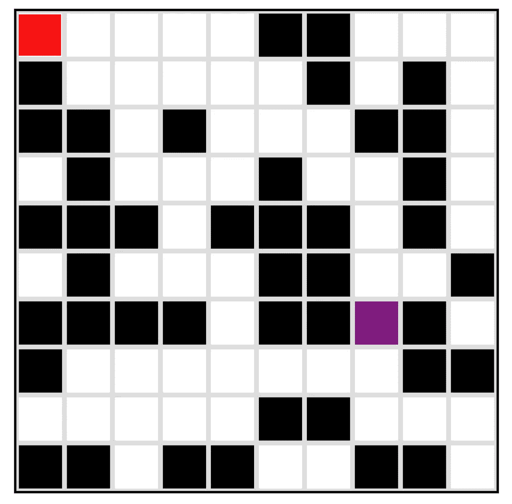
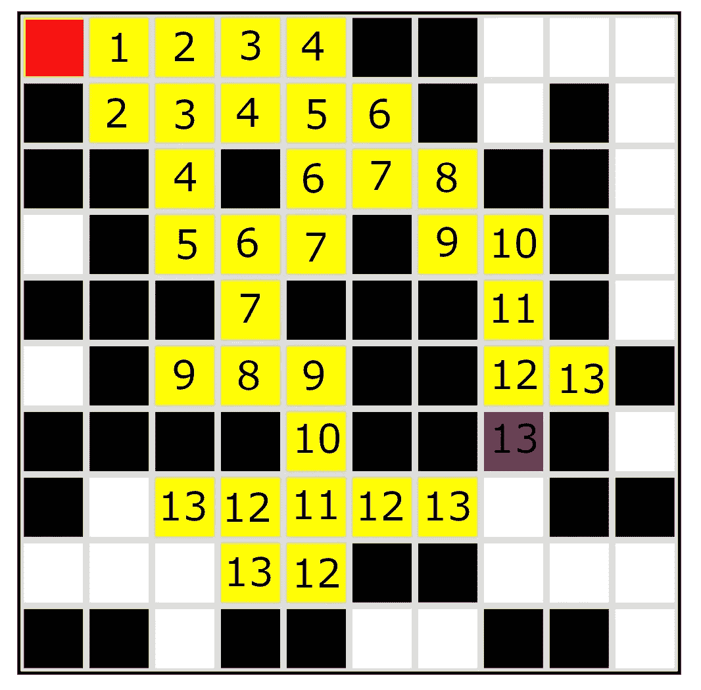

# Lee 算法—类型脚本

> 原文：<https://levelup.gitconnected.com/lee-algorithm-typescript-b68df0a147c0>

Lee 算法最受欢迎的应用是解决最佳二进制迷宫搜索。这是一种广度优先搜索，通常用于矩阵搜索。

想象你有一个迷宫，看起来像这样:



红色是起点，紫色是终点，你的任务是找到到达终点的最短路线。

矩阵通常表现为类似这样的二元迷宫:

```
var maze:number[][] = [[ 1, 1, 1, 1, 1, 0, 0, 1, 1, 1 ],[ 0, 1, 1, 1, 1, 1, 0, 1, 0, 1 ],[ 0, 0, 1, 0, 1, 1, 1, 0, 0, 1 ],[ 1, 0, 1, 1, 1, 0, 1, 1, 0, 1 ],[ 0, 0, 0, 1, 0, 0, 0, 1, 0, 1 ],[ 1, 0, 1, 1, 1, 0, 0, 1, 1, 0 ],[ 0, 0, 0, 0, 1, 0, 0, 11, 0, 1 ],[ 0, 1, 1, 1, 1, 1, 1, 1, 0, 0 ],[ 1, 1, 1, 1, 1, 0, 0, 1, 1, 1 ],[ 0, 0, 1, 0, 0, 1, 1, 0, 0, 1 ]];
```

你会注意到终点标记为 11。这里有许多方法可以达到最终目标，其中一些比 Lee 更有效，但是 Lee 是完成工作最明显和最彻底的方法。

# 我们开始吧。

如果您想查看代码，请随意浏览:

[https://github.com/Clashbuster/lee-algorithm](https://github.com/Clashbuster/lee-algorithm)

算法的核心功能就在这里:

```
function LeesAlgorithm(position:number[], distance:number = 0){ distance += 1 visited[position[0]][position[1]] = true //pushes executable into queue after a bunch of checks for an orthogonal direction if(exists([position[0] + 1, position[1]])){    if( visited[position[0] +1][position[1]] === false){ if(maze[position[0] +1][position[1]] === 1){ visited[position[0] +1][position[1]] = distance queue.push(executable([position[0] + 1, position[1]], distance)) } else if(maze[position[0] +1][position[1]] === 9){ toggle = false console.log(distance) } }}//pushes executable into queue after a bunch of checks for an orthogonal directionif(exists([position[0] - 1, position[1]])){ if( visited[position[0] -1][position[1]] === false){ if(maze[position[0] -1][position[1]] === 1){ visited[position[0] -1][position[1]] = distance queue.push(executable([position[0] - 1, position[1]], distance)) } else if(maze[position[0] -1][position[1]] === 9){ toggle = false console.log(distance) } }}//pushes executable into queue after a bunch of checks for an orthogonal directionif(exists([position[0] , position[1]+1])){ if( visited[position[0]][position[1]+1] === false){ if(maze[position[0]][position[1]+1] === 1){ visited[position[0]][position[1]+1] = distance queue.push(executable([position[0] , position[1]+1], distance)) } else if(maze[position[0]][position[1]+1] === 9){ toggle = false console.log(distance) } }}//pushes executable into queue after a bunch of checks for an orthogonal directionif(exists([position[0] , position[1]-1])){ if( visited[position[0]][position[1]-1] === false){ if(maze[position[0]][position[1]-1] === 1){ visited[position[0]][position[1]-1] = distance queue.push(executable([position[0] , position[1]-1], distance)) } else if(maze[position[0]][position[1]-1] === 9){ toggle = false console.log(distance)    } }}}
```

为了使该算法工作，您必须从起点开始，用当前距离标记所有有效的相邻位置，并将当前位置标记为已访问。然后，移动到那些有效的相邻位置，做完全相同的事情。冲洗并重复，直到找到终点。

为了防止这变成深度优先搜索，并使最短路径总是首先到达终点，我使用了承诺队列。

像这样:

```
const executable = (position:number[], distance:number) => { return () => { LeesAlgorithm(position, distance) }}//seed the executable queuequeue.push(executable([0,0], 0))//until we find 9, repeatedly pull from the executable queue and execute the lee's algorithm functionwhile(toggle){ queue.shift()()}
```

这里发生了两件事。首先，我承诺。当 leesAlgorithm 函数找到一个有效的相邻位置时，它使用当前距离和要执行的位置调用 executable。

要执行的当前距离和位置被传递到另一个 leesalgiothm 调用中，但它直到稍后才真正执行 leesalgiothm。

这是函数找到有效邻接时执行的代码行:

```
queue.push(executable([position[0] , position[1]-1], distance))
```

这是将承诺推入队列，因为我希望承诺以特定的顺序进行评估。如果函数以不受控制的顺序执行，算法将在迷宫中穿行，而不考虑其他路径，这是我们希望避免的，因为我们应该找到最佳路径。

队列是一种数据结构，它将项目放在后面，但总是从前面移除项目，就像在 DMV 排队一样。

我正在指示我的算法以完全相同的方式执行我的 leesAlgorithm 调用。通过这种方式，我的程序将总是在进入迷宫之前执行所有相邻的调用。

因此，随着迷宫越走越深，算法会进行越来越多的调用，所以如果这是一个巨大的迷宫，我们肯定会看到一些减速。

这张图片不仅展示了我的程序正在研究的路径，还展示了程序正在进行的操作的一般顺序。



最后，一旦我的 leesAlgorithm 函数检测到终点，它就中断循环并抛出一个 console.log(路径的)。在这种情况下，答案是 13。

好了，这就是我今天的全部时间。

很快我将发布一个博客，对什么是队列有更深入的了解。

可视化是使用用户友好的渲染引擎 ruby 2d 实现的。