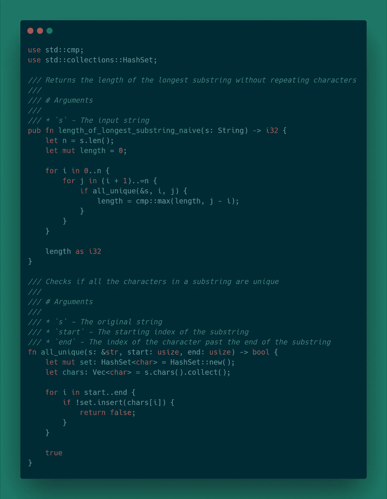
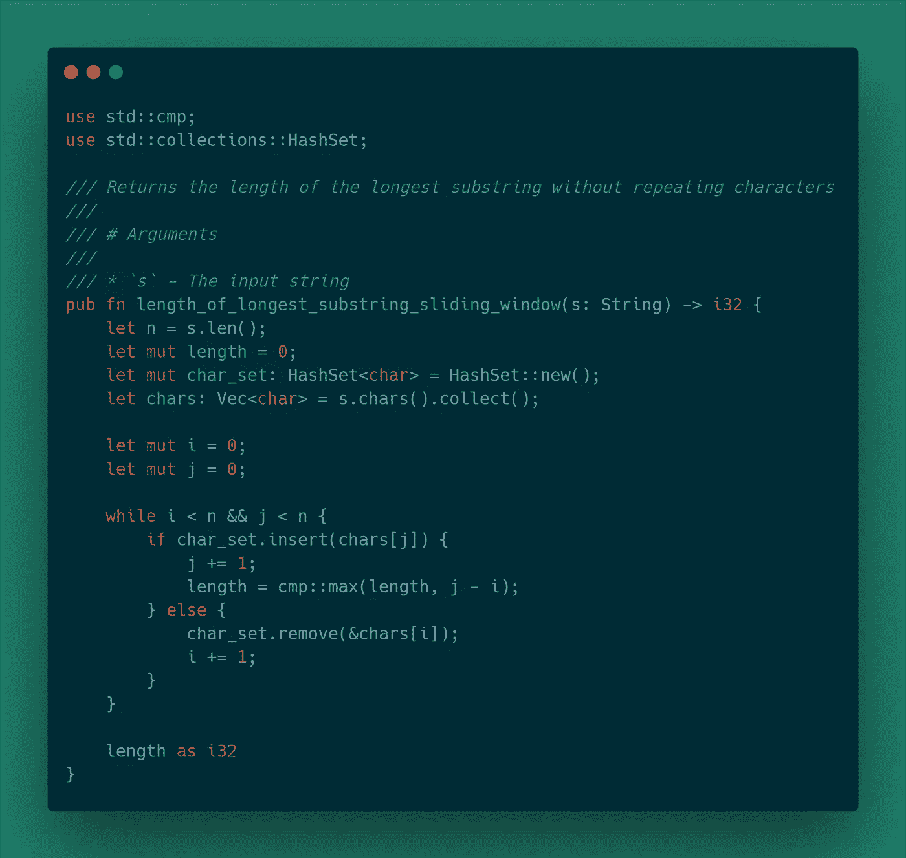
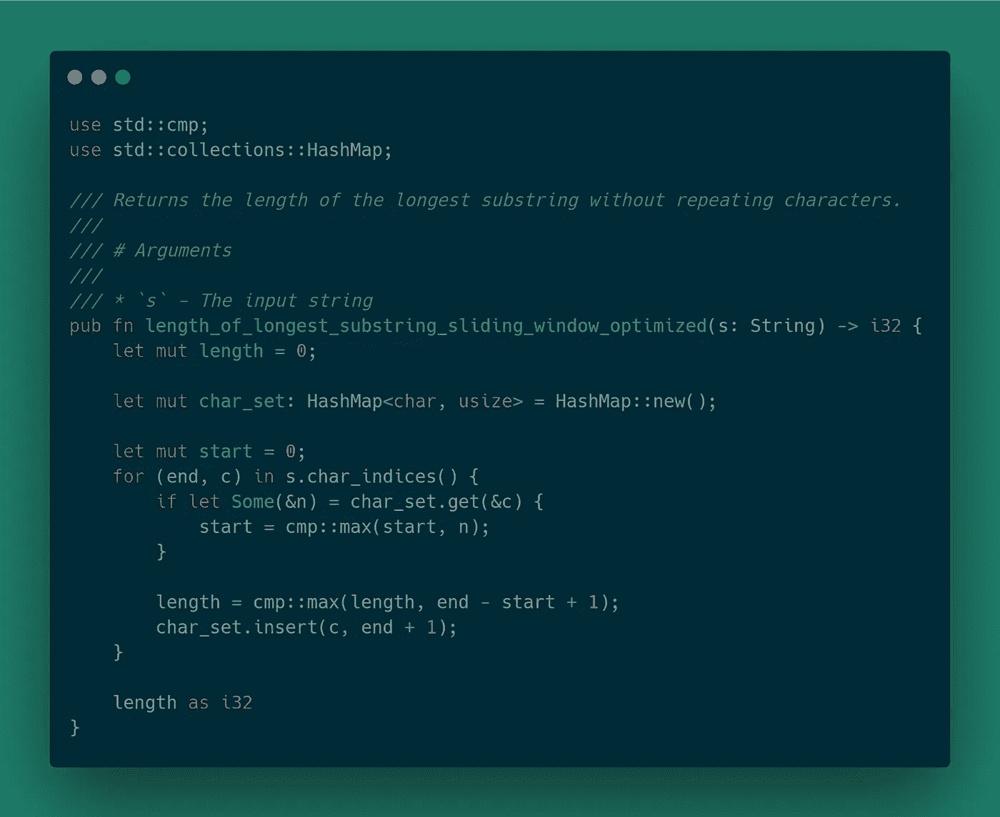

# 带 Rust 的 LeetCode:没有重复字符的最长子字符串

> 原文：<https://levelup.gitconnected.com/leetcode-longest-substring-without-repeating-characters-6d15c267582>


锈病的 LeetCode 问题

# 问题

给定一个字符串，找出没有重复字符的最长子字符串的长度。

# 例子

## 示例 1

```
Input: "abcabcbb" 
Output: 3 
Explanation: The answer is "abc", with the length of 3.
```

## 示例 2

```
Input: "bbbbb" 
Output: 1 
Explanation: The answer is "b", with the length of 1.
```

## 示例 3

```
Input: "pwwkew" 
Output: 3 
Explanation: The answer is "wke", with the length of 3\. Note that the answer must be a sub-string, "pwke" is a sub-sequence and not a sub-string.
```

# 关于生锈的弦的一个注记

需要注意的一点是，由于 utf-8 编码带来的问题，Rust 没有实现传统的字符串索引。有几种方法可以从字符串中提取字符，但是我将把输入字符串转换成字符向量。这是一个有趣的话题，但超出了本文的范围。

# 方法 1:暴力

这个问题的一个简单的解决方案是遍历每个可能的子串，并跟踪到目前为止看到的最长子串的长度。

# 算法

这种方法可以分为两个功能。一个函数应该处理子串的迭代并跟踪最长子串的长度。另一个函数应该处理唯一性检查。

## 子串迭代算法

为了遍历子字符串，这种方法使用了两个循环。外部循环从`i`迭代到`n`，其中`n`是输入字符串的长度。内部循环从`i` + 1 到`n`进行迭代。

算法看起来是这样的:

```
initialize n to length of string
initialize length to 0
for i = 0 to n
    for j = i + 1 to n + 1
        if sub-string of characters between i and j are unique
            update length if j - i is greater than current length
return length
```

## 所有独特的算法

为了检查子字符串中的字符是否都是唯一的，这个函数会将每个字符添加到一个集合中。如果发现重复字符，该函数将返回 false，否则将返回 true。

这个算法看起来像这样:

```
initialize a HashSet of char
initialize a vector of chars
for i = start to end
    if the char exists in the set
        return false
    else 
        add char to set
return true
```

# 履行



# 复杂性

*   时间复杂度:O(n^3)

> 迭代每个子串需要 O(n^2)
> 
> 对于每个子串，我们检查唯一性，这需要 O(n)
> 
> 这给出了 O(n^3 的总数)

*   空间复杂度:O(2 * min(m，n))其中 m 是字符集，n 是字符串长度

> 该集合将需要 O(min(m，n))
> 
> char 向量将取 O(n)

# 方法 2:滑动窗口

天真的方法可以以一种非常重要的方式进行优化。

最大的问题是迭代子串需要 O(n ^ 2)时间。这可以通过使用滑动窗口方法来改善。

滑动窗口方法使用 HashSet 来跟踪由起始和结束索引限定的字符范围。该算法将尝试向集合中添加字符。如果字符添加成功，子字符串右边界将向右移动。如果该字符已经存在于集合中，那么在左边界的索引处的字符被移除，并且左边界被右移。这种移位会一直发生，直到处理完整个字符串。

# 算法

```
initialize n as the length of the string
initialize length as 0
initialize char_set to empty set
initialize chars as vector of characters in string
initialize indexes i and j to 0while i and j are less than n
    if chars[j] does not exist in char_set
        add chars[j] to char_set
        increment j
        update length if new length is greater
    else
        remove chars[i] from chars_set
        increment ireturn length
```

# 履行



# 复杂性

*   时间复杂度:O(2n) => O(n)
*   空间复杂度:O(2 * min(m，n))其中 m 是字符集，n 是字符串长度

> 该集合将需要 O(min(m，n))
> 
> char 向量将取 O(n)

# 方法 3:滑动窗口优化

滑动窗口方法可以进一步优化。

可以使用散列表来跟踪字符和字符的索引，而不是使用散列表。如果发现重复，则左边界可以跳到正确的索引，而不是递增地向右移位。

# 算法

```
initialize length to 0
initialize char_map as an empty HashMap
initialize start to 0for index, character in the characters of s
    if the character is in char_set
        update `start` if the character's index is greater update length if end - start + 1 is greater
    insert character and end + 1 into the HashMapreturn length
```

# 履行



# 复杂性

*   时间复杂度:O(n)
*   空间复杂度:O(min(m，n))其中`n`是字符串长度，`m`是字符集。

# 回顾

与简单的方法相比，滑动窗口方法是解决此类问题的更好的方法。在[媒体](https://medium.com/outco/how-to-solve-sliding-window-problems-28d67601a66)上有一篇很棒的文章专门报道了滑动窗口问题。这个问题的源代码可以在我的 [GitHub](https://github.com/andrewleverette/leetcode_problems/blob/master/longest_substring_without_repeating_characters/src/lib.rs) 上找到。

# 谢谢

感谢阅读！如果您想联系我或想提供反馈，请随时通过 LinkedIn 联系我。

*原载于 2020 年 6 月 5 日*[*https://andrewleverette . github . io*](https://andrewleverette.github.io/longest-substring-without-repeating-characters/)*。*

