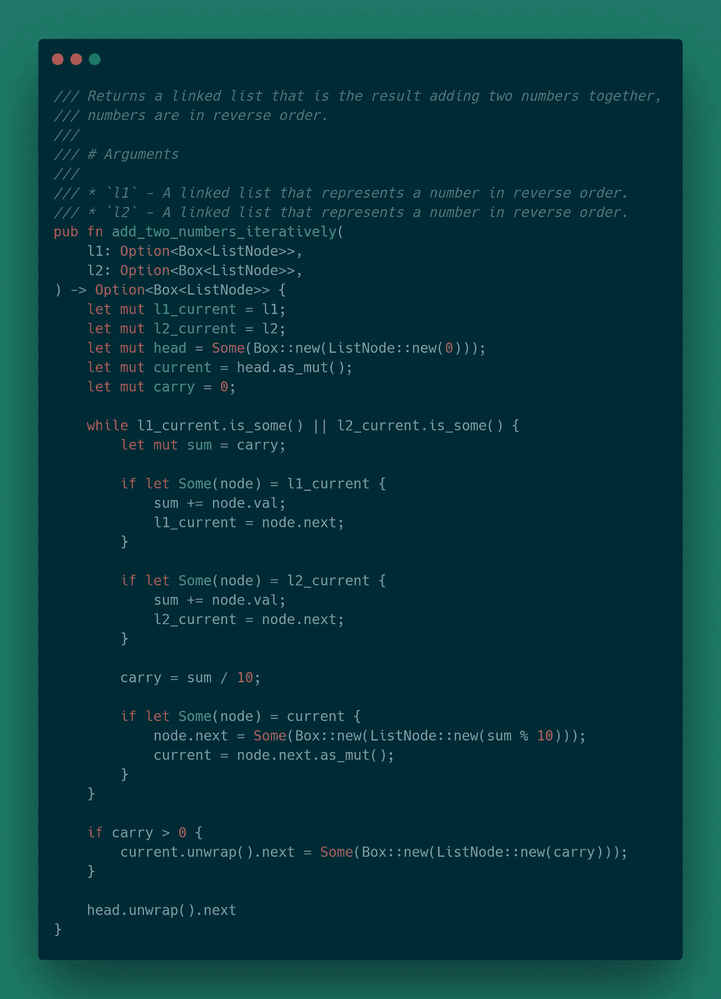
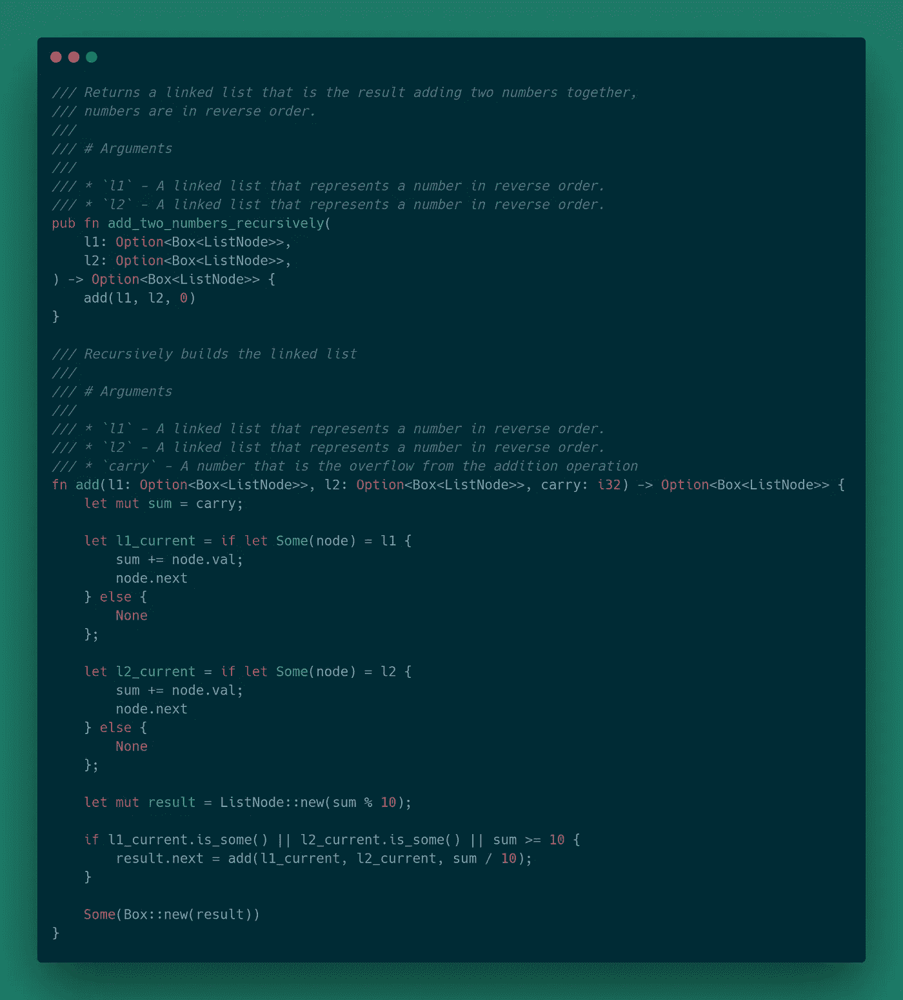

# 锈病的 LeetCode 问题:添加两个数字

> 原文：<https://levelup.gitconnected.com/leetcode-problems-add-two-numbers-6a4045ce146c>


# 问题

给你两个非空链表，代表两个非负整数。这些数字以相反的顺序存储，并且它们的每个节点都包含一个数字。将两个数相加，并以链表的形式返回。

您可以假设这两个数字不包含任何前导零，除了数字 0 本身。

# 例子

```
Input: (2 -> 4 -> 3) + (5 -> 6 -> 4) 
Output: 7 -> 0 -> 8 
Explanation: 342 + 465 = 807.
```

# 初始设置

在解决这个问题之前，我们需要谈谈数据结构。如果您已经熟悉链表以及如何在 Rust 中实现它们，请随意跳到下一节。

链表是由节点组成的数据结构。一个基本节点包含一个数据字段和对下一个节点的引用。引用充当链接，以便可以从根节点开始按顺序遍历节点。

链表的许多变体超出了本文的范围。如果您想了解更多，这篇[文章](https://en.wikipedia.org/wiki/Linked_list)是一个不错的起点。

在 Rust 中，我们可以使用一个简单的结构来定义我们的链表。我将首先列出代码，然后讨论重要的部分。

结构定义包含两个字段。第一个，`val`非常简单。只是节点包含的数据。第二个领域更有趣。

字段`next`首先被包装在一个`Option`类型中。如果一个节点的`next`字段是`None`，那么这就是链表的结尾。在`Option`型里面，我们用的是`Box`型。`Box`类型是一个智能指针，它允许您在堆上而不是堆栈上存储数据，而没有任何实际的性能开销。在这种情况下，我们用它来存储一个`ListNode`。要更详细地了解智能指针，请看一下 [Rust Book](https://doc.rust-lang.org/book/ch15-00-smart-pointers.html) 。

实现块中的`new`函数相当简单。传入一个值，并返回一个包含该值的`ListNode`和`next`字段的默认值`None`。

现在我们已经建立了数据结构，我们可以继续实际解决问题。

# 方法 1:迭代

解决这个问题的一种方法是迭代两个链表，并将两个节点值相加。如果两个值之和大于或等于 10，则有一个进位值被加到下一次迭代的和中。如果一个链表在另一个之前到达末尾，那么我们可以忽略它，直到另一个也完成。

# 算法

```
initialize values `l1_current` and `l2_current` as the root of their respective linked listscreate a dummy node that will be the root of the resulting linked listinitialize `current` node to the dummy nodeinitialize `carry` to 0while `l1_current` or `l2_current` contain nodes initialize sum to the carry of the previous operation if `l1_current` contains a node
        add the node value to sum
        set `l1_current` to its `next` value if `l2_current` contains a node
        add the node value to sum
        set `l2_current` to its `next` value set `carry` to `sum` / 10 (floor division) create new node with value of `sum` mod 10 (modulo division) set `current.next` to the new node set `current` to `current.next`if `carry` is not zero
    create a new node with the value of `carry`
    set `current.next` to the new nodereturn the next value of the dummy node
```

# 履行



# 复杂性

*   时间复杂度:O(max(m，n))其中`m`是`l1`中的节点数，`n`是`l2`中的节点数
*   空间复杂度:O(max(m，n))，因为我们要创建一个新的链表来返回

# 方法 2:递归

解决这个问题的另一种方法是使用递归。这种方法的逻辑与迭代方法相同，只是它递归地将下一个数字添加到链表中。好处是代码看起来更整洁，但是缺点是由于递归函数调用而增加了空间需求。

# 算法

```
initialize sum to the value of carry from the previous recursive callif `l1` contains a node
    add node value to sum
    advance `l1` to `l1.next1`if `l2` contains a node
    add node value to sum
    advance `l2` to `l2.next`create a new node `result` with the value of sum mod 10 (modulo division)if `l1` or `l2` contain a node or sum is greater then or equal to 10
    set `result.next` to the return value of the recursive functionreturn result
```

# 履行



# 复杂性

*   时间复杂度:O(max(m，n))，其中`m`是`l1`中的节点数，`n`是`l2`中的节点数
*   空间复杂度:O(max(m，n))，因为我们要创建一个新的链表来返回

# 回顾

在这种情况下，我更喜欢迭代方法而不是递归方法。显然，递归是一个非常强大的编程特性，但对于这个问题，它带来了更多的资源开销，而没有任何时间改进。随意看一下[源代码](https://github.com/andrewleverette/leetcode_problems/blob/master/add_two_numbers/src/lib.rs)。

*原载于 2020 年 4 月 28 日*[*https://andrewleverette . github . io*](https://andrewleverette.github.io/add-two-numbers/)*。*

[](https://skilled.dev) [## 编写面试问题

### 掌握编码面试的过程

技术开发](https://skilled.dev)