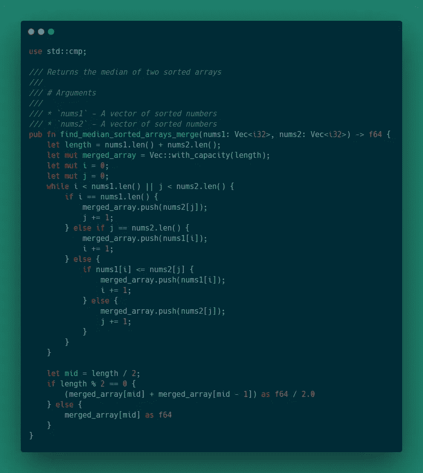
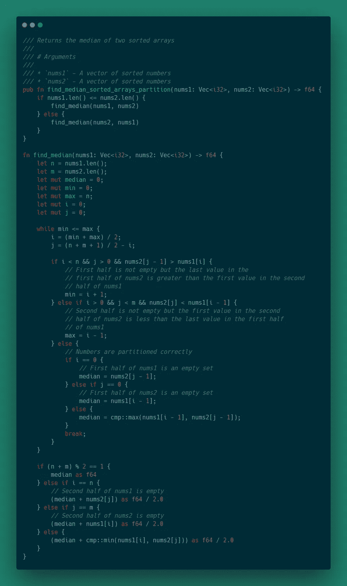

# Rust 的 LeetCode 问题:两个排序数组的中值

> 原文：<https://levelup.gitconnected.com/leetcode-problems-median-of-two-sorted-arrays-9e72f9186b93>


# 问题陈述

有两个大小分别为`n`和`m`的排序数组`nums1`和`nums2`。求两个排序数组的中间值。你可能认为`nums1`和`nums2`不能都为空。

# 例子

## 示例 1

```
nums1 = [1, 3] nums2 = [2] The median is 2.0
```

## 示例 2

```
nums1 = [1, 2] nums2 = [3, 4] The median is (2 + 3)/2 = 2.5
```

# 方法 1:合并数组

由于两个输入数组都已经排序，一个简单的解决方案是通过遍历每个数组并将条目插入一个新数组来合并数组。然后计算中位数。

## 算法

```
initialize i and j to 0
initialize length of new array to the sum of the length the input arrays
initialize an empty arraywhile i is less then length of nums1 or j is less than length of nums2
    if all elements from nums1 have been merged
        merge element nums2[j]
        increment j
    else if all elements from nums2 have been merged
        merge element nums1[i]
        increment i
    else
        if element nums1[i] <= element nums2[j]
            merge element nums1[i]
            increment i
        else
            merge element nums2[j]
            increment jfind midpoint (length / 2)
if length is even
    return the average of merged_array[mid] and merged_array[mid - 1]
else
    return merged_array[mid]
```

## 履行



## 复杂性

*   时间复杂度:O(m + n) -> O(n)
*   空间复杂度:O(m + n) -> O(n)

# 方法 2:分区

线性运行时还不错，但是如果数组的大小显著增加，就会出现一些性能问题。另一个问题是额外的空间需求。即使我们假设输入数组适合内存，如果数组的大小足够大，合并后的数组也可能不适合。这种方法的目标是减少总的运行时间和额外的空间需求。

最终目标是找到两个排序数组的中间值。中位数有效地将一组数字分成两半。因此，不要把数组看作两个独立的数据集，而是把它们看作一个恰好被分成两部分的数组。那么目标就是找到更大数组的中间。

为此，首先要对两个输入数组进行分区。分区的前半部分将包含输入数组开头的一些元素，后半部分将包含输入数组的其余元素。每个分区应该有相同数量的元素，否则第一个分区将比第二个分区多包含一个元素。一旦分区就位，我们必须调整分区索引，直到前半部分的每个元素都小于或等于后半部分的每个元素。

这里有一个例子。

假设我们有两个输入数组:

```
nums1 = [2, 3]
nums2 = [1, 4, 5]
```

下一步是对阵列进行分区。`nums1`的初始分区索引是`n / 2`，其中`n`是`nums1`的长度。`nums2`的初始分区索引为`(n + m + 1) / 2 - i`，其中`n`为`nums1`的长度，`m`为`nums2`的长度，`i`为`nums1`的分区索引。

初始分区如下所示:

```
i = 1 --> (n / 2) = (2 / 2) 
j = 2 --> (n + m + 1) / 2 - i = (2 + 3 + 1) / 2 - 1 
nums1 = [2    | 3] --> The pipe delimits the partition 
nums2 = [1, 4 | 5]
```

您可能会发现这些值不在正确的分区中。分区的前半部分包含`nums2`中的值 4，分区的后半部分包含`nums1`中的值 3。所以我们需要调整分区索引，直到每个值都在正确的一半。

我们知道值 3 属于第一个分区，所以我们可以将分区索引`i`向右移动，再次执行分区。

```
i = 2 
j = 1 --> (n + m + 1) / 2 - i = (2 + 3 + 1) / 2 - 2 
nums1 = [2, 3 |     ] 
nums2 = [1    | 4, 5]
```

现在所有的值都在正确的分区中。两个分区都包含值，两个数组的总长度都是奇数。这意味着中值是第一个分区的最大值:`max(nums1[i - 1], nums2[j - 1])`。在这个例子中，中位数是 3。

在这个例子中，两个数组的长度都是奇数，但是如果长度是偶数，那么需要计算两个中间值的平均值。例如:

```
i = 2
j = 1
nums1 = [2, 3 |        ] 
nums2 = [1    | 4, 5, 6]
```

本例中的中值是第一个分区中最大值`max(nums1[i - 1], nums2[j - 1])`和第二个分区中最小值`min(nums1[i - 1], nums2[j - 1])`的平均值。

这种方法的一个假设是`nums1`的长度小于`nums2`的长度。如果不实施该假设，那么分区索引`j`可能是负的。一个简单的解决方案是用一个包装函数来检查数组的长度，并将数组以正确的顺序传递给这个函数。

另一个问题是，其中一个输入数组可能是空的，但不是两个都是空的。如果我们假设最短的数组总是`nums1`，那么我们可以在分区索引`i`周围添加约束，这样分区索引永远不会小于 0 或大于`n`。这也意味着我们永远不必直接移动分区索引`i`。A `min`和`max`可以替换。这意味着我们之前的示例将如下所示:

```
Iteration 1 
min = 0
max = n
i = 1 --> (min + max / 2) = (2 / 2)
j = 2 --> (n + m + 1) / 2 - i = (2 + 3 + 1) / 2 - 1
nums1 = [2    | 3] --> The pipe delimits the partition
nums2 = [1, 4 | 5]Iteration 2
min = 2 --> Shifted to the right (i + 1)
max = 2 
i = 2 --> (min + max / 2) = (4 / 2)
j = 1 --> (n + m + 1) / 2 - i = (2 + 3 + 1) / 2 - 2 
nums1 = [2, 3 |        ] 
nums2 = [1    | 4, 5, 6]
```

考虑到所有这些因素，可以推导出一种算法来解决这个问题。

## 算法

```
initialize n to length of nums1
initialize m to length of nums2
initialize median to 0
initialize min and max to 0 and n respectively
initialize i and j to 0while min is less than or equal to max
    set i to the partition index for nums1 - (min + max) / 2
    set j to the partition index for nums2 - (n + m + 1) / 2 - i
    if i < n and j > 0 and nums2[j - 1] > nums1[i]
        set min = i + 1
    else if i > 0 and j < m and nums2[j] > nums1[i - 1]
        set max = i - 1
    else
        if i equals 0
            set median = nums2[j - 1]
        else if j equals 0
            set median = nums1[i - 1]
        else
            set median to the max of nums1[i - 1] and nums2[j - 1]
        breakif the length of nums1 and nums2 is odd
    return median
else if i equals n
    return the average of the median and nums2[j]
else if j equals m
    return the average of the median and nums1[i]
else
    return the average of the median and the max of nums1[i] and nums2[j]
```

## 履行



# 复杂性

*   时间复杂度:O(log(min(n，m)))
*   空间复杂度:O(1)

# 回顾

就解决方案而言，与合并数组相比，对数组进行分区可以提高运行时性能，并显著提高空间效率。随着输入数组大小的增加，O(log(min(n，m)))运行时具有更大的优势。就空间效率而言，只要输入数组能够适合内存，我们就可以有把握地认为我们的解决方案应该按照预期执行。这个问题的源代码可以在我的 GitHub 上找到。

对我来说，解决这个问题的关键是不要太专注于个人细节，而忘记了全局，森林换树木的问题。单个数组很重要，但它们是寻找中位数的更大解决方案的一部分。

# 谢谢

感谢阅读！如果您想联系我或想提供反馈，请随时使用主页或“关于”页面上横幅中的链接与我联系。

*原载于 2020 年 6 月 10 日*[*https://andrewleverette . github . io*](https://andrewleverette.github.io/median-of-two-sorted-arrays/)*。*

