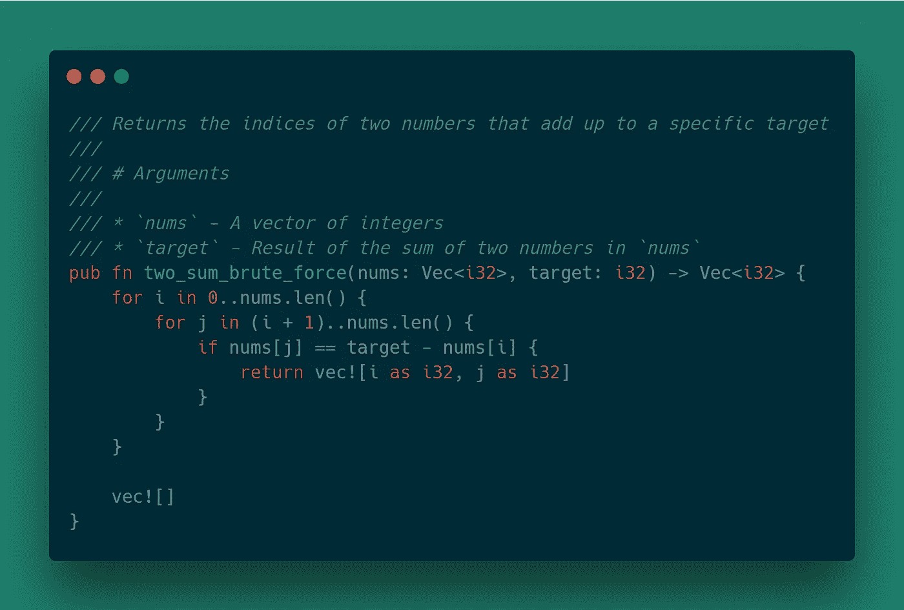
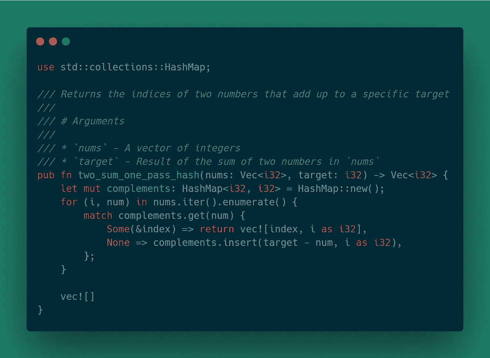

# 带 Rust 的 LeetCode 问题:两个和

> 原文：<https://levelup.gitconnected.com/leetcode-problems-two-sum-efa0b69b9505>


# 问题

给定一个整数数组，返回这两个数字的索引，使它们加起来达到一个特定的目标。您可以假设每个输入只有一个解决方案，并且不能两次使用同一个元素。

# 例子

```
Given nums = [2, 7, 11, 15], target = 9, Because nums[0] + nums[1] = 2 + 7 = 9, return [0, 1].
```

# 方法 1:暴力

解决这个问题的简单方法是遍历`nums`中的每个元素`x`，然后再遍历每个元素，看看是否有一个值等于`target` - `x`

# 算法

```
for i = 0 to length of nums 
    for j = i + 1 to length of nums 
        if nums[j] == target - nums[i] 
            return [i, j]
```

# 履行



# 复杂性

*   时间复杂度:O(n2 ),因为对于数组的每个元素，我们都循环遍历
*   空间复杂度:O(1)

# 方法 2:两遍哈希表

通过将输入数组转换成一个散列图，将值`nums[i]`存储为键，将索引`i`存储为值，可以降低时间复杂度。这将涉及两次迭代，一次构建散列图，另一次检查散列图中是否存在补码- `target - nums[i]` -但不是同一个索引。

# 算法

```
map = new HashMap 
for i = 0 to length of nums 
    map[nums[i]] = i for i = 0 to length of nums 
    complement = target - nums[i] 
    if map.contains(complement) and map[complement] != i 
        return [i, map[complement]]
```

# 履行


# 复杂性

*   时间复杂度:O(2n) -> O(n) —遍历`nums`数组两次，一次是为了构建散列图，另一次是为了检查是否看到了补码。
*   空间复杂度:O(n) —哈希映射的额外空间。

# 方法 3:一遍哈希表

上面的解决方案可以通过仅检查是否已经看到对一个值的称赞来进一步改进。如果没有看到补码，将补码和索引添加到哈希映射中，否则已经找到了解决方案。

# 算法

```
map = new HashMap 
for i in length of nums 
    if map.contains(num) 
        return [map[num], i] 
    else 
        map.insert(target - num, i)
```

# 履行



# 复杂性

*   时间复杂度:O(n)—`nums`向量只迭代一次。
*   空间复杂度 O(n) —哈希映射的额外空间。

# 回顾

对于这个问题，使用两遍哈希表方法对于大多数数据集来说已经足够好了。然而，如果数据集足够大，一次就得到结果将是理想的。随意看一看[源代码](https://github.com/andrewleverette/leetcode_problems/blob/master/two_sum/src/lib.rs)

*原载于 2020 年 4 月 27 日*[*https://andrewleverette . github . io*](https://andrewleverette.github.io/two-sum/)*。*

