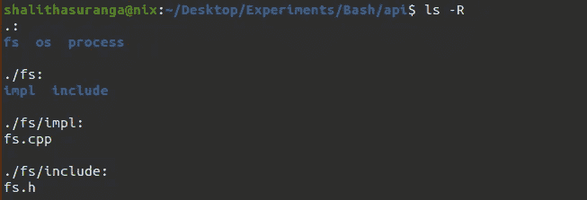
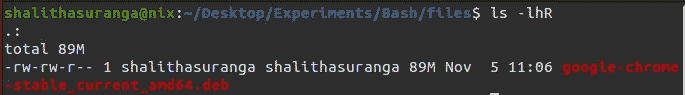
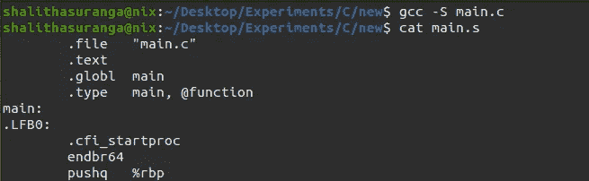
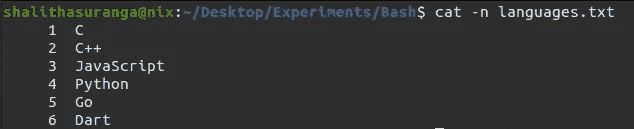
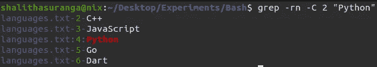

# 众所周知的 Unix/Linux 命令中鲜为人知的选项

> 原文：<https://levelup.gitconnected.com/lesser-known-options-of-well-known-unix-linux-commands-67acb60ea6c0>

## 在您的终端和 shell 脚本中使用这些命令行开关来提高您的工作效率


詹姆斯·哈里森在 [Unsplash](https://unsplash.com/s/photos/programming?utm_source=unsplash&utm_medium=referral&utm_content=creditCopyText) 上拍摄的照片，由 Canva 编辑

程序员通常更喜欢使用命令行界面，因为这样可以提高生产率，而且 CLI 与编程很相似。他们经常用 shell 脚本自动执行重复的命令。因此，框架和工具开发人员通常提供带有各种子命令的 CLI 程序。

终端命令可能到达不同的端点:shell 解释器、预打包的 OS 二进制文件或第三方二进制文件。shell 解释程序通常处理一些内置命令。例如，Bash 解释器处理众所周知的`cd`命令。同时，操作系统也通过预打包的二进制文件提供一些内置命令。例如，GNU/Linux 和 Unix 提供了`touch`命令来创建新文件。此外，程序员有时会出于各种开发目的安装额外的外部 CLI。因此，一些终端命令可能会触发第三方二进制文件。

这些命令带有各种命令行开关，我们可以使用它们来加快我们的日常任务。此外，一些命令行选项有助于我们在 shell 脚本编写期间满足开发需求。在这个故事中，我将解释一些您经常使用的众所周知的命令的不太为人所知的命令行选项。在 shell 脚本或终端中使用这些开关可以节省您在编程任务中的时间！

# 用 mkdir 递归创建目录和保存权限

我们经常在终端和 shell 脚本中使用`mkdir`命令来创建新目录。如果您需要在一个不存在的目录中创建新目录，该怎么办？一些开发人员在使用(或不使用)`cd`命令的情况下使用`mkdir`两次。作为一种快捷方式，您可以使用`-p` / `--parents`选项轻松地递归创建多个目录。请看下面的命令:

```
mkdir -p api/filesystem/impl
```

上面的命令一次创建整个目录树。一旦输入上面的命令，就会看到`api`目录。一旦你打开它，你会发现包含`impl`的`filesystem`。如果需要在`filesystem`内创建`impl`和`include`目录怎么办？为了使需求变得复杂一点，假设您还需要`os`和`process`，它们在`api`中也有类似于`filesystem`的结构。

有了`-p`开关和[支架伸缩](https://www.gnu.org/software/bash/manual/html_node/Brace-Expansion.html)就很容易了:

```
mkdir -p api/{filesystem,os,process}/{impl,include}
```

现在您有了下面的目录结构(`[tree](https://linux.die.net/man/1/tree)`生成了输出):

```
api
├── filesystem
│   ├── impl
│   └── include
├── os
│   ├── impl
│   └── include
└── process
    ├── impl
    └── include
```

对于新创建的目录，您可以通过使用`-m`选项跳过`chmod`,如下所示:

```
mkdir -m 777 public
```

# 从 Bash 脚本运行 Python 代码

Bash 是一种很棒的命令语言，它让我们可以在 Unix 或类似 Unix 的平台上编写自动化脚本。如今，大多数开发人员友好的操作系统都预装了 Bash 版本，因此使用 Bash 进行 shell 脚本编写是一个更具可移植性的选择。Bash 不提供现代语言特性，我们不能在 Bash 中直接使用操作系统 C APIs。因此，由于 Bash 的这些缺点，一些开发人员倾向于用 [Python 或 Node.js](https://betterprogramming.pub/bash-vs-python-vs-javascript-which-is-better-for-automation-92a277ef49e) 编写自动化脚本。

有一种快速的方法可以从 Bash 中调用 Python 来做一些您在 Bash 中无法处理或难以完成的事情。您可以创建一个子 shell，并使用`-c`命令行开关启动 Python 解释器来运行 Python 代码并获得 Bash 的输出:

```
#!/bin/basha=10
b=20code="
import json;
print(json.dumps({'a': $a, 'b': $b}, indent=2))
"json=$(python3 -c "$code")# Use json content
echo -e "$json" > output.json
```

上面的脚本使用 Python 从几个 Bash 变量生成一个漂亮的 JSON 文档。我展示这个例子是为了向您展示通过 Python 美化 JSON 的另一个命令行选项。在 Python 3.9 中，您可以使用`json.tool`模块的`--indent`开关来美化 JSON:

```
echo '{"a": 10}' | python3.9 -m json.tool --indent 2
```

同样，您可以使用您最喜欢的解释器来做 Bash 很难处理的事情。例如，您可以使用`node -e`在 Bash 中运行 JavaScript。

# ls 中的递归列表和其他有用的选项

我们经常使用`ls`命令来列出目录内容。在大多数场景中，我们通常使用不带任何命令行选项的`ls`，或者使用众所周知的`-l`(长列表)选项。但是，`ls`命令提供了更多的命令行选项，我们可以使用它们来提高我们的日常编程效率。

大多数程序员通常倾向于安装`tree`命令来递归地可视化目录内容。`ls`的内置`-R`开关还允许您以最少的格式递归地可视化目录内容:



用 ls 命令递归列出文件，作者截图

如果您需要查看递归列表中的文件统计信息，该怎么办？然后，你可以把`-l`和`-R`两个一起用做`-lR`。

`ls -l`命令以字节为单位输出文件大小，但是您可以使用`-h`选项使命令输出更易于阅读。一旦使用了`-h`开关，该命令将使用千字节、兆字节和吉字节来代替字节:



在文件条目中显示人类可读的大小细节，由作者截屏

# 理解 GNU/GCC 中的编译阶段

程序员通过学习各种编程语言步入编程世界。有些程序员在学术期间就开始用 C/C++编程。与此同时，大多数自学成才的程序员开始使用现代行业语言进行编码，如 Java、C#、Go 和 JavaScript。用 C 开始编程给程序员在他们的软件开发生涯中带来了更多的好处。所以，几乎所有的大学都是先教 C，自学的程序员也倾向于用 C 做实验。

现在，每个人都知道 GNU/GCC 让你编译 C 源文件。你知道它如何处理编译过程中的阶段吗？为了理解编译阶段，您只需要知道三个命令行开关:`-E`、`-S`和`-c`。

让我们用下面的简单 C 程序做实验:

```
#define ERR_CODE 100int main() {
  return ERR_CODE;
}
```

现在，运行以下命令来理解第一个编译步骤:

```
gcc -E main.c
```

`-E`选项在[预处理](https://en.wikipedia.org/wiki/C_preprocessor)后停止编译过程，输出预处理后的 C 代码；

```
int main() {
  return 100;
}
```

以下命令教您第二个编译步骤:

```
gcc -S main.c
```

`-S`选项在 C-to-Assembly 翻译过程之后停止编译过程，并输出翻译后的、人类可读的汇编代码:



用 GNU/GCC 编译器生成人类可读的汇编代码，作者截图

最后，下面的命令创建目标文件(即`main.o`，并在[链接](https://en.wikipedia.org/wiki/Linker_(computing))之前停止编译过程:

```
gcc -c main.c
```

下面的故事进一步解释了编程中的这些内部事实:

[](/5-computer-hardware-concepts-that-every-programmer-should-know-32711c759dc0) [## 每个程序员都应该知道的 5 个计算机硬件概念

### 多亏了这些概念，你的计算机执行了你编写的程序

levelup.gitconnected.com](/5-computer-hardware-concepts-that-every-programmer-should-know-32711c759dc0) 

# 掌握 cat 和 grep 命令

程序员经常在终端中使用`cat`命令来查看现有文件的内容。默认情况下，`cat`命令显示没有行号的文件内容。您可以使用`-n`命令行开关获得行号和内容:



打印带有行号的文件内容，作者截图

`cat`命令还提供了一个命令行开关，只显示非空行的行号。请看下面的命令:

```
cat -b languages.txt
```

如今，现代代码编辑器程序提供了内置的工具来搜索目录中的代码段，但是顽固的程序员仍然在这样的场景中使用`grep`。我们都知道`-rn`命令行开关，它递归地搜索并打印行号:

```
grep -rn "#include <stdio.h>"
```

只有少数程序员知道`grep`中的[上下文控制](https://www.gnu.org/software/grep/manual/html_node/Context-Line-Control.html)特性。`-C`(上下文选项)输出匹配行的周围行，如下所示:



用 grep 的上下文控件打印周围的行，作者截图

另外，`-c`命令行开关显示每个文件匹配的文本段数！练习`-C`和`-c`选项，以便更有效地使用`grep`。

# 结论

我们每天都在使用 Linux/Unix 命令和其他命令行程序。但是，只有少数程序员浏览这些命令的手册来学习隐藏的、不太为人所知的命令行开关。此外，一些 CLI 程序开发人员经常在他们的程序中添加新的以生产效率为中心的命令行选项，以节省 CLI 用户的时间，因此阅读您最喜欢的 CLI 的发行说明是一个好主意。

我是通过浏览手册找到上面这些很有帮助的命令行开关的。一旦你仔细阅读了你最喜欢的工具的手册，你会发现更多关注生产力的选项！查看下面的故事，了解一些高级 Bash 脚本技术:

[](/5-modern-bash-scripting-techniques-that-only-a-few-programmers-know-4abb58ddadad) [## 只有少数程序员知道的 5 种现代 Bash 脚本技术

### 使用这些技巧让您的 Bash 脚本更具交互性和未来感。

levelup.gitconnected.com](/5-modern-bash-scripting-techniques-that-only-a-few-programmers-know-4abb58ddadad) 

感谢阅读。

# 分级编码

感谢您成为我们社区的一员！在你离开之前:

*   👏为故事鼓掌，跟着作者走👉
*   📰查看[级编码出版物](https://levelup.gitconnected.com/?utm_source=pub&utm_medium=post)中的更多内容
*   🔔关注我们:[推特](https://twitter.com/gitconnected) | [LinkedIn](https://www.linkedin.com/company/gitconnected) | [时事通讯](https://newsletter.levelup.dev)

🚀👉 [**将像你这样的开发人员安置在顶级创业公司和科技公司**](https://jobs.levelup.dev/talent/welcome?referral=true)