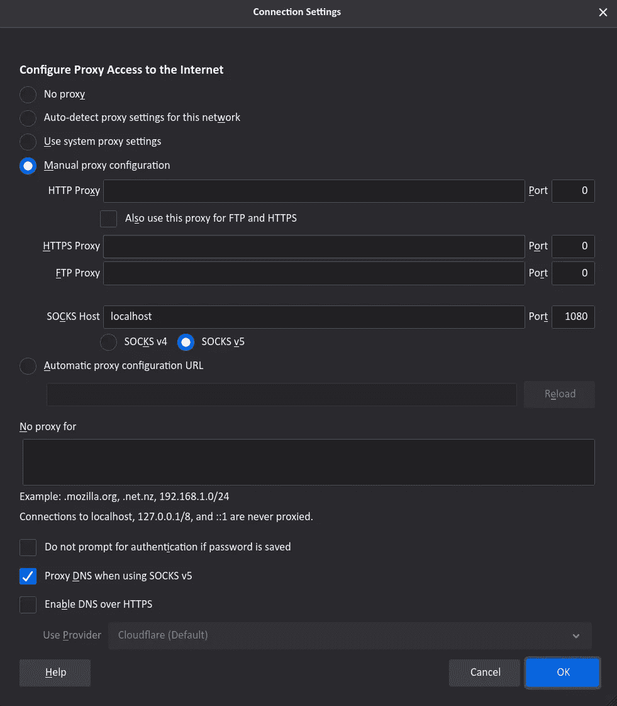

# 宋承宪鲜为人知的超能力

> 原文：<https://levelup.gitconnected.com/lesser-known-superpowers-of-ssh-cda63b35d576>

壳牌超级英雄


如果你正在读这篇文章，你可能以前用过`ssh`。您*可能*使用它安全地登录到远程机器。毕竟，这是`ssh`最初的用例，也是它名字的由来——为`telnet`提供一个安全的替代方案。

它在公共互联网的蛮荒西部，通过最令人震惊的公司代理，在家庭网络的围墙花园内，甚至在`lo`界面的内省渴望中执行这一重要任务。它是开源的，受欢迎的，由软件领域中最有安全意识的项目之一拥有和开发。它已经经历了超过 25 年的历史、安全审计和多种平台。当您使用`[user@]server:project.git`作为遥控器与`git`库交互时，也会用到它。

太酷了。它做它的工作。

然而，我在这里讨论它的其他超能力，你可能不知道。

# 超能力:从服务器复制文件

如果你是软件开发人员，你可能已经用过`scp`和`sftp`。这些包含在大多数 OpenSSH 安装中，并且是您的工具包中的基本项目。

使用`scp`安全地来回复制文件与使用`cp`非常相似。唯一的区别是为服务器目标添加了一些语法。

```
scp local/file.txt user@server:/remote/directory/scp user@server:/remote/directory/file.txt local/file.txt
```

**Pro 提示:**第一次使用`scp`将您的公钥复制到远程服务器。下面将确保远程服务器创建了具有适当权限的源目录，然后将您的公钥复制到其中。此后，如果服务器支持，您在以后的登录中将不再需要您的密码。

```
ssh user@server -- install -dm 700 ~/.sshscp ~/.ssh/id_rsa.pub user@server:~/.ssh/authorized_keys
```

**Pro 提示:**如果您使用较新的 terminfo 文件，如`TERM=tmux-256color`或`TERM=alacritty`，远程服务器可能不知道如何识别您终端的功能。打开`less`或`vim`时，您可能会得到错误提示，提示“未使用全功能终端”使用下面的一行程序来纠正它:

```
infocmp | ssh user@host -- tic -
```

注销远程服务器并重新登录，它应该能正确识别您的终端模拟器。`infocmp`将获取当前终端的能力，并将它们转储到 STDOUT。`tic -`将从 STDIN 中读取终端能力并编译到`$HOME/.terminfo`中。这两个工具都包含在`ncurses`中，默认情况下，它安装在几乎所有基于 Unix 的系统上。

# 超级大国:轻量级浏览器 VPN

如果你被困在禁止性的公司防火墙后面(但是 SSH 是允许的)，或者你想要一个穷人的 VPN 通过远程服务器，有一个有用的规避措施。

首先，使用`ssh`设置一个通过远程服务器的本地 SOCKS 代理:

```
ssh -NTD 1080 user@server
```

*   `-N`为非交互式。这使得 Ctrl-C 和结束它变得很容易。
*   `-T`防止在遥控器上分配不需要的伪终端。
*   `-D`指定 SOCKS 代理在本地监听的端口。本例中使用了`1080`。

现在应该有一个 SOCKS 代理运行在您的本地机器上，您可以配置您的 web 浏览器来引导所有流量通过。您在浏览器中的 internet 状态将显示为来自您在命令中使用的服务器。本地网络环境看到的只是通过 SSH 离开机器的加密流量。

**火狐**

要配置 Firefox 使用您的代理，请前往**首选项>网络设置>设置…**

这将打开一个**连接设置**模式。您需要选择**手动代理配置**单选按钮。除了以下内容之外，将所有内容留空:

*   **袜子主持人** : `localhost`
*   **端口** : `1080`
*   检查 **SOCKS v5** 单选按钮
*   使用 SOCKS v5 时检查**代理 DNS。**



网络设置模式

就是这样！刷新任何标签并继续在 Firefox 中浏览，所有的网络流量都将通过 SSH 进行代理。如果你有 SSH 代理，返回**网络设置**配置并选择**无代理**。

Chrome、Edge、Safari 等其他浏览器的代理设置比较复杂，这里不做介绍。

# 超级大国:通过公司代理导航

一些工作环境已经实施了互联网代理。它们可能允许端口 80 和 443 用于常规的浏览器流量，但默认情况下会阻止其他所有流量。很多时候，如果你友好地请求他们，这些公司代理会让你通过，而默认情况下 SSH 不知道怎么做。

让我们假设您的工作场所在`proxyport`的`proxyhost`有一个公司代理。当你试图单独使用`ssh`时，它要么挂起，要么给你一个无法连接到你的服务器的错误。但是让我们告诉宋承宪如何礼貌地请求公司代理让我们通过。

```
ssh -o ProxyUseFdpass=yes \
    -o ProxyCommand="nc -F -X 5 proxyhost:proxyport %h %p" \
    user@server
```

这将告诉`ssh`在`proxyhost:proxyport`请求`nc`通过公司代理执行连接请求，并将结果隧道传递回`ssh`。

如果你想让这个对这台机器上特定主机的所有 SSH 命令永久有效，你可以把它添加到`~/.ssh/config`中，以避免每次都使用`-o`选项。

```
Host example.com
  ProxyUserFdpass yes
  ProxyCommand    nc -F -X 5 proxyhost:proxyport %h %p
```

如果需要，这种超能力可以与这里的许多其他超能力结合起来。

# **超能力:远程** `**sudo**` **一次性命令**

这是一种常见的模式

1.  `ssh`远程服务器上
2.  `sudo`单一命令
3.  输入你的密码
4.  `logout`或`exit`之后

您可以组合这些步骤，并使用`-tt`跳过调用和退出 shell

```
ssh -tt user@server -- sudo some-command
```

您将从遥控器的`sudo`得到密码提示，但之后它将完成并退出。

# 超级大国:本地可用的远程服务

假设您有一个运行在远程服务器上的服务，比如 web 服务器，但是它只在`localhost:80`可用。您可以使用`ssh`通过端口转发使该服务在您本地机器上可用。

```
ssh -L 8080:localhost:80 user@server
```

格式为`-L <tunnel port>:<destination>:<destination port>`。在这种情况下，我们希望服务器上的`localhost:80`在使用相同端口号的本地机器上可用。你现在应该能够对本地机器的`localhost:8080`执行操作，就像你在远程服务器上点击`localhost:80`一样！

```
 ┌──────────────────────┐
 │        localhost:80  │
 │               ▲      │
 │server         │      │
 └────────────┬──┼──┬───┘
              │  │  │
   ssh tunnel │  │  │
              │  │  │
 ┌────────────┴──┼──┴───┐
 │local          │      │
 │               |      │
 │ ────► localhost:8080 │
 └──────────────────────┘
```

# 超级能力:将本地服务转发到远程

反过来也是可能的。您可以将仅在本地计算机上可用的服务转发到远程服务器。在这种情况下，请使用`-R`标志。在这种情况下，假设我们想要从端口`8888`上的远程服务器到达本地机器上监听`localhost:8080`的 web 服务器。

```
ssh -R 8888:localhost:8080 user@server
```

这里的语法是`-R <tunnel port>:<destination>:<destination port>`

现在，当我们在远程服务器上时，我们可以点击`localhost:8888`，就像我们在本地机器上点击端口`8080`一样。

```
┌──────────────────────┐
│ ─────► localhost:8888│
│               │      │
│remote         │      │
└────────────┬──┼──┬───┘
             │  │  │
  ssh tunnel │  │  │
             │  │  │
┌────────────┴──┼──┴───┐
│local          │      │
│               ▼      │
│       localhost:8080 │
└──────────────────────┘
```

# 超级大国:修改已建立的连接

SSH 支持一些交互式命令来修改现有的连接。一个常见的例子是一个连接已经冻结，您无法断开。可以打`<ENTER>~.`；这三个键，按照这个顺序，强制断开连接！您还可以将`ssh`放在后台，列出、添加和删除端口转发。下面是 SSH 手册页的一个子集。

```
~.      Disconnect.
~^Z     Background ssh.
~#      List forwarded connections.
~?      Display a list of escape characters.~C      Open command line.  Currently this allows the addition of
        port forwardings using the -L, -R and -D options. It also
        allows the cancellation of existing port-forwardings with
        -KL[bind_address:]port for local, -KR[bind_address:]port for
        remote and -KD[bind_address:]port for dynamic port
        -forwardings. !command allows the user to execute a local
        command if the PermitLocalCommand option is enabled in
        ssh_config(5).  Basic help is available, using the -h
        option.
```

# 结论

使用`ssh`你还可以做其他的事情，还有很多其他的系统和工具利用它的能力来创建安全的连接。本文坚持使用 OpenSSH 包含的特性，但是一个这样的例子是 [sshfs](https://github.com/libfuse/sshfs) 来挂载远程文件系统；它在大多数 Linux 发行版、BSD 版本和 MacOS 中都可用(通过`brew`)。

黑客快乐！