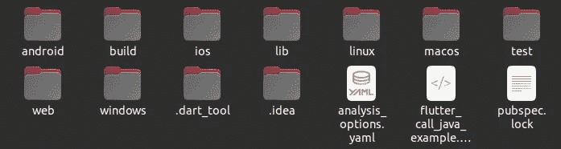
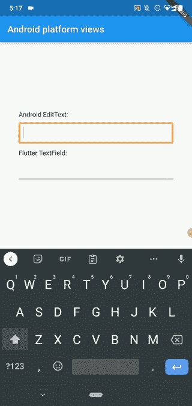

# 构建高级 Flutter 应用的鲜为人知的方法

> 原文：<https://levelup.gitconnected.com/lesser-known-ways-to-build-advanced-flutter-apps-74d2af638e2>

## 让 Flutter 超越 Dart 生态系统


由[杰佛森·桑多斯](https://unsplash.com/@jefflssantos?utm_source=unsplash&utm_medium=referral&utm_content=creditCopyText)在 [Unsplash](https://unsplash.com/s/photos/programming?utm_source=unsplash&utm_medium=referral&utm_content=creditCopyText) 上拍摄的照片，由 Canva 编辑

现在，Flutter 和 React Native 成为应用程序开发行业最推荐的构建跨平台移动应用程序的方法。喜欢 JavaScript、React 和特定于平台的 UI 元素的开发团队选择 React Native。同时，喜欢 Dart 和 Material UI 元素的开发者倾向于使用 Flutter。两种框架各有利弊，但 Flutter 由于其令人印象深刻的性能优先的架构基础，无疑在性能因素上表现更好。

大多数开发人员通常以同样的方式使用 Flutter。他们搭建应用程序，使用内置的小部件和 Dart APIs，并生成特定于平台的二进制文件或 web 应用程序包(通过 Flutter web)。此外，他们倾向于使用 Flutter 插件来加快应用程序开发过程。

Flutter 提供了一种使用平台无关的 Dart 语言开发高性能跨平台应用程序的简单方法，但它保持了其架构的灵活性，以访问平台相关的代码。因此，我们可以超越 Dart 生态系统，整合各种模块来构建高级 Flutter 应用程序。在这个故事中，我将解释超越 Dart 层开发 Flutter 应用程序的几种鲜为人知的方法。这些方法可以帮助您重用现有代码，加快开发时间，并为独特的用例提供令人印象深刻的架构解决方案。

# 从 Dart 调用特定于平台的本机代码

Flutter 框架是用 Dart 编写的，但是它不能在操作系统上单独运行，因为操作系统本身不支持 Dart。因此，Flutter 团队创建了特定于平台的 Flutter 引擎模块，以在所有支持的操作系统上托管基于 Dart 的应用程序。Flutter 引擎实现了在每个平台上运行 Flutter 应用程序所需的运行时。另一方面，Flutter CLI 支持使用 Flutter 引擎的特定于平台的主机应用程序(嵌入式应用程序)。您可以在应用程序目录中看到这些动态生成的主机应用程序源:



android、ios、linux 等。目录包含主机 app 源码，作者截图。

毫无疑问，我们可以使用特定于平台的 Flutter 引擎 API 来修改这些主机应用程序源。可以在每个主机应用程序上使用[平台通道 API](https://docs.flutter.dev/development/platform-integration/platform-channels) 从 Dart 端调用特定于平台的语言。例如，您可以使用 Android 平台通道 API 从 Dart 调用 Java/Kotlin，因此在 Flutter 中使用已经开发的 Java 包很容易。

我修改了 Flutter 演示应用程序，并在下面的项目中从 Java `Random`类生成了一个随机数:

[](https://github.com/codezri/flutter-call-java-example) [## GitHub-codez ri/flutter-call-java-示例:在 Flutter 中从 Dart 代码调用 Java 代码

github.com](https://github.com/codezri/flutter-call-java-example) 

同样，你可以在 Linux、iOS、macOS、Windows 和 [Fuchsia](/will-flutter-and-fushia-replace-your-favourite-operating-system-2653384b186f) 上调用原生平台特定代码。这种开发方法是重用现有的特定于平台的代码或调用原生 SDK 的更好方法。Flutter 插件使用平台通道调用原生 SDK。检查 [flutter_vibrate](https://github.com/rodydavis/flutter_vibrate) 包源代码，查看最小插件实现。

# 在 Flutter 应用中嵌入 Go/Python 模块

早些时候，我们从 Dart 中学习了如何调用原生平台特定的代码，那么如果有一种方法可以在原生应用程序中嵌入其他编程语言运行时呢？ [Go mobile](https://github.com/golang/mobile) 项目让开发者在 Android 和 iOS 应用中嵌入 Go，在移动设备上运行 Go 模块。因此，我们可以使用 Go mobile 从特定于平台的本地语言调用 Go 代码，并通过 Flutter 平台通道从 Dart 调用特定于平台的代码。因此，我们可以从 Dart 调用 Go 代码。

大多数开发人员选择 Go 构建 web 服务是因为它的性能、简单性和受欢迎程度。Flutter 也有同样的竞争因素，所以现在大多数开发者倾向于使用 Flutter。现在，他们有了一种节省时间的方法，直接在 Flutter 中使用基于 Go 的后端模块，而不是从头开始在 Dart 中重写。

我修改了 Flutter 演示应用程序，并在下面的项目中通过 Go 的`math/rand`包生成了一个随机数:

[](https://github.com/codezri/flutter-gomobile) [## GitHub-codez ri/flutter-gomobile:在 Flutter 中使用 Go 模块

### 这个样例 Flutter 应用程序通过 Flutter 平台通道调用一个用 Go 编写的函数，并使用 Go mobile bind。已实施…

github.com](https://github.com/codezri/flutter-gomobile) 

对于 Android，Go mobile 生成了一个包含 CPU 专用共享库的 [Android 库](https://developer.android.com/studio/projects/android-library)。您可以使用以下 Go mobile 命令生成 Android 库:

```
gomobile bind --target android
```

上面的命令从您的 Go 模块源生成一个`aar`文件(一个 Android 库文件)。另一方面，我们可以在 Android 项目中使用它作为依赖包:

```
// app/build.gradlerepositories{
    flatDir{
         dirs 'src/main/libs'
    }
}dependencies {
  api(name:'gomobilelib', ext:'aar')
}
```

Kivy 框架也提供了一种类似的在移动应用上嵌入 Python 的方法，所以从 Dart 调用 Python 代码也是可能的。 [python-for-android](https://github.com/kivy/python-for-android) 项目让你用 python 模块生成 apk。

# 在 Flutter 应用中使用特定于平台的原生 UI 元素

正如我们已经知道的，Flutter 提供了自己的 widgets 工具包，它使用 [Skia](https://github.com/google/skia) 作为底层图形库。因此，当你在移动应用程序中显示内置的 Flutter 小工具时，Flutter 不会呈现原生的 Android 或 iOS 元素。因此，您可以在所有支持的操作系统上设计相同的外观。使用相同的外观和感觉对于构建现代的跨平台应用程序来说是非常好的，但是用户通常希望应用程序具有操作系统的设计概念。因此，Flutter 为 iOS 提供了库比蒂诺风格的小工具。

但是，在某些场景中，我们需要依赖于平台的真正的原生 GUI 元素，而不是呈现人工风格的独立于平台的 UI 元素。例如，如果我们可以使用官方平台特定的 Google Maps SDK 或 Webview，而不是用 Dart 从头实现一个专用元素，这确实很棒。

看下面这个项目。在这里，我在一个典型的 Flutter 应用程序中呈现了一个原生的 Android 文本输入，以及一个 Flutter 文本字段小部件:

[](https://github.com/codezri/flutter-platform-views-example) [## GitHub-codez ri/flutter-platform-views-example:学习使用 Android 特有的原生 UI 元素…

github.com](https://github.com/codezri/flutter-platform-views-example) 

一旦我们在 Android 设备上运行上述项目，您将在同一个应用程序视图中看到 Android EditText 元素和 Flutter TextField 小部件，如以下预览所示:



在 Flutter 应用中使用 Android EditText 和 Flutter TextField，作者截图

如果 Flutter 等价物不可用或者基于 Dart 的重写非常耗时，这种方法是直接使用预实现的特定于平台的复杂元素的好方法。官方文档解释说平台视图伴随着[性能权衡](https://docs.flutter.dev/development/platform-integration/ios/platform-views#performance)，所以首先检查一个本地颤振等价。

# 用 Flutter 开发混合应用

如今，大多数企业投资于混合移动应用程序开发，因为项目交付速度快，开发成本低，并且有可能实现基于 web 的平台集成。大多数基于网络应用的公司将他们现有的网络应用转化为带有 Cordova 或类似电容器框架的移动应用。

由于 web 资源解析/加载缓慢，与完全原生的、基于 Flutter 的或基于 Kivy 的应用程序相比，混合应用程序确实有更多的性能权衡。但是，现代高端设备可以隐藏这些性能问题，并向用户提供类似本机的应用程序。几年前，我写了下面的故事来解释这种情况:

[](https://shalithasuranga.medium.com/goodbye-native-apps-2ffcbd2773e7) [## 再见，本地应用

### 混合应用正在取代在低端和高端电脑上都能流畅运行的原生应用。

shalithasuranga.medium.com](https://shalithasuranga.medium.com/goodbye-native-apps-2ffcbd2773e7) 

官方的 [webview_flutter](https://pub.dev/packages/webview_flutter) 插件允许你通过平台视图功能将原生 webviews 添加到你的 flutter 应用程序中——这样你就可以在 Flutter 中创建混合应用程序。此外，使用 webview_flutter 软件包，您可以在创纪录的时间内将现有的 web 应用程序转变为混合移动应用程序:

```
[@override](http://twitter.com/override)
   Widget build(BuildContext context) {
     return WebView(
       initialUrl: 'https://example.com',
     );
   }
```

webview_flutter 插件支持在 Dart 和 JavaScript 之间建立一个消息传递接口，因此您可以通过结合原生 flutter 小部件和 HTML/Web 组件来构建类似原生的混合应用程序。想象一下，如果您为现有的 web 应用程序使用 Material 主题，并将其嵌入到 Flutter 应用程序中，而不是在 Dart 中重写所有内容，那么项目交付速度会有多快。

# 结论

Flutter 正变得越来越受欢迎，因为它对开发人员友好，接近本地的性能，以及通用平台支持。但是，有些开发人员不选择 Flutter，因为 Dart 对于开发人员社区来说是一种陌生的语言。一些开发人员认为，Flutter 用 Dart 运行时制作了一个沙箱(就像 web 浏览器一样),从而降低了应用程序开发的灵活性。

Flutter 提供了平台通道的概念，就像 go 中的 [cgo](https://pkg.go.dev/cmd/cgo) 或者 Java 中的 [JNI](https://en.wikipedia.org/wiki/Java_Native_Interface) 。因此，在 Flutter 中使用特定于平台的代码是如此简单和高效。此外，我们有几种通过 Dart 使用其他语言的实用方法。尝试上述方法，通过重用现有的特定平台或 web 应用程序代码来构建高级 Flutter 应用程序。

感谢阅读。

# 分级编码

感谢您成为我们社区的一员！在你离开之前:

*   👏为故事鼓掌，跟着作者走👉
*   📰查看[升级编码出版物](https://levelup.gitconnected.com/?utm_source=pub&utm_medium=post)中的更多内容
*   🔔关注我们:[Twitter](https://twitter.com/gitconnected)|[LinkedIn](https://www.linkedin.com/company/gitconnected)|[时事通讯](https://newsletter.levelup.dev)

🚀👉 [**加入升级人才集体，找到一份神奇的工作**](https://jobs.levelup.dev/talent/welcome?referral=true)