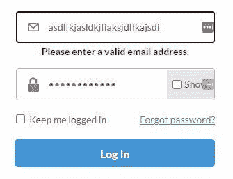

# JavaScript 内置函数和对象

> 原文：<https://levelup.gitconnected.com/lesson-6-javascript-built-in-functions-and-objects-fullstackroadmap-9834a2d6125a>

## #fullstackroadmap 第 6 课

[点击这里查看 YouTube 上的这一课](https://www.youtube.com/watch?v=O3iR-CIufKM)

这是我的 fullstack 开发者系列的一部分，在这个系列中，你将从没有编写过一行代码，到将你的第一个 fullstack web 应用程序部署到互联网上。[点击此链接](https://www.zachgollwitzer.com/posts/2021/fullstack-developer-series/introduction/)了解这个系列的内容。

请在 Twitter [@zg_dev](https://twitter.com/zg_dev) 上给我加标签，并与 [#100DaysOfCode](https://twitter.com/search?q=%23100DaysOfCode&src=typed_query) 分享这个系列！

# 有用的系列链接

*   [系列目录](https://www.zachgollwitzer.com/posts/2021/fullstack-developer-series/fullstack-roadmap-toc)
*   [Github 仓库](https://github.com/zachgoll/fullstack-roadmap-series)——在这里你可以找到我们在这个系列中编写的所有代码
*   [YouTube 播放列表](https://www.youtube.com/watch?v=ZZJT5uskuvI&list=PLYQSCk-qyTW37zDPzcAyzCsnypFQrhUcq)
*   [系列概述](https://www.zachgollwitzer.com/posts/2021/fullstack-developer-series/introduction/)
*   [100 天的代码挑战](https://www.100daysofcode.com/)——我强烈建议你在阅读本系列时接受这个挑战！
*   我的 CodeWars 档案——跟着我，我会跟着你回来。这是我们在整个系列中进行编码挑战的地方！
*   我的推特资料——你可以在那里了解最新消息

# 本课的目标是

在之前的课程中，我们讨论了 JavaScript 的许多基本部分，在我们的 [25 代码挑战](https://www.youtube.com/watch?v=sqRk0Ly66Ps)中，我们甚至探索了一些内置的 JavaScript 方法。

在这一课中，我不仅将教您如何阅读 JavaScript MDN 文档，还将向您展示开发人员可能会看到的最常见的内置对象和函数。

最后，我策划了 10 个代码挑战，这些挑战将强化帖子中解释的一些概念。

以下是我们将涉及的主题。

*   如何阅读文档
*   快速启动回调函数
*   原语与对象(在前面的课程中我一直在撒谎)
*   日期
*   正则表达式
*   常见字符串方法
*   常见数组方法
*   数学图书馆
*   错误类型
*   NaN，空，未定义

这将是我们讨论 JavaScript 基础知识系列的最后一篇文章。如果你想在我们讨论的基础上继续深造，我强烈推荐[你不懂 JavaScript](https://github.com/getify/You-Dont-Know-JS/tree/1st-ed) 。

还有额外的 JavaScript 概念，比如 async/await、Promises 和 Classes，但是在我们具备 HTML、CSS 和 JavaScript 的基础知识之前，我们可能不会涉及这些概念。我确实打算报道他们，但还不是时候。

# 如何阅读文档

我们将从一个作为程序员必须具备的非常重要的技能开始。你可能听过这个说法，RTFM，代表“阅读 f********手册”。这在软件工程中很常见，因为大多数问题都可以通过阅读文档来解决。当我说“文档”的时候，我只是指那些解释如何使用某个框架、库或编程语言的指导性指南。

因为到目前为止我们只接触了 JavaScript，所以最常见的文档来源是 MDN (Mozilla Developer Network)。[这是 JavaScript 文档](https://developer.mozilla.org/en-US/docs/Web/JavaScript)的主页。

每种语言/框架/库的文档会有所不同，但是高质量的文档通常为开发人员提供以下资源。

1.  快速入门或概述指南
2.  延伸教程
3.  API 引用(通常简称为“引用”或“API”)

每当我开始学习一个新的框架时，快速入门和教程都是学习基础知识的好方法，然后我会在构建项目时根据需要参考 API 参考(以及非官方教程)。

[这里是 JavaScript 编程语言的 API 引用](https://developer.mozilla.org/en-US/docs/Web/JavaScript/Reference)。由于 JavaScript 如此广泛，有几个网站提供了 API 参考，但通常，框架和库只有一套“官方”文档。

当你翻阅 JavaScript 的参考资料时，你可能会感到困惑，这没关系。记住，参考文献记录了 JavaScript 的所有内容。不需要像读书一样去读。将其作为参考(因此得名)。

假设你正在解决上节课练习题中的一个[，你想了解更多关于我们在数组上使用的`push()`方法。这是你到达那里的方法。](https://www.youtube.com/watch?v=sqRk0Ly66Ps&t=1833s)

1.  转到 [JavaScript 参考](https://developer.mozilla.org/en-US/docs/Web/JavaScript/Reference)
2.  由于`push()`是一个数组方法，找到数组数据类型[点击它](https://developer.mozilla.org/en-US/docs/Web/JavaScript/Reference/Global_Objects/Array)。
3.  向下滚动到“实例方法”并[点击推送方法](https://developer.mozilla.org/en-US/docs/Web/JavaScript/Reference/Global_Objects/Array/push)。
4.  阅读解释这个方法如何工作的那一页

第四步说起来容易做起来难。阅读文档对初学者来说很难，所以让我们来看看如何去做。

# 概述部分

我们来看一个叫做`pop()`的数组方法。这是最简单的学习方法之一。[这里是截图来自](https://developer.mozilla.org/en-US/docs/Web/JavaScript/Reference/Global_Objects/Array/pop)的文档。

文档通常从函数的概述开始。这通常是你需要的唯一信息。从这个概述中，我们可以看到`pop()`方法移除数组的最后一个元素(即修改原始数组)并返回被移除的元素。

但是也许概述部分没有提供您需要的所有信息。向下滚动到语法部分。

# 句法

这一节可能是记录一个函数最直接的方式。这向您解释了函数分别接收和返回的输入和输出。一旦你擅长阅读文档，并且对编程有了大体的了解，这一节通常就是你开始使用一个给定函数所需要的全部。

让我们继续使用`array.pop()`方法。

通过观察这一点，我们可以推断出`pop()`方法不接受任何参数，并返回被移除的数组的值。

与 overview 部分不同，这里还注意到，如果您在空数组上使用`pop`方法，它将返回`undefined`。您可以在您的开发工具控制台中进行尝试。

让我们看看另一个稍微复杂一点的方法。这里是`array.join()`方法的“语法”部分([链接到第](https://developer.mozilla.org/en-US/docs/Web/JavaScript/Reference/Global_Objects/Array/join)页)。

与`array.pop()`方法不同，这个方法只有一个可选的参数。我们可以看出这个参数是可选的，因为`[separator]`周围有`[]`。此外，在参数部分，它表示这是可选的。

查看返回值，可以看到该方法返回一个字符串值，其中给定数组的所有元素都连接在一起。它还指出，如果您试图在空数组上使用此方法，返回值将是一个空字符串。

下面是如何将这个文档翻译成代码。

下面是`push()`方法的语法部分。

让我们从这部分开始:

这到底是怎么回事？！这试图解释的是函数的参数。首先，括号`[]`表示参数是可选的(不要与我们之前学习的数组括号语法混淆)。在这种情况下，如果不传递参数，数组将保持不变。其次，你会注意到`...`，它告诉我们这个方法接受无限数量的参数。

当我们查看返回值时，我们可以看到它在推送操作后返回新数组的长度。看看下面的代码，猜猜`result`变量等于什么。

不，正如你所料，`result`不等于`[1, 2, 3, 4, 5, 6, 7, 8, 9]`。`result`变量等于`9`(新数组的长度)`arr`等于新数组。

你可能会问——我们用关键字`const`分配了它，那么我们如何重新分配它呢？！我不想离题太远，所以[如果你好奇就去读读这个](https://stackoverflow.com/a/45597013/7437737)。

好，让我们再看一个例子。

首先，您会看到这个函数有两个参数。`valueToFind`参数是必需的，而`fromIndex`是可选的(您会注意到在其描述的底部，它说它默认为 0)。

返回值是一个布尔值，它表明`valueToFind`是否存在于我们正在搜索的`arr`中。

利用上面的信息，我们可以尝试使用这种方法的几种不同方式。

# 示例、规格、浏览器兼容性

您将在文档中看到的与上述类似的特定方法的其余部分是有用的，但并不总是必需的。

示例部分是不言自明的。规范部分将向您展示在 ECMAScript 标准中的什么地方可以找到这种方法(还记得第 2 课吗？).

最后，浏览器兼容性将向您展示该功能可以在哪些浏览器中正常工作。如果你看一下`arr.includes()`方法，它不能在 Internet Explorer 中工作，所以如果你正在构建一个需要在 IE 中工作的应用程序(比如在一个大公司中)，你不应该使用`arr.includes()`方法。一开始，我不会关注浏览器兼容性——学习编码已经够难的了！

# 回调函数:令人困惑，但很有必要

在我们开始探索不同的内置 JavaScript 函数之前，您至少需要对回调函数有一个大致的了解。

不，这不是编写函数的不同类型。它们代表了使用函数的不同方式。

这里是一些真正令人困惑的代码，我希望你从现在起有 5 分钟的基本理解。

这也可以简化为以下内容(做完全相同的事情):

不幸的是，对于初学者来说，第二段代码是你最常看到的，因为它更简洁。

让我们带着一些注释浏览第一个代码块。

我们可以通过给`myCallback`打电话得到同样的结果。

`myCallback`没什么特别的。它只是一个函数，但是我们可以让`mainFunction`为我们做，而不是单独调用这个函数！放大`result = callback(randomNumber)`，您可以看到我们正在获取`randomNumber`的值，在本例中是`20`，并将其作为参数传递给`callback`。什么是`callback`？这是我们作为参数传入的函数。

所以让我们用我们刚刚定义的函数，`myCallback`，并把它作为一个参数传递给`mainFunction`！

当然，您不必将`myCallback`定义为一个单独的函数。你可以用匿名函数或者箭头函数来实现。所有这些都会产生相同的结果。

# 那么…回调有什么意义？

有两个优点:

1.  功能的可重用性
2.  异步编程

## 回调支持可重用性

我们来看一个名为`arr.map()`的内置 JavaScript 函数。[您可以在这里找到文档](https://developer.mozilla.org/en-US/docs/Web/JavaScript/Reference/Global_Objects/Array/map)，我鼓励您在我们开始讨论它之前尝试并弄清楚它。

在这个例子中，我将`myCustomMapOperation`作为我的“回调”函数传递给内置的`arr.map()` JavaScript 函数。我写的这个自定义回调函数将使数组中的值加倍。

但是，如果我的数组中填充了字符串值，而我想创建一个只包含每个字符串的第一个字母的新数组，该怎么办呢？难道我不需要去寻找另一个内置的 JavaScript 函数来做这件事吗？

不要！！

回调函数使得东西可以重用。由于我们作为开发人员负责定义回调函数将做什么，我们可以出于各种目的重用`arr.map()`函数。以下是我如何实现我刚才提出的想法。

## 异步编程:回调、承诺和异步等待

是的，我说了。“异步”是一个你将学会同时又爱又恨的词。

在编程中，并不是所有的操作都像我们编写的代码一样几乎是即时发生的。例如，当一个 web 应用程序需要从数据库中获取一些数据，而当天互联网很慢时，会发生什么情况？此操作将需要几秒钟的时间，这取决于您的互联网的延迟。

你可能会说——那么，让我们等到它完成后再执行任何代码？

回答错误，但想法不错。我们不能只是等待它发生，因为在许多应用程序中，有数百个这样的操作同时发生，如果我们等待每个操作，我们的网页将需要几分钟才能加载。没人想这样。

在这一课中，我们不会深入到任何代码中，但将来会有一课专门讲述异步编程，因为这是一个很大的主题，可能会相当混乱。

# 原语与对象

如果您一直关注本系列课程，您可能已经听到我说过“JavaScript 中的一切都是对象”。直到现在，我也没有解释清楚。

但是因为我们将在这一课中讨论很多内置的 JavaScript 函数和对象，所以您需要对原语和对象有一个基本的了解。

我的意思是:

还记得第三课的`===`和`==`吗？三重等于比较*类型*和*值*。Double equals 只是比较*值*。

这些“字符串”的值相等，但类型不相等(一个是对象，一个是字符串)。

你可能在想——“所以你告诉我`string1`不是一个字符串？？？!"。

这正是我要告诉你的。此外，有些人可能认为`string2`不是一个字符串，因为它上面有“方法”。例如:

一个“字符串”怎么会有这样的方法呢？我们不会详细回答这个问题，但我想至少回答一下。

# 什么是原始值？

把“原语”想象成某物最简单的形式。如果一种编码语言有一个“元素周期表”，它将被“原语”填充。

在 JavaScript 中，有六种原语。

1.  线
2.  数字
3.  bigint
4.  布尔型
5.  不明确的
6.  标志

我们还没有谈到所有这些，没关系。

一个“原始”数据类型没有任何附加的“方法”，但是在幕后，JavaScript *将*原始值与它们对应的对象值包装在一起。这就是为什么`'some string'.toUpperCase()`是有效的 JavaScript 代码。

# 那我该怎么办？

我创建了课程系列的这一部分，因为这是我在学习 JavaScript 时遇到的一个问题。

我建议您将此视为“值得注意”的信息，但不要再进一步。一旦你更有经验了，你就可以回去学习 JavaScript 语言的底层细节。如果你和我一样是个天生好奇的人，我建议你先看看下面的简短资源，然后再回到课上。

*   [字符串原语与字符串对象](https://developer.mozilla.org/en-US/docs/Web/JavaScript/Reference/Global_Objects/String#string_primitives_and_string_objects)
*   [什么是原语？](https://developer.mozilla.org/en-US/docs/Glossary/Primitive)

让我们回到本节开头的代码，用一些注释来结束我们对原语的简短讨论。

# 这个“新”关键词是什么？

我想访问这一部分的另一个原因是，随着我们进入 JavaScript 日期等主题(下一部分)，您将开始看到一个 JavaScript 关键字，`new`。

从技术上讲，`new`是一个运算符，但是我们在关于运算符的课程中没有涉及到它。下面是`new`操作员做的事情:

1.  创建一个空白 JavaScript 对象
2.  将这个新对象链接到“父”对象

实际上还有一些额外的步骤，但与我们无关。

简单地说，`new`操作符创建一个现有对象的“实例”。我们将在本系列的后面重新讨论这个概念。现在，每当你看到`new`操作符，就像这样想:

1.  我们有一些现有的，预定义的对象，如`Date`
2.  我们想要一个可以存储在变量中对象的“副本”
3.  所以…我们使用`Date`作为“模板”来创建“副本”

说到约会…

# 日期

[官方文件](https://developer.mozilla.org/en-US/docs/Web/JavaScript/Reference/Global_Objects/Date)。

我要告诉你一个秘密——大多数开发人员都不太了解 JavaScript 日期。如果日期最初让你困惑，不要担心。如果你有兴趣深入研究，我有一整篇文章解释它们。

无论如何，这里是快速启动。创建一个新的日期对象(记住，`new`只是创建了一个`Date`模板的“副本”):

存储在此 date 对象中的值表示自 UTC 1970 年 1 月 1 日午夜以来经过的毫秒数。

您可以通过使用`valueOf()`方法来查看该值。

为什么是 1970 年 1 月 1 日？什么是 UTC？再次，[如果你好奇，请阅读我的详细帖子](https://www.zachgollwitzer.com/posts/2020/js-dates/)。

如果要定义一个特定的日期，可以将各种参数传递给 date 对象。同样，如果你想知道更多的细节，请阅读我在 JS Dates 上的帖子。

# 一些有用的日期方法

*   `toString()`
*   `toISOString()`
*   `getDate()`
*   `getMonth()`
*   `getFullYear()`

这些是常见的。欲了解更多信息，[请访问文档](https://developer.mozilla.org/en-US/docs/Web/JavaScript/Reference/Global_Objects/Date)。

这里有一个如何使用这些方法的简单例子。

我认为现在已经足够了。你不需要成为 JS 约会的专家，但肯定需要有一些熟悉度。

# 正则表达式

“正则表达式”几乎可以被认为是一种独立的语言(当然不是图灵全集)。正则表达式的目的是根据您定义的特定模式在字符串中查找字符。

这是一个复杂且令人困惑的话题，但是作为开发人员，您将使用正则表达式。下面是正则表达式的 10，000 英尺总结。如果你想了解更多细节，请阅读我的详细帖子。在您的旅程的这一点上，深入研究正则表达式可能不是首要任务。现在重要的是知道它们是什么，它们做什么，以及如何阅读它们——而不是如何写它们。

[这里是正则表达式的文档](https://developer.mozilla.org/en-US/docs/Web/JavaScript/Reference/Global_Objects/RegExp)。

我们可以用来解释为什么正则表达式(通常缩写为“regex”或“regexp”)很重要的最好例子是表单数据的验证。

假设你有一个应用程序的用户注册表单，在过去的几周里，你已经收到了很多注册应用程序的无效电子邮件地址。你当然不想这样。你想要有效的电子邮件。

为了避免这种情况，您可以在注册用户之前用正则表达式验证用户的输入。下面是你可能做到这一点。

被认为是正则表达式，所有这些符号都代表非常具体的东西。这绝不是用来验证电子邮件的最好的正则表达式(它实际上忽略了很多场景)，但是它是我们的一个好的起点。

在我们解释这个模式之前，我想介绍一下正则表达式的基本知识。

无论您使用哪种语言，正则表达式都遵循相同的结构。

*   标识符
*   量词

# 标识符

这些帮助您识别字符串中的字符。它们可以是任何东西，从单个字符到更高级的表达式。

例如，要识别包含字母`g`的字符串，您可以这样做:

你也可以检查整个单词。

正则表达式区分大小写，所以下面的表达式不匹配。

标识符不一定是字母、数字和单词。有“特殊”标识符可以识别*模式*。这里有一些常见的例子，但是你可以在我的[关于正则表达式的详细帖子](https://www.zachgollwitzer.com/posts/2019/regexp-bash/)中找到更详尽的列表。

*   `[A-Z]` -匹配所有大写字母
*   `[a-z]` -匹配所有小写字母
*   `[0-9]` -匹配所有数字
*   `[A-Za-z0-9]` -匹配所有字母和数字
*   `.` -匹配任何字符(通配符)
*   `\d` -匹配所有数字(另一种写法`[0-9]`)
*   `\s` -匹配任何空白字符
*   `\w` -匹配所有字母和数字(另一种写法`[A-Za-z0-9]`)
*   `^` -表示一行的开始
*   `$` -表示一行的结束
*   `(dog|cat)` -匹配“狗”或“猫”

我们以`[A-Za-z]`为例。这匹配所有字母(大写和小写)。

等等……如果`[A-Za-z]`只匹配字母，那么为什么上面的表达式会返回`true`？到目前为止，我们一直在使用`test()`方法，它将检查您的正则表达式是否匹配字符串的任何部分。但是和哪个部分吻合呢？？要找出答案，您可以使用`exec()`方法，它将返回一个数组，告诉您*在您的字符串中匹配了什么*。

在上面的例子中，数组的第一个元素是匹配的子字符串。第二个元素告诉你它是在字符串的哪个索引匹配的。在这种情况下，我们匹配每个字符串的第一个字母，它有一个`0`索引。第三个元素是原始字符串，第四个元素显示匹配的组(但这是一个高级主题，我们不会讨论)。

那么…为什么我们只匹配了每个字符串的第一个字母？`[A-Za-z]`不都是字母匹配吗？

队列量词。

# 量词

下面是量词。

*   `*` -匹配 0 个或多个前面的字符
*   `+` -匹配前面的一个或多个字符
*   `?` -匹配前面字符的 0 或 1
*   `{1}` -精确匹配前面的 1 个字符
*   `{1,}` -匹配前面的一个或多个字符(等同于+)
*   `{2,6}` -匹配前面字符的 2 到 6 个字符

这就是我们如何修改上面的代码来匹配所有的字母。通过在末尾添加`*`，我们说，“匹配 1 个或多个字母”。

您会注意到两个数组的第一个元素都等于`my`，这仍然不是我们想要匹配的！原因–我们没有匹配单词之间的空格！

你所要做的就是在你的字符组中添加一个空格(括号)。

现在，我们的`exec()`方法返回所有的单词。

最后，如果我们想要匹配整个字符串，我们当然可以将`0-9`添加到我们的字符组中，但是我将用一种稍微低效的方式来演示一些东西。

在这段代码中，我们要匹配任意字母或空格(标识符:`[A-Za-z ]` ) 1 次或多次(量词:`+`)，然后匹配 1 个或多个数字(`[0-9]+`)。如果我们颠倒了弦，我们的表达式将不再工作。

我们的`exec()`函数返回`null`,因为我们的正则表达式模式不再匹配字符串！

# 编写正则表达式的另一种方法

到目前为止，我们是这样写的:

你也可以这样写:

从我的经验来看，大多数开发者倾向于使用第二个版本。

至此，我们已经介绍了 JavaScript 正则表达式的基本知识，为了你我的理智，我们就此打住。您可以在以后学习更多关于正则表达式的知识，但是希望这个简短的概述能让您了解它们的作用以及如何阅读它们。

# 常见字符串方法

从上面的讨论中可以看出，字符串被认为是 JavaScript 中的“对象”，因此有内置的“方法”(只是“函数”的另一种说法)。我不打算涵盖所有的字符串方法(你可以在这里[找到它们](https://developer.mozilla.org/en-US/docs/Web/JavaScript/Reference/Global_Objects/String#instance_methods))，也不打算详细解释其中的任何一个。我的目的是向您展示一些常用的方法以及它们是如何工作的基础知识，这样到了使用它们的时候，您就已经有些熟悉了。

以下是我发现自己使用最多的字符串方法。

*   replaceAll()
*   toUpperCase()
*   子字符串()
*   修剪()
*   匹配()

# 全部替换

[正式文件](https://developer.mozilla.org/en-US/docs/Web/JavaScript/Reference/Global_Objects/String/replaceAll)

当您想要替换一个字符串中多次出现的值时，这种方法非常方便。

注意到这里有什么不对吗？我们只替换了大写版的`Dog`！这就是正则表达式派上用场的地方。`replaceAll()`方法接受*一个字符串或者一个正则表达式作为它的第一个参数。*

*我们编写了`/[Dd]{1}og/g`作为正则表达式，它将精确匹配 1 个字符，要么是`D`要么是`d`后跟`og`。结尾的`g`字符不是我们之前讨论过的，但它代表“全局”标志(即匹配该模式的所有出现，而不仅仅是第一个)。关于正则表达式标志的更多信息，[你可以阅读这个](https://developer.mozilla.org/en-US/docs/Web/JavaScript/Guide/Regular_Expressions#advanced_searching_with_flags_2)。*

*正如您在上面看到的，我们用一个表达式替换了所有出现的“dog”(大写和小写)。*

# *toUpperCase*

*[正式文件](https://developer.mozilla.org/en-US/docs/Web/JavaScript/Reference/Global_Objects/String/toUpperCase)*

*这个方法正如它的名字所暗示的那样。它将给定字符串中的每个字母大写。*

*您将在下一个方法`substring()`中看到这个方法是如何有用的。*

# *子链*

*[正式文件](https://developer.mozilla.org/en-US/docs/Web/JavaScript/Reference/Global_Objects/String/substring)*

*如果您查看文档，您会看到以下两种方法。*

**

*注意到那个拇指朝下的图标了吗？这意味着该方法“已被否决”(不再受支持)。不推荐使用的方法在大多数情况下仍然有效，但随着时间的推移，某些浏览器可能会不支持这些方法。*

*虽然在之前的课程中，在我们的一次代码挑战中，我不小心使用了`substr()`,但是你应该总是使用`substring()`,因为它没有被弃用。*

*当您需要隔离字符串的一部分时，这种方法非常有用。*

*注意我放在`myString`的前几个字母上面的索引值。`substring()`方法有两个参数——起始索引和结束索引。在本例中，我们从索引`4`开始，到索引`14`结束。如果您已经跳过了第一个参数(即`myString.substring(4)`，该方法将返回从索引`4`开始的整个字符串*。**

*这种方法在很多情况下都能派上用场，但是这里有一个我发现自己使用了`substring()`和`toUpperCase()`的方法。*

*`myString[0]`检索字符串的第一个字母。然后，我们使用`toUpperCase()`将该值转换成大写。然后我们使用`substring()`方法获取字符串的剩余部分(从索引 1 开始，它是第二个字母，到最后一个字母结束，它的索引应该等于字符串的长度)。最后，我们将这两个字符串“添加”或“连接”在一起。*

# *整齐*

*[官方文件](https://developer.mozilla.org/en-US/docs/Web/JavaScript/Reference/Global_Objects/String/Trim)*

*这个方法将“修剪”掉字符串末尾的空白。为什么这很有用似乎并不明显，但是有时，当您从外部 API 或数据库获取数据时，您不能确定该数据的格式是否正确。*

*例如，假设您从外部 API 获得以下数据。*

*数据本身看起来不错，但是你有一些不需要的额外空间。下面是如何使用`trim()`和一个基本的 for 循环来修复它(见上一课)。*

*如果您运行这段代码，您将看到数组中的对象周围不再有空格。需要注意的是`trim()`仅删除字符串开始和结束的*处的空格；而不是单词之间的空格。这就是为什么我们的标题仍然有这些空间。**

# *比赛*

*[正式文件](https://developer.mozilla.org/en-US/docs/Web/JavaScript/Reference/Global_Objects/String/match)*

*那么……还记得几百个单词前我们如何谈论那些叫做“正则表达式”的东西吗？他们回来了。又来了。*

*`match()`方法非常类似于我们谈到的正则表达式的`exec()`方法。让我们来比较一下这两者。*

*只要您没有在正则表达式中使用[全局标志](https://developer.mozilla.org/en-US/docs/Web/JavaScript/Guide/Regular_Expressions#advanced_searching_with_flags_2)，这两个方法将返回相同的精确值。*

# *常见数组方法*

*[阵列文档](https://developer.mozilla.org/en-US/docs/Web/JavaScript/Reference/Global_Objects/Array)*

*我们在数组上！同样的规则也适用于这一部分——我并不打算提供一个详尽的清单和详尽的解释；只是概述了一些最常见的方法。*

*以下是我发现自己使用最多的数组方法。请注意，它们中的大多数都需要对回调函数有一个相当好的理解，所以如果你对这些还不清楚的话，一定要再读一遍上一节。*

*   *push() / pop() / shift() / unshift()*
*   *切片()*
*   *拼接()*
*   *findIndex() / indexOf()*
*   *地图()*
*   *forEach()*
*   *包括()*
*   *过滤器()*
*   *减少()*

*记住，这些不是要背的！。你可以随时查找它们。我把它们展示给你，是为了让你意识到它们，并能确定它们什么时候会有用。*

*我在这里的目标不是详细描述每种方法可以做的每一件事。文档已经做到了这一点。我的目标是指出*为什么*你可能想要使用这些方法。*

# *推动、弹出、换档、取消换档*

*公文— [推送](https://developer.mozilla.org/en-US/docs/Web/JavaScript/Reference/Global_Objects/Array/push)、[弹出](https://developer.mozilla.org/en-US/docs/Web/JavaScript/Reference/Global_Objects/Array/pop)、[移位](https://developer.mozilla.org/en-US/docs/Web/JavaScript/Reference/Global_Objects/Array/shift)、[未移位](https://developer.mozilla.org/en-US/docs/Web/JavaScript/Reference/Global_Objects/Array/unshift)*

*这些是有关联的。它们允许你在数组中添加/删除元素。根据我的经验，`push()`是你最常用的方法。*

# *薄片*

*[正式文件](https://developer.mozilla.org/en-US/docs/Web/JavaScript/Reference/Global_Objects/Array/slice)*

*当您需要复制一个数组时，`arr.slice()`方法就派上了用场。对于初学者来说，这可能看起来没有用，但是当你开始在像 React 这样的前端框架中处理不可变状态时，这种方法对你来说将是无价的。*

# *拼接(不要与切片混淆)*

*[官方文件](https://developer.mozilla.org/en-US/docs/Web/JavaScript/Reference/Global_Objects/Array/splice)*

*如果您想在数组的开头(`unshift()`)或结尾(`push()`)之外的地方添加元素，`splice()`是您的方法。下面是常用的使用方法。更多使用案例见文档。*

# *findIndex / indexOf*

*[正式文件](https://developer.mozilla.org/en-US/docs/Web/JavaScript/Reference/Global_Objects/Array/findIndex)*

*`findIndex`方法接受一个回调函数作为参数，并将在数组中找到与回调函数中设置的条件相匹配的第一个元素。*

*`indexOf`方法只是搜索数组中第一个出现的值，这是一个简单得多的方法。*

*让我们从简单的`indexOf`方法开始。这只是在数组中定位一个值，如果没有找到，就返回`-1`。*

*但是如果你有一个像这样更复杂的数组呢？*

*我们如何找到姓“多伊”的人？你可能会考虑这样做:*

*这是行不通的，因为检查一个对象的相等性比仅仅把它作为一个值传入要复杂一些。*

*用`findIndex`，我们可以定位这个元素。*

*`findIndex()`方法提供了更多的灵活性！*

# *地图*

*[正式文件](https://developer.mozilla.org/en-US/docs/Web/JavaScript/Reference/Global_Objects/Array/map)*

*在所有这些内置数组方法中，这一个可能是我用得最多的。这里有一个非常实际的例子。假设您从数据库中检索了一组博客文章，并且没有填写`category`属性。对于所有这些博客文章，您希望将它们归类到“学习编码”类别中。*

*映射方法可以用于许多不同的情况。如果您有一个数组，其中的每个元素都需要以类似的方式进行修改，那么 map 方法就会派上用场。*

# *为每一个*

*[正式文件](https://developer.mozilla.org/en-US/docs/Web/JavaScript/Reference/Global_Objects/Array/forEach)*

*到目前为止，我只展示了如何编写一个基本的 for 循环。以下是我们看到的内容:*

*但是有一种更简单的方法来编写同样的 for 循环——`forEach()`数组方法。*

*请[阅读此](https://stackoverflow.com/a/43032526/7437737)以比较基本`for`回路和`forEach`回路。简而言之——每种方式都有其优点，在大多数情况下，你选择哪种方式并不重要。*

*这是使用它的基本方法。*

*这是一种更简洁(但对初学者不太友好)的写法。这里，我们使用一个箭头函数作为回调函数，而不是单独定义它。*

# *包含*

*[正式文件](https://developer.mozilla.org/en-US/docs/Web/JavaScript/Reference/Global_Objects/Array/includes)*

*如果你需要判断一个数组中是否存在一个值，使用这个方法。请注意，您*不能*使用它来查找复杂的数据类型，如对象或其他数组。*

*假设你有下面这个数组，你想弄清楚颜色`orange`是否存在于其中。你可以清楚地看到这一点，但在编写代码时，你不会总是这么清楚。也许这个数组来自一个数据库，你不知道会发生什么！*

*这里有一种方法可以让我们搞清楚:*

*这里有一个更简单的方法。*

*但是通过使用`includes()`，我们可以做得更简单:*

*此外，您甚至可以使用完全不同的方法来实现这一点。见下文:*

*我们知道，如果`indexOf`没有在数组中找到元素，它将返回值`-1`。我知道这一点，因为我读过文档。*

**

*我们可以使用这个逻辑来确定数组中是否存在一个值；类似于`includes()`的方法。*

*如果您知道何时使用这些内置方法，那么您将开始看到这些内置方法可以为您节省多少代码！*

# *过滤器*

*[正式文件](https://developer.mozilla.org/en-US/docs/Web/JavaScript/Reference/Global_Objects/Array/filter)*

*在`map()`之后，这可能是我第二常用的内置数组方法。*

*与其他一些方法不同，`filter()`方法有一个非常明显的用例，大多数人即使没有写很多代码也能产生共鸣。*

*假设我们正在为亚马逊构建“我的订单”页面。在此页面上，您可以查看您过去的所有订单，但也可以按各种条件进行筛选。您可以显示特定时间段的订单、未结订单、纯数字订单和已取消订单。*

*当 Amazon 将数据加载到这个页面时，它很可能以数组的形式出现(这是一个虚构的表示):*

*当用户单击过滤器只选择数字订单时，我们该如何编写代码来完成呢？当然是用`filter()`的方法！我们也可以得到一个组合过滤器的数组！*

*它是这样工作的——如果我们的回调函数的返回值对于一个特定的数组项是真的，那么这个数组项将包含在结果数组中。*

*这个方法你会用很多，好好学！*

# *减少*

*[正式文件](https://developer.mozilla.org/en-US/docs/Web/JavaScript/Reference/Global_Objects/Array/Reduce)*

*我把最难的留到了最后，因为虽然它会派上用场，但你并不需要它。看一下这个例子，但是不要强调学习这个，在接下来的几课中，我们有更重要的东西要学。*

*你现在可能已经意识到了:*

*`reduce()`方法只是编写这段代码的一种更短的方式。*

*下面是使用`reduce()`方法重写的上面的相同代码。*

*我们从`0`开始我们的`sum`值，将它作为第二个参数传入(就像我们在之前的代码中所做的一样)。`reducerCallback`将遍历数组中的每个值，并按数组中的每一项增加`sum`的值。这个回调函数将返回“累积的”`sum`。*

# *但是如果我要做的事情没有方法呢？*

*很高兴你问了。在某些情况下，您可能希望执行一些使用内置 JavaScript 方法无法完成的操作。*

*在这种情况下，您有两个选择:*

1.  *写一堆 JavaScript 代码来解决问题*
2.  *使用 JavaScript“库”*

*如果您试图通过编写“普通的”(普通的)JavaScript 代码来比较对象的相等性，[下面是您需要编写的代码](https://stackoverflow.com/a/1144249/7437737)。不推荐。*

*更好的解决方案是使用类似 Lodash 的代码库。我们将在后面更多地讨论代码库以及如何使用它们，但是现在，只需浏览一下我下面写的代码(利用 Lodash 库)。*

*快速提示:Lodash 库为各种数据类型提供了函数(类似于 JavaScript 内置函数)，我们通常称之为“函数式编程”。*

*在以后的课程中，我们将演示如何使用这样的库。*

# *JavaScript 数学库*

*即使您没有构建金融 web 应用程序，您也需要了解 JavaScript 数学库中的几个常用函数。*

*现在，在我们开始之前，我想谈一个小问题(至少在我们的旅程中)。看一下下面的代码。*

*日期和数学库是不相关的，但是您注意到上面的代码有什么奇怪的地方吗？我知道。在第一个代码片段中，我们使用`new Date()`创建一个日期，而在第二个代码片段中，我们使用数学库作为`Math.abs()`。*

*我们不需要这么做吗？？？*

*不，这是使用数学库的不正确方法，如果你试图运行这段代码，你会得到下面的错误信息:*

*那个词是什么，“构造者”？？*

*嗯，它与 JavaScript 中的*构造*一个对象有关，它源于一种叫做“面向对象编程”(OOP)的东西。在本系列的后面，我们将讨论这一点以及“类”、“静态方法”和“实例方法”的概念。*

*`Math.abs()`是一个*静态方法*，而`myDate.getFullYear()`被认为是一个*实例方法*。现在没有必要知道这些，但是我想指出来，这样当你将来看到它的时候，它就不是一个完全的惊喜了。*

# *数学库的一些常见用途*

*即使对初学者来说，数学库的[文档也不难阅读。](https://developer.mozilla.org/en-US/docs/Web/JavaScript/Reference/Global_Objects/Math)*

*以下是使用它的一些常见方法(并非详尽):*

*在我们继续之前，我想稍微多关注一下那个`Math.random()`方法，因为如果你知道如何使用它，它会派上用场。*

*由于它返回一个 0 到 1 之间的随机值，我们可以利用这个事实和一些基本逻辑来获得数组中的随机索引。我们已经在本系列的前几课中使用过，但是我还没有解释它是如何工作的。*

*您可能不会在许多应用程序中使用这个技巧，但是它对于单元测试来说确实很有用！*

# *JavaScript 错误类型*

*我知道，这一课的其余部分看起来很无聊，但如果你已经做到了这一步，请留下来，因为理解错误类型，NaN，null 和未定义的值是非常重要的！*

*当您试图执行无效或无法处理您赋予它的值的 JavaScript 代码时，就会发生 JavaScript 错误。*

*在 JavaScript 中，有几种不同的*类型的*错误，但是它们都是从`Error`对象“继承”(这是一个面向对象的编程术语)，这[你可以在这里看到文档](https://developer.mozilla.org/en-US/docs/Web/JavaScript/Reference/Global_Objects/Error)。*

*虽然不止有三种类型，但这三种是您将会看到的最常见的类型，并且需要对它们有一个高层次的了解。*

*   *`ReferenceError`*
*   *`SyntaxError`*
*   *`TypeError`*

# *JavaScript 引用错误*

*[正式文件](https://developer.mozilla.org/en-US/docs/Web/JavaScript/Reference/Global_Objects/ReferenceError)*

*当你试图“引用”或“使用”一个不存在的值时，你会得到这个错误。下面是一个最简单的例子:*

*JavaScript 试图在内存中找到对`anotherVariable`的“引用”,但是因为我们从未声明过它，所以它根本不存在！*

# *JavaScript 语法错误*

*[正式文件](https://developer.mozilla.org/en-US/docs/Web/JavaScript/Reference/Global_Objects/SyntaxError)*

*当我们谈论“语法”时，我们谈论的是如何编写代码。如果你写了无效的 JavaScript 代码，编译器不知道该怎么做，会抛出一个`SyntaxError`。这很容易解释——只需编写一些无效的 JavaScript 代码！看看你能不能找出下面的问题。*

*如果你试图运行这段代码，你将得到一个显示为`Unexpected token ';'`的`SyntaxError`。这是因为在你的对象中需要`,`而不是`;`。以下是正确的做法:*

# *JavaScript 类型错误*

*[官方文件](https://developer.mozilla.org/en-US/docs/Web/JavaScript/Reference/Global_Objects/TypeError)*

*这可能是三者中最难理解的。当您试图对特定类型的数据执行无法完成的操作时，就会发生这种情况。如果您试图将一个不兼容的参数传递给一个函数，试图修改一个不可变的值，或者只是不恰当地使用一个值，您将会得到这个错误。*

*这很令人困惑，因为有很多情况下*看起来*像是他们会抛出一个`TypeError`，但并没有。考虑一下这个:*

*你不能把两个物体相加，对吗？？不，你不能，但如果你尝试，它不会向你抛出一个错误。它只是将两个对象组合成一个字符串。从逻辑上讲，这在我看来像是一个`TypeError`。但是这里有几个例子确实抛出了这个错误。*

*在第一种情况下，我们试图对一个数字使用字符串方法。在第二种情况下，当我们真正处理一个字符串时，我们试图调用一个函数。*

# *什么是“错误处理”*

*我不想用错误掩盖的最后一件事是非常重要的，但是很多初学者(包括几年前的我自己)都忘记了。*

*“处理”错误的目的是什么，这意味着什么？*

*好吧，让我给你描述一下。假设您构建了一个类似于 Instagram 的应用程序，而您的一个用户在发布图片时失去了互联网连接。很明显，允许用户发布图片的代码是行不通的，因为用户没有互联网接入。*

*如果我们处理代码中的错误，我们可以在屏幕上打印出这样的内容:“您没有连接到互联网。请连接并重试”。*

*如果我们不处理代码中的错误，我们的应用程序将会崩溃，用户将会不知道发生了什么。*

*所以下一个问题是…我们试图处理什么样的错误？*

*而这也是初学者难以理解错误处理的地方。在大多数情况下，我们想要处理的错误是由我们无法控制的*外部*代码引起的。我们将在后面的系列文章中深入讨论这个问题，但是现在，我将只向您展示*如何处理*错误。*

*当然，上面的代码是无用的，我们永远也不会写这样的东西，但是它展示了我们可以在 JavaScript 中用于错误处理的 try/catch 语法。*

*由于我们将`num.toUpperCase()`(它抛出一个`TypeError`)放在“try”块中，我们的代码运行得很好，没有被中断。我们甚至可以打印关于这个错误的一些细节。*

*正如我提到的，我们将在本系列中再次讨论错误处理，所以请将此视为您的简要介绍。*

# *NaN，null，在 JavaScript 中未定义*

*我会让这最后一部分简短明了。有三种“数据类型”我们没有花太多时间，它们是`NaN`、`null`和`undefined`。*

# *南——“不是数”*

*你很少会看到这个或者用到这个，但是你应该知道这是什么。*

*从[文档](https://developer.mozilla.org/en-US/docs/Web/JavaScript/Reference/Global_Objects/NaN)中，这里是将返回`NaN`的最常见场景。*

*我说过，你不会看到或使用这么多。*

# *空*

*不像南，你会一直遇到`null`的价值观！一个`null`值是一个 JavaScript 原始值(还记得本文前面的内容吗？)并表示故意缺少某个值。换句话说，你可以把它想成一个“占位符”值，必须由开发人员来设置。*

*当在操作中使用`null`时，它表现为一个“假”值。见下文。*

*[这里是关于`null`值的官方文档](https://developer.mozilla.org/en-US/docs/Web/JavaScript/Reference/Global_Objects/null)。*

# *不明确的*

*与`null`非常相似，`undefined`是一个原始值，表示没有值。*

*当您试图使用一个已经存在但还没有定义的变量时，您将得到一个`undefined`值(并且还没有被赋予一个`null`值)。*

*因为我们没有故意将`myString`初始化为`null`值，所以它带有一个`undefined`值。*

*`myObj`的例子有点复杂。您可能会推断，因为`myObj`还没有`someFunction`属性，所以它会抛出一个错误。相反，所有未分配的对象属性都带有一个值`undefined`。在这个例子中，当我们试图调用这个函数时，我们得到一个`TypeError`，因为您不能“调用”和`undefined`值。*

*像`null`一样，`undefined`原语在条件中使用时被视为“假”值。*

# *恭喜，你成功了*

*如果你真的读了整篇文章，上 Twitter 让我知道你的想法！我的句柄是 [@zg_dev](https://twitter.com/zg_dev) 。*

*另外，祝贺你完成这个。我知道这种东西令人困惑，但是有了你完成这么长帖子的奉献精神，我知道你会成为一名成功的软件工程师！*

*但是，如果你只是阅读我的帖子，你不会学习编码。你必须练习。所以继续挑战吧！*

# *10 个 JavaScript 挑战*

*我为这节课选择了 15 个挑战，要求你应用我们在这里讨论的主题的基础知识，并结合你在之前的课程中获得的知识。*

*为了充分利用这些挑战，我推荐观看我的 YouTube 视频，在那里我与你一起解决所有这些问题。我向你展示我的思考过程，并希望从这些课程中填补一些空白。*

*以下是挑战和解决方案。*

*   *解决方案(即将推出)——[YouTube 视频](https://gist.github.com/zachgoll/3b8281568f19db2ce752149ab826f230)*
*   *挑战集合— [第六课关于代码战的集合](https://www.codewars.com/collections/lesson-6-challenges-number-fullstackroadmap)*