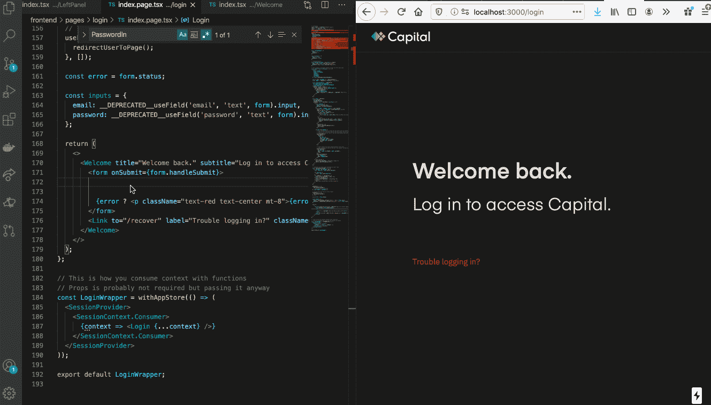
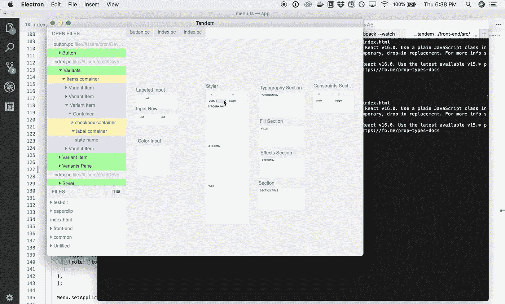

# 关于创建 UI 生成器的课程

> 原文：<https://levelup.gitconnected.com/lessons-around-creating-ui-builders-46ceeaea327f>

Web UI 工具是我几年来一直感兴趣的东西，主要是因为目前的 Web 开发是多么令人痛苦。

非常慢的 HMR

开发人员必须等待几秒钟才能在浏览器中出现更改，由于 UI 开发是如此反复，所以这段时间会越来越长。必须有一种更快的方法，更像绘画，所以我开始创建一个更好的工具来构建 ui。

尽管我对创造出*可行*的东西很有信心，但试图想出一些*实用*的东西远比我想象的更具挑战性。在过去的 4 年里，我有过许多失败的想法，但我过得很开心，也学到了很多东西。

# **V1:构建一个可以编辑任何东西的可视化编辑器**

早在 2016 年，我第一次尝试 UI 工具是雄心勃勃的。这个想法是允许用户在 UI 编辑器中打开他们现有的应用程序，并允许他们立即开始进行更改。

该编辑器可以运行任何类型的 web 应用程序，并且可以根据源代码映射(React、Less、SCSS、Angular，只要你能想到的)写回源代码。这是另一个编辑对实时网站进行更改的演示:

然而，事情很快就不了了之。首先，构建者不能为所有场景编写源代码，比如计算数据。以此为例:

假设`a=b`和`b=2`，用户将在 UI 生成器中看到`3`。由于这是计算出的信息*，*，它需要是不可编辑的，因为 UI 构建器不知道是编辑`a`还是`b`。这是一个基本的例子，但事实证明*很多应用程序代码是以一种很难回溯和编辑的方式计算的。我的解决方案是将 UI 生成器限制在应用程序中可以轻松编辑的部分，但是用户体验很混乱，因为可编辑和不可编辑代码之间没有明确的界限。*

编辑器还存在许多其他问题:有时它会在不正确的位置编写源代码(源代码映射并不总是准确的)，一些框架在没有猴子补丁的情况下无法加载，某些本机调用无法工作，如 getBoundingClientRect(这无法修复，因为编辑器使用了浏览器 VM)。问题越来越多。

最后，这个项目太大了，花了我所有的时间来管理。一个更好的方法是从小处开始，有清晰的边界，然后从那里开始迭代。

# V2:构建一个表示组件编辑器

为了步入正轨，我从一个问题开始:我如何使用 UI 生成器本身来创建它？我认为，如果编辑器可以用来构建自己，那么它就可以处理任何复杂的情况。

逻辑从一开始就被排除在范围之外，因为我无法想象我会可视化地构建一个编辑器及其所有逻辑的任何场景。在这种情况下，手写代码是最好的媒介。另一方面，编辑器的*外观*可以在视觉上构建，围绕它的界限非常清楚。组件、插槽(在组件的不同部分插入子组件的能力)、变体和动态属性是 UI 构建器真正需要覆盖的唯一内容，所以我只关注这些特性，加上一个允许用代码连接表示组件的 API。

最初，我想构建一个允许用户不受限制地自由绘制画布元素的东西。这个想法是要有一个类似于 Figma 的用户体验，然后允许用户在完成后用布局信息来注释元素，类似于 [Pagedraw](http://pagedraw.com/) 的工作方式。

我认为，如果用户可以像这样在画布上自由拖动元素，下一个发展将是允许 Figma 设计直接导入。

在实践中，这种方法失败了，因为我发现绝对定位元素的结构并不总是反映响应性 UI 的需求。

在画布上随意拖动元素经常会产生 HTML 和 CSS，为了添加布局信息，我不得不完全重构它们。真是一团糟。为了解决这个问题，我想到在抽象 HTML 和 CSS 的自定义布局引擎的基础上构建 UI 控件，但是考虑到 CSS 可以变得多么复杂，这似乎不是一个安全的想法(公平地说，使用有限的 CSS 功能可以做很多事情，所以编辑器不需要做所有的事情，但是自定义布局引擎仍然是一个很大的飞跃)。我需要开发我确信可以处理所有情况的工具。

我觉得编辑器最好从一开始就指导用户正确地编写 HTML 和 CSS，不要抽象*。**要求用户体验更多的是在 HTML 和 CSS 之上的增强。这是我对此的第一个看法:*

*这感觉好多了。接下来，我用编辑器源代码连接了一些设计文件。此时，我几乎停止了编写 JSX 代码，转而使用 UI 编辑器。*

*UI 控件逐渐成形。这是样式面板的早期截图:*

**

*这是编辑器最终汇集成的有用的东西:*

*在这一点上，用户体验开始变得更加完美。这是一个正在创建的单选按钮的演示:*

*快进一点，实现了像拆分视图、全局 CSS 变量和混合这样的特性:*

*在这个项目接近尾声时，编辑能够从头开始项目，运行 CLI 命令，并运行 UIs live。*

*此时，我正在收集关于这款应用的反馈。在与开发人员和设计人员进行了几十次一对一的会谈后，我得到的大多是不冷不热的回应。有些人很兴奋，大多数人没有。我意识到我构建了一个站在设计师和开发人员中间的东西，同时没有完全满足任何一方，包括我自己。设计师不喜欢受到 CSS 的限制，开发人员也不想为了可视化地编辑 HTML 和 CSS 而切换环境——只是大多数时候用手写更容易。*

*我有足够的反馈来失去兴趣。还有一些大问题也于事无补:*

1.  *UI 文件在 JSON 中，您需要使用编辑器进行更改。这给协作、调试和维护等工作带来了各种各样的问题。最好是使用可读且可手工编辑的文件格式。*
2.  *在某些情况下，样式面板会碍事。例如，如果我想添加一种背景颜色，我需要在添加之前滚动所有选项。作为一名开发人员，我已经知道 CSS 属性的大部分时间(我也有智能感知来帮助我)，所以通常更容易键入它。*
3.  *我有时需要当时只能用文本表示的怪异 CSS 行为:`calc`、伪元素(`:before`、`:after`，以及其他 fringy CSS 特性。我本可以为这类功能添加更多的 UI 控件，但那是我没有精力去做的*大量*的工作。*

*编辑的跳跃太大了，感觉*偏离了*。我认为许多问题本来是可以解决的，但是不稳定的基础没有让我对方向有信心，所以我放弃了。不过，我还是学到了一些积极的东西:*

1.  *对编辑人员来说，最大的好处是可以立即看到变化。*
2.  *样式面板对于对颜色、排版和阴影等进行微调很有用。*
3.  *孤立地创建表示组件感觉非常有效率，因为我只需要考虑 HTML 和 CSS。表示组件和逻辑之间的界限也是清晰直观的。*
4.  *除了围绕数据模型的一些问题，总体来说它的伸缩性相当好。见鬼，我能够在编辑器中构建编辑器 UI！*

*于是，我决定重新开始。*

# *V3:构建以代码为中心的可视化工具*

*我构建的第一个编辑器是为处理所有的代码而设计的，这并不是很好，因为可视化工具并不总是能够编辑应用程序代码。我构建的第二个编辑器感觉不太好，部分原因是 JSON 不适合存储复杂的 HTML 和 CSS。这让我想到了中间的某个地方:一种围绕视觉开发设计的微型语言。*

*我开始构建一种仅限于表示组件的模板语言。它的表达能力足以构建大多数用户界面，但也有足够的局限性来支持 UI 工具层。模板语言只关注简单行为的另一个原因是，我不想对逻辑的走向有任何困惑。逻辑放在应用程序代码中，UI 代码放在模板语言中(只有 HTML、CSS 和基本组件)。*

*这是我想到的原型:*

*回到代码和 HMR 的经历。*

*我将这个项目命名为回形针，以反映它是最小的、轻量级的，并且兼容多种语言和框架。*

*我以前的可视化编辑器的一个问题是，对于大文件，性能开始下降，所以我决定构建我能想到的最快的东西:Rust 中内置的预览引擎。设计文件也被限制为 HTML 和 CSS，这样它们可以保持轻量级，不会给 Rust 引擎带来压力。以下是我经过几个月的润色后得出的结论:*

*我添加了测量工具、画板、颜色选择器，并更新了语法。*这感觉棒极了*，似乎是朝着正确的方向迈出了一步。*

*一年多以前，我在我的工作( [Hum Capital](http://humcapital.com) )中引入了曲别针，我非常高兴它对团队中的每个人都有帮助。为了让回形针更容易被设计者和任何想要建立用户界面的人使用，还有很长的路要走，我将继续和我的团队一起努力，帮助回形针朝着这个方向前进。现在它已经成熟了一点，我真的很高兴分享它。下次，我会告诉你更多关于它的事情！*