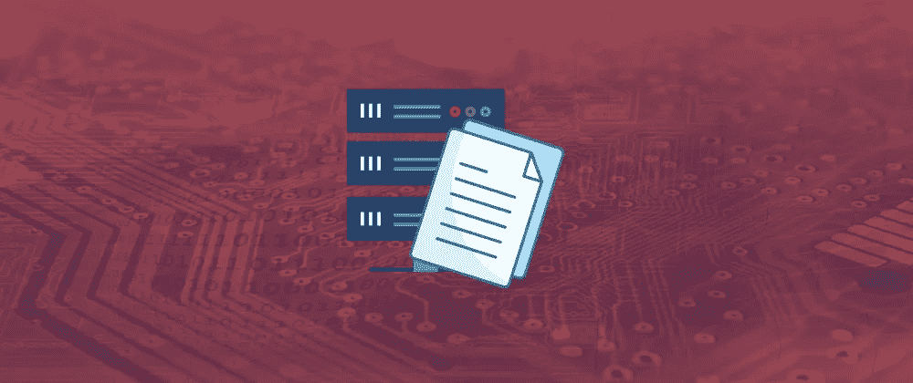

# 来自我家庭实验室的教训

> 原文：<https://levelup.gitconnected.com/lessons-from-my-homelab-e4a9790e66cb>

我运行 homelab 已经有一段时间了，在它的生命周期中经历了几次不同的迭代。它从单一服务器设置发展到多节点高可用性配置，使用旧的企业计算机消耗大量电力和硬盘。最近，我经历了一次搬家，并做了一些计划来缩小规模，使我的家庭实验室更加紧凑，这让我思考了一下我从实验室及其不同形式中学到的所有东西。我想写这篇文章来分享我在这个 homelab 上运行和学习的一些经验，希望能帮助你做出更好的决定，开始一个实验室或你现在正在运行的需要我再次建立的实验室。

# 将配置存储为代码

假设你正在建造你的实验室并安装任何应用程序。在这种情况下，我建议你尽早开始研究配置管理工具，比如 [Ansible](https://www.ansible.com/) 、 [Chef](https://www.chef.io/products/chef-infra) 、 [Terraform](https://www.terraform.io/) 以及其他一些工具。

这些工具可以让您根据自己编写的代码在主机上一致地应用配置，并使您能够开始像对待牛而不是宠物一样对待实验室中的组件。你将开始发现，把这些配置作为代码来关注。您将开始遇到更少的错误和独特问题，因为这些工具鼓励在安装应用程序或管理主机时使用最佳实践。

如果你对 DevOps 或者仅仅是常规软件工程感兴趣，这些工具在行业中也是非常有用的。总有一些配置可以从代码中存储和操作，随着工具使部署更接近源代码的应用程序变得更加容易，这种配置变得越来越重要。随着 Docker 和 Kubernetes 之类的东西的出现，你会看到这一点，它们使运行时环境的配置接近应用程序源代码。

# 为你的实验室搭建一个个人平台

一旦你开始在你的实验室中设置几个应用程序，你可能会想，我们如何开始使它更容易访问和管理。我认为实现这一点的最佳方式是将您的实验室视为您的计算平台，并运行一些服务来更好地支持该平台。这个平台可以包括以下内容:

*   集中式日志记录和警报
*   单点登录和身份服务
*   VPN 和网络

通过设置这些类型的工具，您可以专注于了解您想要的东西，而不是必须为每个服务实现 SSL 之类的东西。如果你在你的实验室中开发了一个这样做的模式，更好的是，使它可脚本化或可配置，以便在你的实验室中做更多的事情，同时保持它的安全性，因为你可以在你的平台中一致地实施那些最佳实践。假设你想进一步研究这个问题，在你的实验室里检查一下这些类型的项目。

*   使用免费工具为您的实验室及其所有服务设置 SSL，例如[让我们加密](https://letsencrypt.org/)
*   [Docker 注册表](https://docs.docker.com/registry/)用于本地直通缓存或存储私有映像
*   使用 [Graylog](https://www.graylog.org/) 、 [Grafana](https://grafana.com/) 和 [Prometheus](https://prometheus.io/) 等工具记录和监控您的实验室

# 选择一个大小合适的实验室

如果你在像 [r/homelab](https://www.reddit.com/r/homelab) 这样的论坛上呆过一段时间，你可能会看到一些优秀的实验室，它们在一个看起来非常令人印象深刻的大型服务器机架中使用多台机器。我要警告你，当你开始建造你的实验室，了解更多关于你可以使用的设备时，你会有购买的冲动，并不断地给实验室增加又吵又贵的机器。

您将希望远离仅仅花费时间和金钱来积累这些您不利用计算资源的机器，因为您不会增加复杂性、电费和噪音。当你还在学习的时候，考虑先使用一台机器来了解管理你的实验室和管理你可能正在运行的应用程序的基础知识。

稍后，如果你想，是的，我想学习如何管理大型主机组或托管高度可用的应用程序，你应该看看如何有效地扩展你的实验室，以适应你的家庭实验室的新学习目标。这种评估应该是一个持续的过程，无论你何时考虑增加你的实验室，计划你需要它做什么，并得到适合这项工作的设备。

# 不要买旧垃圾

在您的实验室中，您可能会混合使用新的或旧的硬件，并且通常用于您的家庭实验室。我会鼓励这种做法，因为它能让你花更少的钱更快地建设，这总是有利于让更多的人学习，并减少进入门槛。但我会分享一个警告，当你为你的家庭实验室购买二手硬件时，不要买垃圾是很重要的。

在为您的实验室购买硬件之前，请确保您首先做了调查，确定您需要什么功能，并留意一些关键的东西，如机器的功耗和噪音，如果您以前购买消费产品，可能不会考虑这些问题。如果您正在寻找一些目前仍然值得您花费时间和金钱的硬件推荐，请尝试查看以下系列产品。如果你在二手市场上找不到你所在地区的那个系列，看看下一个更新的版本。

*   第 13 代-戴尔 R30s
*   第 14 代-戴尔 R40s
*   惠普 DL360 G8 和 DL380 G8
*   惠普 DL360 G9 和 DL380 G9

一般来说，在二手市场上买得起的家用企业设备的经验法则是:查看惠普和戴尔等主要品牌的支持页面，并查看其设备的支持期限何时结束。你通常会在 craigslist、Gumtree 和易贝等网站上发现大量出售或免费出售的设备。随着支持终止日期的临近，组织会淘汰旧设备并将其投入市场，以收回一些设备成本。尽管如此，我们还是很乐意以优惠的价格购买我们实验室的设备。

# 包扎

所以，在结束这篇文章之前，我想提醒你，你需要享受你的实验室，你应该把它作为另一种工具，以一种非常实用的方式参与和发展你的技能。但是，如果它开始花费太多的钱或造成太多的压力，也许是时候退一步，做一些规划，甚至缩小规模，如果这是最好的决定。

现在走出去，为自己创造一些有趣的东西，并从中获得乐趣！

# 进一步连接

*   如果你正在考虑购买一份中等订阅，你可以通过我的推荐链接来帮我。
*   查看我在[媒体](https://medium.com/@aaron-kt-berry)上的其他文章，如果你想了解最新消息，请通过[电子邮件](https://aaron-kt-berry.medium.com/subscribe)订阅。
*   如果你想聊天，请在 Twitter 或 LinkedIn 上联系我，如果你想雇佣我，我在 Codementor 上。