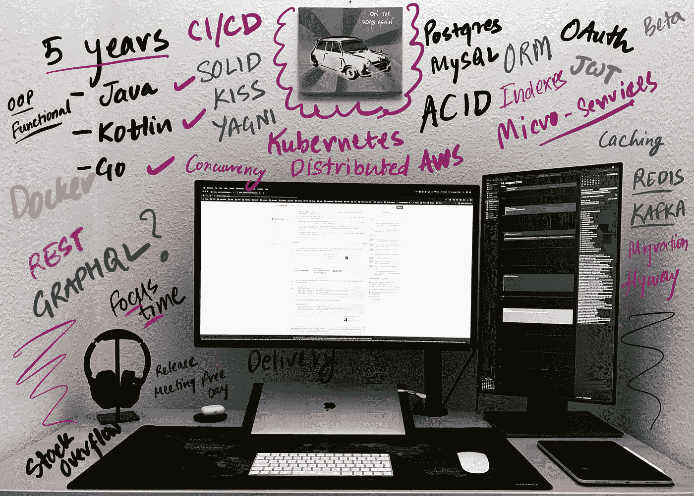
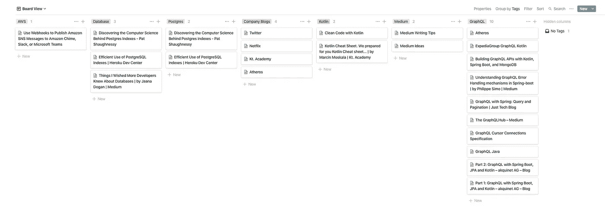

# 作为一名软件工程师，我在 5 年里学到的经验教训

> 原文：<https://levelup.gitconnected.com/lessons-ive-learned-in-5-years-as-a-software-engineer-ee483f12d83a>

## “让你到这里的东西不会让你到那里”——马歇尔·戈德史密斯

我的桌面设置

它花了时间来建立上图中可见的桌面设置。这与我在过去 5 年中作为一名软件工程师的发展非常相似。与各种组织一起成长和工作需要耐心和努力。一路走来，我参与了各种各样的项目和技术，最近完成了 5 年。这是我学到的一系列教训。我希望它对你的软件工程师生涯有所裨益。请随时在[推特](https://twitter.com/maniish_jaiin)上找到我并给我发消息。

# 你和你的工作应该是可替换的

等等，什么？

我刚才说了吗？

这听起来可能与直觉相反，但实际上，这是你在开发软件时应该牢记在心的事情。软件行业节奏很快，你很快会得到一个更好的机会，迫使你跳槽。如果你考虑到这一点设计了这个系统，接替你的人会感谢你的。[坚实](https://itnext.io/solid-principles-explanation-and-examples-715b975dcad4)原理坚实是有原因的。你应该总是试着遵守它们。此外，当系统增长时，很难跟踪决策。这就是为什么分享和写下你所知道的东西很重要，这样其他人就不必花大量的时间从代码中解密信息。

# 质疑一切，不做任何假设

记住这条经验法则，每当有疑问的时候，就提出问题。它意味着了解它真正的含义。我犯的一些最大的错误是由于误解。有时它小到错过了一个在现实生活中永远不会发生的边缘情况。有时会更大，比如期望另一个团队来解决一个特定的问题，或者假设整个系统以某种方式工作。在这些情况下，只有一个错误，那就是做出假设。对问题和解决方案更加明确和详细将有助于您从一开始就抑制较小的错误和问题。

# 不要纠结于技术/框架，要纠结于核心概念

技术和框架会来来去去，市场上有如此多的技术和框架，可能会势不可挡。但都是建立在核心概念上的。如果你理解了这些概念，那么在框架、语言和工具之间的转换将变得毫不费力。考虑一个关系数据库的例子，有很多关系数据库，但是如果你理解基本原理，比如 ACID 属性、索引、事务管理、并发性，你就不必担心可用数据库的数量。

# 你周围的人很重要

对于一份全职工作，你一天至少要工作八小时，一周工作五天。那是你生命中很重要的一部分。这意味着和你一起工作的人对你和你的整体幸福有着不可思议的影响力。我合作过的最好的团队是我真正喜欢花时间的团队，不管我们在做什么。这意味着我非常关心谁会被团队雇佣，谁会最终成为我的队友。

> “在你感到有点不安全的地方与人共事”Alphabet 和谷歌首席执行官桑德尔·皮帅

当我们乐于向他人学习时，我们会受益于他们的经验以及我们自己的经验，我们可以继承他们的智慧和知识。我们周围的人对我们的行为、态度和结果影响最大。当我们和某人在一起一段时间后，我们倾向于继承他们的习惯。有时是故意的，有时是自动的。这就是为什么在换工作时考虑到这一点是非常重要的。不仅仅是头衔和薪水。

# 做一个问题解决者，而不仅仅是一个程序员

作为一名软件工程师，你需要明白编程只是一种工具。认识到你写代码的能力是你解决问题的工具箱中的一个工具。因为你首先是一个解决问题的人。学会识别你面前最重要的问题，并准备好运用不同的观点来解决问题。不要只应用程序员的视角。你必须学会对你面前的系统有一个整体的看法！

参考开头描述的“软件工程师”的定义，你必须考虑很多事情，这样你的用户/客户才能从你提供的应用程序/解决方案中受益。

# 按照自己的节奏工作

杰夫·贝索斯关于工作与生活平衡的观点:

> “如果我在家很开心，我会带着巨大的能量来到办公室。如果我工作愉快，我回家时会精力充沛。”

不要贪多嚼不烂。每个人都是不同的，并受到生活中不同事情的激励。你必须弄清楚你的动机。不要跟着你周围的人做什么。找到你生活中的平衡，并努力实现它。如果你想在这里呆很长时间，这是很重要的。你得把这当成一场马拉松。按照您的速度跑步，休息一下，享受旅程。

# 避免破坏性的心态

在成为一名优秀的软件工程师的道路上，有很多事情会扼杀你，而且通常它们是难以识别的精神状态，因为它们是内在的，是你的一部分。自从我开始编程以来，我学到了一件事，那就是所有不成功的开发人员通常都有相似的特质。有时候知道要避免什么比知道要做什么更重要。比如说，什么都答应。

我在我的另一篇博文中详细阐述了这些特质。

 [## 不成功开发者的 5 种心态

### #3 学习只发生在工作中

levelup.gitconnected.com](/5-mindsets-of-unsuccessful-developers-5d9bd5e4f700) 

# 没有测试的代码是你最大的敌人

编写测试非常重要，更好的是，学习在编写代码之前编写测试是最重要的。许多程序员认为在编写代码之前编写测试的想法是荒谬的。他们认为这是没有用的，并减缓了开发过程。从某种意义上说，这是正确的，它确实影响了发展的速度。但是如果你的系统没有弹性，那么开发的速度就没什么关系了。

工程师的工作是交付不仅实用，而且可读和可维护的代码。测试驱动的开发可以帮助你做到这一点。

根据 Martin Fowler 的说法，TDD 是:

*   为您想要添加的下一个功能编写测试。
*   编写功能代码，直到测试通过。
*   重构新旧代码，使其结构良好。

TDD 最重要的一个方面是它将焦点从如何转移到问题的什么上。这种心态将帮助你成长为一名软件工程师。如果您正在寻找 TDD 的示例实现，请考虑阅读本。

# 成为收藏家

嗯，这是断章取义，但听我说完。我的意思是收集你偶然发现的资源。博客文章、视频、演讲以及它们之间的一切，保存它们，并以一种可以在以后使用的方式组织它们。

来自作者的截图

上图只是一个例子。你可以找到更好的管理方法。你肯定会多次解决一个问题，或者多次实现同一个解决方案，而不是在互联网上到处寻找你最初是如何解决它的，这将非常方便。我已经在我的博客中写了更多关于这个的内容。

 [## 3 个有助于你成为顶级开发者的习惯

### 这将有助于大大减少返工，并增强您的整体理解

levelup.gitconnected.com](/3-habits-that-will-help-you-become-a-top-developer-7f310fa2c3b0) 

# 深入挖掘，细节决定成败

最近我在和 Hibernate 和 Kotlin 一起工作。我碰到了一个问题，那就是不可能使用数据类来创建实体。在真正找到一篇解释问题和可能的解决方案的好文章之前，我奋斗了一段时间。我没有迅速找到解决方案并付诸实施，而是开始深入挖掘。我观察到，由于与 Kotlin 的兼容性问题，有很多库都有类似的问题。下次当我看到类似的东西时，我可以快速浏览一下这篇文章来刷新我的记忆并完成解决方案。

试着花时间去理解你所使用的不同库和框架的内部工作原理。这将帮助您联系不同的框架，并理解为什么一个比另一个好。你将开始形成在特定情况下使用哪一种的观点。当你看到一些新的框架时，你将能够更快地学会它。该行业发展这一习惯的速度将帮助你在未来几年保持相关性。

# 最后的想法

做一个好的软件工程师很难，需要时间去理解为什么。我分享了我的经验。没有完美的成功秘诀，你必须不断评估不同的选择和方法来实现它。但有一点要记住，你必须对自己非常挑剔。向你周围的人寻求反馈，改变那些不起作用的东西。你必须不断地重新定义自己。

你可以在 LinkedIn(领英)、 [Twitter(推特)](https://twitter.com/maniish_jaiin)和 [Instagram 上随时联系我。](https://www.instagram.com/maniish.jaiin/)

# 其他有趣的文章

 [## 给刚起步的软件工程师的 5 个建议

### 这可能令人望而生畏，但这里有一些建议可以帮助你在混乱中导航

better 编程. pub](https://betterprogramming.pub/5-tips-for-software-engineers-who-are-just-starting-out-72ab2329bc8)  [## GraphQL 最佳实践

### 在使用 GraphQL 6 个月之后，我分享了我对创建 graph QL 服务器的良好实践的想法

towardsdatascience.com](https://towardsdatascience.com/graphql-best-practices-3fda586538c4) 