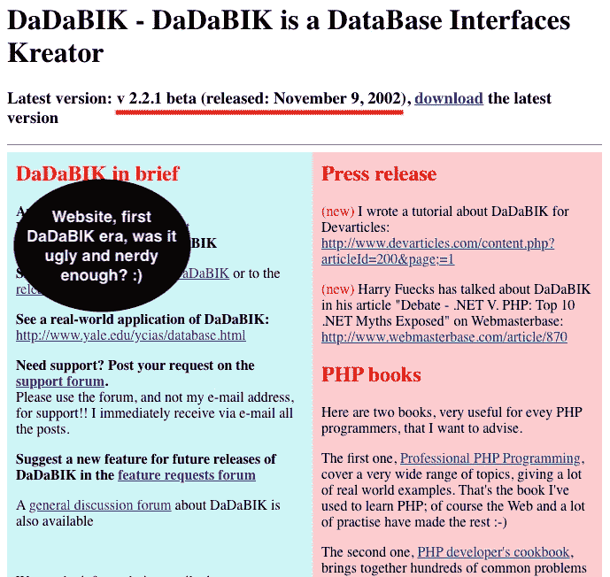

# 20 年来开发、管理和销售软件产品的经验教训

> 原文：<https://levelup.gitconnected.com/lessons-learned-after-20-years-of-developing-managing-and-selling-a-software-product-1fcc05f45b03>

## 给独立软件和数字产品创作者的 25+1 提示

由 [lukasbieri](https://pixabay.com/photos/laptop-business-man-from-above-2838918/) 拍摄

我在 2001 年 11 月发布了第一版 [DaDaBIK](https://dadabik.com) 、 *v. 1.0 beta* ，差不多 20 年前了。

它是一个为 MySQL 数据库自动创建 **CRUD Web 前端**的工具，在 PHP 社区中一炮而红——当时这种类型的工具非常少，我认为几乎所有的工具都是通过*生成* PHP 脚本来工作的，当数据库模式发生变化时，产生的代码就变得过时了。相反，创建一个可以适应和同步模式变化的模型，基本上镜像数据库本身，这是一个相当新的概念。

自从测试版以来，已经发布了 87 个版本。

我经历了几个阶段，它以自由软件的形式发布(自由是指*自由* +免费是指*免费*)，然后我开始要求自愿下载，最后它变成了一个成熟的商业产品。

它已经发展了很多，开始是一个简单的前端创建者(DaDaBIK 代表“Dadabik 是一个数据库接口缔造者”)，现在是一个**完整的低代码无代码开发平台**。

近年来，我直接接触了数百(也许数千)名用户，我面临着技术和管理方面的挑战。

这里是我这些年来学到的经验，一些随机排序的技巧和建议，我不仅想与独立软件供应商分享，也想与任何计划构建和发布(通常是数字)产品的人分享。

# 1.(几乎)永远不会太晚

在 2007-2010 年期间，我停止了 DaDaBIK 的工作。人们仍然在使用它，我花了一些时间回复邮件和论坛帖子，但在那段时间里我没有写过任何 DaDaBIK 代码。

2010 年，我意识到 DaDaBIK 是我创造的最有用的东西，尽管有人告诉我已经太晚了，而且市场上已经出现了许多其他类似的软件，但我决定重新审视我的优先事项，我开始致力于 DaDaBIK，并发起了一场捐款活动来支持我的工作。这个故事说明了一切:不仅不算太晚，而且一个巨大的低代码和无代码的新趋势在 2014 年左右开始了。

我的观点是:现实(以及人们的需求)往往是非常复杂和不可预测的。看似“已解决”的问题可以得到更有效的处理；显然,“死亡”技术可能对新的、意想不到的需求有用。我猜你们大多数人都记得 2010 年《连线》杂志的标题“网络已死。互联网万岁" :)

# **2。从一开始就想得很大**

在 DaDaBIK 诞生之前，我已经用不同的技术(经典的 ASP +配置文件)试验了一个类似的“自动数据库前端”的想法，但是成为 DaDaBIK 的*核心*的东西是在我必须开发一个管理联系人的应用程序时编写的。我决定写一些非常抽象的东西，这将允许我在不修改代码的情况下为联系人添加新的属性(例如，新的地址字段)。事实证明，它足够抽象，可以用于*任何*数据库，甚至非程序员也可以使用，这就是 DaDaBIK 的故事的开始。

我的观点是:试着从第一天开始，就考虑你的产品可能的发展，为你的软件在几年后的发展打下基础。不要害怕大胆梦想。

# 3.专注于你的焦点和生产力

我使用[番茄工作法](https://en.wikipedia.org/wiki/Pomodoro_Technique)已经很多年了。我认为这真的很有帮助，我建议每个人都试试。

我没有特别使用任何 app，只是在手机上放了一个 20 '的定时器(原来的间隔是 25 ')。我尽量不让自己分心:在吃番茄大战期间，我的手机处于飞行模式，电子邮件客户端关闭，我倾向于与任何社交媒体平台断开连接，开始工作(编码、思考如何实施某事、计划、学习……)。

如果我写代码，我会听音乐(没有人声的电子音乐，有时是 techno)。另一方面，如果我必须学习，思考如何解决一个具有挑战性的问题或写内容，音乐太让我分心了，我更喜欢安静。
在一个*番茄和另一个*番茄之间的休息时间，我会尝试做一些完全不相关的事情，例如，如果我的 [guitalele](https://en.wikipedia.org/wiki/Guitalele) 在附近，我就会玩它。

如果你发现自己更有效率，我认为最好不要仅仅为了增加更多的工作而使用你赚来的时间，我认为重要的是通过花时间在一些令人愉快的、不相关的活动上来奖励自己。通常我不会，但我觉得我应该。

如果你很难找到一个概念性问题的解决方案，试着把注意力放在别的事情上和/或做一项体育活动。我的一些最好的想法是在散步、骑自行车或骑 Vespa 的过程中或之后产生的。

# 4.就像你是最终用户一样进行测试

你是单元测试专家吗？这还不够。

你应该尝试复制你的用户的整个体验。我时不时地尝试在谷歌上搜索类似于 DaDaBIK 的软件，购买并下载 DaDaBIK，安装它，并在过程中出现一些对我来说不是 100%清楚的事情时查看手册。

我也使用我的产品来创建我开发的大多数应用程序，这将把我们带到下一点，*吃你自己的狗粮*。

# 5.吃你自己的狗粮

你应该成为你产品的第一个用户，不仅仅是因为你必须测试它，而是因为你喜欢它。如果你不喜欢你的产品，或者认为它没有用，那么就是出问题了。

# 6.营销和沟通很重要

似乎很明显，对吧？对于许多软件开发人员来说，包括我自己，这可能不是那么明显。

不要认为营销是一种强加你的产品的方式，尽管它有价值，而是一种将你的产品的真正价值传达给正确的人的方式。

这些年来，我收到了许多电子邮件，开头都是“我已经寻找这个产品很多年了！”原因很简单:我从未在市场营销上认真投资，许多潜在客户甚至不知道 DaDaBIK 的存在。几乎所有的购买都来自于有机搜索、之前版本的升级和口碑。

从这个角度来看，我教不了多少东西，不仅因为这不是我的专业领域，还因为，正如我所说，我可能不是一个好榜样。我只能强调这一点的重要性，即使你是一个小型的独立软件供应商。

# 7.售后支持是金

只有一件事比不提供支持更糟糕:提供糟糕的支持。我说的糟糕的支持是指:自动应答器、聊天机器人或没有必要知识的人。更糟糕是因为它令人沮丧——作为用户，你不仅没有得到你需要的东西，而且你觉得你在浪费时间。如果你生产的软件被其他软件开发者使用，这一点尤其正确(一些 DaDaBIK 用户*就是*开发者):

这很可悲，但我认为我们现在已经习惯了得不到支持；尤其是当你与大供应商打交道时，你经常要通过表格、聊天机器人、自动过滤器，甚至当有人最终回复时，你会觉得这只是一个标准答案。如果你提供高级支持服务，这意味着你的用户只需要发送一封电子邮件，他们将在几个小时内从*专家*那里得到答复，这将非常非常受欢迎。相信我。

如果你能自己处理大部分的支持，那太好了。如果你需要授权，确保相关人员非常了解你的产品。如果你的客户意识到他们比你的服务台员工更了解你的产品，他们会开始讨厌它。

# 8.与你的用户交流。字面上。

我和 DaDaBIK 用户的关系一直很密切，我亲自回复了数百封电子邮件，我想我知道几十个用户的名字。这是好事吗？嗯，当你过于个性化你的产品时，你可能会有副作用，但总的来说，我认为与你的用户交谈是非常重要的。

几年来，我让一小群用户参与了一个私人测试程序。他们可以在正式发布之前试用即将发布的新的主要版本。我安排了一个简短的 Skype 电话，和他们每个人打了一个电话，问他们喜欢和不喜欢他们正在测试的产品的什么。

这对我来说非常有用:不仅用户给了我很好的建议(他们通常是有经验的用户，已经用 DaDaBIK 构建了许多应用程序),而且我能够在没有过滤器的情况下看到并理解 DaDaBIK 的一些典型用例，DaDaBIK 是如何使用的，背景是什么以及用户的(有时是意想不到的)期望:这对于微调 DaDaBIK 路线图非常有用！

你可能认为你可以通过电子邮件、论坛或任何其他书面交流方式做到这一点。是的，你可以而且应该与你的用户建立一个强大的书面沟通渠道，但是口头的、面对面的(网络摄像头对网络摄像头)沟通是不同的、更丰富的——我非常确定有些事情人们不会写在电子邮件中，因为需要太长的时间来形式化它们，但是他们很乐意在非正式的聊天中分享它们。

**不要*假设*** 你知道谁是你的典型用户/顾客，你可能不知道。

# 9.投入大量时间来设置您的开发工具

您使用的工具(如代码编辑器)会对您的生产力产生巨大的影响。你应该花时间选择它们，并仔细设置它们。一旦你选择了你喜欢的工具，试着成为它们的超级专家，不要浪费时间去尝试任何新的选择。也许你可以定期检查一些新的东西，比如每六个月一次。

我喜欢轻便快速的应用程序。我受不了“纺车”:)

我只想就我的两个基本开发工具说几句话:

*   **BBEdit** 。([https://www.barebones.com/products/bbedit](https://www.barebones.com/products/bbedit))
    我用它写代码已经很多年了。它很快，很轻，做一件事(代码编辑)非常好，而且(几乎)一切都在它应该在的地方。我也用它来写普通文本(如果只是纯文本)，做笔记和写内容草稿，然后用其他软件格式化。对于一般的文本内容，我最近也尝试过[尤利西斯](https://ulysses.app)，但最终还是回到了 BBEdit。
*   **BetterTouchTool**([https://foli vora . ai](https://folivora.ai/))
    我对 Andreas hegen Berg(《BetterTouchTool》的作者)感激不尽。这个工具节省了我大量的时间。我设置了许多键序列，允许我插入任何类型的文本片段:我经常使用的代码片段、电子邮件地址、签名、日期/时间相关的文本、git 命令，甚至整个电子邮件模板。我还有一些快捷方式，允许我在不使用鼠标/触控板的情况下执行我最常做的操作(例如，打开特定文件、特定应用程序或在窗口上执行某些操作)。我讨厌不得不做同样的工作两次，而 BetterTouchTool 经常允许我避免这样做。
    最后，我也经常使用内置的剪贴板管理器，这也是一个宝贵的时间节省器。

有时候没有一个针对特定工作的*标准*工具，你必须构建它；例如，我创建了我的定制*部署工具*和一些让我在发布新版本之前更容易测试的工具。

当我谈到开发工具时，我不仅仅指软件，我也指硬件。使用你感觉舒适的设备对你的工作效率和健康是必不可少的。我认为这是一个非常主观的领域，你应该阅读评论、规范、分析，但不要假设一般的解决方案总是适合你的，总是尝试不同的选项，直到你找到正确的。

在尝试了许多设置之后，我用了将近 15 年的是一台正好位于外部显示器前面的笔记本电脑；作为高支架上的外部显示器，我可以清楚地看到两个显示器一个在另一个下面，但我主要使用外部显示器。我认为这对大多数人来说很奇怪，但对我来说这是最舒适的设置。

十多年前我就停止使用鼠标了。我只使用触控板，不仅速度更快(我不用把手从键盘上拿开)，而且对我来说也不那么累。有时我不得不使用鼠标(例如，如果我需要在实验室使用台式电脑)，但它感觉非常不自然，并导致挛缩/背痛。永远不要低估你的身体给你的信号，试着了解原因，并与医生交谈！

# 10.憎恨者将会憎恨

如果你的产品取得了一定程度的成功，某些时候就会出现一些*憎恨者*。希望你不会被侮辱，但是你会遇到一些人(用户、顾客、潜在顾客)会开始批评你的工作**，仅仅因为那是他们的行为方式**或者因为他们认为他们可以从中受益。
对我来说，幸运的是，这个比例非常小。我只记得 3-4 个令人不安的案例。在一个由成千上万用户发布的近 2 万个帖子的论坛中，我只使用过一次 **ban** 。

当你注意到你不断收到来自某人的包含非建设性批评的信息或评论时，停止回应，不要在他们身上浪费额外的一分钟，每一分钟都是你可以投资改进你的产品的时间，你可以投资照顾欣赏你的工作的客户或提供负面(但建设性)反馈的人的时间。

在过去的 20 年里，我回复了数量惊人的电子邮件和论坛帖子，我意识到我已经浪费了太多时间回复某些信息，只是因为我认为这是正确的事情；我不再这样做了，我的时间很宝贵，如果我不再回应那些只想用自命不凡的请求浪费我时间的人，我也不会觉得自己很粗鲁。

# 11.从一开始就处理好法律事务

当你作为一个小型独立软件供应商开始一个新项目时，你可能会被诱惑推迟法律事务(许可、使用条款、隐私政策等)。原因很简单:对于软件开发人员来说，这没有编码有趣！不要误会我的意思，当然这是你应该委托给律师的事情，但仍然需要你的参与，你可能更喜欢专注于构建你的产品。这是不对的。如果你的产品会变得受欢迎，在某个时候你会后悔的。从你的第一次发布开始，就认真地处理好法律事务。

# 12.向你的用户清楚透明地解释事情(不要害怕交流大的变化)

在 DaDaBIK 的早期，人们可以免费下载它。这是一个附带项目，我喜欢做它，所以它很好。我收到的信息、受欢迎的程度、杂志上的文章都足够让我受益。

然而，在某个时候，我意识到如果我想认真地发展我的产品，我需要一种不同的方法。DaDaBIK 变成了商业软件，然后也改变了它的许可证。这是一个很大的改变，我向用户解释了我的感受和我的需求，并准备好面对任何形式的批评。批评实际上比我想象的要少得多，从这个巨大的变化开始，产品开始不断改进，比以前好得多。

当然，我并不是说这是所有软件项目的必经之路！这只是一个例子，关键是有时候你太保守了，你害怕改变，你把这种恐惧投射到你的用户/客户身上，他们比你想象的更愿意接受改变！

# 13.让您的客户参与路线图

这与另一点(与您的客户交谈)有很大关系，但在这里我想强调一个事实，即您客户的意见应该对您的路线图有影响。

我尝试过不同的工具，我总是在思考新的方法。

我有一个致力于“特性请求”的论坛，在那里用户可以提交新的特性和对其他用户提议的评论。

几年来，我让一部分用户(根据他们的经历，我认为他们可能会给讨论带来更多的价值)来决定下一个主要版本应该包含哪些特性。我使用了一个简单的共享文档，用户可以在其中写下自己的提议、评论，并对其他用户的提议进行投票。

在过去的两年里，我一直在使用一个专门的反馈平台，允许用户描述他们认为 DaDaBIK 缺少的功能，对其他用户的建议进行评级和评论。

需要考虑两个方面:

*   一个非常小的(但也可能是非常嘈杂的)用户子集将他们的特定需求视为一般需求，并假设某个特定的功能将仅因为他们需要而被实现。发生这种情况，你需要管理它。使用专用工具清楚地向每个人显示每个提案获得了多少赞成票会有所帮助。
*   在我看来，你的用户不应该决定 100%的路线图。你应该对你的产品有自己的愿景，你希望它变成什么样。有一些关键的特性、增强或者选择，你觉得对你的软件的未来是战略性的，不一定需要提前与你的用户分享。

# 14.停止使用所有可用的新框架/工具/语言。

或者你喜欢就去做，但不要假装这是真正的工作。

此外，不要假设人们在博客上谈论的，在特定时间看起来是一种“趋势”的东西，就是软件开发人员实际上用来生产现实世界应用程序的东西。

# 15.理解创新与炒作

你应该拥抱创新，但你也应该理解炒作。我 8 岁时开始在 Commodore Vic-20 上编程，我已经看到了 IT 行业中如此多的趋势和周期(语言、方法、范例、工具等等)，我想我现在可以在一英里之外闻到炒作的味道。

我知道这很难相信，但许多软件开发人员，当谈到新的和最酷的技术时，是最糟糕的时尚受害者。

# 16.不要重新发明轮子，但是如果你对现有的“轮子”感到不舒服，就去做

近年来，对于我们代码中越来越多的部分，编写工作已经委托给预先存在的外部库。总的来说，这很有意义，如果已经有一个可用的、编写得很好并经过数千人测试的用户认证模块，我为什么还要重新发明轮子并从头构建一个用户认证模块呢？这将是浪费时间，最好专注于我的项目最具体的代码。

然而，我经常看到有人在将代码的重要部分外包给外部模块时过于放松。

使用你在 GitHub 上找到的第一个库作为你软件的关键部分，仅仅因为它是免费的，看起来很酷，并且有很多分支不是一个好主意。你应该做你的功课，试着理解更多。这个项目是什么时候启动的？作者是否不断发布新版本？有路线图吗？他们看起来对安全感兴趣吗？他们修复安全漏洞的速度有多快？如果你需要支持，你如何获得支持？如果有源代码，你也要看一看，不要假设既然是开源，那么其他很多人都看过，审核过。

# 17.数字游牧

在过去的 13 年里，我经常每年在国外呆几个月，有时是因为学术上的承诺，有时只是因为我喜欢。我总是随身带着工作。

在过去的几年里，数字游牧这个词变得很流行，我认为这个想法已经被社会所接受；相信我，13 年前，大多数人都不相信你可以把所有的工作都放在笔记本电脑里随身携带，不在办公室也能安排好一天的工作:)

我认为这是一个难以置信的机会，我很感激生活在这样一个可能的时代，但是我请你们不要只看到*积极的事情。*

1.  如果你在谷歌上搜索*数字流浪者*，你会看到人们拿着 MacBook 在海滩上工作的照片。好吧，我告诉你一个秘密:你不可能在太阳底下做几个小时的正经工作(其实我的一个朋友可以，但我觉得他是世界上为数不多的！所以忘了把你的办公室搬到海滩吧。
2.  要想富有成效，你需要常规。如果你在一个地方移动了几个星期/几个月，在最初的设置(见下一点)之后，你可以建立日常习惯，但是如果你经常移动(一个星期在这里，下一个星期在那里……)就很难做到。
3.  考虑安装时间。尤其是如果你要搬到国外，总要考虑准备时间。你必须找到一个房子，也许还有一个共同工作的空间，你可能需要做一些文书工作，你需要买一些你不能带走的东西，你甚至需要检查哪里是最好的和最近的杂货店！

然而，生产率并不是一切。离开你平常的家，结识新朋友，不仅会让你成长，还会激发你的创造力(至少对我来说是这样)，这时候就会有新想法冒出来。

找到变化和常规的完美结合绝对是你应该努力的事情。

# 18.控制你的自我

有时候，特别是如果你是一个独立的开发者，并且对你自己的决定负责，你的自我可能会过多地驱动你的选择。你可能想证明你比你的同龄人更聪明，并做出那些允许你这样做的决定，比如决定实现那个特别酷(但不是真正有用)的功能。

倾听你的自我可能会对你的产品产生*一些*积极的影响，因为你有动力去改进它，但是如果你想围绕你的软件创建一个企业，你应该做出那些让你的项目长期可持续的决定。

如果你太听从你的自我，你可能甚至不能授权(见下一点)。

# 19.代表

我想这对我们大多数人来说都很难。你总是觉得**你足够好，你有足够的时间做每件事**，但那显然不是真的。

你应该开始委派那些离你的核心活动*最远的活动*，然后继续那些更近的活动。例如，如果你是一个一人团队的软件开发人员，你可能会从管理任务开始，然后是营销和 SEO，然后是大多数与图形设计有关的事情(你的网站的布局，你的软件的用户界面等等)，最后你可以委托你的代码的有限部分:一个*模块*，一个*库*或者更一般的，所有可以被你的代码的其余部分视为一个*黑盒*的东西。

# 20.不要爱上你的想法

这来自于我博士之初导师给我的一个最好的建议，当你开始做研究的时候，很容易陷入这个陷阱:**你想相信你的假设是真的**只是因为这是一个*迷人的假设*。然而，假说需要被证实；科学就是这样运作的。

当你建立一个产品或服务时，同样的陷阱也存在。你可能认为人们需要你的产品，你的服务，你的用户会喜欢你已经做了几个星期的很酷的功能，但是这些只是猜测。当你了解真相时，如果事实不能证实你的假设，不要害怕承认你错了。

# 21.真的需要外部投资者吗？

你确定你是 startupper 吗？不要假设你符合典型的*创业路径*，也就是说，你从投资者那里获得资金，并试图尽可能多、尽可能快地成长(在某些情况下，不考虑你的初始收入)。也许你更喜欢(和/或你的企业更适合)一条更传统的道路:你从一开始就开始创造收入，你希望缓慢增长，你没有必要渴望有一个庞大的团队为你工作。

# 22.做一些你有热情的事情，它会成功的:错误

建立一些**你**是**热情**和**才华**关于**和**对其他**人有用。在我看来，这是软件产品成功的必要条件。**

这并不意味着你不应该花时间去追随你的激情！试着客观地认识到什么只是爱好，什么可以成为工作。

# 23.你应该认真学习数据库设计和 SQL

[关系模型](https://en.wikipedia.org/wiki/Relational_model)非常古老，但是非常可靠；关系数据库和 SQL 仍然落后于大多数商业应用程序。

在我的职业生涯中，我多次看到基于混乱、复杂和未优化的数据库的应用程序，它们显然是由对数据库设计的基础毫无概念的人设计的。这可能会对应用程序的性能产生巨大的影响，如果应用程序很复杂，这可能会使其他开发人员的工作更加困难。SQL 也是如此。

# 24.保持你的代码整洁并有文档记录

有整本书都在讲述如何编写干净的代码，所以我肯定不能在几行中添加太多内容。然而，我想强调一个特别的方面:当你选择类名、函数名和变量名时，要慢慢来；它们必须随身携带信息，即使多年后你再看那一小段代码也是如此！

你也应该保持你的名字更新:例如，如果你不久前写的一个方法改变了它的目的，你可能想保持它的名字不变；不要这样做，把名字改成实际反映其当前目的的东西，即使这对你代码的各个部分都有影响。

就我个人而言，我更喜欢长名字:如果你使用自动完成功能，打字速度不会明显变慢；当然，你的代码不会很紧凑，但是当你(或其他人)在几年后(甚至几周后)阅读它时，它会更容易理解。).

# 25.提高你的沟通技巧

我遇到过沟通能力很差的有才华的软件开发人员。如果你把工作时间花在编码上，你可能会认为你不需要这样的技能。这不是真的。

首先，如果你拥有一个小企业，你可能会**需要**与你的终端用户/客户沟通。更一般地说，你可能需要与其他软件开发人员和任何为你的产品工作的人交流:解释你的需求或者培训他们**选择正确的简化和抽象层次**是很重要的。

# 26.感激你正在做你喜欢的事情

这里没什么好解释的！

# 最终注释

我希望你不要认为我擅长所有这些事情，对于其中的一些，我真的不擅长！写这篇文章也是鼓励我进步的一种方式。