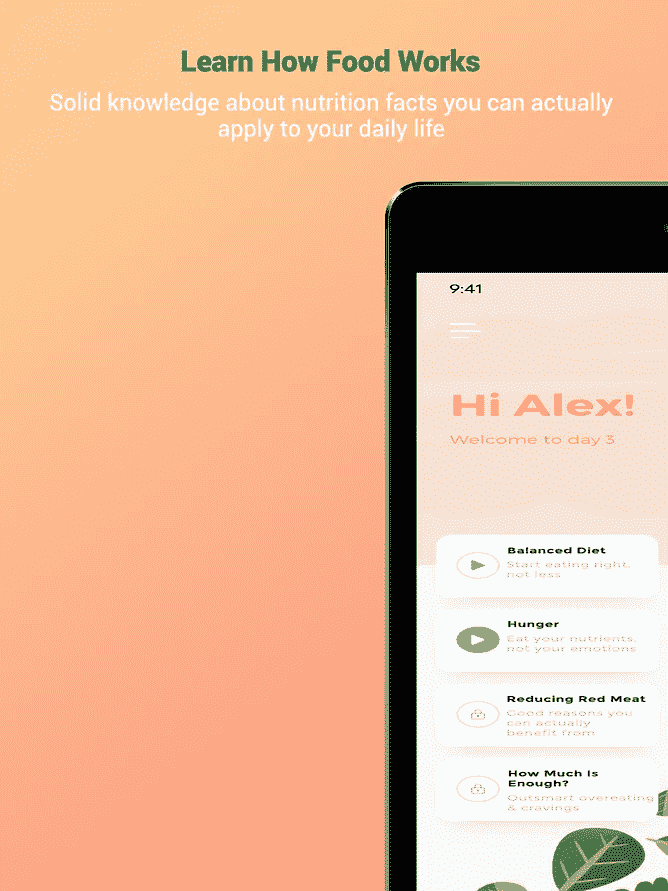
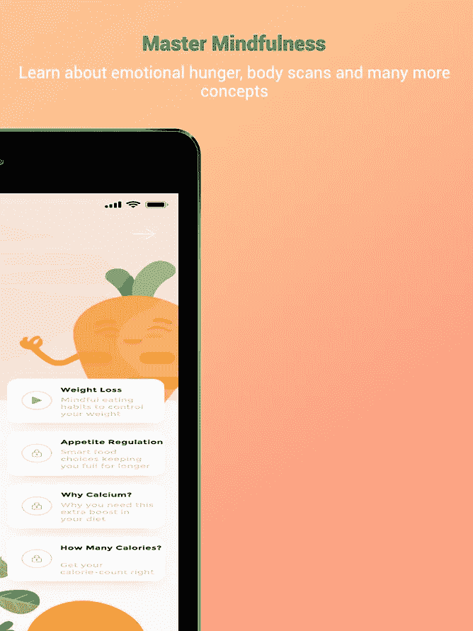

# 通过 Expo 和 React Native 构建多个应用程序的经验教训

> 原文：<https://levelup.gitconnected.com/lessons-learned-building-multiple-apps-with-expo-and-react-native-28bd43b72b84>

使用我们的应用程序创建技术构建的应用程序之一— [Nutridi](https://nutridi.app.audio/)

由[皮达尔·科伊尔](http://www.peadarcoyle.com)和[萨利赫·卡斯姆·李奔](https://www.linkedin.com/in/salihkasimbenli/)

我们用了 [Expo](http://www.expo.io) **managed flow** 一年。以下是我们在过去 18 个月里从一个小型开发团队中学到的一些东西。

afriothmic Labs([www . afriothmic . ai](http://www.aflorithmic.ai))是一家专注于高科技的初创公司，为品牌打造个性化音频体验的平台。我们的客户和用户经常寻找应用程序作为交付机制，因此我们构建了一些**工具来简化应用程序的创建**，在后端连接到我们的 API。

当我们大约 18 个月前开始我们的旅程时，我们的创始人 Peadar 评估了 React-Native、native code 和 flutter。

我们在构建应用程序时的核心理念是，我们希望将我们能做的抽象到我们的后端 API 中，我们希望尽可能地简化应用程序生成过程。

# 我们的移动应用技术堆栈

*   [打字稿](https://www.typescriptlang.org/)
*   [用](https://reactnative.dev/)[博览会](http://www.expo.io/) *反应本土
*   [反应-导航](https://reactnavigation.org/)
*   [Redux](https://redux.js.org/)
*   [放大](https://docs.amplify.aws/)

* *我们受益于令人惊叹的 Expo 团队在生态系统方面所做的所有工作，但自从我们一年多前开始(特别是在 Expo 推出* [*web 支持*](https://dev.to/evanbacon/getting-started-with-expo-web-168g) *)以来，因为我们有许多原生组件，特别是专注于音频的组件，我们基本上是在进行* [*裸工作流*](https://docs.expo.io/versions/latest/introduction/managed-vs-bare/#workflow-comparison) *。*

**历史**

我们选择 React-Native 是因为它是当时最成熟的社区，我们希望在 iOS 和 Android 上共享一个代码库。特别是，我们选择了 react-native 之上的 SDK Expo。我们最终退出了 Expo，进入了裸露的工作流程。然而，在我们开发的头一年里，诸如 [www.withhislight.app](http://www.withhislight.app) (一款使用我们的个性化音频 API 构建的应用)

**哲学**

所有的应用程序背后都应该有一个理念。

对我们来说，在用户体验和我们选择的工具方面，我们有一些指导原则。

*   应该可以在两个平台上运行(Android 和 iOS)
*   我们应该尽量保持代码重叠——尽管我们的代码库中确实有一些特定于平台的代码。
*   如果我们可以购买第三方服务，我们应该购买——因此我们选择了 AWS Amplify 来进行身份验证和早期分析，以及其他工具，如 AWS Lambdas。
*   我们试图让前端尽可能的不可知，所以在可能的情况下，我们把东西放到我们的 API 中。这为我们的代码决策提供了很多信息。
*   我们想要一个世界级的 UX。我们的软件工程师花了很多时间来简化我们在 UX 的体验。我们仍然没有达到我们想要的目标，但我们对自己的经历感到非常自豪。
*   Velocity，因为我们仍在试图找出产品与市场的契合度，所以我们希望尽可能平稳地部署新功能。

我们在 IPad 上的一个应用的一些截图。Expo 使得跨平台变得很容易。

React-native 还允许您使用 React.js 分享一些知识，因此尽管 web 和移动应用程序之间存在差异，但对于对 react.js 有初步了解的人来说，通常很容易学会 native。学习 Java 和 Objective C 要困难得多。

事实上，我们的一个创始人仍然不太懂 javascript，他能够从头开始编写 MVP。他有 python 背景，所以如果他能开发出任何开发者都能开发的应用程序！

让我们深入研究 Expo 和 React 原生组件之间的一些权衡。这些是音频播放器，但即使你的应用程序是一个不同的应用程序，你可能会有所收获。

**世博音频播放器**

Expo AV 是 Expo 的音频和视频播放器，它的设计就是为了工作。你可以在不到两周的时间内开发出一个音频或视频应用。因为它是由 Expo 团队打造的，所以它被打造得易于使用且有主见。固执意味着做某些事情只有一种方法(所以 API 有些限制性)，所以这加速了产品开发。然而，固执己见也意味着最终，我们与它达成了一些问题。Expo 团队开发速度很快，所以有时我们可以等待 SDK 升级——例如，它一度不允许在后台播放音频，这在 SDK 升级中得到了解决。

有哪些缺点——感觉不太自然。它没有锁屏和通知控件，没有稳定的后台模式，在 iOS 上换曲目时会停止。尽管如此，对于一个 MVP 来说，这已经很不错了。

我们注意到，当我们转向“反应-本地-轨道-播放器”时，它并不能在应用范围内工作。这意味着当组件卸载时它会停止，它也有一些全局状态的问题，增加了音乐相关屏幕的代码库，因为我们必须在那里培养声音相关的逻辑。因为所有的逻辑都是围绕“playbackObject”构建的，所以不可能到达该组件之外的音频相关数据。在使用了“[react-native-track-player”](https://github.com/react-native-kit/react-native-track-player)之后，我们实现了一个“useTrackPlayer”自定义钩子，可以在应用程序中的任何地方使用，以获得百分比、剩余时长、状态等等。

Expo AV 的设计只是像前面提到的那样“工作”，所以如果一个人想拥有一个以声音为中心的 app，像播客或广播 app，在某个点之后就不符合要求了。不过，它是多功能的，Expo AV 也支持播放视频。因此，对于一个 MVP 来说，推荐使用它。然而，要获得像 Spotify 一样的改进 UX，原生模块更好。这方面的经验是，要走得快，你需要放弃一些控制。这就是框架的力量。

**推送通知**

推送通知是 Expo 在创建 MVP 时帮助很大的另一个主题。它易于使用和测试，处理证书和凭证是留给博览会服务器和一个简单的后端，它可能只是工作。

尽管这在开发的最初阶段非常有用，但是随着产品的发展，将会需要使用更复杂和更强大的服务。OneSignal 、react-native-push-notification 和 wix/react-native-notifications 是这些服务/包的例子。此外，如果世博会的通知服务器使用，任何其他工具都不能使用。例如，你不能把 Expo 处理推送通知的方式和 MixPanel 结合起来。世博会团队在文档和支持社区方面做得很好，有很多例子可以设计一个后端与世博会的服务器对话来发送通知，更多细节请参见[https://docs . Expo . io/guides/push-notifications/# 2-call-expos-push-API-with-the](https://docs.expo.io/guides/push-notifications/#2-call-expos-push-api-with-the)。

**使用原生模块**

在开发 react 原生应用时，可能需要使用原生模块。本机模块可以简单解释为使用本机代码完成某种任务并与 react native 通信的包。它们通常是用 Java、Obj-C 或 Swift 编写的。如果使用 Expo，没有原生包可以使用(除了 Expo 团队已经提供的那些)，所以，这就是为什么“react-native-track-player”，“react-native-iap”或“react-native-wheel-picker-Android”和许多其他伟大的包不能与 Expo 一起使用。然而，世博会团队总是试图为共同的问题提出解决方案，例如[https://docs.expo.io/versions/latest/sdk/in-app-purchases/](https://docs.expo.io/versions/latest/sdk/in-app-purchases/)

**世博 CLI—**[**https://github.com/expo/expo-cli**](https://github.com/expo/expo-cli)

到今天为止，我已经使用 expo-cli 两年了。变化很大，变得更好了。“世博安装”或“世博升级”就是这种实质性改进的例子。此外，这个非常棒的 cli 对于自动化发布和测试非常有用。使用 expo-cli 可以方便快捷地构建 CI/CD 系统。

**裸工作流程**

Expo 给了开发者一个弹出的选项。弹出意味着从“受管工作流”进入“裸工作流”。更多细节可以在他们的网站上找到。作为算法实验室，经过一年的开发，我们最终选择了这个选项，特别是，有一些我们想使用的本机模块。弹出不是免费的。所以有必要指出这一点。弹出后遇到了一些问题:

*   CI/CD 设置需要更新—特别是我们损失了一周时间来处理构建错误
*   管理证书/凭证变得更加困难
*   本机模块设置可能比仅仅运行“expo install”更难
*   配置难度大了很多。应该编辑大量的原生目录和文件，而不是仅仅更改 app.json。

**最终想法**

Expo 是一个真正伟大的包，由一个伟大的团队和最好的社区之一开发。所有的 react-native 项目都可以在不接触设备的情况下进行测试，只要写在[小吃](https://snack.expo.io/)上，这也是由[博览会](http://www.expo.io)团队开发的。然而，正如生活中的任何地方一样，它也有一些缺点，这是我们上面提到的。

如果一个人是一个新的创业公司，试图说服客户或决定创造一个关于一些新主题的新产品，那么他应该默认使用 Expo(如果没有已知的[限制](https://docs.expo.io/introduction/why-not-expo/))。我们(Aflorithmic Labs)使用 Expo 一年时间来制作音频应用程序，并在 App Store 和 Play Store 上提供。

因此，人们不应该认为世博会只是一个开始。可能真的没有理由不使用它。

在我们构建的任何附带项目中，我们都会立即转向 Expo 和现有的工具包，如 Firebase 和 Amplify。这大大减少了构建和部署应用程序的时间，虽然我们起初对此表示怀疑。我们惊讶于自己在世博会上取得的成就。感谢世博团队所做的一切。

如果你想尝试用我们的平台构建的一些应用程序，你可以在 [iPhone](https://apps.apple.com/us/app/with-his-light/id1460383692?ls=1) 和 [Google Play](https://play.google.com/store/apps/details?id=com.aflorithmic.withhislight4) 上用 hi light 查看