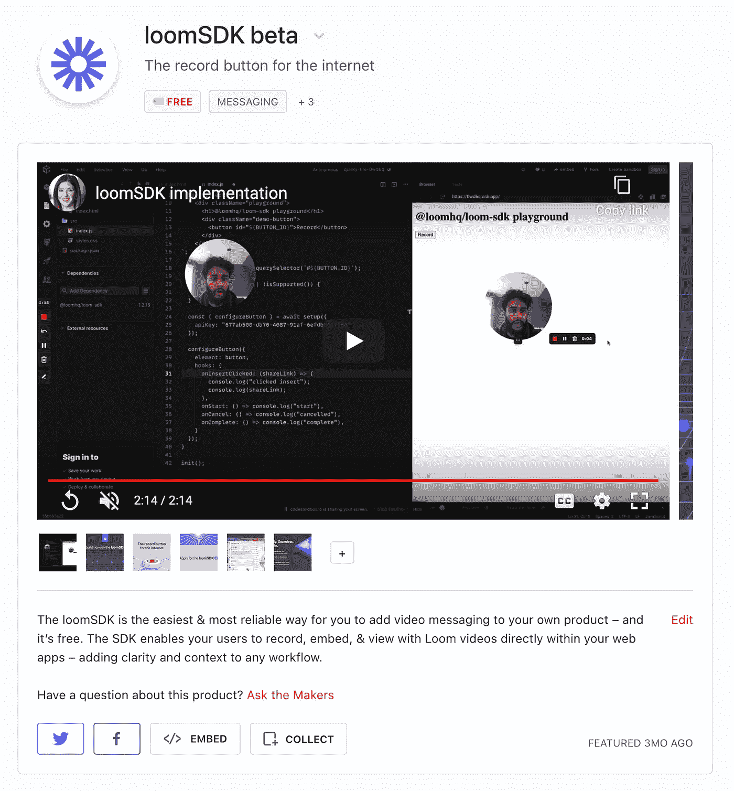
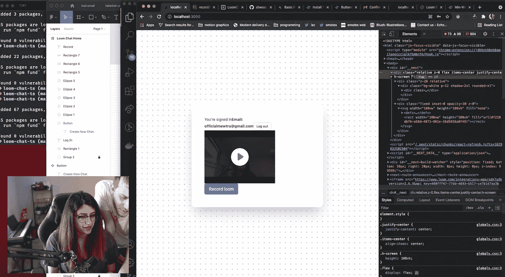

# 开发非常公开的 SDK 的经验教训

> 原文：<https://levelup.gitconnected.com/lessons-learned-developing-a-very-public-sdk-81a27e0dbba2>

自从我上次在媒体上写作已经有一段时间了。那是因为我一直埋头在 [loomSDK](https://www.loom.com/sdk-beta) 团队中工作。我们在 2021 年 6 月 2 日推出了 1.4.3 版本的 SDK 测试版。从那时起，已经发布了 30 多个版本，我们还在继续快速添加新功能。

我们的[产品搜寻发布会](https://www.producthunt.com/posts/loomsdk-beta)，本周第二大产品

我以前从未和这么多的外部利益相关者一起工作过。我以前的大部分经历都是在私有的单片和微服务中工作。当升级一个系统时，让我的团队放松对变化的关注并更新 repo README 是我必须担心的向后兼容性的程度。

当开发一个被大量外部开发人员采用的产品时，这是一件非常不同的事情。

## **第一课:对你公开揭露的事情要非常小心。**

一旦它出现并被大规模采用，就没有多少希望再回头去做剧烈的改变。

使用 loomSDK 的 mewtru

在一个整体中，如果你离开遗留系统，以前的引用可以被删除，永远不会再被想起。有了公共包，你不能强迫人们升级到最新发布的版本。你可以通过反对警告来推动你的观众接受新的，忽略旧的。但是这是以使你的 API 变得更加复杂为代价的，因为事实上不是每个人都会像你希望的那样快速移动。这引出了我的下一个观点…

## **第二课:确保你的文档是顶级***。*

*没有人会突然神奇地理解你的包是如何工作的。花时间编写文档，使您的 API 清晰明了，这对于成功采用至关重要。*

*也可能很难记住这样做，特别是如果你正在埋头苦干，并且知道你的包里里外外是如何工作的。后退一步。观察其他人将您的包整合到他们的应用程序中。还是自己动手吧。看看有什么可以改进的地方，让它更容易使用。*

*记录演练也很有帮助*

*以上两点是一个更大主题的缩影，这个主题就是…*

## ***第三课:做长远打算，不要急于求成。***

*我们努力让 SDK 迅速退出市场。如果我们以一种更悠闲的节奏前进，我们是否会做出一些同样的设计决策，这是有争议的。我能想到一两个我想回去重做的实现细节。当然，在您的软件包发布到用户手中之前，很难知道什么有效，什么无效。*

*当你想建立一个长久的遗产时，花点时间停下来。给自己额外的几天时间来思考如何确定一个特定的功能会对事情的大计划产生很大的影响吗？走捷径通常会有后果，要有耐心。*

*但是说了这么多，一路顺风，没有任何颠簸，简直是白日做梦。这引出了我的最后一点…*

## *第四课:做到比完美更好。*

*没有亲身经历，很难吸取教训。你需要把你的工作拿出来，以便迭代和改进。所有这些想法都是在深入了解并看到我们的产品投入使用后产生的。我习惯于打磨和完善，所以我很高兴我被推出了我的舒适区，以便更快地行动。*

**

*我们可爱的拟人化的[推特账号](https://twitter.com/loomSDK)*

*不要让对混乱的恐惧阻止你创造一些你知道会帮助别人的东西。我们为我们在 SDK 团队的基础上构建的东西感到自豪，并为培养一个热爱使用它的开发人员社区而感到兴奋。*