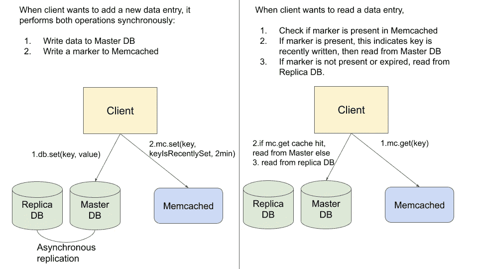
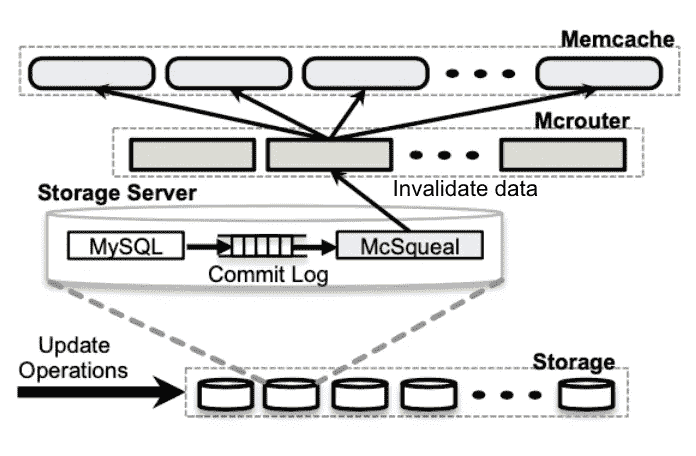
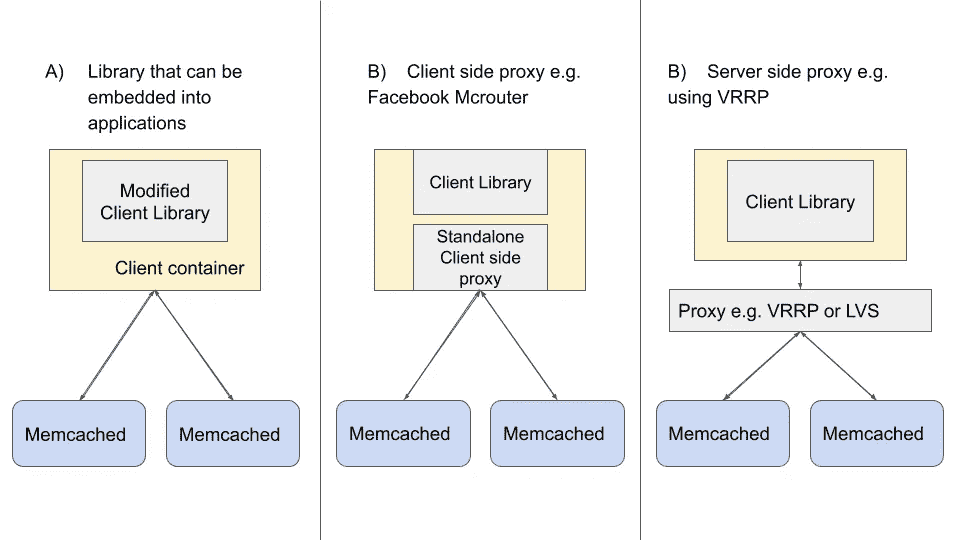
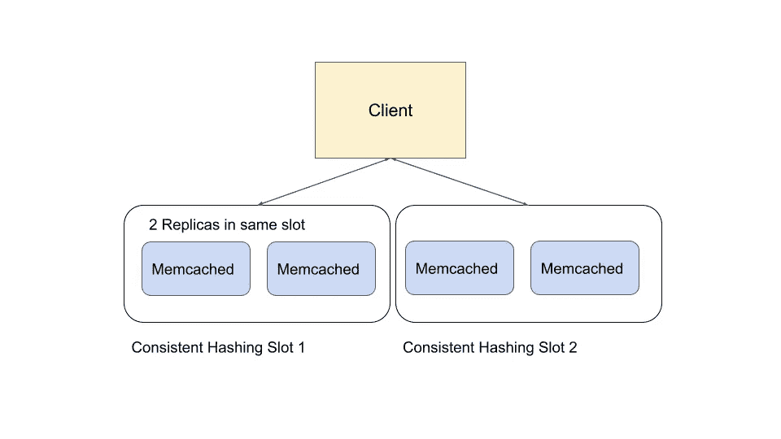

# 在生产中扩展 Memcached 的经验教训

> 原文：<https://levelup.gitconnected.com/lessons-learnt-from-scaling-memcached-in-production-86778ab616c7>

## 为业务用例构建高可用性缓存解决方案的主要考虑事项和策略

Elena Mozhvilo 在 [Unsplash](https://unsplash.com?utm_source=medium&utm_medium=referral) 上的照片

M emcached 是一个众所周知的简单的内存缓存解决方案，被脸书、Twitter 和 Pinterest 等几家大公司使用。Memcached 的主要用例是后备缓存，以减少数据库的负载。与 Redis 不同，以简单著称的 Memcached 不提供任何内置的高可用性特性。

# 问题是

随着缓存集群规模的扩大，高可用性(HA)成为一个关键问题。在缓存服务器暂时甚至永久崩溃的情况下，我们如何快速响应？我们如何防止数据库服务器的请求过载？

虽然有一些开源的 Memcached HA 解决方案(最流行的是脸书的 Mcrouter)，但这些解决方案可能不完全适合个人的业务用例。例如，Mcrouter 确保尽最大努力实现最终一致性(即陈旧数据仍可能出现，尤其是在存在复制的情况下)，而一些特定的使用情形可能需要更高的数据一致性。对于不同的业务用例，可能还需要更多地控制可用性、一致性、性能和成本效益之间的权衡。

此外，在撰写本文时，Mcrouter 使用了一个分支版本的 Memcached，该版本使用租约来确保最终的一致性[1]。在最近版本的开源 Memcached 中，租约是不可用的，这使得 Mcrouter 很难适应一般的 Memcached 基础设施。

> 本文的目的不是描述一个固定的扩展 Memcached 的解决方案。

在过去的 4 个月里，我一直致力于扩展 Memcached，我的目标是整合关键策略和考虑事项，以**构建高度可用的缓存解决方案，同时满足业务用例的一致性需求。**这些策略不是特定于 Memcached 的，可以应用于类似的后备缓存解决方案。

# 高可用性缓存解决方案需要什么

那么，高可用性缓存解决方案需要什么呢？我们确定了高可用性解决方案中三个最重要的特性:

1.  **缓存复制**
2.  **冷缓存预热**:如果发生崩溃故障，有没有热备份缓存来缓冲数据库负载的增加？
3.  **自动快速故障转移**:我们能够足够快地检测并纠正崩溃故障吗？

虽然缓存复制背后的动机类似于在节点故障时进行热缓存备份，但复制可能更强大，因为它还有助于增加 Memcached 集群每秒可以处理的总查询数。例如，如果我们采用将读取流量定向到任一副本的策略，单个 Memcached 的负载可以减少副本数量的一倍，因此在整个副本中，我们可以支持更高的每秒查询数(QPS)。

但是，通常为了换取更高的可用性，会牺牲一致性。例如，对于两个副本 Memcached，我们不仅要关心 Memcached 和 DB 之间的一致性，还要关心两个副本 Memcached 之间的一致性。

Amazon 也报告了这一点，根据他们的经验，在 ACID (C 代表一致性)属性和可用性之间通常存在一种折衷。我们将在后面的部分讨论平衡这种权衡的策略。

# 缓存的主要业务用例

为了理解如何平衡一致性和可用性之间的平衡，我们需要确定业务用例及其需求。缓存通常有两种主要的使用情形:

1.  后备缓存(数据库是事实的权威来源)
2.  缓存作为权威存储(缓存现在是事实的权威来源)

虽然 Memcached 的主要用途通常是作为后备缓存，但一些业务用例可能会将缓存用作权威存储，在这种情况下，一致性可能变得更加重要。

图 1:远程标记机制使用 Memcached 作为权威数据源来存储标记。该机制用于最小化读取副本数据库中陈旧数据的可能性。

在脸书的 Scaling Memcached 论文中，描述了缓存作为权威存储的用例:对于需要高度一致性的用例，使用*远程标记*机制来最小化读取副本数据库中陈旧数据的概率。本文中描述的问题源于这样一个事实，即副本数据库可能落后于主数据库(DB)，有时这种复制滞后是不可忽略的(例如，当主数据库和副本数据库位于不同的地理区域时)。

如图 1 所示，当新数据写入 master DB 时，客户机也将向 Memcached 中写入一个标记。通常标记的到期时间非常短。随后，在客户端从数据库中读取数据之前，它将检查缓存中是否存在远程标记。如果标记存在，则意味着数据最近被写入或更新，客户端将从主数据库读取，否则，它将从副本数据库读取。

## 选择正确的一致性保证

在确定我们的业务用例之后，我们需要选择正确的一致性保证。例如，在作为权威存储用例的缓存中，我们可能需要 Memcached 副本之间的高度一致性，因为数据只存储在缓存中，而缓存是真实数据的权威来源。在其他业务情况下，最终的一致性可能就足够了，我们可以将策略集中在维护更高的可用性或优化性能上。

我们需要考虑两个主要的一致性关系:

1.  Memcached 副本之间的一致性(如果使用复制)
2.  数据库和 Memcached 之间的一致性

因为我们的重点是扩展 Memcached 基础设施，所以我们不会关心主数据库和副本数据库之间的一致性。

下面是业务级别通常需要的几个一致性级别。请记住，高一致性通常是可用性、性能(低延迟、高吞吐量)或/和成本的折衷。

1.  **强一致性**

Memcached 副本之间的强一致性保证了 Memcached 副本具有相同的数据，并且对副本的不同读取请求将返回相同的结果。当缓存被用作权威存储时，或者当不一致的数据可能会对业务产生重大影响时，可能需要 Memcached 副本之间具有如此强的一致性。例如，在远程标记机制(如上所述)的情况下，高速缓存未命中可能导致客户端从可能包含陈旧数据的副本 DB 中读取数据。

2.**最终一致性**

最终一致性保证了如果给定的数据项没有新的更新，**最终**对该项目的所有 get 请求都将返回最后更新的值。大多数(如果不是全部)缓存使用案例至少需要最终的一致性。

3.**允许陈旧数据(在有限的时间内)以换取更低的延迟**

通过确定返回稍微过时的数据是可以接受的情况，我们可以采用允许在有限的时间内返回过时数据的策略，以减少延迟。

5.**顺序一致性**

根据兰波特的定义:

> 顺序一致性意味着操作似乎是以某种总的顺序发生的，并且这种顺序与每个单独过程中的操作顺序是一致的。

在分布式缓存的上下文中，顺序一致性保证了 Memcached 服务器接收的操作顺序与每个客户机发送的部分操作顺序一致。也就是说，每个客户端看到它们的操作是按顺序执行的(即使它们的操作可能与其他客户端发送的操作交错)。

# 扩展分布式缓存的策略

在分析了我们的业务案例及其所需的一致性级别后，我们现在准备讨论扩展我们的分布式缓存解决方案的策略。所讨论的每一种策略都源于生产中在扩展 Memcached 基础设施时所面临的不同问题。

## 1.在数据更新时执行缓存失效

Memcached 基础设施中出现的一个问题是并发写入的竞争条件，这会导致缓存中出现无限陈旧的数据。这对业务逻辑是有害的，因为甚至最终的一致性也不能保证。

例如，考虑 Memcached 的单个实例，其中来自客户端的并发写入有时可能被重新排序，也就是说，如果我们采用简单的“先写入数据库，再写入缓存”策略，写入数据库的顺序可能与写入 Memcached 的顺序不同，这将导致数据无限期地过时。主要问题是因为写不是等幂的，也不是可交换的。

> “我们选择删除缓存的数据而不是更新它，因为删除是等幂的。Memcache 不是数据的权威来源，因此被允许驱逐缓存的数据"[1]。

避免这个问题的常见策略是在更新数据库时使用缓存失效，因为删除是等幂的。例如，在脸书论文[1]的扩展 Memcached 中，作者提出，在对数据项 x 进行 DB 写入时，运行守护进程*MC quiller*的无效流水线将读取 DB 日志，然后向 Memcached 发出对相同数据项 x 的无效(即删除命令)。然后，当客户端收到缓存未命中时，它们将直接从数据库中获取数据项，并将最新的值写入 Memcached。

为了准备意外的情况，比如短暂的网络故障，我们需要确保失效守护进程继续以相同的顺序重试删除命令，直到成功为止，这样当 Memcached 实例断开连接时，失效请求不会丢失。为了在节点故障期间减少无效流水线上的负载，可以以指数补偿的方式实现重试。

改编自[1]。

这种方法最大限度地降低了并发写入被重新排序的风险，因为删除是等幂的，如果多个客户端并发地更新同一个数据项，数据库将负责排序更新并从 Memcached 中删除数据项。

然而，使用这种策略仍然存在以陈旧数据告终的小风险。考虑给定的竞争条件:

为了解决这个问题，脸书在 Memcached 服务器端使用了一种类似 CAS(检查和设置)的方法，称为租约。然而，在撰写本文时，在最近版本的开源 Memcached 中还没有租约。

## 2.客户端与服务器端方法

在扩展缓存基础设施时，将系统的复杂性嵌入到无状态客户端或独立代理中通常是一个好主意。这极大地简化了 Memcached，并使人们能够专注于使它对特定用例具有高性能。为了扩展 Memcached 基础设施，我们发现有两种通用方法可以采用:

a)可以嵌入到应用程序中的库(客户端方法)

b)独立代理(可以是客户端代理进程，如 Mcrouter 或服务器端代理)

独立客户端代理的一个例子是 Mcrouter [1]，它通常被部署为客户端机器的附属设备，这意味着它独立于客户端 API 库[5]。服务器端代理的一个例子是部署一个 LVS 负载平衡器，在同一个一致散列槽中的不同 Memcached 副本之间分割流量。使用独立代理解决方案的主要优点是客户端的代码修改很少或没有修改。

与客户端代理相比，部署服务器端代理还减少了对代码添加和更改的需求，从而降低了错误的风险，并使现有团队更容易转换到新的解决方案。但是，服务器端代理可能需要额外的成本(以另一台物理机/专用机架的形式)。在复制策略一节中，我们将研究如何使用这两种策略来实现高可用性。

## 3.复制策略

我们在一致性一节中已经看到，不同的业务需求可能需要非常不同的一致性或可用性保证。有时，我们甚至需要在同一个缓存基础架构中满足多个完全不同的用例。为了满足这些业务目标，我们必须采用特定的策略来平衡这些权衡。我们将在这一部分讨论其中的一些复制策略。请注意，我们检查的规模是一个特定的复制群集(即一致性哈希算法的一个片段)。

我们的策略将集中在一个特定的 Memcached 一致散列槽上。

1.  自动故障转移到冷备份的主 Memcached 节点
2.  写入任何节点；从任意节点获取。
3.  写入所有节点；从任何节点获取
4.  写入所有节点；仅从主 Memcached 节点获取

**自动故障转移到冷备份的主 Memcached 节点**

此策略不支持复制或热缓存备份；它主要支持 Memcached 节点失败时的自动故障转移。如果 Memcached 出现故障，将流量路由到冷缓存将导致缓存未命中，从而增加数据库负载。但是，如果 DB 能够承受几个 Memcached 节点的负载，那么这个解决方案可能适合作为临时解决方案。

这种策略的一种可能实现是通过使用服务器端策略:我们可以在客户机和 Memcached 服务器之间添加一层虚拟路由器冗余协议(VRRP)。VRRP 执行自动故障检测和故障转移，因此如果活动的物理 Memcached 主服务器出现故障，将选择另一台物理机器来自动替换它。

**写入任意节点；从任意节点获取。**

请注意，脸书使用客户端代理 Mcrouter 实现了这一策略。这种策略也可以以服务器端代理的形式实现，使用负载均衡器(如 LVS)来分割 Memcached 副本之间的流量。

*优点*:副本在它们之间分担流量负载，因此，总体上可以支持更多的 QPS。由于流量的分割是随机的，我们可以期望密钥在副本之间均匀分布。因此，在部分副本出现故障的情况下，我们可以保证有热备份。

*缺点*:无法确保副本之间的可重复读取，因为不能保证写入会在所有副本中结束。对于需要高度一致性的使用情形，例如将缓存用作权威存储，此解决方案可能不够。

**写入所有节点；从任意节点获取**

此策略旨在支持所有副本中的完整复制，即写入将传播到所有副本(同步)。

*优点*:如果实现得当，可以支持不同 Memcached 副本之间的高度一致性。由于请求被拆分到不同的副本中，一个一致哈希槽中支持的总体 QPS 也会随着副本数量的增加而增加。

*缺点*:保证所有 Memcached 副本彼此一致并不容易，特别是对于客户端方法。这是因为我们必须管理由于临时网络延迟而导致 Memcached 写入失败的情况。

**尝试写入其他节点；仅从主 Memcached 节点获取**

该策略放宽了先前策略的条件:即尝试实现完全复制。在缓存未命中时，Memcached 将从 DB 获取新数据，并以同步方式写入主 Memcached 节点，然后以异步方式写入辅助节点。Get 查询将只定向到主 Memcached。

*优点*:能够维护热 Memcached 副本备份，假设大多数异步写入将会成功。因为 Get 查询只由主 Memcached 节点处理，所以在大多数正常情况下，确保主节点和备份之间的一致性并不重要。

*缺点*:同样，保证所有副本彼此一致也是很重要的。如果主 Memcached 节点出现故障，提升到主节点的备份可能包含一些陈旧的数据。

此外，由于只有一个主节点被用于处理所有查询流量，所以在一个一致散列槽中可以支持的总 QPS 保持不变。

## 4.实现故障转移

故障转移指的是在主要机器出现故障时回退到次要服务/机器的行为。故障转移是任何高可用性解决方案的一个重要方面，包括两个主要组件:故障检测和到另一个 Memcached 副本或备份的逐步故障转移。理想情况下，我们希望实现快速故障转移，有时是自动故障转移。

检测节点故障的一种常见方法是通过使用守护程序脚本向服务器发送定期心跳来执行健康检查。回复心跳的服务器被认为是健康的，我们可以在像 ETCD/Zookeeper 这样的中央配置中心跟踪这个健康的服务器列表，客户端进程可以访问它。支持渐进式故障转移的一种可能方式是通过服务器端策略，如支持这种高可用性功能的 VRRP。

总之，随着 Memcached 规模的增加，人们必须记住一致性、可用性和性能之间的权衡，这些因素之间的复杂平衡取决于 Memcached 支持的业务用例。

感谢您的阅读！请点击此处查看我之前关于如何测试 Memcached 性能的帖子:

 [## 在 Ubuntu 16.04 上测试 Memcached 性能的完整指南

### 如何识别瓶颈并为 memcached 服务器建立安全的流量级别。

medium.com](https://medium.com/swlh/the-complete-guide-to-benchmark-the-performance-of-memcached-on-ubuntu-16-04-71edeaf6e740) 

## 参考

[1]在脸书扩展 Memcached[https://www . usenix . org/system/files/conference/nsdi 13/nsdi 13-final 170 _ update . pdf](https://www.usenix.org/system/files/conference/nsdi13/nsdi13-final170_update.pdf)

[2]迪纳摩:亚马逊的高可用键值存储[https://www . usenix . org/system/files/conference/nsdi 13/nsdi 13-final 170 _ update . pdf](https://www.usenix.org/system/files/conference/nsdi13/nsdi13-final170_update.pdf)

[3]Memcached[https://memcached.org/](https://memcached.org/)

[4]关于在 https://pdos.csail.mit.edu/6.824/notes/l-memcached.txt 脸书[缩放 Memcached 的说明](https://pdos.csail.mit.edu/6.824/notes/l-memcached.txt)

[5]在 Pinterest 扩展缓存基础设施[https://medium . com/Pinterest-engineering/Scaling-Cache-infra structure-at-Pinterest-422 d6d 294 ECE](https://medium.com/pinterest-engineering/scaling-cache-infrastructure-at-pinterest-422d6d294ece)